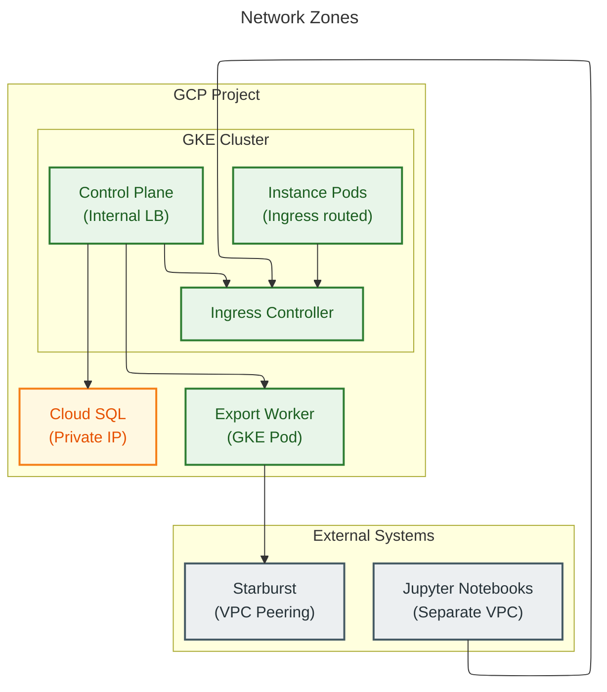

# Architectural Guardrails

## Overview

This document defines the **hard constraints** that ALL designs and implementations must follow. These are non-negotiable decisions that have been locked to ensure consistency across the Graph OLAP Platform.

## Prerequisites

- [requirements.md](-/requirements.md) - Functional requirements and scope

---

## Technology Stack (Locked)

These technology choices are final. Do NOT propose alternatives.

| Layer | Technology | Rationale |
|-------|------------|-----------|
| Graph Database | Ryugraph (KuzuDB fork), FalkorDB | Multiple wrappers via pluggable architecture (see ADR-049) |
| Control Plane Backend | Python + FastAPI | Unified stack with Wrapper/Worker/SDK, async-native, GCP SDK support |
| Control Plane DB | PostgreSQL (Cloud SQL, DO Managed, or local pod) | Standard RDBMS, PostgreSQL everywhere |
| Ryugraph Wrapper | Python + FastAPI | Required for Ryugraph bindings, NetworkX in-process |
| FalkorDB Wrapper | Python 3.12+ + FastAPI | FalkorDBLite subprocess architecture, Cypher procedures |
| Jupyter SDK | Python | Target environment is Jupyter notebooks |
| Export Job Polling | APScheduler background job | Polls `export_jobs` table, calls Starburst Galaxy directly (see ADR-025) |
| Object Storage | Google Cloud Storage (GCS) | Parquet file storage, Starburst integration |
| Container Orchestration | GKE (Kubernetes) | GCP-native, managed control plane |
| IaC/CI/CD | Terraform (IaC), Jenkins (CI), `./infrastructure/cd/deploy.sh` + `kubectl apply -f infrastructure/cd/resources/` (CD) | Helm is used only for the upstream Zero-to-JupyterHub chart. |

---

## Architecture Patterns (MUST Follow)

### 1. Control Plane is the Single Source of Truth

- **All state lives in the Control Plane database**
- Workers, Ryugraph pods, and external clients MUST update state via Control Plane API
- No direct database access from workers or pods
- Control Plane API is the only interface for CRUD operations on mappings, snapshots, instances

```
DO:     Worker → HTTP POST /api/snapshots/:id/status → Control Plane → Database
DO NOT: Worker → Direct SQL INSERT → Database

```

### 2. Ryugraph Runs Embedded (Not as Server)

- Each graph instance runs Ryugraph **in-process** within a Python FastAPI wrapper
- One Ryugraph database per pod (file locking prevents multiple writers)
- Pod-per-instance model: each instance gets its own Kubernetes pod
- No shared Ryugraph server between instances

```
DO:     [Pod] FastAPI → Ryugraph embedded → Database files on PVC
DO NOT: [Pod] FastAPI → HTTP → [Separate Ryugraph Server]

```

### 3. Stateless Workers, Stateful Pods

- **Export workers are stateless**: can be scaled horizontally, restartable
- **Ryugraph pods are stateful**: each holds a graph instance in memory/disk
- Worker state flows through the `export_jobs` table and Control Plane API
- Pod state includes graph data (ephemeral, recreatable from snapshot)

### 4. Parquet as Interchange Format

- Starburst exports data as Parquet to GCS
- Ryugraph loads data via `COPY FROM` Parquet files
- No intermediate formats (CSV, JSON, etc.)
- Parquet column order must match schema definition order

### 4a. Async Export with Adaptive Polling

See ADR-025 for full rationale.

- **Export is split into two phases:** Submit (fast) and Poll (scheduled)
- Export Submitter submits UNLOAD queries and returns immediately
- Export Poller is an APScheduler background job that polls the `export_jobs` table and calls Starburst Galaxy directly
- Snapshot status: `pending` → `exporting` → `ready` (or `failed`)
- Instance creation blocked until snapshot status = `ready`

```
DO:     Export Submitter → export_jobs table → APScheduler Poller → Starburst Galaxy
DO NOT: Export Worker sits idle polling Starburst for 30 minutes
```

### 5. Implicit Locking for Algorithms

- **No explicit lock API** - locks are internal implementation detail
- Lock acquired automatically when algorithm starts
- Lock released automatically when algorithm completes (success or failure)
- Lock includes: holder user ID, algorithm name, start timestamp
- If algorithm hangs, user must terminate instance (no manual lock release)

```
DO:     POST /algo/pagerank → [Wrapper acquires lock] → [Run algo] → [Wrapper releases lock]
DO NOT: POST /lock → POST /algo/pagerank → DELETE /lock

```

#### Race Condition Prevention

Lock acquisition must be atomic to prevent race conditions when concurrent requests arrive:

```
Implementation requirement:

- Use mutex/semaphore in Wrapper Pod to serialize lock check + acquire
- Pattern: acquire_mutex → check_lock → set_lock → release_mutex → run_algorithm
- If lock already held, return 409 immediately (no retry/wait)

Sequence (safe):
  Request A: acquire_mutex → check (free) → set_lock(A) → release_mutex → run
  Request B: acquire_mutex → check (held by A) → release_mutex → return 409

Sequence (race without mutex - UNSAFE):
  Request A: check (free) ─────────────────────────► set_lock(A) → run
  Request B: ───────────────► check (free) → set_lock(B) → run ← CONFLICT!

```

### 6. Immutable Versions, Mutable Headers

- **Mapping versions are immutable** once created
- Mapping header (name, description, lifecycle settings) is mutable
- Editing node/edge definitions creates a new version (requires change description)
- Snapshots reference a specific mapping version
- Deleting a mapping requires deleting all snapshots first

### 7. Shared Schemas as Single Source of Truth

The `graph-olap-schemas` package defines authoritative Pydantic models for all inter-component communication. These schemas are the **API contract** between components.

**Purpose of Shared Schemas:**

1. **Compile-time validation** - Type mismatches are caught during development, not at runtime
2. **Single source of truth** - All components agree on data structures
3. **Documentation as code** - Schemas document the API contracts
4. **Code generation** - Can generate OpenAPI specs, API clients, JSON Schema

**Consuming Components:**

- Control Plane (defines and validates)
- Ryugraph Wrapper (consumes for API calls)
- Export Worker (consumes for status updates)
- Jupyter SDK (consumes for client models)

**Schema Categories:**

| Category | Purpose | Examples |
|----------|---------|----------|
| `definitions` | Core domain models | `NodeDefinition`, `EdgeDefinition`, `PropertyDefinition` |
| `api_resources` | External API request/response | `CreateMappingRequest`, `MappingResponse` |
| `api_internal` | Internal component communication | `UpdateInstanceStatusRequest`, `InstanceMappingResponse` |
| `api_common` | Shared patterns | `DataResponse`, `ErrorResponse`, `PaginationParams` |

**Correct Usage Pattern:**

```python
# In component code (e.g., wrapper, worker)
from graph_olap_schemas import (
    NodeDefinition,
    UpdateInstanceStatusRequest,
    InstanceMappingResponse,
)

# Use shared types directly for API communication
async def update_status(self, status: str) -> None:
    request = UpdateInstanceStatusRequest(status=status)
    await self._post("/status", json=request.model_dump(exclude_none=True))

# Use utility functions for component-specific logic
def generate_node_ddl(node: NodeDefinition) -> str:
    """Generate DDL from shared NodeDefinition - NOT a subclass."""
    columns = [f"{node.primary_key.name} {node.primary_key.type.value} PRIMARY KEY"]
    for prop in node.properties:
        columns.append(f"{prop.name} {prop.type.value}")
    return f"CREATE NODE TABLE {node.label}({', '.join(columns)})"
```

**Why Schemas Must Not Be Extended:**

- Extended schemas become incompatible types (Pydantic model inheritance creates distinct types)
- Values from API responses can't be used directly with extended types
- Defeats compile-time validation (mismatches hidden by type conversion)
- Creates maintenance burden keeping extensions synchronized

See Anti-Patterns section for prohibited patterns.

### 8. Pluggable Multi-Wrapper Architecture

- **Wrapper types are enum-defined** in shared schemas (prevents typos, enables compile-time validation)
- **Capabilities are declarative** in `WRAPPER_CAPABILITIES` registry (feature discovery, validation)
- **Configuration is centralized** in `WrapperFactory` service (no scattered wrapper-specific logic)
- **Wrapper selection is user-driven** at instance creation time via `wrapper_type` parameter
- **Adding new wrappers** requires: enum value, capabilities entry, factory config, wrapper package, helm chart
- **Backward compatibility** maintained via defaults (Ryugraph is default wrapper type)

See ADR-049: Multi-Wrapper Pluggable Architecture for full design.

```
DO:     wrapper_config = factory.get_wrapper_config(instance.wrapper_type)
DO NOT: if instance.wrapper_type == "ryugraph": config = {...} elif instance.wrapper_type == "falkordb": config = {...}
```

### 9. Owner-Based Permissions

- All resources are visible to all analysts (no access control lists)
- Only owner can modify/delete their resources
- Admins can modify/delete any resource
- Instance queries are open (anyone can query any instance)
- Instance algorithms are owner-restricted (analysts can only run on their own instances)

### 10. Authentication Model

**References:**
- ADR-104: DB-Backed User Auth Model

The platform authenticates users via DB-backed user records:

| Path | Use Case | Flow | Validation |
|------|----------|------|------------|
| **API Access** | SDK, scripts, CI/CD | `X-Username` header | Control Plane looks up user record in `users` table |
| **User Sessions** | Browser (JupyterHub) | OAuth2 redirect | oauth2-proxy handles OIDC flow, sets `X-Username` |

```
API Access Path:
  Client → Control Plane (X-Username header → users table lookup) → Response

Browser Path (target per ADR-137):
  Browser → oauth2-proxy → HSBC Azure AD (Entra ID) → Cookie → JupyterHub (X-Username injected)
```

**Key Constraints:**
- User identity is resolved via `X-Username` header, mapped to a DB-backed user record
- `role` column in `users` table determines permissions (analyst, admin, ops)
- Network policies must ensure Control Plane is only accessible via proxy or internal traffic
- Updated for ADR-104

### 11. AMD64 Platform Enforcement

All container images **MUST** be built for AMD64 architecture:

```dockerfile
# All Dockerfiles MUST include explicit platform
FROM --platform=linux/amd64 python:3.11-slim
```

**Rationale:**
- GKE cluster `hsbc-12636856-udlhk-dev` in `asia-east2` runs AMD64 nodes
- Content-addressable image tags require consistent platform hashes

#### Permission Matrix by Endpoint

| Endpoint Category | Analyst | Admin | Ops |
|-------------------|---------|-------|-----|
| **Mappings** | List all, CRUD own, copy any | CRUD any | CRUD any |
| **Snapshots** | List all, CRUD own | CRUD any | CRUD any |
| **Instances** | List all, CRUD own, query any | CRUD any, query any | CRUD any, query any |
| **Algorithms** | Run on own instances only | Run on any instance | Run on any instance |
| **Favorites** | CRUD own favorites | CRUD own favorites | CRUD own favorites |
| **Config (lifecycle, concurrency)** | No access | No access | Read/Write |
| **Cluster (health, metrics)** | No access | No access | Read |
| **Export Queue** | Read own only | Read all | Read all |
| **Ops Jobs** | No access | No access | Full access |

> See `system-design/authorization.spec.md` for the complete authoritative RBAC specification.

#### Authorization Error Responses

| Scenario | HTTP Status | Error Code |
|----------|-------------|------------|
| Missing/invalid auth token | 401 | UNAUTHORIZED |
| Analyst tries to modify other's resource | 403 | PERMISSION_DENIED |
| Analyst tries to run algorithm on other's instance | 403 | PERMISSION_DENIED |
| Analyst tries to access admin/ops endpoints | 403 | PERMISSION_DENIED |
| Admin tries to access ops-only endpoints | 403 | PERMISSION_DENIED |

---

## Anti-Patterns (MUST NOT Do)

This is the **authoritative list** of anti-patterns. Other documents reference this section.

### Database & Schema

- DO NOT access Control Plane database from Export Worker
- DO NOT access Control Plane database from Ryugraph Wrapper
- DO NOT have Control Plane access Ryugraph database directly
- DO NOT store algorithm results in Control Plane database
- PostgreSQL is the only supported database (SQLite not supported)
- DO NOT store raw Starburst query results (only metadata)
- DO NOT add columns for derived/computed data (compute at query time)
- DO NOT create circular foreign key dependencies
- DO NOT bypass application layer for direct database modifications

### Query Patterns

- DO NOT use SELECT * in application queries (always list columns)
- DO NOT update multiple tables in a single transaction without necessity
- DO NOT use ORM lazy loading patterns (explicit joins only)
- DO NOT perform unbounded queries without LIMIT

### Shared Schemas

- DO NOT extend shared schema classes with subclasses (use utility functions instead)
- DO NOT define duplicate models that mirror shared schemas
- DO NOT build request/response payloads as raw dicts when a shared schema exists
- DO NOT add component-specific fields to shared schemas (propose changes to shared package)
- DO NOT use `.model_dump()` without validating against the shared schema first
- DO NOT ignore Pydantic validation errors (they indicate API contract violations)

```
DO:     from graph_olap_schemas import NodeDefinition
        def generate_ddl(node: NodeDefinition) -> str: ...

DO NOT: class NodeDefinition(BaseNodeDefinition):  # Extending schema
            def to_ddl(self) -> str: ...
```

### API Design

- DO NOT create bulk modification endpoints (handle in clients)
- DO NOT create explicit lock/unlock endpoints (lock is implicit)
- DO NOT return 429 for concurrency limits (use 409 Conflict)
- DO NOT use cursor-based pagination (use offset/limit)
- DO NOT accept requests without Content-Type: application/json header
- DO NOT return HTML error pages; always return JSON error responses
- DO NOT expose internal error details (stack traces, SQL queries) in production
- DO NOT allow PUT/PATCH to modify immutable fields (id, created_at, owner_username)
- DO NOT create new mapping versions without change_description
- DO NOT allow snapshot creation from non-existent mapping versions
- DO NOT allow instance creation from snapshots not in 'ready' status
- DO NOT modify user SQL queries during validation (validate only, never transform)
- DO NOT skip SQL validation when updating mapping definitions
- DO NOT allow snapshot creation without successful SQL validation

### Authentication & Authorization

- DO NOT allow unauthenticated access to any endpoint (except health checks)
- DO NOT allow analysts to modify resources they don't own (except admins)
- DO NOT allow analysts to run algorithms on instances they don't own (except admins)
- DO NOT expose user credentials or API keys in responses or logs
- DO NOT store user passwords (use external IdP)
- DO NOT store sensitive data unencrypted (API keys, tokens)

### Data Handling & GCS

- DO NOT export algorithm results back to snapshots
- DO NOT modify graph structure after instance creation (no add/delete nodes/edges)
- DO NOT store Parquet files outside the defined path structure
- DO NOT load edges before nodes (edges reference node primary keys)
- DO NOT store algorithm results in GCS (results stay in Ryugraph only)
- DO NOT access GCS from Control Plane (only Worker and Wrapper access GCS)
- DO NOT share GCS paths between unrelated snapshots
- DO NOT delete GCS data before database record deletion succeeds

### Resource Lifecycle

- DO NOT delete snapshots while active instances exist (starting, running)
- DO NOT delete mappings while snapshots exist
- DO NOT allow lifecycle settings (TTL, inactivity_timeout) to exceed hard limits
- DO NOT allow inactivity timeout > TTL (logical constraint)
- DO NOT set lifecycle values on resources that reference deleted parents
- DO NOT terminate instances during algorithm execution (lock must be respected)
- DO NOT bypass lifecycle cleanup for any resource type
- DO NOT allow instance creation when concurrency limits exceeded (return 409)
- DO NOT delete a resource without also cleaning up its favorites references

### Concurrency & Pod Lifecycle

- DO NOT run multiple algorithms simultaneously on same instance
- DO NOT open multiple write transactions to same Ryugraph database
- DO NOT share Ryugraph Connection objects across async tasks
- DO NOT allow multiple Ryugraph processes in one pod (file locking)
- DO NOT keep instance pods running after termination request while locked
- DO NOT store persistent state in Wrapper pods (ephemeral only)
- DO NOT store lock state in Control Plane (query Wrapper Pod directly)

### Component Communication & Network

- DO NOT use synchronous calls for long-running operations (use async job queue via `export_jobs` table)
- DO NOT bypass the Control Plane for status updates
- DO NOT expose internal APIs to external traffic
- DO NOT allow direct pod-to-pod communication (route through services)
- DO NOT bypass Ingress for external instance access
- DO NOT allow duplicate favorites for same user/resource combination

### Multi-Wrapper Architecture

- DO NOT hardcode wrapper-specific configuration in K8s service (use WrapperFactory)
- DO NOT use string literals for wrapper types (use WrapperType enum)
- DO NOT add wrapper-specific logic outside WrapperFactory (centralize configuration)
- DO NOT bypass wrapper capabilities registry (query capabilities, don't assume)
- DO NOT allow wrapper_type mutation after instance creation (immutable property)
- DO NOT create wrapper-specific API endpoints (use `wrapper_type` parameter instead)
- DO NOT duplicate wrapper configuration between WrapperFactory and Helm charts (WrapperFactory is source of truth for runtime config)

### Export Processing

- DO NOT poll Starburst in a long-running blocking call (use APScheduler background job polling `export_jobs` table)
- DO NOT use fixed-interval polling (use adaptive backoff intervals)
- DO NOT allow instance creation from snapshots with status != 'ready'
- DO NOT mark snapshot as 'ready' until ALL export_jobs are 'completed'
- DO NOT continue polling after Starburst returns FINISHED or FAILED state
- DO NOT lose Starburst query_id or next_uri (required for polling resumption)

---

## SQL Validation Strategy

Mapping SQL queries are validated at multiple points to provide early feedback and prevent runtime errors.

### Validation Timing

| Stage | Validation | Blocking |
|-------|------------|----------|
| Mapping Create/Update | SQL syntax check (EXPLAIN) | Yes |
| Mapping Create/Update | Column type inference | Yes |
| Snapshot Create | Full execution dry-run (LIMIT 0) | Yes |
| Snapshot Export | Actual execution | Yes (fails snapshot) |

### Validation Details

**On Mapping Create/Update (synchronous, via Control Plane):**

1. For each node/edge SQL query:
   - Run EXPLAIN on query → validates syntax
   - Run query with LIMIT 0 → validates tables/columns exist
   - Infer column types from result schema
   - Validate primary_key column exists and type matches
   - Validate from_key/to_key columns exist for edges
2. If any validation fails, reject with VALIDATION_FAILED error

**On Snapshot Create (synchronous, before queueing):**

1. Run each query with LIMIT 0 to verify schema hasn't changed
2. This catches cases where:
   - Tables were renamed/dropped since mapping created
   - Columns were removed
   - Permissions changed
3. If validation fails, reject with STARBURST_ERROR (don't queue)

### Stale Mapping Handling

If Starburst schema changes after a mapping is created:

- Existing snapshots remain valid (data already exported)
- New snapshot creation fails with clear error message
- User must update mapping to fix SQL queries
- No automatic migration or fixing

### Error Messages

| Scenario | Error Code | Message Example |
|----------|------------|-----------------|
| SQL syntax error | VALIDATION_FAILED | "SQL syntax error at position 45: unexpected token 'FORM'" |
| Table not found | VALIDATION_FAILED | "Table 'analytics.customers' does not exist" |
| Column not found | VALIDATION_FAILED | "Column 'customer_id' not found in result of node 'Customer'" |
| Type mismatch | VALIDATION_FAILED | "Primary key 'id' has type INTEGER, expected STRING" |
| Schema changed | STARBURST_ERROR | "Column 'city' no longer exists in 'analytics.customers'" |

---

## Naming Conventions

### API Endpoints

```
Pattern:  /api/{resource}s              (plural, lowercase)
Pattern:  /api/{resource}s/:id          (singular resource by ID)
Pattern:  /api/{resource}s/:id/{action} (verb for operations)

Examples:
  GET    /api/mappings
  GET    /api/mappings/:id
  PUT    /api/mappings/:id/lifecycle
  POST   /api/instances/:id/terminate

```

### Database Tables

```
Pattern:  {entity}_plural           (lowercase, snake_case)
Examples: users, mappings, mapping_versions, snapshots, instances, export_queue

```

### GCS Paths

```
Pattern:  gs://bucket/{user_id}/{mapping_id}/{snapshot_id}/
          ├── nodes/{node_label}/*.parquet
          └── edges/{edge_type}/*.parquet

Note: user_id is the snapshot owner (not mapping owner)

```

### Kubernetes Resources

```
Pattern:  graph-instance-{instance_id}    (pod name)
Pattern:  graph-svc-{instance_id}         (service name)

```

### Environment Variables

```
Pattern:  GRAPH_OLAP_{COMPONENT}_{SETTING}
Examples: GRAPH_OLAP_CONTROL_PLANE_DB_URL
          GRAPH_OLAP_WORKER_PUBSUB_TOPIC
          GRAPH_OLAP_WRAPPER_BUFFER_POOL_SIZE

```

---

## Error Handling Standards

### HTTP Status Codes

| Code | Usage |
|------|-------|
| 200 | Successful GET, PUT, DELETE |
| 201 | Successful POST (resource created) |
| 400 | Invalid request body, validation failure |
| 401 | Missing or invalid authentication |
| 403 | Permission denied (not owner, not admin) |
| 404 | Resource not found |
| 409 | Conflict (concurrency limit, resource has dependencies, locked) |
| 500 | Internal server error |
| 503 | Service unavailable (maintenance mode, Starburst unreachable, database unavailable) |

### Error Response Format

All errors MUST return this JSON structure:

```json
{
  "error": {
    "code": "CONCURRENCY_LIMIT_EXCEEDED",
    "message": "Cannot create instance: analyst limit exceeded",
    "details": {
      "current_count": 5,
      "max_allowed": 5,
      "limit_type": "per_analyst"
    }
  }
}

```

### Request Tracing

All API responses MUST include `X-Request-ID` header:

- Generate UUID for each incoming request
- Include in all log entries for that request
- Return in response header for client correlation
- Accept client-provided `X-Request-ID` if present (use theirs instead of generating)

### Error Codes

See [api.common.spec.md](--/system-design/api.common.spec.md) for the authoritative list of error codes and HTTP status mappings.

---

## Performance Constraints

### Instance Limits

| Metric | Limit | Notes |
|--------|-------|-------|
| Max graph size | ~2GB in memory | Ryugraph buffer pool + disk spilling |
| Max instance per analyst | Configurable (Ops) | Enforced at creation time |
| Max cluster instances | Configurable (Ops) | Enforced at creation time |
| Default TTL | <24 hours | Configurable per instance |
| Inactivity timeout | Configurable | Auto-terminate after no queries/algos |

### Timeouts

| Operation | Timeout | Notes |
|-----------|---------|-------|
| Starburst UNLOAD | Configurable | Worker config, default 30 min |
| Instance startup | 5 minutes | Including COPY FROM parquet |
| Cypher query | 60 seconds | Default, configurable |
| Algorithm execution | 30 minutes | Default, per-algorithm configurable |
| Health check | 10 seconds | Kubernetes liveness probe |

### API Pagination

| Parameter | Default | Max |
|-----------|---------|-----|
| limit | 50 | 100 |
| offset | 0 | No limit |

### Retry Configuration

| Operation | Max Retries | Backoff Strategy | Notes |
|-----------|-------------|------------------|-------|
| Starburst query submission | 3 | Exponential (1s, 2s, 4s) | Export Submitter retries |
| Export polling (APScheduler) | Unlimited | Adaptive intervals | Polls until done or failed |
| Status update to Control Plane | 5 | Fixed (1s) | Critical path |
| GCS operations | 3 | Exponential (500ms, 1s, 2s) | Transient failures |
| Instance startup | 0 | None | Fail fast, user retries manually |

**Export Polling Failure Handling (APScheduler):**

- APScheduler polls the `export_jobs` table at configurable intervals
- On persistent failure, snapshot status is set to `failed` with error message
- Failed exports require manual investigation or retry via SDK
- Ops dashboard shows failed export count for alerting

---

## Security Boundaries

### Network Zones


<details>
<summary>Mermaid Source</summary>



</details>

### Credential Management

| Credential | Storage | Access |
|------------|---------|--------|
| Starburst credentials | Secret Manager | Worker only |
| GCS service account | Workload Identity | Worker, Wrapper pods |
| Cloud SQL credentials | Secret Manager | Control Plane only |
| API keys (Jupyter SDK) | Control Plane DB | Issued to users |

### Data Classification

| Data Type | Sensitivity | Handling |
|-----------|-------------|----------|
| Graph data (Parquet) | Business confidential | GCS bucket with IAM |
| Mapping definitions | Internal | Stored in Control Plane DB |
| Query/algorithm logs | Audit | External observability stack (retained per policy) |
| Algorithm results | Ephemeral | In-memory, not persisted |

---

## Compatibility Requirements

### Database Requirements

PostgreSQL is required in all environments (SQLite is not supported).

**Target deployment** (per ADR-128):

- **GCP Staging/Production**: Cloud SQL PostgreSQL (project `hsbc-12636856-udlhk-dev`, region `asia-east2`, namespace `graph-olap-platform`)

```sql
-- PostgreSQL-specific features are allowed
SELECT * FROM mappings WHERE owner_username = ? AND created_at > ?;
SELECT * FROM export_queue FOR UPDATE SKIP LOCKED;  -- PostgreSQL row locking
```

### Type Mappings

| Logical Type | PostgreSQL | Python |
|--------------|------------|--------|
| UUID | TEXT | str |
| Timestamp | TEXT (ISO 8601) | datetime |
| Duration | TEXT (ISO 8601) | timedelta |
| Boolean | INTEGER (0/1) | bool |
| JSON | TEXT | dict |

---

## Observability Standards

### Structured Logging

All log entries MUST be JSON with these fields:

```json
{
  "timestamp": "2025-01-15T10:30:00Z",
  "level": "INFO",
  "component": "control-plane",
  "trace_id": "abc123",
  "user_id": "user-uuid",
  "message": "Snapshot created",
  "resource_type": "snapshot",
  "resource_id": "snapshot-uuid",
  "duration_ms": 1523
}

```

### Metrics (Prometheus format)

| Metric | Type | Labels |
|--------|------|--------|
| `graph_olap_request_duration_seconds` | Histogram | method, endpoint, status |
| `graph_olap_instances_active` | Gauge | status |
| `graph_olap_snapshots_total` | Counter | status |
| `graph_olap_algorithm_duration_seconds` | Histogram | algorithm, status |
| `graph_olap_query_duration_seconds` | Histogram | status |

### Health Checks

| Endpoint | Component | Checks |
|----------|-----------|--------|
| `/health` | Control Plane | DB connectivity |
| `/health` | Worker | Starburst Galaxy connectivity, `export_jobs` table access |
| `/health` | Wrapper | Ryugraph ready, GCS accessible |
| `/ready` | Wrapper | Graph data loaded |

---

## Open Questions

See [decision.log.md](--/process/decision.log.md) for consolidated open questions and architecture decision records.
