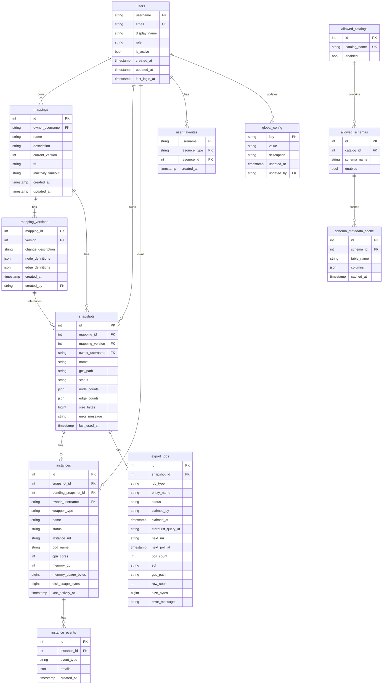

# Data Model Specification

## Overview

Complete database schema specification for the Graph OLAP Platform Control Plane. PostgreSQL is required in all environments (local dev, DO Demo, GCP staging/production).

## Prerequisites

- [requirements.md](--/foundation/requirements.md) - Resource definitions and metadata fields
- [architectural.guardrails.md](--/foundation/architectural.guardrails.md) - Type mapping and SQL compatibility constraints

## Constraints

- PostgreSQL is required in all environments (SQLite not supported)
- Use TEXT for UUIDs, timestamps (ISO 8601), and durations (ISO 8601)
- Use INTEGER for booleans (0/1)
- Foreign keys enforced by PostgreSQL
- PostgreSQL-specific features allowed (e.g., FOR UPDATE SKIP LOCKED)

---

## Type Conventions

| Logical Type | SQL Type | Format | Example |
|--------------|----------|--------|---------|
| User ID | TEXT | Username from auth header | `alice.smith`, `bob.jones` |
| Resource ID | INTEGER | Auto-incrementing | `1`, `42`, `1337` |
| Timestamp | TEXT | ISO 8601 | `2025-01-15T10:30:00Z` |
| Duration | TEXT | ISO 8601 | `PT24H`, `P7D`, `PT30M` |
| Boolean | INTEGER | 0 or 1 | `1` |
| Enum | TEXT | Lowercase values | `pending`, `ready`, `failed` |
| JSON | TEXT | Valid JSON | `{"key": "value"}` |

**ID Strategy:**

- **User IDs:** Username from `X-Username` header (set by auth middleware, see api.common.spec.md#authentication)
- **Resource IDs:** Database-generated auto-incrementing integers (mappings, snapshots, instances, etc.)

---

## Entity Relationship Diagram


<details>
<summary>Mermaid Source</summary>



</details>

---

## Table Definitions

### users

Stores user accounts for FK references and tracking. User ID is the username from `X-Username` header set by auth middleware. **Roles are stored in the database** (ADR-104) as `analyst` | `admin` | `ops`; the `X-User-Role` header path was superseded.

```sql
CREATE TABLE users (
    username TEXT PRIMARY KEY,              -- Username from X-Username header (e.g., 'alice.smith')
    email TEXT NOT NULL UNIQUE,
    display_name TEXT NOT NULL,
    role TEXT NOT NULL DEFAULT 'analyst'    -- CHECK: 'analyst', 'admin', 'ops' (ADR-104)
        CHECK (role IN ('analyst', 'admin', 'ops')),
    role_changed_at TEXT,                   -- ISO 8601 timestamp (nullable)
    role_changed_by TEXT,                   -- Username who last changed role (nullable)
    created_at TEXT NOT NULL,               -- ISO 8601 timestamp
    updated_at TEXT NOT NULL,               -- ISO 8601 timestamp
    last_login_at TEXT,                     -- ISO 8601 timestamp (nullable)
    is_active INTEGER NOT NULL DEFAULT 1    -- 0 = disabled, 1 = active
);

CREATE INDEX idx_users_email ON users(email);
```

**Notes:**

- `username` is extracted from `X-Username` header (primary key)
- User record auto-created on first request if not exists
- **Role IS stored in database** as of ADR-104; values: `analyst`, `admin`, `ops` (default: `analyst`)
- `is_active` allows disabling without deletion
- Users exist primarily for FK references (ownership) and timestamps

---

### mappings

Header table for mapping definitions. Mutable fields separate from immutable versions.

```sql
CREATE TABLE mappings (
    id INTEGER PRIMARY KEY AUTOINCREMENT,
    owner_username TEXT NOT NULL REFERENCES users(username),
    name TEXT NOT NULL,
    description TEXT,
    current_version INTEGER NOT NULL DEFAULT 1,
    created_at TEXT NOT NULL,               -- ISO 8601 timestamp
    updated_at TEXT NOT NULL,               -- ISO 8601 timestamp
    ttl TEXT,                               -- ISO 8601 duration (nullable = no expiry)
    inactivity_timeout TEXT                 -- ISO 8601 duration (nullable = no timeout)
);

CREATE INDEX idx_mappings_owner ON mappings(owner_username);
CREATE INDEX idx_mappings_created_at ON mappings(created_at);
CREATE INDEX idx_mappings_name ON mappings(name);
```

**Notes:**

- `id` is database-generated auto-incrementing integer
- `current_version` points to latest version in mapping_versions
- `ttl` and `inactivity_timeout` store durations as ISO 8601 (e.g., `P7D`, `PT24H`)
- Name is not unique (different owners can have same name)

---

### mapping_versions

Immutable version records. Created on initial mapping creation and each edit.

```sql
CREATE TABLE mapping_versions (
    mapping_id INTEGER NOT NULL REFERENCES mappings(id) ON DELETE CASCADE,
    version INTEGER NOT NULL,
    change_description TEXT,                -- NULL for version 1, required for subsequent
    node_definitions TEXT NOT NULL,         -- JSON array
    edge_definitions TEXT NOT NULL,         -- JSON array
    created_at TEXT NOT NULL,               -- ISO 8601 timestamp
    created_by TEXT NOT NULL REFERENCES users(username),
    PRIMARY KEY (mapping_id, version)
);

CREATE INDEX idx_mapping_versions_created_at ON mapping_versions(created_at);
```

**Notes:**

- Composite primary key (mapping_id, version)
- `change_description` required for version > 1
- `node_definitions` and `edge_definitions` are JSON arrays - see [requirements.md](--/foundation/requirements.md) for complete schema
- Versions are never deleted individually; cascade on mapping delete

---

### snapshots

Data snapshots created from mapping exports.

```sql
CREATE TABLE snapshots (
    id INTEGER PRIMARY KEY AUTOINCREMENT,
    mapping_id INTEGER NOT NULL REFERENCES mappings(id),
    mapping_version INTEGER NOT NULL,
    owner_username TEXT NOT NULL REFERENCES users(username),
    name TEXT NOT NULL,
    description TEXT,
    gcs_path TEXT NOT NULL,                 -- Full GCS path: gs://bucket/{owner}/{mapping_id}/v{mapping_version}/{snapshot_id}/
    size_bytes INTEGER,                     -- Total storage size (set when ready)
    node_counts TEXT,                       -- JSON object: {"Customer": 1000, "Product": 500}
    edge_counts TEXT,                       -- JSON object: {"PURCHASED": 5000}
    status TEXT NOT NULL CHECK (status IN ('pending', 'creating', 'ready', 'failed')),
    progress TEXT,                          -- JSON: current export progress (see schema below)
    error_message TEXT,                     -- Set when status='failed'
    created_at TEXT NOT NULL,               -- ISO 8601 timestamp
    updated_at TEXT NOT NULL,               -- ISO 8601 timestamp
    ttl TEXT,                               -- ISO 8601 duration
    inactivity_timeout TEXT,                -- ISO 8601 duration
    last_used_at TEXT,                      -- Last instance created from this snapshot
    FOREIGN KEY (mapping_id, mapping_version) REFERENCES mapping_versions(mapping_id, version)
);

CREATE INDEX idx_snapshots_mapping_id ON snapshots(mapping_id);
CREATE INDEX idx_snapshots_owner ON snapshots(owner_username);
CREATE INDEX idx_snapshots_status ON snapshots(status);
CREATE INDEX idx_snapshots_created_at ON snapshots(created_at);
```

**Notes:**

- `id` is database-generated auto-incrementing integer
- `mapping_version` captures which version was used (immutable after creation)
- `node_counts` and `edge_counts` are JSON for per-type counts
- `gcs_path` includes snapshot owner's username (not mapping owner)
- `last_used_at` updated when instance created (for inactivity timeout)
- Detailed export progress tracked in `export_jobs` table (one row per node/edge)
- `progress` field provides summary view, derived from `export_jobs` at query time

**Status Transitions:**

```
pending → creating → ready
                  → failed
                  → cancelled
```

- `pending`: Snapshot created, waiting for Export Worker
- `creating`: UNLOAD queries submitted to Starburst, polling in progress
- `ready`: All export_jobs completed successfully
- `failed`: At least one export_job failed
- `cancelled`: Export explicitly cancelled before completion

**Progress JSON Schema (snapshots):**

Derived from `export_jobs` table for API responses:

```json
{
  "phase": "submitting|creating|completed",
  "started_at": "2025-01-15T10:30:00Z",
  "jobs_total": 5,
  "jobs_completed": 3,
  "jobs_failed": 0,
  "jobs": [
    {"name": "Customer", "type": "node", "status": "completed", "row_count": 10000},
    {"name": "Product", "type": "node", "status": "completed", "row_count": 500},
    {"name": "Supplier", "type": "node", "status": "running", "row_count": null},
    {"name": "PURCHASED", "type": "edge", "status": "pending", "row_count": null},
    {"name": "SUPPLIES", "type": "edge", "status": "pending", "row_count": null}
  ]
}
```

---

### Instances

Running graph instance pods.

```sql
CREATE TABLE instances (
    id INTEGER PRIMARY KEY AUTOINCREMENT,
    snapshot_id INTEGER NOT NULL REFERENCES snapshots(id),
    pending_snapshot_id INTEGER REFERENCES snapshots(id),  -- Set when status='waiting_for_snapshot'
    owner_username TEXT NOT NULL REFERENCES users(username),
    wrapper_type TEXT NOT NULL,                          -- e.g. 'ryugraph', 'falkordb'
    name TEXT NOT NULL,
    description TEXT,
    url_slug TEXT UNIQUE,                                -- UUID slug for external URL routing
    instance_url TEXT,                                   -- Set when running: https://{domain}/{slug}/
    pod_name TEXT,                                       -- Kubernetes pod name
    pod_ip TEXT,                                         -- Internal pod IP
    status TEXT NOT NULL CHECK (status IN (
        'waiting_for_snapshot', 'starting', 'running', 'stopping', 'failed'
    )),
    progress TEXT,                          -- JSON: current startup progress (see schema below)
    error_message TEXT,                     -- Human-readable error (set when status='failed')
    error_code TEXT,                        -- Machine-readable error code (set when status='failed')
    stack_trace TEXT,                       -- Stack trace for debugging (set when status='failed')
    created_at TEXT NOT NULL,               -- ISO 8601 timestamp
    updated_at TEXT NOT NULL,               -- ISO 8601 timestamp
    started_at TEXT,                        -- When status became 'running'
    last_activity_at TEXT,                  -- Last query or algorithm execution
    ttl TEXT,                               -- ISO 8601 duration
    inactivity_timeout TEXT,                -- ISO 8601 duration
    cpu_cores INTEGER DEFAULT 2,            -- Current CPU allocation
    memory_gb INTEGER,                      -- Current memory allocation in GB (dynamic resize)
    memory_usage_bytes INTEGER,             -- Observed memory (updated periodically)
    disk_usage_bytes INTEGER                -- Observed disk (updated periodically)
);

CREATE INDEX idx_instances_snapshot_id ON instances(snapshot_id);
CREATE INDEX idx_instances_owner ON instances(owner_username);
CREATE INDEX idx_instances_status ON instances(status);
CREATE INDEX idx_instances_created_at ON instances(created_at);
```

**Notes:**

- `id` is database-generated auto-incrementing integer
- `pending_snapshot_id` is set when an instance is created from a mapping and waits for snapshot export; cleared when instance transitions to `starting`
- `wrapper_type` identifies the graph engine pod type (required)
- Lock state is NOT stored in Control Plane; query `GET /{instance_id}/lock` on the Wrapper Pod directly
- `status='stopping'` is transient; leads to row deletion
- `instance_url` set after pod becomes ready
- `progress` updated by Wrapper Pod via internal API during startup

**Progress JSON Schema (instances):**

```json
{
  "phase": "initializing|loading_nodes|loading_edges|ready",
  "started_at": "2025-01-15T10:30:00Z",
  "steps": [
    {"name": "pod_scheduled", "status": "completed", "completed_at": "2025-01-15T10:30:05Z"},
    {"name": "schema_created", "status": "completed", "completed_at": "2025-01-15T10:30:10Z"},
    {"name": "Customer", "type": "node", "status": "completed", "row_count": 10000},
    {"name": "Product", "type": "node", "status": "in_progress", "row_count": null},
    {"name": "PURCHASED", "type": "edge", "status": "pending", "row_count": null}
  ]
}
```

---

### instance_events

Resource monitoring events for instances (CPU updates, memory upgrades, OOM recoveries).

```sql
CREATE TABLE instance_events (
    id INTEGER PRIMARY KEY AUTOINCREMENT,
    instance_id INTEGER NOT NULL REFERENCES instances(id) ON DELETE CASCADE,
    event_type TEXT NOT NULL CHECK (event_type IN (
        'memory_upgraded', 'cpu_updated', 'oom_recovered', 'resize_failed'
    )),
    details TEXT,                            -- JSON with old/new values
    created_at TEXT NOT NULL                 -- ISO 8601 timestamp
);

CREATE INDEX idx_instance_events_instance_id ON instance_events(instance_id);
CREATE INDEX idx_instance_events_type ON instance_events(event_type);
```

**Notes:**

- Cascade-deleted when the parent instance is deleted
- `details` JSON typically records `{from: <old_value>, to: <new_value>}` for resize events

---

### global_config

Ops-managed global configuration.

```sql
CREATE TABLE global_config (
    key TEXT PRIMARY KEY,
    value TEXT NOT NULL,                    -- JSON or simple value
    description TEXT,
    updated_at TEXT NOT NULL,               -- ISO 8601 timestamp
    updated_by TEXT NOT NULL REFERENCES users(username)
);
```

**Configuration Keys:**

| Key | Value Format | Description |
|-----|--------------|-------------|
| `lifecycle.mapping.default_ttl` | ISO 8601 duration | Default mapping TTL |
| `lifecycle.mapping.default_inactivity` | ISO 8601 duration | Default mapping inactivity timeout |
| `lifecycle.mapping.max_ttl` | ISO 8601 duration | Maximum allowed mapping TTL |
| `lifecycle.snapshot.default_ttl` | ISO 8601 duration | Default snapshot TTL (e.g., `P7D`) |
| `lifecycle.snapshot.default_inactivity` | ISO 8601 duration | Default snapshot inactivity timeout |
| `lifecycle.snapshot.max_ttl` | ISO 8601 duration | Maximum allowed snapshot TTL |
| `lifecycle.instance.default_ttl` | ISO 8601 duration | Default instance TTL (e.g., `PT24H`) |
| `lifecycle.instance.default_inactivity` | ISO 8601 duration | Default instance inactivity timeout |
| `lifecycle.instance.max_ttl` | ISO 8601 duration | Maximum allowed instance TTL |
| `concurrency.per_analyst` | INTEGER | Max instances per analyst |
| `concurrency.cluster_total` | INTEGER | Max instances cluster-wide |
| `maintenance.enabled` | BOOLEAN | Maintenance mode on/off |
| `maintenance.message` | TEXT | Message shown during maintenance |
| `cache.metadata.ttl_hours` | INTEGER | Schema metadata cache TTL (default: 24) |
| `export.max_duration_seconds` | INTEGER | Max export job duration before timeout (default: 3600) |

---

### allowed_catalogs

Starburst catalogs available for Schema Browser.

```sql
CREATE TABLE allowed_catalogs (
    id INTEGER PRIMARY KEY AUTOINCREMENT,
    catalog_name TEXT NOT NULL UNIQUE,
    enabled INTEGER NOT NULL DEFAULT 1,  -- 0=disabled, 1=enabled
    created_at TEXT NOT NULL,            -- ISO 8601
    updated_at TEXT NOT NULL             -- ISO 8601
);
```

---

### allowed_schemas

Schemas within allowed catalogs.

```sql
CREATE TABLE allowed_schemas (
    id INTEGER PRIMARY KEY AUTOINCREMENT,
    catalog_id INTEGER NOT NULL REFERENCES allowed_catalogs(id) ON DELETE CASCADE,
    schema_name TEXT NOT NULL,
    enabled INTEGER NOT NULL DEFAULT 1,
    created_at TEXT NOT NULL,
    updated_at TEXT NOT NULL,
    UNIQUE(catalog_id, schema_name)
);
```

---

### schema_metadata_cache

Cached table/column metadata from Starburst.

```sql
CREATE TABLE schema_metadata_cache (
    id INTEGER PRIMARY KEY AUTOINCREMENT,
    schema_id INTEGER NOT NULL REFERENCES allowed_schemas(id) ON DELETE CASCADE,
    table_name TEXT NOT NULL,
    columns TEXT NOT NULL,               -- JSON: [{name, type, nullable}]
    cached_at TEXT NOT NULL,             -- ISO 8601
    UNIQUE(schema_id, table_name)
);
```

---

**Note:** Audit logging is handled by the external observability stack, not stored in this database. See requirements for audit event categories.

---

### user_favorites

User bookmarks for quick access.

```sql
CREATE TABLE user_favorites (
    username TEXT NOT NULL REFERENCES users(username) ON DELETE CASCADE,
    resource_type TEXT NOT NULL CHECK (resource_type IN ('mapping', 'snapshot', 'instance')),
    resource_id INTEGER NOT NULL,
    created_at TEXT NOT NULL,               -- ISO 8601 timestamp
    PRIMARY KEY (username, resource_type, resource_id)
);

CREATE INDEX idx_user_favorites_username ON user_favorites(username);
CREATE INDEX idx_user_favorites_resource ON user_favorites(resource_type, resource_id);
```

**Notes:**

- No foreign key to resource tables (polymorphic reference)
- When a resource is deleted, application MUST also delete matching favorites:
  `DELETE FROM user_favorites WHERE resource_type = :type AND resource_id = :id`

---

### export_jobs

Tracks individual Starburst UNLOAD queries for each snapshot export. See ADR-025 for architecture details.

```sql
CREATE TABLE export_jobs (
    id INTEGER PRIMARY KEY AUTOINCREMENT,
    snapshot_id INTEGER NOT NULL REFERENCES snapshots(id) ON DELETE CASCADE,
    job_type TEXT NOT NULL CHECK (job_type IN ('node', 'edge')),
    entity_name TEXT NOT NULL,              -- Node label or edge type name
    status TEXT NOT NULL DEFAULT 'pending' CHECK (status IN ('pending', 'claimed', 'submitted', 'completed', 'failed')),

    -- Job claiming (for stateless workers)
    claimed_by TEXT,                        -- Worker ID that claimed this job
    claimed_at TEXT,                        -- When job was claimed (for lease expiry)

    -- Starburst tracking
    starburst_query_id TEXT,                -- Query ID from POST /v1/statement response
    next_uri TEXT,                          -- Current polling URI for this query

    -- Stateless polling state (persisted, not in-memory)
    next_poll_at TEXT,                      -- When to poll next (ISO 8601)
    poll_count INTEGER DEFAULT 0,           -- Number of polls (for Fibonacci backoff)

    -- Job definition (denormalized for worker efficiency)
    sql TEXT,                               -- UNLOAD SQL query
    column_names TEXT,                      -- JSON array of column names
    starburst_catalog TEXT,                 -- Starburst catalog name

    -- Results (set on completion)
    gcs_path TEXT NOT NULL,                 -- gs://bucket/{owner}/{mapping_id}/v{mapping_version}/{snapshot_id}/nodes/{entity}/
    row_count INTEGER,                      -- Row count from Parquet files
    size_bytes INTEGER,                     -- Total size of Parquet files

    -- Timestamps
    submitted_at TEXT,                      -- When UNLOAD query was submitted to Starburst
    completed_at TEXT,                      -- When query finished (success or failure)
    error_message TEXT,                     -- Error details if status='failed'

    created_at TEXT NOT NULL,               -- ISO 8601 timestamp
    updated_at TEXT NOT NULL                -- ISO 8601 timestamp
);

CREATE INDEX idx_export_jobs_snapshot_id ON export_jobs(snapshot_id);
CREATE INDEX idx_export_jobs_status ON export_jobs(status);
CREATE INDEX idx_export_jobs_snapshot_status ON export_jobs(snapshot_id, status);
CREATE INDEX idx_export_jobs_claimable ON export_jobs(status, next_poll_at);  -- For job claiming queries
```

**Notes:**

- One row per node/edge definition in the mapping
- Workers are **stateless** - all polling state persisted in database
- `claimed_by` and `claimed_at` enable lease-based job ownership
- `next_poll_at` and `poll_count` enable stateless Fibonacci backoff
- `sql`, `column_names`, `starburst_catalog` denormalized so workers don't need to fetch mapping
- Snapshot status='ready' only when ALL export_jobs for that snapshot are 'completed'
- Snapshot status='failed' if ANY export_job has status='failed'

**Status Transitions:**

```
pending → claimed → submitted → completed
                             → failed
       ↑__________|  (lease expired, reset by reconciliation)
```

- `pending`: Job created, waiting to be claimed
- `claimed`: Worker claimed job, preparing to submit to Starburst
- `submitted`: UNLOAD query submitted, polling for completion
- `completed`: Query finished successfully, rows counted
- `failed`: Query failed or error during processing

**Job Claiming (Atomic):**

```sql
-- Worker claims up to N pending jobs atomically
UPDATE export_jobs
SET status = 'claimed',
    claimed_by = :worker_id,
    claimed_at = :now
WHERE id IN (
    SELECT id FROM export_jobs
    WHERE status = 'pending'
    ORDER BY created_at
    LIMIT :limit
    FOR UPDATE SKIP LOCKED
)
RETURNING *;
```

**Pollable Jobs Query:**

```sql
-- Get jobs ready for polling (submitted + poll time reached)
SELECT * FROM export_jobs
WHERE status = 'submitted'
  AND next_poll_at <= :now
ORDER BY next_poll_at
LIMIT :limit
FOR UPDATE SKIP LOCKED;
```

**Lease Expiry (Reconciliation):**

```sql
-- Reset stale claimed jobs (lease expired after 10 minutes)
UPDATE export_jobs
SET status = 'pending',
    claimed_by = NULL,
    claimed_at = NULL
WHERE status = 'claimed'
  AND claimed_at < :now - INTERVAL '10 minutes';
```

---

## Indexes Summary

### Required Indexes (Performance Critical)

| Table | Index | Purpose |
|-------|-------|---------|
| mappings | `idx_mappings_owner` | Filter by owner |
| mappings | `idx_mappings_created_at` | Sort by creation |
| snapshots | `idx_snapshots_mapping_id` | List snapshots for mapping |
| snapshots | `idx_snapshots_status` | Filter by status |
| instances | `idx_instances_owner` | Filter by owner |
| instances | `idx_instances_status` | Filter by status |

### Recommended Indexes (Query Optimization)

| Table | Index | Purpose |
|-------|-------|---------|
| mappings | `idx_mappings_name` | Text search on name |
| snapshots | `idx_snapshots_owner` | Filter by owner |
| snapshots | `idx_snapshots_created_at` | Sort by creation |
| instances | `idx_instances_snapshot_id` | List instances for snapshot |
| instances | `idx_instances_created_at` | Sort by creation |
| export_jobs | `idx_export_jobs_snapshot_status` | Find running jobs for snapshot |

---

## Query Patterns

### Common Queries with Indexes

**List mappings for owner with pagination:**

```sql
SELECT m.*,
       (SELECT COUNT(*) FROM snapshots s WHERE s.mapping_id = m.id) as snapshot_count
FROM mappings m
WHERE m.owner_username = ?
ORDER BY m.created_at DESC
LIMIT ? OFFSET ?;
-- Uses: idx_mappings_owner, idx_mappings_created_at
```

**Get mapping with current version:**

```sql
SELECT m.*, mv.node_definitions, mv.edge_definitions, mv.change_description, mv.created_at as version_created_at
FROM mappings m
JOIN mapping_versions mv ON m.id = mv.mapping_id AND m.current_version = mv.version
WHERE m.id = ?;
```

**List snapshots for mapping (all versions):**

```sql
SELECT s.*
FROM snapshots s
WHERE s.mapping_id = ?
ORDER BY s.created_at DESC
LIMIT ? OFFSET ?;
-- Uses: idx_snapshots_mapping_id
```

**Check if mapping can be deleted (no snapshots exist):**

```sql
SELECT COUNT(*) as snapshot_count
FROM snapshots
WHERE mapping_id = ?;
-- Deletion blocked if count > 0
```

**Check if snapshot can be deleted (no active instances exist):**

```sql
SELECT COUNT(*) as instance_count
FROM instances
WHERE snapshot_id = ?
  AND status IN ('starting', 'running');
-- Deletion blocked if count > 0
-- Note: 'stopping' instances are being terminated; 'failed' instances are dead
-- Both can be cleaned up separately, so they don't block snapshot deletion
```

**Count running instances for concurrency check:**

```sql
-- Per-analyst limit
SELECT COUNT(*) as user_instance_count
FROM instances
WHERE owner_username = ?
  AND status IN ('starting', 'running');

-- Cluster-wide limit
SELECT COUNT(*) as total_instance_count
FROM instances
WHERE status IN ('starting', 'running');
```

**Find instances due for inactivity timeout:**

```sql
SELECT id, name, owner_username, last_activity_at, inactivity_timeout
FROM instances
WHERE status = 'running'
  AND inactivity_timeout IS NOT NULL
  AND datetime(last_activity_at, '+' ||
      CAST(SUBSTR(inactivity_timeout, 3, LENGTH(inactivity_timeout)-3) AS INTEGER) || ' hours')
      < datetime('now');
-- Note: Duration parsing simplified; actual implementation needs proper ISO 8601 parsing
```

**Search mappings by name/description:**

```sql
SELECT *
FROM mappings
WHERE (name LIKE '%' || ? || '%' OR description LIKE '%' || ? || '%')
ORDER BY created_at DESC
LIMIT ? OFFSET ?;
```

---

## Migration Strategy

### Initial Schema Creation

```sql
-- migrations/001_initial_schema.sql

-- Users
CREATE TABLE users (...);

-- Mappings and versions
CREATE TABLE mappings (...);
CREATE TABLE mapping_versions (...);

-- Snapshots and instances
CREATE TABLE snapshots (...);
CREATE TABLE instances (...);

-- Configuration
CREATE TABLE global_config (...);

-- Favorites
CREATE TABLE user_favorites (...);

-- Export jobs
CREATE TABLE export_jobs (...);

-- All indexes
CREATE INDEX ...;
```

### Migration Numbering

Format: `{NNN}_{description}.sql`

- `001_initial_schema.sql`
- `002_add_user_favorites.sql`
- `003_add_export_jobs.sql`

### Rollback Strategy

Each migration should have a corresponding down migration:

- `001_initial_schema.down.sql` - DROP all tables
- `002_add_user_favorites.down.sql` - DROP TABLE user_favorites

### Data Seeding (Development)

```sql
-- seeds/001_initial_config.sql

INSERT INTO global_config (key, value, description, updated_at, updated_by) VALUES
('lifecycle.mapping.default_ttl', NULL, 'Default mapping TTL (null = no expiry)', '2025-01-15T00:00:00Z', 'system'),
('lifecycle.mapping.default_inactivity', 'P30D', 'Default mapping inactivity timeout', '2025-01-15T00:00:00Z', 'system'),
('lifecycle.snapshot.default_ttl', 'P7D', 'Default snapshot TTL', '2025-01-15T00:00:00Z', 'system'),
('lifecycle.snapshot.default_inactivity', 'P3D', 'Default snapshot inactivity timeout', '2025-01-15T00:00:00Z', 'system'),
('lifecycle.instance.default_ttl', 'PT24H', 'Default instance TTL', '2025-01-15T00:00:00Z', 'system'),
('lifecycle.instance.default_inactivity', 'PT4H', 'Default instance inactivity timeout', '2025-01-15T00:00:00Z', 'system'),
('concurrency.per_analyst', '5', 'Max instances per analyst', '2025-01-15T00:00:00Z', 'system'),
('concurrency.cluster_total', '50', 'Max instances cluster-wide', '2025-01-15T00:00:00Z', 'system'),
('export.max_duration_seconds', '3600', 'Max export job duration before timeout (1 hour)', '2025-01-15T00:00:00Z', 'system');
```

---

## Constraints and Validation

### Application-Level Validation

These constraints must be enforced in application code:

| Constraint | Enforcement |
|------------|-------------|
| Mapping name max length | 255 characters |
| Description max length | 4000 characters |
| change_description required for version > 1 | Check on INSERT |
| TTL ≤ hard limit | Compare against global_config |
| Cannot delete mapping with snapshots | Query count before DELETE |
| Cannot delete snapshot with instances | Query count before DELETE |

### Database-Level Constraints

| Constraint | Type | Table |
|------------|------|-------|
| Primary keys | UNIQUE, NOT NULL | All tables |
| Foreign keys | REFERENCES | See table definitions |
| Status enum | CHECK | snapshots, instances |
| Status enum | CHECK | instances, export_jobs |

---

## Anti-Patterns

See [architectural.guardrails.md](--/foundation/architectural.guardrails.md#anti-patterns-must-not-do) for the authoritative list of anti-patterns.

Key sections relevant to data model:

- **Database & Schema** - No PostgreSQL-specific features, no algorithm results in DB
- **Query Patterns** - No SELECT *, no ORM lazy loading, always use LIMIT
- **Resource Lifecycle** - Respect deletion dependencies (instances → snapshots → mappings)
- **Authentication & Authorization** - No password storage, encrypt sensitive data

---

## Schema Creation and Alembic Migrations

**Base-schema bootstrap (authoritative):**

The base schema (`users`, `mappings`, `snapshots`, `instances`, `export_jobs`,
`global_config`, etc.) is created at control-plane startup by SQLAlchemy's
`metadata.create_all()`, invoked from
`packages/control-plane/src/control_plane/infrastructure/database.py`
(`init_database()` → `await conn.run_sync(metadata.create_all)`). The same
path runs in E2E tests via `packages/control-plane/tests/conftest.py`.

`DatabaseManager.startup()` in that module calls `init_database()` only when
`settings.debug` is true (local and E2E). In production, `metadata.create_all`
is still the first-boot creation path, but Alembic is expected to be run once
at install time against an empty database. The Alembic config acknowledges
this dual path (`packages/control-plane/alembic.ini`):

> In development/testing, tables are auto-created via metadata.create_all().

**Alembic migrations (delta-only):**

Alembic migrations under
`packages/control-plane/alembic/versions/` cover **schema deltas on top of
the baseline**, not the baseline itself. As of ADR-149 the directory contains
three migrations (the fresh-install baseline is still the SQLAlchemy
metadata):

| File | Intent |
|------|--------|
| `20250127_1502_440c6421ad9d_add_pending_snapshot_id_and_waiting_for.py` | Adds `instances.pending_snapshot_id` FK and the `waiting_for_snapshot` status for the "create instance from mapping" feature. |
| `20260204_add_memory_gb_column.py` | Adds the nullable `instances.memory_gb` column for Phase 3 dynamic memory upgrade. |
| `20260330_add_role_column_to_users.py` | Adds `users.role` per ADR-104 (database-backed role management). |

**Bootstrap order for a fresh database:**

1. Run `metadata.create_all()` (via `init_database()` or the control-plane
   startup path with `debug=True` on a dedicated bootstrap run) to create the
   baseline tables.
2. Run `alembic upgrade head` so the `alembic_version` table is stamped at
   the latest revision and any delta columns/constraints that aren't in the
   SQLAlchemy model are applied. (For the three migrations above the columns
   and `role` are already in the SQLAlchemy models, so this is primarily to
   stamp the version table.)
3. Start the control plane normally.

**Known risk — migration-only production deploys would fail to bootstrap a
fresh database.** Because there is no `alembic revision --autogenerate`-style
baseline migration covering the initial `CREATE TABLE` statements, running
`alembic upgrade head` against an empty PostgreSQL database will fail: the
first migration tries to `ALTER TABLE instances ADD COLUMN
pending_snapshot_id …` before `instances` exists. Any production deploy path
that relies on Alembic alone (for example, a future CI check that forbids
`metadata.create_all` in production) must first introduce an explicit baseline
migration that recreates the full schema from `infrastructure.tables.metadata`.
This is tracked as part of ADR-149's Tier-C.16 follow-ups.

---

## Open Questions

See [decision.log.md](--/process/decision.log.md) for consolidated open questions and architecture decision records.
