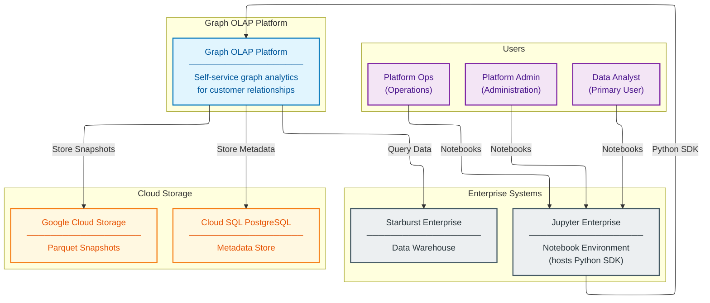
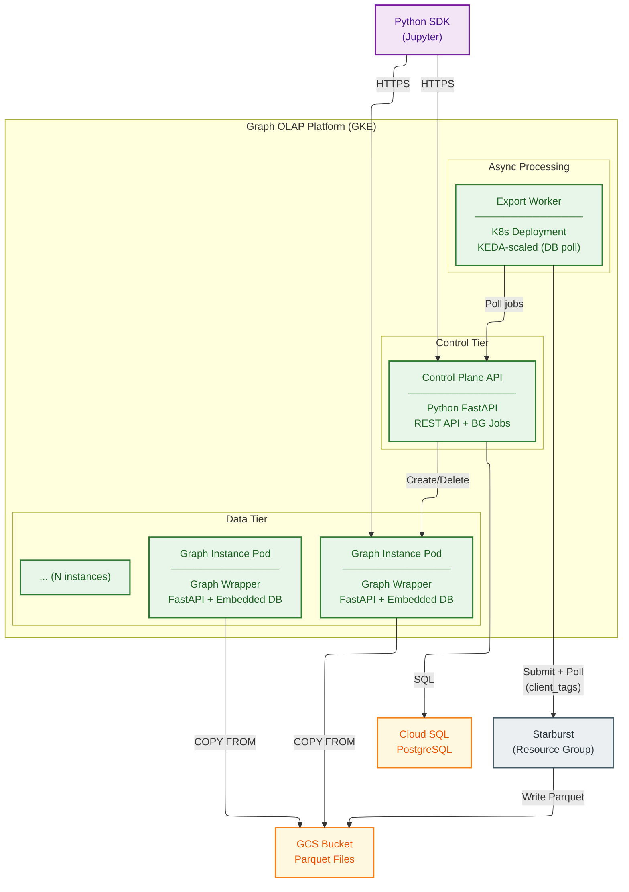
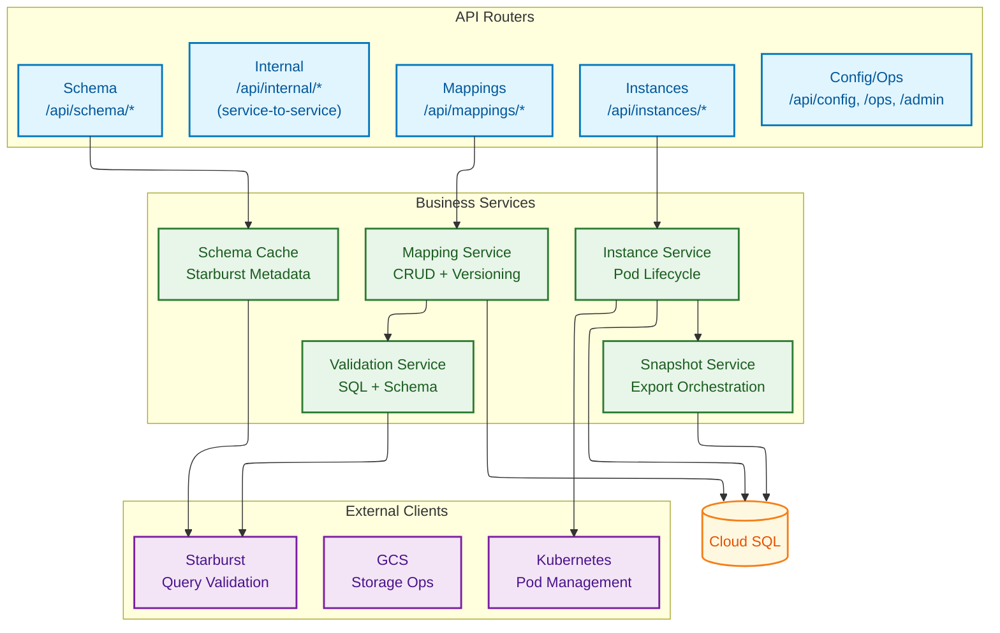
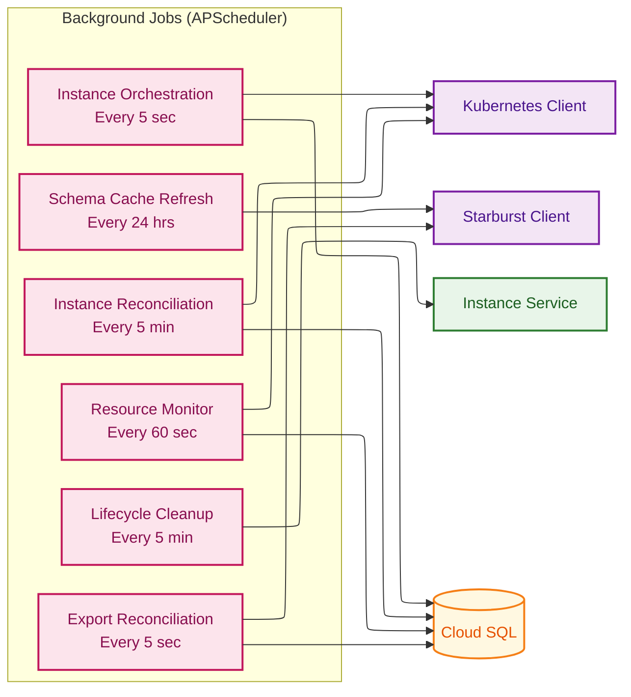
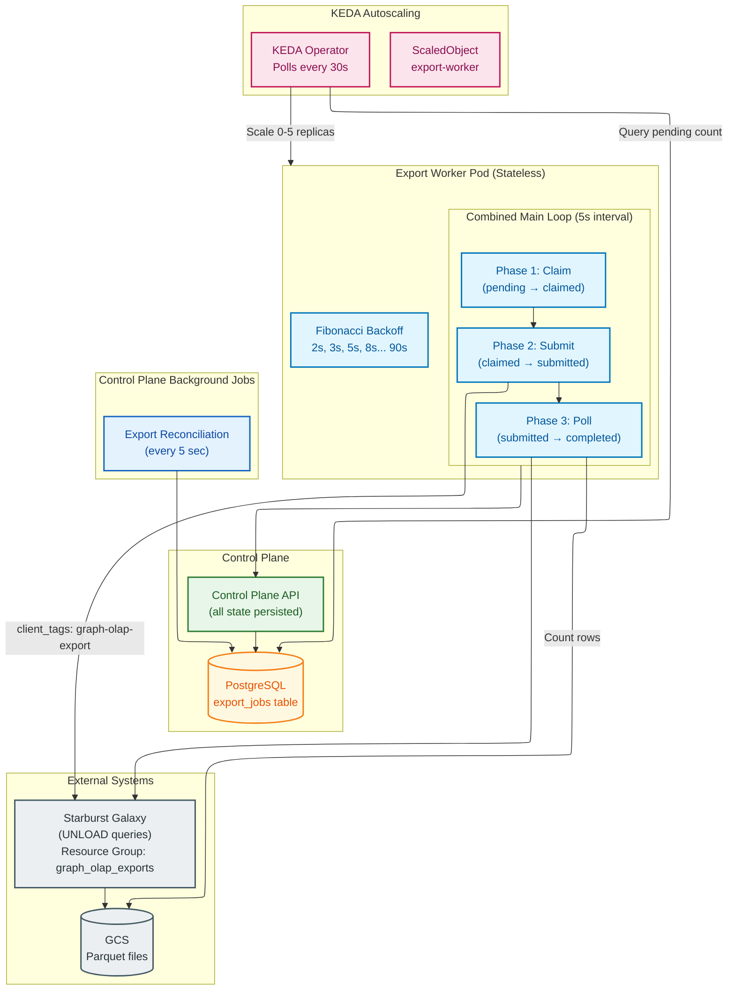
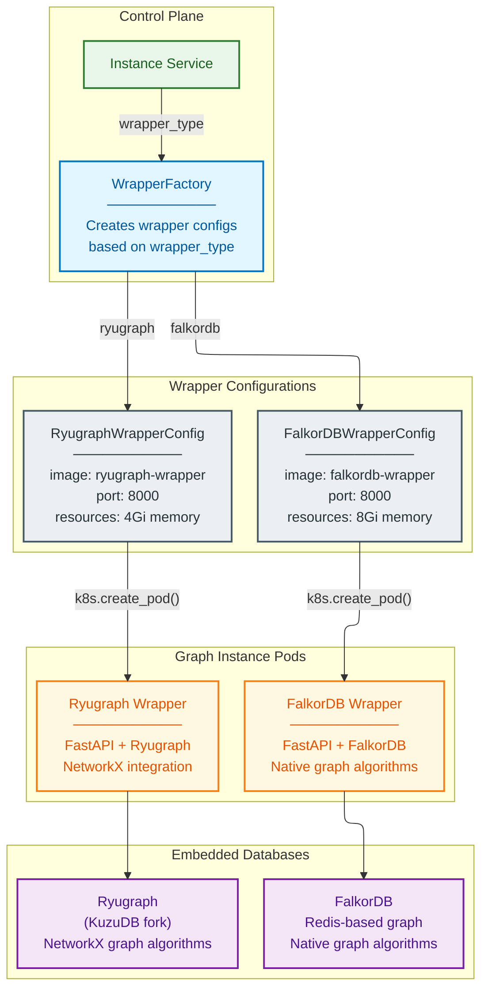
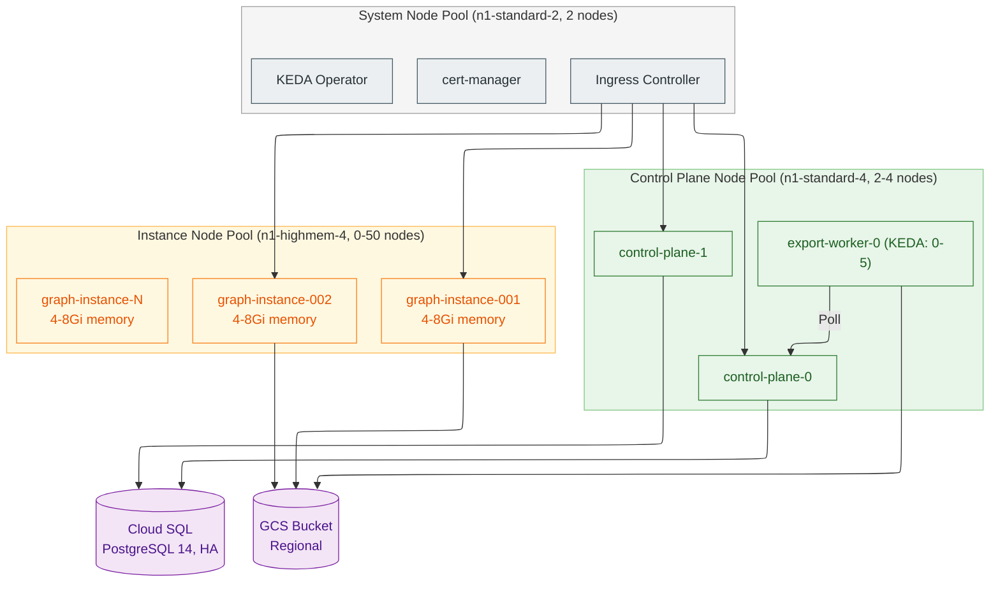

# Graph OLAP Platform - Detailed Architecture

**Document Type:** Detailed Architecture Specification
**Version:** 1.0
**Status:** Ready for Architectural Review
**Author:** Graph OLAP Platform Team
**Target Audience:** HSBC Enterprise Architecture
**Last Updated:** 2026-02-04

---

## Document Structure

This architecture documentation is organized into five focused documents:

| Document | Content |
|----------|---------|
| **This document** | Executive Summary + C4 Architecture Viewpoints + Resource Management |
| [SDK Architecture](sdk-architecture.md) | Python SDK, Resource Managers, Authentication |
| [Domain & Data Architecture](domain-and-data.md) | Domain Model, State Machines, Data Flows |
| [Platform Operations](platform-operations.md) | Technology, Security, Integration, Operations, NFRs |
| [Authorization & Access Control](authorization.md) | RBAC Roles, Permission Matrix, Ownership Model, Enforcement |

---

## Executive Summary

### Business Context

HSBC Customer Service Analytics requires capabilities to perform ad-hoc graph analysis on customer relationship data. Currently, analysts must request custom development for each graph analysis need, creating delays and limiting analytical agility.

The Graph OLAP Platform addresses this by enabling analysts to:

- Define graph structures from existing Starburst data warehouse queries
- Create graph instances directly from mappings (snapshots managed internally)
- Run graph algorithms (PageRank, Community Detection, Shortest Path) via simple SDK method calls
- Share analysis artifacts with colleagues while maintaining ownership controls

### Solution Overview

The platform implements a **Control Plane + Data Plane** architecture pattern:

- **Control Plane:** Manages resource lifecycle, orchestrates operations, provides REST API for SDK integration
- **Data Plane:** Ephemeral graph database instances (Ryugraph/FalkorDB) for query and algorithm execution

### Key Architectural Decisions

| Decision | Choice | Rationale |
|----------|--------|-----------|
| Graph Database | Ryugraph (KuzuDB fork), FalkorDB | Embedded Python bindings, NetworkX integration, sub-2GB graph optimization |
| Compute Platform | Google Kubernetes Engine (GKE) | Managed Kubernetes, Workload Identity, native GCP integration |
| Data Transfer | Parquet via GCS | Industry-standard columnar format, Starburst native support |
| API Design | REST + JSON | Enterprise standard, broad tooling support |
| Export Architecture | KEDA-scaled workers + DB polling | Scale-to-zero, simplified architecture, Starburst resource groups for throttling |
| Pod Isolation | Pod-per-Instance | Strong resource isolation, independent scaling, clear security boundary |

### Expected Outcomes

| Metric | Current State | Target State |
|--------|---------------|--------------|
| Time to graph analysis | Days (custom development) | Minutes (self-service) |
| Analysis reproducibility | Manual recreation | Automatic snapshots (managed internally) |
| Collaboration | Email/file sharing | Shared platform resources |
| Graph algorithm access | Requires coding | SDK method calls |

---

## 1. Architecture Viewpoints (C4 Model)

This section presents the system architecture using the C4 model (Context, Containers, Components) for multiple levels of abstraction.

### 1.1 System Context (C4 Level 1)

The system context shows the Graph OLAP Platform within HSBC's analytics ecosystem.


<details>
<summary>Mermaid Source</summary>



</details>

**Role Hierarchy:** `Analyst < Admin < Ops` (strict superset). Ops inherits all Admin permissions plus exclusive access to platform configuration, cluster monitoring, and background job management. See [Authorization & Access Control](authorization.md) for the full permission matrix.

### 1.2 Container Diagram (C4 Level 2)

Decomposition of the Graph OLAP Platform into its primary containers (deployable units).


<details>
<summary>Mermaid Source</summary>



</details>

### 1.3 Control Plane Components (C4 Level 3)

Detailed view of the Control Plane internal components, split into API layer and background jobs.

#### 1.3.1 API Layer


<details>
<summary>Mermaid Source</summary>



</details>

#### 1.3.2 Background Jobs


<details>
<summary>Mermaid Source</summary>



</details>

### 1.4 Export Pipeline Components (C4 Level 3)

Detailed view of the Export Worker architecture showing stateless design and KEDA scaling.


<details>
<summary>Mermaid Source</summary>



</details>

### 1.5 Multi-Wrapper Architecture

The platform supports multiple graph database backends through a pluggable wrapper architecture. Both Ryugraph (KuzuDB + NetworkX) and FalkorDB are first-class options with equal support.


<details>
<summary>Mermaid Source</summary>



</details>

**Wrapper Selection:**

| Wrapper | Use Case | Memory | Algorithms | Persistence |
|---------|----------|--------|------------|-------------|
| **Ryugraph** | NetworkX integration, Python algorithms | 4-8 GB | NetworkX (Python) | Disk-based |
| **FalkorDB** | Larger graphs, native performance | 8-16 GB | Native C algorithms | In-memory |

Both wrappers provide equivalent Cypher query support and expose the same REST API interface.

### 1.6 Schema Metadata API

The platform provides a Schema Metadata API for browsing Starburst catalog structure. This enables users to discover available tables and columns when authoring mapping queries.

**Architecture:**

- **In-Memory Cache**: All catalog metadata is cached in memory for sub-millisecond lookups
- **Background Refresh**: Cache refreshes every 24 hours via APScheduler background job
- **Search Indices**: Prefix-based search for tables and columns (~100us for typical queries)

**API Endpoints:**

| Endpoint | Description | Performance |
|----------|-------------|-------------|
| `GET /api/schema/catalogs` | List all catalogs | ~1us |
| `GET /api/schema/catalogs/{catalog}/schemas` | List schemas in catalog | ~1us |
| `GET /api/schema/catalogs/{catalog}/schemas/{schema}/tables` | List tables in schema | ~1us |
| `GET /api/schema/.../tables/{table}/columns` | List columns in table | ~1us |
| `GET /api/schema/search/tables?q=` | Search tables by prefix | ~100us |
| `GET /api/schema/search/columns?q=` | Search columns by prefix | ~100us |
| `POST /api/schema/admin/refresh` | Manual refresh (admin) | async |
| `GET /api/schema/stats` | Cache statistics (admin) | ~1us |

### 1.7 Deployment Architecture (GKE Topology)

Physical deployment topology across GKE node pools.


<details>
<summary>Mermaid Source</summary>



</details>

### 1.8 Wrapper Pod Resource Management

Graph instance pods require careful resource management to balance performance, cost, and cluster capacity. The platform uses **dynamic sizing at creation** with **in-place CPU scaling** rather than traditional autoscalers.

#### 1.8.1 Resource Allocation Strategy

**Default Resource Configuration (GKE London):**

These defaults are applied at spawn time by `WrapperFactory.get_wrapper_config`
(see `packages/control-plane/src/control_plane/services/wrapper_factory.py`).
Per ADR-149 Tier-B.10 the factory is the authoritative source for wrapper
resource defaults; all other documentation and config surfaces mirror these
values.

| Wrapper | Memory Request | Memory Limit | CPU Request | CPU Limit | QoS Class |
|---------|----------------|--------------|-------------|-----------|-----------|
| **Ryugraph** | 4Gi | 8Gi | 2 | 4 | Burstable |
| **FalkorDB** | 2Gi | 4Gi | 1 | 2 | Burstable |

**QoS Strategy:**
- **Memory**: Requests sized to accommodate typical workloads; limits prevent runaway consumption
- **CPU**: Burstable (limit = 2× request) allows burst capacity for query execution peaks without over-provisioning

#### 1.8.2 Dynamic Sizing from Snapshot Size

When an instance is created, resources are automatically calculated from the snapshot's Parquet file size:

| Wrapper | Memory Formula | Rationale |
|---------|----------------|-----------|
| **FalkorDB** | `parquet_size × 2.0 + headroom` | In-memory graph requires ~2× Parquet size |
| **Ryugraph** | `parquet_size × 1.2 + headroom` | Buffer pool + disk-backed storage |

**Configuration (Helm values):**
```yaml
sizing:
  enabled: "true"
  falkordbMemoryMultiplier: "2.0"
  ryugraphMemoryMultiplier: "1.2"
  memoryHeadroom: "1.5"
  minMemoryGb: "2.0"
  maxMemoryGb: "16.0"
```

**Sizing Flow:**

```
Snapshot.size_bytes → instance_service._calculate_resources() → k8s_service.create_wrapper_pod()
                              ↓
                    Apply multiplier + headroom
                              ↓
                    Clamp to [minMemoryGb, maxMemoryGb]
                              ↓
                    Set memory_request = memory_limit (Guaranteed QoS for memory)
```

#### 1.8.3 In-Place Resource Scaling (Kubernetes 1.27+)

The platform supports **in-place vertical pod resizing** for both CPU and memory without pod restart, using Kubernetes InPlacePodVerticalScaling (enabled by default in K8s 1.33+, available as alpha in 1.27+).

##### CPU Scaling

CPU can be increased or decreased freely:

```python
# SDK usage
instance.update_cpu(cpu_cores=2)  # Resize from 1 to 2 cores
```

```bash
# Kubernetes operation (k8s_service.resize_pod_cpu)
kubectl patch pod <pod-name> --subresource=resize \
  -p '{"spec":{"containers":[{"name":"wrapper","resources":{"requests":{"cpu":"2"},"limits":{"cpu":"4"}}}]}}'
```

- CPU limit always set to 2× request (Burstable QoS)
- Both increases and decreases work without restart

##### Memory Scaling

Memory can only be **increased** (not decreased) due to OS-level constraints:

```python
# SDK usage
instance.update_memory(memory_gb=8)  # Upgrade from 4GB to 8GB
```

```bash
# Kubernetes operation (k8s_service.resize_pod_memory)
kubectl patch pod <pod-name> --subresource=resize \
  -p '{"spec":{"containers":[{"name":"wrapper","resources":{"requests":{"memory":"8Gi"},"limits":{"memory":"8Gi"}}}]}}'
```

**Why memory decrease is not supported:**
- Memory is a non-compressible resource (unlike CPU which can be throttled)
- Decreasing memory below current usage triggers immediate OOM kill
- For loaded graph databases, usage ≈ limit, so decreases would always fail

##### Automatic Memory Upgrades

The Resource Monitor Job (runs every 60s) proactively upgrades memory before OOM:

| Level | Trigger | Action |
|-------|---------|--------|
| Proactive | Memory > 80% for 2 min | Double memory (up to max) |
| Urgent | Memory > 90% for 1 min | Immediate resize + notification |
| Recovery | OOMKilled event | Auto-restart with 2× memory |

##### Scaling Constraints

| Constraint | Value | Applies To |
|------------|-------|------------|
| Resize cooldown | 300 seconds | CPU and memory |
| Max memory | 32 GB | Per instance |
| Max resize steps | 2 | Automatic upgrades only |
| Memory QoS | request = limit | Guaranteed QoS maintained |

**API Endpoints:**
- `PUT /api/instances/{id}/cpu` - CPU scaling (increase or decrease)
- `PUT /api/instances/{id}/memory` - Memory upgrade (increase only)

#### 1.8.4 Resource Governance

To prevent resource exhaustion in shared clusters, the platform enforces governance limits:

| Limit | Default | Purpose |
|-------|---------|---------|
| Per-instance max memory | 16 GB | Prevent single pod from consuming excessive resources |
| Per-user max memory | 32 GB | Fair share across analysts |
| Cluster soft limit | 64 GB | Capacity protection (triggers warnings, not hard block) |
| Max resize steps | 2 | Limit automatic memory tier upgrades |
| Resize cooldown | 300s | Prevent resize storms |

#### 1.8.5 Why Not VPA or HPA?

| Autoscaler | Decision | Rationale |
|------------|----------|-----------|
| **VPA** (Vertical Pod Autoscaler) | Not used | Wrapper pods are short-lived (TTL <24h); VPA complexity not justified |
| **HPA** (Horizontal Pod Autoscaler) | Not applicable | One pod per instance by design (not horizontally scalable) |

**Instead:** Dynamic sizing at creation + in-place resource scaling provides simpler, more predictable resource management for ephemeral graph workloads.

**Detailed Documentation:** For implementation details and configuration options, see [control-plane.design.md - Wrapper Pod Resource Management](--/component-designs/control-plane.design.md#wrapper-pod-resource-management).

---

## 2. Python SDK Architecture

The Graph OLAP Platform is **notebook-first** by design—all user interactions happen through the Python SDK in Jupyter notebooks. There is no separate web console or GUI.

**See [SDK Architecture](sdk-architecture.md)** for complete documentation including:

- SDK as sole user interface (resource managers table)
- Client architecture diagram
- Typical user workflow sequence
- Package structure
- Key design decisions
- Authentication flow

---

## Related Documents

- **[SDK Architecture](sdk-architecture.md)** - Python SDK, Resource Managers, Authentication
- **[Domain & Data Architecture](domain-and-data.md)** - Domain Model, State Machines, Data Flows
- **[Platform Operations](platform-operations.md)** - Technology, Security, Integration, Operations, NFRs
- **[Authorization & Access Control](authorization.md)** - RBAC Roles, Permission Matrix, Ownership Model, Enforcement

---

*This is part of the Graph OLAP Platform architecture documentation. See also: [SDK Architecture](sdk-architecture.md), [Domain & Data Architecture](domain-and-data.md), [Platform Operations](platform-operations.md), [Authorization](authorization.md).*
