# Graph OLAP Platform - Domain & Data Architecture

**Document Type:** Domain & Data Architecture Specification
**Version:** 1.0
**Status:** Ready for Architectural Review
**Author:** Graph OLAP Platform Team
**Last Updated:** 2026-02-03

---

## Document Structure

This architecture documentation is organized into five focused documents:

| Document | Content |
|----------|---------|
| [Detailed Architecture](detailed-architecture.md) | Executive Summary + C4 Architecture Viewpoints + Resource Management |
| [SDK Architecture](sdk-architecture.md) | Python SDK, Resource Managers, Authentication |
| **This document** | Domain Model, State Machines, Data Flows |
| [Platform Operations](platform-operations.md) | Technology, Security, Integration, Operations, NFRs |
| [Authorization & Access Control](authorization.md) | RBAC Roles, Permission Matrix, Ownership Model, Enforcement |

---

## 2. Domain Model

This section describes the domain model using Domain-Driven Design (DDD) principles, including bounded contexts, aggregates, and state machines.

### 2.1 Bounded Context Overview

The Graph OLAP Platform operates within a single bounded context focused on **Graph Analytics Resource Management**.


<details>
<summary>Mermaid Source</summary>

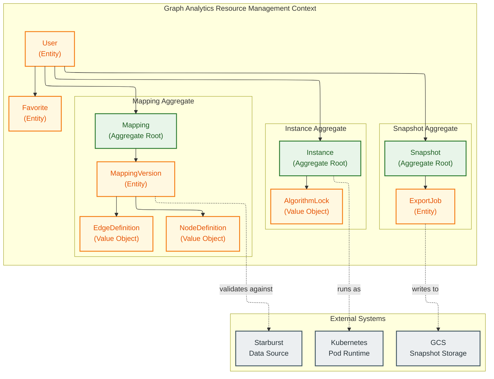

</details>

### 2.2 Core Aggregates

#### 2.2.1 Mapping Aggregate

The **Mapping** aggregate defines the graph structure and is the foundation for all downstream operations.


<details>
<summary>Mermaid Source</summary>

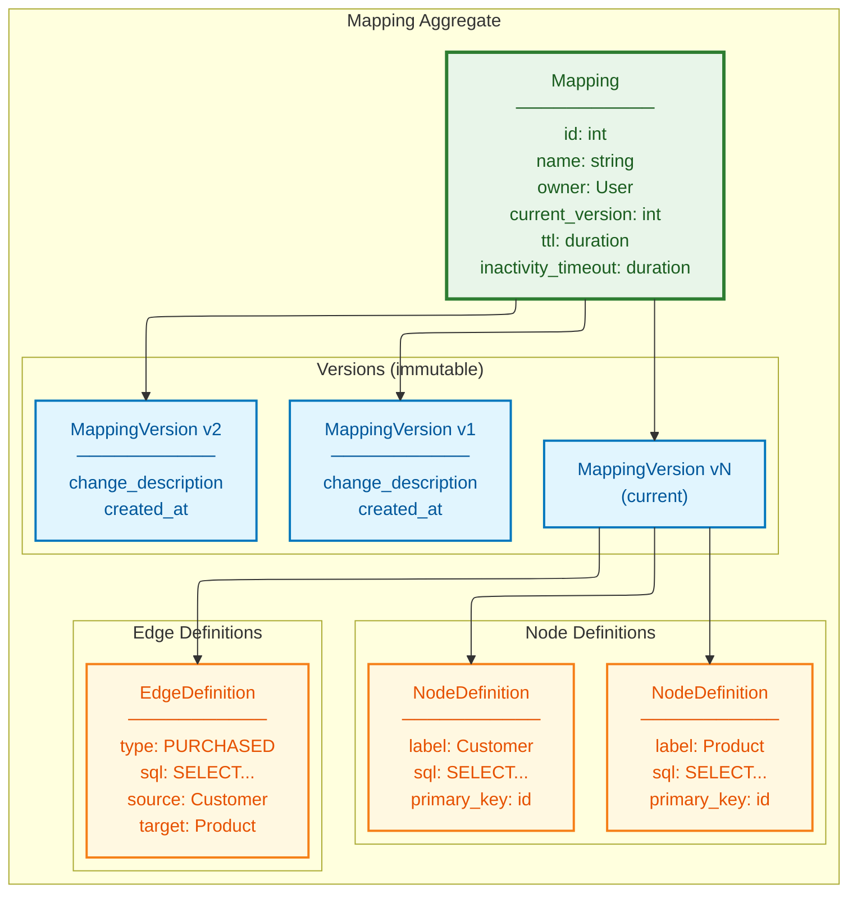

</details>

**Invariants:**
- A Mapping must have at least one version
- Versions are immutable once created
- The `current_version` always points to the latest version
- Each NodeDefinition must have a unique label within the mapping
- Each EdgeDefinition's source/target must reference existing NodeDefinitions

#### 2.2.2 Snapshot Aggregate

The **Snapshot** aggregate represents a point-in-time data export from Starburst. Snapshots are created implicitly when users create instances via `create_from_mapping()` and are not directly exposed through public APIs. Users interact with instances directly; the platform manages snapshot lifecycle automatically.


<details>
<summary>Mermaid Source</summary>

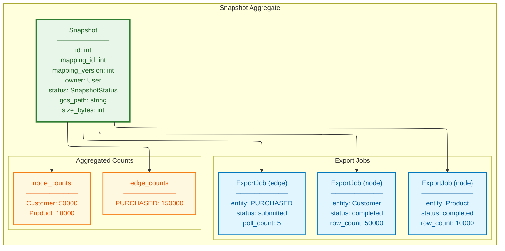

</details>

**Invariants:**
- A Snapshot is immutable once status = `ready`
- All ExportJobs must complete (success or failure) before Snapshot can transition
- GCS path follows structure: `{owner}/{mapping_id}/v{version}/{snapshot_id}/`
- If any ExportJob fails, Snapshot status = `failed`
- Snapshot status can also be `cancelled` if the export is explicitly cancelled before completion

#### 2.2.3 Instance Aggregate

The **Instance** aggregate represents a running graph database pod. Instances are created via `POST /api/instances` with a `mapping_id`; the platform creates the required snapshot implicitly and transitions the instance through `waiting_for_snapshot` -> `starting` -> `running` states.


<details>
<summary>Mermaid Source</summary>

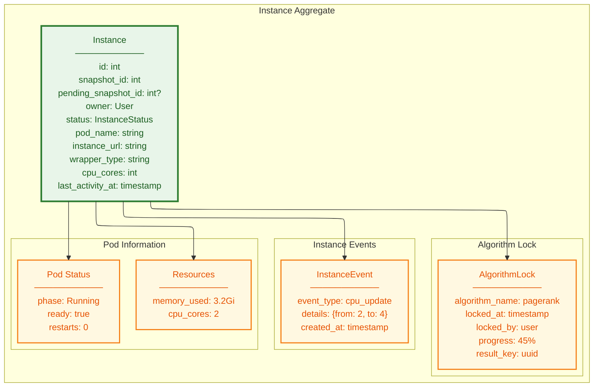

</details>

**Invariants:**
- Only one algorithm can hold the lock at a time
- Lock automatically releases after algorithm completion or timeout
- Instance URL is only valid when status = `running`
- `last_activity_at` updates on every query or algorithm execution
- `pending_snapshot_id` is set only when status = `waiting_for_snapshot`
- `cpu_cores` can only be updated when status = `running` (K8s in-place resize)
- Instance events record resource changes (CPU updates, memory upgrades, OOM recoveries)

### 2.3 State Machines

#### 2.3.1 Snapshot State Machine


<details>
<summary>Mermaid Source</summary>

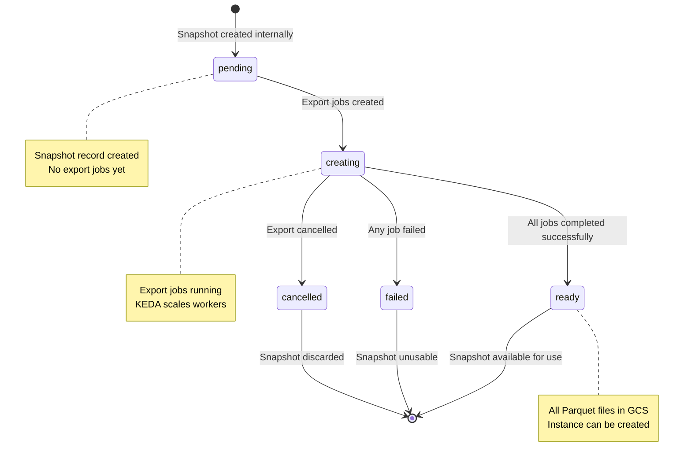

</details>

**State Transitions:**

| From | To | Trigger | Action |
|------|-----|---------|--------|
| `pending` | `creating` | Export jobs created | Workers claim jobs |
| `creating` | `ready` | All jobs completed | Calculate totals |
| `creating` | `failed` | Any job failed | Record error |
| `creating` | `cancelled` | Export cancelled | Record cancellation |

#### 2.3.2 Instance State Machine


<details>
<summary>Mermaid Source</summary>

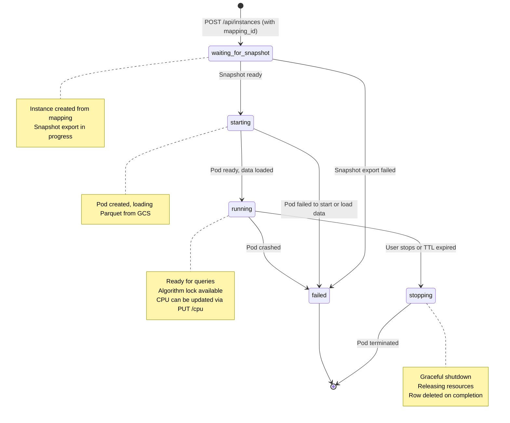

</details>

**State Transitions:**

| From | To | Trigger | Action |
|------|-----|---------|--------|
| (initial) | `waiting_for_snapshot` | POST /api/instances with mapping_id | Create snapshot, queue instance |
| `waiting_for_snapshot` | `starting` | Snapshot status = `ready` | Orchestration job creates pod |
| `waiting_for_snapshot` | `failed` | Snapshot status = `failed` | Record snapshot error |
| `starting` | `running` | Pod ready + data loaded | Update instance_url |
| `starting` | `failed` | Pod error or timeout | Record error |
| `running` | `stopping` | User request or TTL | Call /shutdown |
| `running` | `failed` | Pod crash | Reconciliation detects |
| `stopping` | (deleted) | Pod terminated | Row deleted from DB |

#### 2.3.3 Export Job State Machine


<details>
<summary>Mermaid Source</summary>

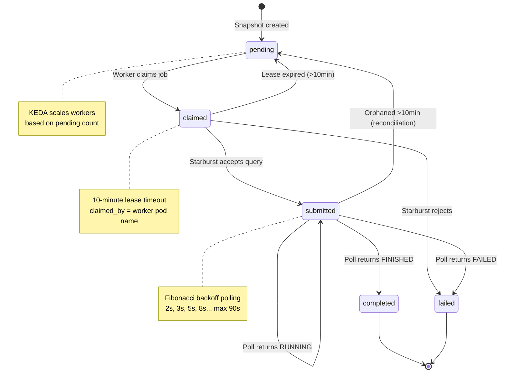

</details>

### 2.4 Invariants & Business Rules

#### Cross-Aggregate Rules

| Rule | Description | Enforcement |
|------|-------------|-------------|
| **Snapshot-Mapping Binding** | Snapshot must reference valid Mapping + Version | Database FK constraint |
| **Instance-Snapshot Binding** | Running instance requires `snapshot_id` with `ready` snapshot; `waiting_for_snapshot` uses `pending_snapshot_id` | Service layer validation |
| **Ownership Consistency** | Analyst: Snapshot/Instance owner must match Mapping owner. Admin/Ops: ownership check bypassed (role-based override) | Service layer authorization |
| **Version Immutability** | MappingVersion cannot be modified after creation | No UPDATE operations |
| **Algorithm Lock Exclusivity** | Only one algorithm per instance at a time | Optimistic locking with version |

#### Lifecycle Rules

| Rule | Description | Default |
|------|-------------|---------|
| **Snapshot TTL** | Snapshots auto-delete after TTL | 7 days |
| **Instance TTL** | Instances auto-stop after TTL | 24 hours |
| **Instance Inactivity** | Instances auto-stop after inactivity | 4 hours |
| **Export Job Timeout** | Jobs fail after max duration | 1 hour |
| **Claim Lease** | Claimed jobs reset after lease expires | 10 minutes |

#### Supporting Domain Concepts

The platform includes additional domain concepts that support the core aggregates:

| Concept | Description | Purpose |
|---------|-------------|---------|
| **Schema Metadata Cache** | In-memory cache of Starburst catalog/schema/table/column metadata | Enables fast SQL validation and autocomplete without Starburst round-trips |
| **Background Job Scheduler** | APScheduler-based periodic job execution | Runs reconciliation, lifecycle, export reconciliation, schema cache refresh, instance orchestration, and resource monitoring |
| **Instance Orchestration** | Background job transitioning `waiting_for_snapshot` instances to `starting` | Decouples instance creation from snapshot completion |
| **Resource Monitor** | Background job for dynamic memory monitoring | Enables proactive OOM prevention via memory tier upgrades |
| **Global Configuration** | Key-value store for platform-wide settings | Configurable export max duration, concurrency limits, default TTLs |

### 2.5 Authorization & Ownership

All resources (Mappings, Snapshots, Instances) carry an `owner: User` property assigned at creation time. Ownership interacts with the platform's hierarchical RBAC model:

| Role | Own Resources | Other Users' Resources | Deletion |
|------|--------------|----------------------|----------|
| **Analyst** | Full CRUD | Read only | Own only |
| **Admin** | Full CRUD | Full CRUD (ownership bypass) | Any resource + bulk delete |
| **Ops** | All Admin capabilities | All Admin capabilities | Any resource + bulk delete |

**Role Hierarchy:** `Analyst < Admin < Ops` (strict superset). See [Authorization & Access Control](authorization.md) for the complete specification.

### 2.6 Deletion Dependency Chain

Resources must be deleted in the correct order to maintain referential integrity. Analyst users may only delete resources they own; Admin and Ops users may delete any resource.


<details>
<summary>Mermaid Source</summary>

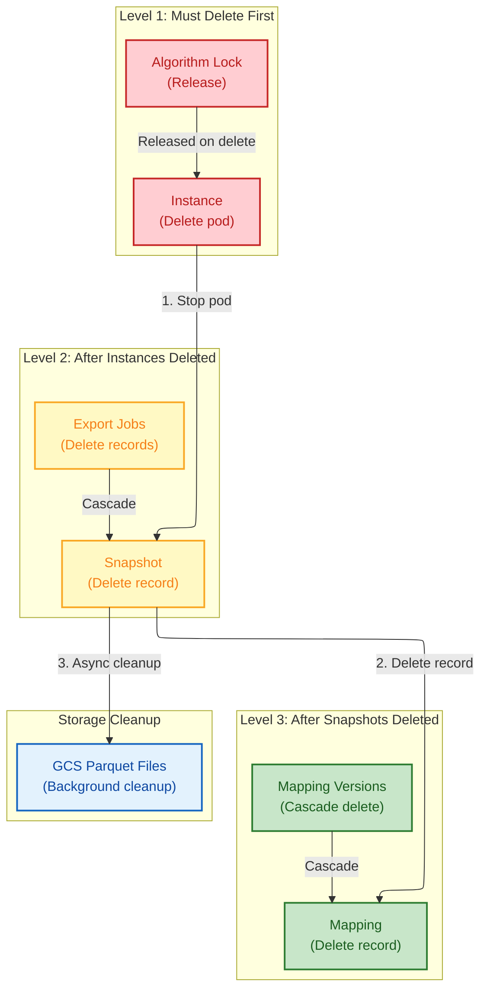

</details>

**Deletion Order:**

1. **Instances** - Stop running pods, release algorithm locks
2. **Snapshots** - Delete snapshot records, cascade to export_jobs
3. **Mappings** - Delete mapping records, cascade to versions
4. **GCS Files** - Background job cleans up orphaned Parquet files

---

## 3. Data Architecture

### 3.1 Data Flow Overview


<details>
<summary>Mermaid Source</summary>

```mermaid
---
config:
  layout: elk
---
flowchart LR
    accTitle: Data Flow Architecture
    accDescr: Shows the complete data flow from Starburst through export to graph instance

    classDef source fill:#ECEFF1,stroke:#455A64,stroke-width:2px,color:#263238
    classDef process fill:#E8F5E9,stroke:#2E7D32,stroke-width:2px,color:#1B5E20
    classDef storage fill:#FFF8E1,stroke:#F57F17,stroke-width:2px,color:#E65100
    classDef compute fill:#E1F5FE,stroke:#0277BD,stroke-width:2px,color:#01579B

    subgraph Source["Data Source"]
        Starburst["Starburst Galaxy<br/>Data Warehouse"]:::source
    end

    subgraph Export["Export Pipeline"]
        UNLOAD["UNLOAD Query<br/>───────────<br/>SQL → Parquet<br/>client_tags routing"]:::process
    end

    subgraph Storage["Object Storage"]
        GCS["GCS Bucket<br/>───────────<br/>nodes/{label}/*.parquet<br/>edges/{type}/*.parquet"]:::storage
    end

    subgraph Load["Load Pipeline"]
        COPY["COPY FROM<br/>───────────<br/>Parquet → Graph"]:::process
    end

    subgraph Instance["Graph Instance"]
        GraphDB["Graph Database<br/>───────────<br/>Node Tables<br/>Rel Tables"]:::compute
        Algorithms["Algorithm Engine<br/>───────────<br/>NetworkX / Native"]:::compute
    end

    Starburst -->|"1. Export Query"| UNLOAD
    UNLOAD -->|"2. Write Files"| GCS
    GCS -->|"3. Read Files"| COPY
    COPY -->|"4. Load Tables"| GraphDB
    GraphDB <-->|"5. In-Process"| Algorithms
```

</details>

### 3.2 Export Pipeline Sequence

Detailed temporal flow showing how data moves from user request through Starburst export to snapshot completion.


<details>
<summary>Mermaid Source</summary>

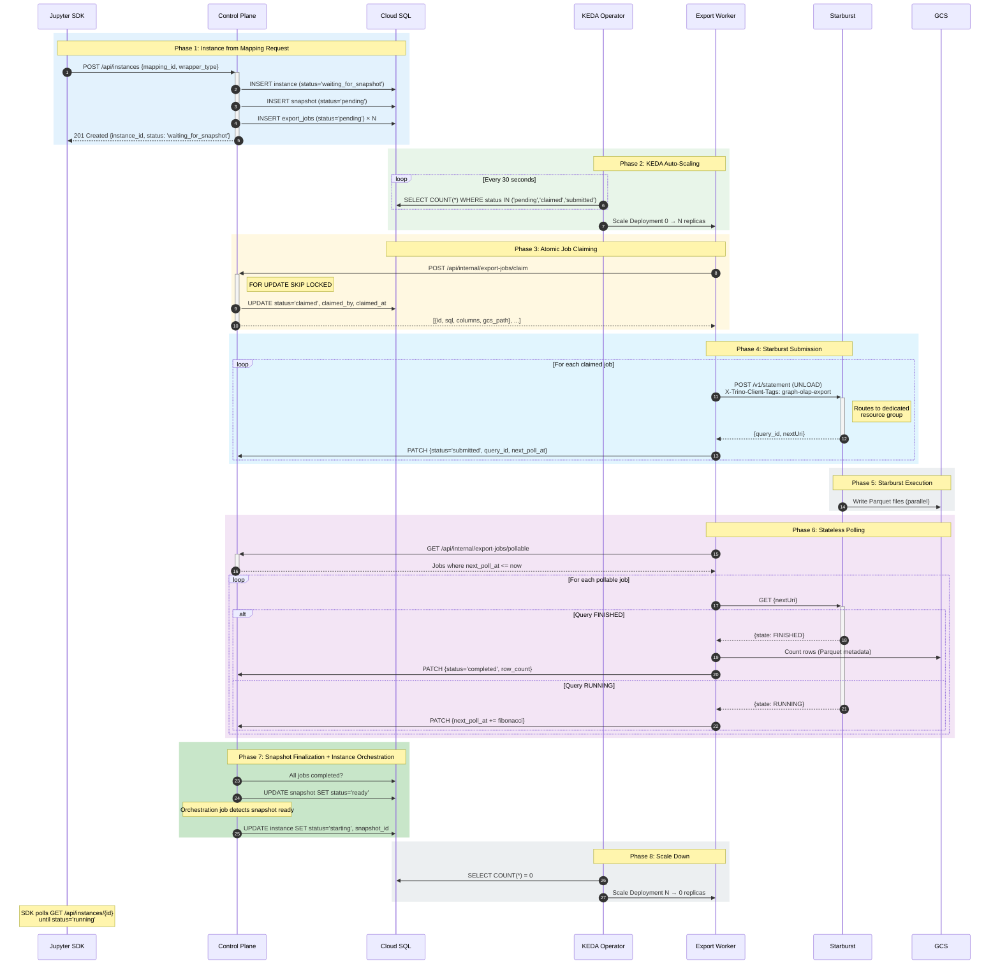

</details>

### 3.3 Instance Startup Flow


<details>
<summary>Mermaid Source</summary>

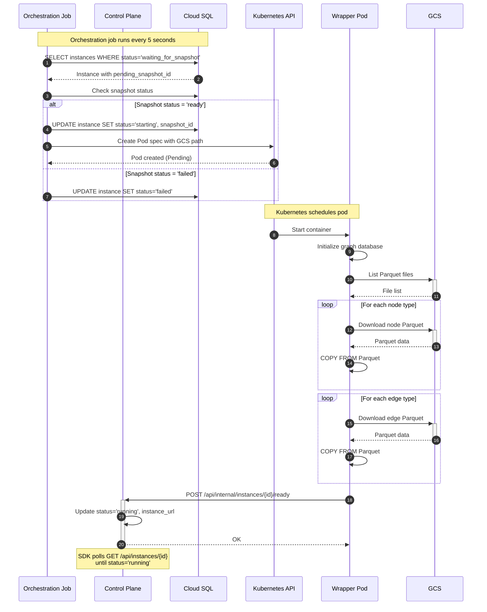

</details>

### 3.4 Algorithm Execution Flow (Implicit Locking)


<details>
<summary>Mermaid Source</summary>

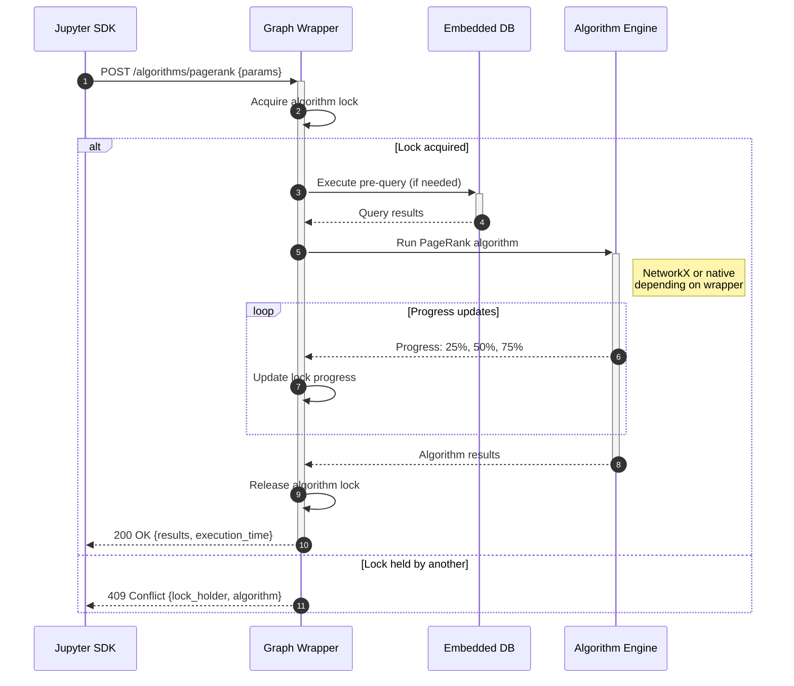

</details>

### 3.5 Entity Relationship Diagram


<details>
<summary>Mermaid Source</summary>

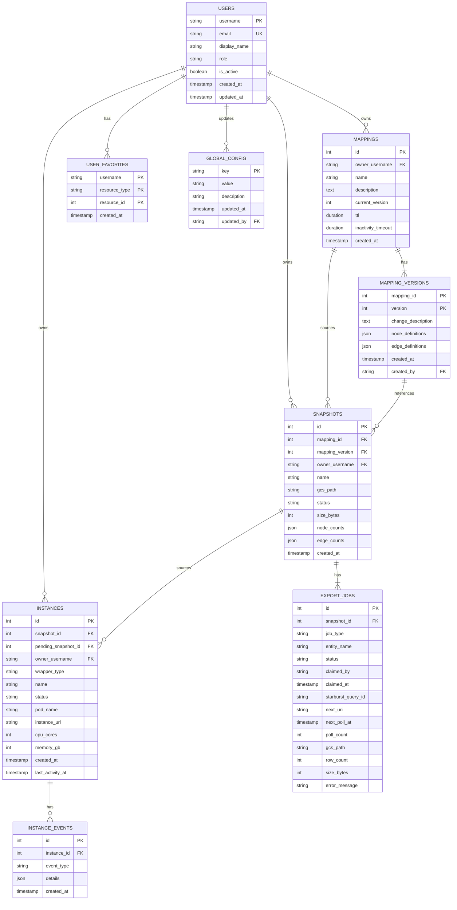

</details>

### 3.6 Data Lifecycle

| Resource | Default TTL | Inactivity Timeout | Cleanup Mechanism |
|----------|-------------|-------------------|-------------------|
| **Mapping** | None | 30 days | Background job (lifecycle cleanup) |
| **Snapshot** | 7 days | 3 days | Background job + GCS cleanup |
| **Instance** | 24 hours | 4 hours | Background job + Pod deletion |
| **Export Job** | N/A | N/A | Cascade delete with snapshot |
| **GCS Files** | N/A | N/A | Orphan cleanup job |

### 3.7 GCS Storage Structure

```
gs://{bucket}/
└── {owner_username}/
    └── {mapping_id}/
        └── v{mapping_version}/
            └── {snapshot_id}/
                ├── nodes/
                │   ├── Customer/
                │   │   └── *.parquet (multiple files from parallel UNLOAD)
                │   └── Product/
                │       └── *.parquet
                └── edges/
                    ├── PURCHASED/
                    │   └── *.parquet
                    └── KNOWS/
                        └── *.parquet
```

---

## Related Documents

- **[Detailed Architecture](detailed-architecture.md)** - Executive Summary + C4 Architecture Viewpoints + Resource Management
- **[SDK Architecture](sdk-architecture.md)** - Python SDK, Resource Managers, Authentication
- **[Platform Operations](platform-operations.md)** - Technology, Security, Integration, Operations, NFRs
- **[Authorization & Access Control](authorization.md)** - RBAC role hierarchy, permission matrix, ownership model, enforcement architecture

---

*This is part of the Graph OLAP Platform architecture documentation. See also: [Detailed Architecture](detailed-architecture.md), [SDK Architecture](sdk-architecture.md), [Platform Operations](platform-operations.md), [Authorization](authorization.md).*
