# Domain Model Overview

## Overview

This document provides a comprehensive view of the Graph OLAP Platform domain model, following Domain-Driven Design (DDD) principles. It consolidates the business domain concepts, aggregates, entity relationships, state machines, and invariants that govern the platform.

## Prerequisites

- [requirements.md](--/foundation/requirements.md) - Functional requirements and resource definitions
- [data.model.spec.md](-/data.model.spec.md) - Database schema specification
- [system.architecture.design.md](-/system.architecture.design.md) - System architecture

---

## Business Domain

The Graph OLAP Platform enables **HSBC customer service analysts** to:

1. **Define graph schemas** from Starburst SQL queries (Mappings)
2. **Export point-in-time data** to GCS as Parquet files (Snapshots)
3. **Create graph instances** for interactive analysis (Instances)
4. **Run graph algorithms** (PageRank, Louvain, centrality, etc.)
5. **Share work** across teams (all resources visible to all analysts)

**Scale Characteristics:**

| Dimension | Expected Range |
|-----------|---------------|
| Analysts | Tens |
| Concurrent Instances | Hundreds |
| Graph Size | ≤2GB per instance |
| Instance Lifespan | <24 hours typical |

---

## Bounded Context

The platform operates within a **single bounded context**: the Graph Analytics Context.

Mermaid Source

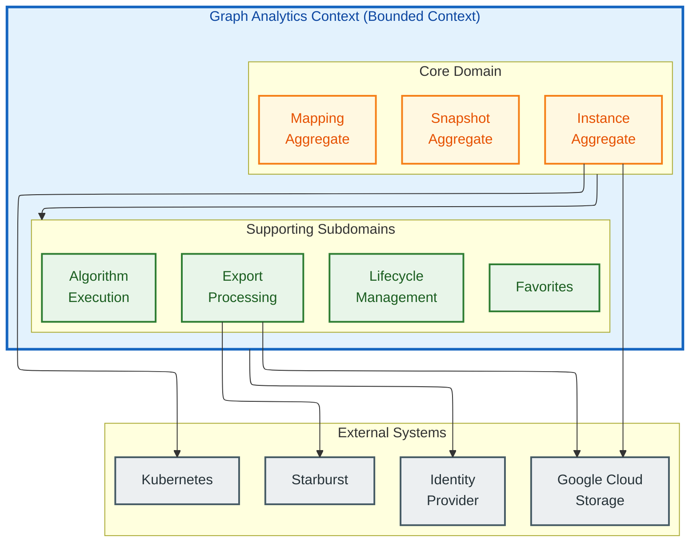

**Context Relationships:**

| External System | Relationship Type | Description |
|-----------------|------------------|-------------|
| Starburst | **Conformist** | We conform to Starburst's SQL dialect and UNLOAD semantics |
| GCS | **Published Language** | Standard Parquet format as interchange |
| Kubernetes | **Open Host Service** | We consume K8s API for pod management |
| Identity Provider | **Anti-Corruption Layer** | Auth headers translated to internal User model |

---

## Core Aggregates

The domain has three core aggregates forming a hierarchy: **Mapping → Snapshot → Instance**.

Mermaid Source

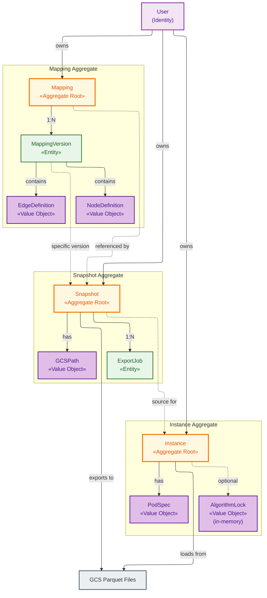

### Aggregate Boundaries

| Aggregate | Root Entity | Contained Entities | Value Objects | Invariants |
|-----------|-------------|-------------------|---------------|------------|
| **Mapping** | Mapping | MappingVersion | NodeDefinition, EdgeDefinition | Versions immutable; delete blocked if snapshots exist |
| **Snapshot** | Snapshot | ExportJob | GCSPath, Progress | Delete blocked if active instances exist |
| **Instance** | Instance | — | AlgorithmLock (in-memory), PodSpec, Progress | One algorithm at a time (exclusive lock) |

---

## Aggregate Detail: Mapping

Mermaid Source

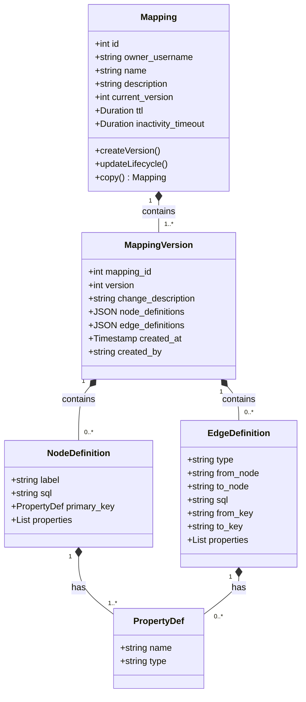

---

## Aggregate Detail: Snapshot

Mermaid Source

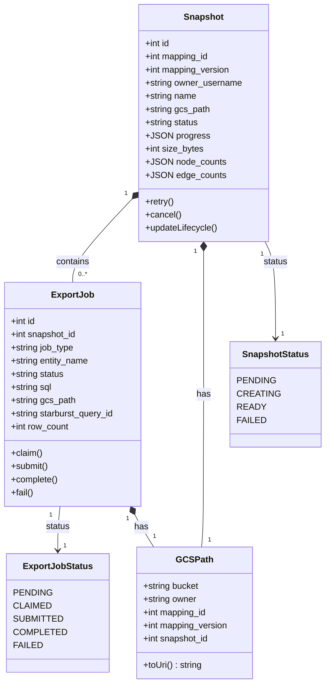

---

## Aggregate Detail: Instance

Mermaid Source

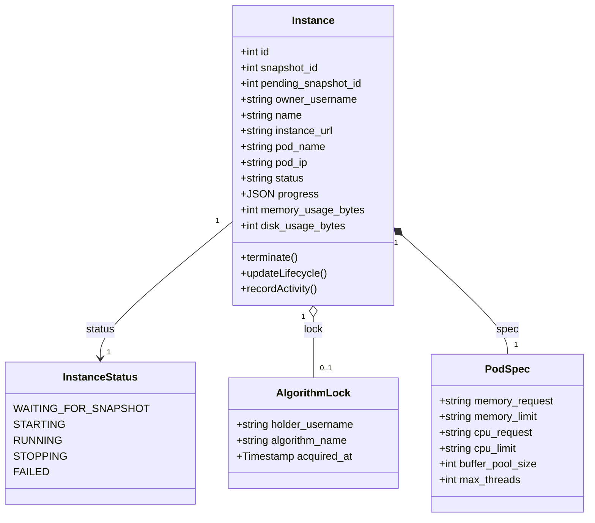

**Note:** The `AlgorithmLock` is managed in-memory by the Wrapper Pod, not persisted to the database. This ensures low-latency lock operations during algorithm execution.

---

## Entity Relationship Diagram

Complete database schema showing all entities and relationships:

Mermaid Source

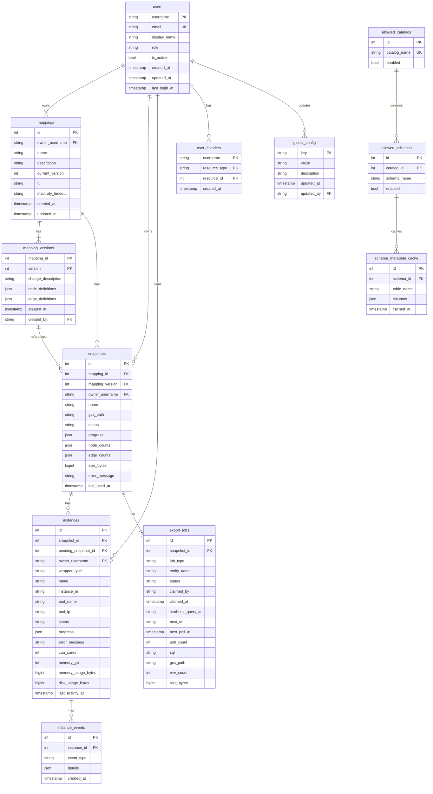

---

## State Machines

### Snapshot Lifecycle

Mermaid Source

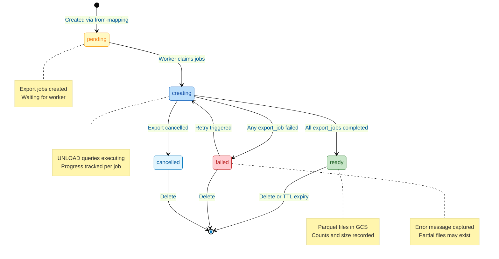

### Instance Lifecycle

Mermaid Source

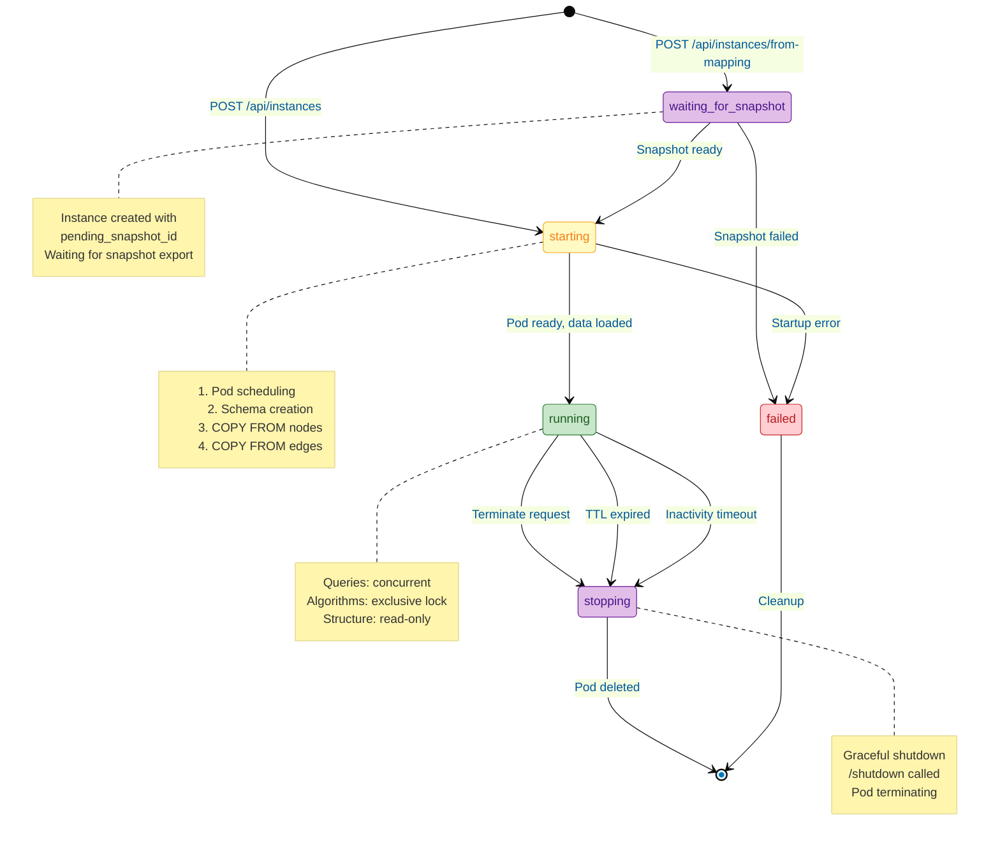

### Export Job Lifecycle

Mermaid Source

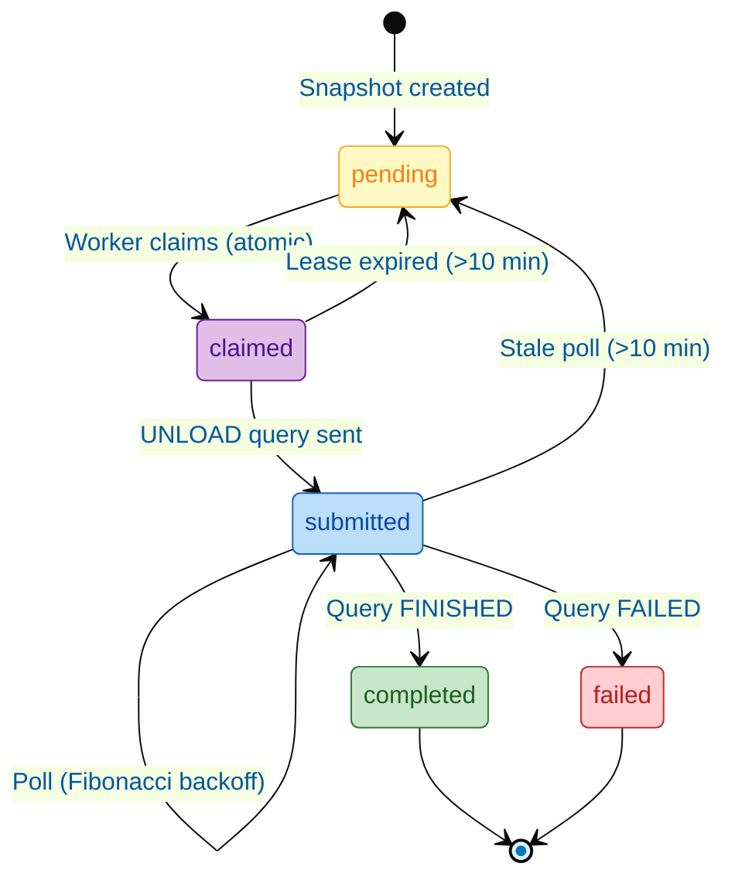

---

## Resource Lifecycle Flow

End-to-end flow from user action to graph instance:

Mermaid Source

```mermaid
---
config:
  layout: elk
---
flowchart TB
    accTitle: Resource Lifecycle Flow
    accDescr: Shows complete flow from Mapping creation through Snapshot export to Instance creation

    classDef user fill:#F3E5F5,stroke:#7B1FA2,stroke-width:2px,color:#4A148C
    classDef resource fill:#FFF8E1,stroke:#F57F17,stroke-width:2px,color:#E65100
    classDef process fill:#E1F5FE,stroke:#0277BD,stroke-width:2px,color:#01579B
    classDef storage fill:#E8F5E9,stroke:#2E7D32,stroke-width:2px,color:#1B5E20
    classDef external fill:#ECEFF1,stroke:#455A64,stroke-width:2px,color:#263238
    classDef infra fill:#E3F2FD,stroke:#1565C0,stroke-width:2px,color:#0D47A1

    USER["Analyst"]:::user

    subgraph Phase1["Phase 1: Define Schema"]
        M1["Create Mapping<br/>(SQL queries)"]:::process
        M2["Mapping<br/>v1"]:::resource
        M3["Edit Mapping<br/>(new version)"]:::process
        M4["Mapping<br/>v2, v3..."]:::resource
    end

    subgraph Phase2["Phase 2: Create Instance from Mapping"]
        S1["POST /instances/from-mapping"]:::process
        S2["Instance (waiting_for_snapshot)<br/>Snapshot (pending)"]:::resource
        S3["Export Worker<br/>claims jobs"]:::process
        S4["UNLOAD to<br/>Starburst"]:::external
        S5["Parquet files<br/>written"]:::storage
        S6["Snapshot<br/>(ready)"]:::resource
    end

    subgraph Phase3["Phase 3: Instance Startup"]
        I1["Instance transitions<br/>to starting"]:::process
        I2["Instance<br/>(starting)"]:::resource
        I3["K8s Pod<br/>scheduled"]:::infra
        I4["COPY FROM<br/>GCS Parquet"]:::process
        I5["Instance<br/>(running)"]:::resource
    end

    subgraph Phase4["Phase 4: Analyze"]
        A1["Execute Cypher<br/>queries"]:::process
        A2["Run graph<br/>algorithms"]:::process
        A3["Export results<br/>to CSV/DataFrame"]:::process
    end

    USER --> M1
    M1 --> M2
    M2 --> M3
    M3 --> M4

    M2 --> S1
    M4 --> S1
    S1 --> S2
    S2 --> S3
    S3 --> S4
    S4 --> S5
    S5 --> S6

    S6 --> I1
    I1 --> I2
    I2 --> I3
    I3 --> I4
    I4 --> I5

    I5 --> A1
    I5 --> A2
    A1 --> A3
    A2 --> A3
```

---

## Domain Rules and Invariants

### Deletion Dependencies

Resources form a strict dependency chain that must be respected during deletion:

Mermaid Source

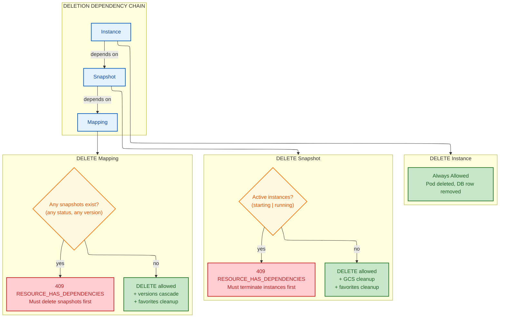

### Versioning Rules

| Rule | Description |
|------|-------------|
| **Immutability** | Mapping versions are immutable once created |
| **Change Description** | Required for versions > 1 |
| **Snapshot Binding** | Snapshot records specific `mapping_version` used |
| **Version Survival** | Deleting a mapping deletes all versions (CASCADE) |
| **No Version Deletion** | Cannot delete individual versions |

### Concurrency Rules

| Rule | Scope | Enforcement |
|------|-------|-------------|
| **Per-Analyst Instance Limit** | Configurable (default: 5) | Control Plane validates on create |
| **Cluster Instance Limit** | Configurable (default: 50) | Control Plane validates on create |
| **Concurrent Queries** | Allowed | Ryugraph supports concurrent reads |
| **Exclusive Algorithm Lock** | Per-instance | In-memory lock in Wrapper Pod |
| **No Structure Modification** | Per-instance | Cannot add/delete nodes/edges |

### Lifecycle Rules

| Resource | TTL Source | Inactivity Definition |
|----------|------------|----------------------|
| **Mapping** | Global default or override | Snapshot created from mapping |
| **Snapshot** | Inherited from mapping (max) | Instance created from snapshot |
| **Instance** | Inherited from snapshot (max) | Query executed or algorithm run |

**Inheritance Constraint:** Child resources can only have shorter timeouts than parent.

### Algorithm Locking

Mermaid Source

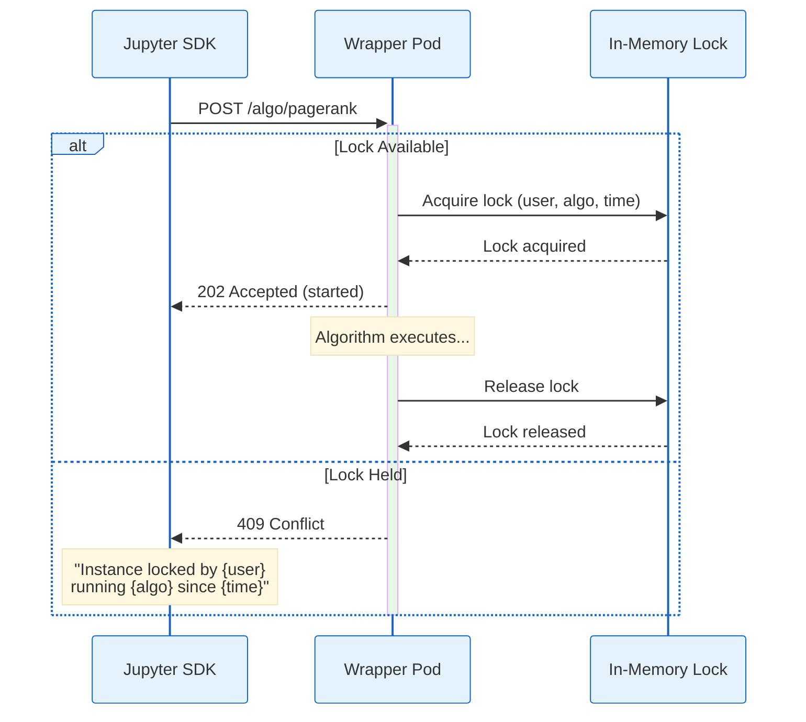

**Lock Characteristics:**

- **Implicit:** Acquired automatically on algorithm start, released on completion
- **Non-persistent:** Stored in Wrapper Pod memory, lost on pod restart
- **Non-transferable:** Only completion or pod termination releases lock
- **Timeout-free:** Hung algorithms require instance termination

---

## Domain Events

Key events that drive state transitions:

| Event | Publisher | Subscribers | Effect |
|-------|-----------|-------------|--------|
| `SnapshotCreated` | Control Plane | Export Worker (via polling) | Jobs become claimable |
| `ExportJobCompleted` | Export Worker | Control Plane | Updates snapshot progress |
| `SnapshotReady` | Control Plane | — | Snapshot can create instances |
| `InstanceStarted` | Wrapper Pod | Control Plane | Status → running, URL set |
| `InstanceFailed` | Wrapper Pod / Reconciler | Control Plane | Status → failed, cleanup |
| `AlgorithmStarted` | Wrapper Pod | — | Lock acquired |
| `AlgorithmCompleted` | Wrapper Pod | — | Lock released, activity recorded |
| `LifecycleExpired` | Background Job | Control Plane | Terminate/delete resource |

---

## Ubiquitous Language

| Term | Definition |
|------|------------|
| **Mapping** | Configuration defining graph schema from SQL queries |
| **Mapping Version** | Immutable snapshot of mapping configuration |
| **Node Definition** | SQL query + schema for a node type |
| **Edge Definition** | SQL query + schema for a relationship type |
| **Snapshot** | Point-in-time data export from a mapping version |
| **Export Job** | Single UNLOAD query within a snapshot export |
| **Instance** | Running Ryugraph database pod |
| **Algorithm Lock** | Exclusive execution rights for graph algorithms |
| **TTL** | Time-to-live duration before automatic deletion |
| **Inactivity Timeout** | Duration without use before automatic cleanup |
| **Export** | Process of running SQL → writing Parquet to GCS |
| **Load** | Process of reading Parquet from GCS → Ryugraph COPY FROM |
| **Waiting for Snapshot** | Instance state when created from mapping, pending snapshot completion |

---

## References

- [requirements.md](--/foundation/requirements.md) - Full resource definitions
- [data.model.spec.md](-/data.model.spec.md) - Database schema details
- [system.architecture.design.md](-/system.architecture.design.md) - Component architecture
- [architectural.guardrails.md](--/foundation/architectural.guardrails.md) - Design constraints
- Evans, Eric. *Domain-Driven Design: Tackling Complexity in the Heart of Software*
- [Microsoft: Using tactical DDD to design microservices](https://learn.microsoft.com/en-us/azure/architecture/microservices/model/tactical-ddd)
- [Martin Fowler: Bounded Context](https://www.martinfowler.com/bliki/BoundedContext.html)
