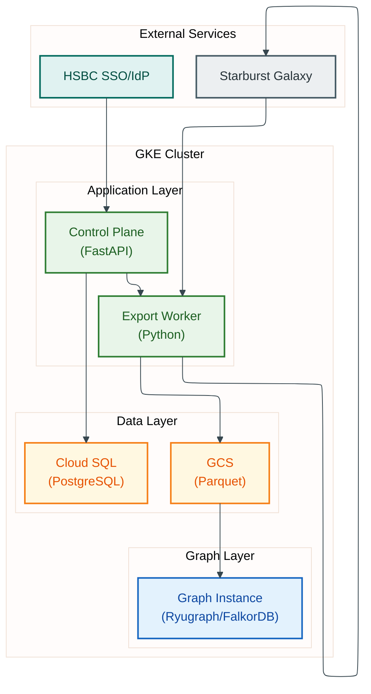

# Graph OLAP Platform - Platform Operations

**Document Type:** Platform Operations Specification
**Version:** 1.0
**Status:** Ready for Architectural Review
**Author:** Graph OLAP Platform Team
**Last Updated:** 2026-02-03

---

## Document Structure

This architecture documentation is organized into five focused documents:

| Document | Content |
|----------|---------|
| [Detailed Architecture](detailed-architecture.md) | Executive Summary + C4 Architecture Viewpoints + Resource Management |
| [SDK Architecture](sdk-architecture.md) | Python SDK, Resource Managers, Authentication |
| [Domain & Data Architecture](domain-and-data.md) | Domain Model, State Machines, Data Flows |
| **This document** | Technology, Security, Integration, Operations, NFRs |
| [Authorization & Access Control](authorization.md) | RBAC Roles, Permission Matrix, Ownership Model, Enforcement |

---

## 4. Technology Architecture

### 4.1 Technology Stack

| Layer | Technology | Version | License | Purpose |
|-------|------------|---------|---------|---------|
| **Graph Database** | Ryugraph (KuzuDB fork) | 0.3.x | MIT | Embedded columnar graph database |
| **Graph Database** | FalkorDB | 4.x | Source Available | Redis-based in-memory graph |
| **Algorithm Engine** | NetworkX | 3.x | BSD | Graph algorithms (Ryugraph only) |
| **Backend Framework** | Python FastAPI | 0.109+ | MIT | REST APIs |
| **Client SDK** | Python + httpx | N/A | MIT | Jupyter notebook integration |
| **Container Runtime** | GKE (Kubernetes) | 1.28+ | N/A | Managed Kubernetes |
| **Database** | Cloud SQL PostgreSQL | 14 | N/A | Metadata store |
| **Object Storage** | Google Cloud Storage | N/A | N/A | Parquet snapshot storage |
| **Autoscaling** | KEDA | 2.12+ | Apache 2.0 | Event-driven autoscaling |
| **Continuous Delivery** | Jenkins (HSBC) | N/A | N/A | Build, scan, deploy pipeline (`./infrastructure/cd/deploy.sh`) |
| **Infrastructure** | Terraform | 1.5+ | MPL-2.0 | Infrastructure as Code |

HSBC deploys via Jenkins + `kubectl apply` against the HSBC Artifact Registry (`gcr.io/hsbc-12636856-udlhk-dev/com/hsbc/wholesale/data/<svc>:${VERSION}` with `VERSION=1.0_N_<sha7>`).

### 4.2 Component Dependencies


<details>
<summary>Mermaid Source</summary>



</details>

### 4.3 Multi-Wrapper Architecture

The platform supports multiple graph database backends through a pluggable wrapper architecture:

| Wrapper | Database | Memory Model | Algorithm Engine | Best For |
|---------|----------|--------------|------------------|----------|
| **Ryugraph** | KuzuDB (embedded) | Buffer pool + disk | NetworkX (Python) | NetworkX integration, Python algorithms |
| **FalkorDB** | FalkorDB (embedded) | In-memory only | Native C algorithms | Larger graphs, native performance |

Both wrappers provide:
- Equivalent Cypher query support
- Same REST API interface
- GCS Parquet data loading
- Algorithm lock mechanism

**Selection Flow:**
1. User specifies `wrapper_type` when creating instance
2. Control Plane queries `WrapperFactory` for configuration
3. K8s Service creates pod with wrapper-specific image and resources
4. Wrapper loads data and reports ready state

---

## 5. Security Architecture

### 5.1 Security Controls Matrix

| # | Control Category | Control | Implementation | NIST CSF |
|---|------------------|---------|----------------|----------|
| 1 | **Authentication** | SSO Integration | HSBC IdP via auth proxy headers | PR.AC-1 |
| 2 | **Authorization** | Role-Based Access | Analyst/Admin/Ops roles with ownership model | PR.AC-4 |
| 3 | **Data Protection (Transit)** | TLS 1.2+ externally; HSBC-managed pod-to-pod encryption (if enabled on the target cluster) | Ingress TLS termination; pod-to-pod encryption posture is owned by the HSBC platform team and depends on the target cluster's network dataplane | PR.DS-2 |
| 4 | **Data Protection (Rest)** | Encryption | Google-managed AES-256 for Cloud SQL/GCS | PR.DS-1 |
| 5 | **Network Security** | Private Cluster | No public endpoints; VPC-native networking | PR.AC-5 |
| 6 | **Secret Management** | External Secrets | Google Secret Manager via ESO | PR.DS-5 |
| 7 | **Audit Logging** | Cloud Audit Logs | All API access logged; retention owned by HSBC (not asserted by this document) | DE.AE-3 |
| 8 | **Container Security** | PSA Restricted | No root, no privilege escalation | PR.IP-1 |
| 9 | **Image Security** | Jenkins pipeline-driven image scanning (HSBC enterprise scanner TBC during integration) | Critical-CVE gate enforced by the HSBC build pipeline; image provenance tracked via content-addressable `1.0_N_<sha7>` tags published to the HSBC Artifact Registry. See ADR-149 Tier-A.1 follow-up — specific scanner/SBOM tooling is owned by HSBC CI and not asserted by this document. | DE.CM-8 |
| 10 | **Network Isolation** | Network Policies | Default-deny with explicit allow (Cilium) | PR.AC-5 |

### 5.2 RBAC Hierarchy

Graph OLAP uses a hierarchical role model: `Analyst < Admin < Ops`. Each higher role is a strict superset of the one below it.

| Capability | Analyst | Admin | Ops |
|---|---|---|---|
| Read all resources | Yes | Yes | Yes |
| CRUD own resources | Yes | Yes | Yes |
| CRUD any resource | No | Yes | Yes |
| Bulk delete | No | Yes | Yes |
| Config/Cluster/Jobs | No | No | Yes |

See [Authorization & Access Control](authorization.md) for the complete specification including the full permission matrix and enforcement architecture.

### 5.3 Transport Security

#### External Traffic (Client → GKE ingress)
- **Protocol:** TLS 1.2+
- **Termination:** nginx ingress with cert-manager-issued certificates via an HSBC-provided `ClusterIssuer` (the demo cluster uses a self-signed issuer defined in `infrastructure/cd/resources/self-signed-issuer.yaml`; HSBC supplies its own internal PKI issuer in the target environment — Let's Encrypt cannot reach HSBC-internal hosts and is not used)
- **WAF / edge protection:** owned by HSBC (not asserted by this document)

#### Internal Traffic (Pod-to-Pod)
- **Network policy:** default-deny with explicit allow (Kubernetes `NetworkPolicy` resources under `infrastructure/cd/resources/network-policies.yaml`)
- **Pod-to-pod encryption:** whether the target cluster's dataplane enables transparent encryption is an HSBC platform-team decision and is not asserted by this document

#### Database Connections
- **Cloud SQL:** TLS required (`sslmode=require`)
- **GCS:** HTTPS (default)
- **Starburst:** HTTPS

### 5.4 Authentication Flow

```
User → HSBC SSO → Session Cookie → Auth Proxy → X-Username Header → Services → DB role lookup
```

- **SDK/API:** API key presented as Bearer token; auth middleware resolves username and looks up the `role` column from the DB-backed `users` table. No JWT parsing occurs in the control plane. (Updated for ADR-104)

### 5.5 Data Classification

| Data Type | Classification | Storage | Encryption | Access Control |
|-----------|----------------|---------|------------|----------------|
| Graph Mapping Definitions | Internal | Cloud SQL | AES-256 | Platform users |
| Parquet Snapshots | Business Confidential | GCS | AES-256 | IAM + Workload Identity |
| Query Results | Transient | In-memory | N/A | Session-bound |
| Algorithm Results | Ephemeral | In-memory | N/A | Instance owner |
| Audit Logs | Compliance | Cloud Logging | AES-256 | Security team |

---

## 6. Integration Architecture

### 6.1 External System Integration

| System | Integration Type | Protocol | Authentication | Purpose |
|--------|------------------|----------|----------------|---------|
| **Starburst Galaxy** | REST API | HTTPS | Service account token | Data export (UNLOAD) |
| **HSBC SSO** | SAML/OIDC | HTTPS | Session cookies | User authentication |
| **Jupyter Enterprise** | Python SDK | HTTPS | API key (Bearer) | Notebook integration |
| **Cloud SQL** | PostgreSQL Wire | TLS | IAM auth | Metadata storage |
| **GCS** | REST API | HTTPS | Workload Identity | Snapshot storage |

### 6.2 SDK Integration

The Python SDK (`graph-olap-sdk`) provides:
- Async/await pattern for long-running operations
- Automatic polling with exponential backoff
- Type-safe models via Pydantic
- Jupyter-friendly progress indicators

```python
from graph_olap import Client

client = Client(base_url="https://api.example.com", token="...")

# Create an instance directly from a mapping (recommended)
# Snapshots are created implicitly during instance creation
instance = await client.instances.create_from_mapping(
    mapping_id=123,
    wrapper_type="ryugraph",
    wait=True         # Polls until instance is running
)

# Execute algorithm on the instance
result = await instance.algorithms.pagerank(
    damping_factor=0.85,
    max_iterations=100
)

# Access the underlying snapshot if needed
snapshot = await instance.get_snapshot()
print(f"Node counts: {snapshot.node_counts}")

# For metadata-only operations (no instance creation)
info_snapshot = await client.snapshots.create(
    mapping_id=123,
    info_only=True,  # Only collects row counts, no data export
    wait=True
)
print(f"Node counts: {info_snapshot.node_counts}")
```

### 6.3 Cross-Component Data Flows

| From | To | Protocol | Trigger | Error Handling |
|------|-----|----------|---------|----------------|
| SDK | Control Plane | HTTPS REST | User action | SDK exception |
| SDK | Graph Instance | HTTPS REST | Query/algorithm | SDK exception |
| Control Plane | Cloud SQL | PostgreSQL | API requests | 503 until recovered |
| Control Plane | K8s API | HTTPS | Instance lifecycle | Mark failed |
| Export Worker | Control Plane | HTTPS REST | Job claim/status | Retry with backoff |
| Export Worker | Starburst | HTTPS REST | UNLOAD submission | Retry 3x → fail |
| Export Worker | GCS | HTTPS | Row count | Retry 3x |
| Graph Instance | GCS | HTTPS | Data load | Fail fast |

---

## 7. Operational Architecture

### 7.1 Deployment Architecture

#### GKE Node Pools

| Node Pool | Machine Type | Nodes | Purpose | Autoscaling |
|-----------|--------------|-------|---------|-------------|
| System | n1-standard-2 | 2 | Cluster infrastructure | Fixed |
| Control Plane | n1-standard-4 | 2-4 | Platform services | HPA |
| Graph Instances | n1-highmem-4 | 0-50 | User graph pods | Cluster autoscaler |

#### Deployment Strategy
- **Pipeline:** Jenkins builds images, pushes to the HSBC Artifact Registry, and invokes `./infrastructure/cd/deploy.sh` which applies Kubernetes manifests via `kubectl apply`.
- **Rolling Updates:** Zero-downtime deployments via Kubernetes Deployment rolling strategy.
- **Manual Approval:** Production pipeline stages require explicit human approval before `kubectl apply`.

### 7.2 SLOs and SLIs

| SLI | SLO Target | Measurement |
|-----|------------|-------------|
| Control Plane Availability | 99.5% monthly | Successful requests / Total requests |
| API Latency (P95) | < 2 seconds | Request duration histogram |
| Query Latency (P95) | < 10 seconds | Cypher query execution duration |
| Export Success Rate | > 95% weekly | Successful exports / Total exports |
| Instance Startup Time (P95) | < 3 minutes | Time from creation to running |

### 7.3 Observability

| Component | Tool | Purpose |
|-----------|------|---------|
| **Metrics** | Managed Prometheus | Resource and application metrics |
| **Logging** | Cloud Logging | Structured JSON logs |
| **Tracing** | Cloud Trace | Distributed request tracing |
| **Dashboards** | Grafana | Operational dashboards |
| **Alerting** | Cloud Monitoring | SLO-based alerts |

### 7.4 Disaster Recovery

| Scenario | RTO | RPO | Recovery Method |
|----------|-----|-----|-----------------|
| Instance Pod Failure | Immediate | N/A | Create new instance from snapshot |
| Control Plane Pod Failure | < 1 minute | 0 | Kubernetes restart (stateless) |
| Cloud SQL Failure | 4 hours | 5 minutes | Point-in-time recovery |
| GCS Data Loss | 8 hours | N/A | Re-export from Starburst |
| Regional Outage | 4 hours | 5 minutes | Restore to alternate region |

### 7.5 Background Jobs

| Job | Interval | Purpose |
|-----|----------|---------|
| Instance Orchestration | 5 sec | Transition `waiting_for_snapshot` instances to `starting` once snapshot is ready |
| Instance Reconciliation | 5 min | Sync pod state with database |
| Export Reconciliation | 5 sec | Reset stale claims, finalize exports (deliberate exception to ADR-040 default policy — near-real-time propagation requirement) |
| Lifecycle Cleanup | 5 min | TTL enforcement, orphan cleanup |
| Schema Cache Refresh | 24 hrs | Update Starburst schema cache |
| Resource Monitor | 60 sec | Proactive OOM prevention via memory tier upgrades |

**Manual Triggers:** Operators can manually trigger jobs via the OpsResource API:
```python
# Trigger a background job immediately
await client.ops.trigger_job("reconciliation")  # or "lifecycle", "export_reconciliation", "schema_cache"

# Check job status
status = await client.ops.get_job_status()
```

### 7.6 Operations API (OpsResource)

The SDK provides an `OpsResource` for platform operations and monitoring:

| Method | Purpose |
|--------|---------|
| `get_cluster_health()` | Component health status (control-plane, export-worker, wrappers) |
| `get_metrics()` | Prometheus metrics (instances, exports, queries) |
| `get_state()` | System state summary |
| `trigger_job(job_type)` | Manually trigger background job |
| `get_job_status()` | Background job last-run timestamps |
| `get_lifecycle_config()` | View lifecycle settings (TTL, idle timeout) |
| `update_lifecycle_config()` | Update lifecycle settings |
| `get_concurrency_config()` | View concurrency limits |
| `update_concurrency_config()` | Update concurrency limits |
| `get_export_config()` | View export job duration settings |
| `update_export_config()` | Update export job duration settings |
| `get_export_jobs()` | Export job debugging information |

### 7.7 Schema Metadata API

The platform provides a schema metadata API for discovering available tables and columns in Starburst:

| Endpoint | Purpose |
|----------|---------|
| `GET /api/schema/catalogs` | List available catalogs |
| `GET /api/schema/catalogs/{catalog}/schemas` | List schemas in catalog |
| `GET /api/schema/catalogs/{catalog}/schemas/{schema}/tables` | List tables in schema |
| `GET /api/schema/.../tables/{table}/columns` | List columns in table |
| `GET /api/schema/search/tables?q=pattern` | Search tables by pattern |
| `GET /api/schema/search/columns?q=pattern` | Search columns by pattern |
| `POST /api/schema/admin/refresh` | Trigger cache refresh (admin) |
| `GET /api/schema/stats` | Cache statistics (admin) |

---

## 8. Non-Functional Requirements

### 8.1 Performance

| Metric | Requirement | Notes |
|--------|-------------|-------|
| API Response Time (P95) | < 2 seconds | Excluding long-running operations |
| Query Response Time | < 10 seconds | For typical graph queries |
| Algorithm Execution | < 5 minutes | For graphs up to 1M edges |
| Instance Startup | < 3 minutes | Including data load |
| Export Throughput | > 100K rows/minute | Per export job |

### 8.2 Scalability

| Dimension | Target | Mechanism |
|-----------|--------|-----------|
| Concurrent Users | 50+ | HPA on control plane |
| Concurrent Instances | 100+ | Node pool autoscaling |
| Graph Size | 10M nodes, 50M edges | Memory-based sizing |
| Export Parallelism | 5 workers | KEDA scaling |

### 8.3 Availability

| Component | Target | Mechanism |
|-----------|--------|-----------|
| Control Plane | 99.5% | Multi-replica deployment |
| Cloud SQL | 99.95% | Regional HA configuration |
| GCS | 99.99% | Multi-zone redundancy |

### 8.4 Security & Compliance

| Requirement | Implementation |
|-------------|----------------|
| Encryption in Transit | TLS 1.2+ external; internal pod-to-pod encryption per HSBC cluster posture |
| Encryption at Rest | Google-managed AES-256 |
| Access Logging | Cloud Audit Logs (400-day retention) |
| Network Isolation | Private GKE cluster, VPC-native |
| Data Residency | Configurable GCP region |

---

## 9. Cost Model

### 9.1 Monthly Estimate (Production)

| Component | Monthly Cost | Notes |
|-----------|--------------|-------|
| GKE Cluster | $1,500 - $2,500 | Base cluster + node pools |
| Graph Instance Nodes | $2,000 - $8,000 | Variable; Spot VMs reduce 60-70% |
| Cloud SQL (HA) | $400 - $600 | db-custom-4-16384 |
| GCS Storage | $50 - $200 | ~100GB with lifecycle |
| Cloud NAT / Networking | $100 - $300 | Egress + NAT |
| Observability | $200 - $400 | Logging + Prometheus |
| **Total** | **$4,250 - $12,000** | Highly variable based on usage |

### 9.2 Cost Optimization

- **Spot VMs:** 60-70% cost reduction for graph instance nodes
- **KEDA Scale-to-Zero:** Export workers scale to 0 when idle
- **GCS Lifecycle:** Auto-delete old snapshots
- **Instance TTL:** Auto-stop idle instances

---

## 10. Risk Assessment

### 10.1 Top Risks with Mitigations

| # | Risk | Likelihood | Impact | Mitigation |
|---|------|------------|--------|------------|
| 1 | Starburst Unavailability | Medium | High | Retry with backoff; clear error messages |
| 2 | Graph Size Exceeds Memory | Medium | Medium | Pre-export validation; soft/hard limits |
| 3 | Unauthorized Data Access | Low | Critical | RBAC; ownership model; audit logging |
| 4 | Pod Scheduling Delays | Low | Medium | Reserved capacity; priority classes |
| 5 | Export Worker Crashes | Medium | Low | Stateless workers; reconciliation recovery |
| 6 | Data Leakage via Snapshots | Low | High | GCS IAM; no public access |
| 7 | Memory Exhaustion | Medium | Medium | Burstable QoS; timeout enforcement |
| 8 | Network Issues | Low | High | Private endpoints; health checks |
| 9 | Orphaned Resources | Medium | Low | Reconciliation job; TTL enforcement |
| 10 | Deployment Failure | Low | Medium | Jenkins pipeline; rolling updates; manual approval |

### 10.2 Vendor Lock-in Assessment

| GCP Component | Lock-in Level | Exit Strategy |
|---------------|---------------|---------------|
| GKE | Medium | Standard K8s; portable to any K8s |
| Cloud SQL | Low | PostgreSQL standard; pg_dump |
| GCS | Low | S3-compatible API; gsutil export |
| Workload Identity | Medium | Alternative: service account keys |
| Cloud Logging | Medium | OpenTelemetry export |
| Managed Prometheus | Low | Standard Prometheus; remote_write |

---

## 11. Governance

### 11.1 Change Management

| Change Type | Approval Required | Deployment Method |
|-------------|-------------------|-------------------|
| Configuration | Team lead | Jenkins pipeline (`./infrastructure/cd/deploy.sh` → `kubectl apply`) |
| Feature release | Product owner | Jenkins pipeline with manual approval stage |
| Infrastructure | Platform team | Terraform apply |
| Security patch | Security team | Expedited Jenkins pipeline |

### 11.2 Operational Runbooks

| Scenario | Runbook |
|----------|---------|
| High export queue depth | Scale KEDA min replicas |
| Instance stuck starting | Check GCS access, pod events |
| Database connection errors | Verify Cloud SQL status, connection pool |
| Algorithm timeout | Increase timeout, check graph size |

---

## Related Documents

- **[Detailed Architecture](detailed-architecture.md)** - Executive Summary + C4 Architecture Viewpoints + Resource Management
- **[SDK Architecture](sdk-architecture.md)** - Python SDK, Resource Managers, Authentication
- **[Domain & Data Architecture](domain-and-data.md)** - Domain Model, State Machines, Data Flows
- **[Authorization & Access Control](authorization.md)** - RBAC Roles, Permission Matrix, Ownership Model, Enforcement

---

*This is part of the Graph OLAP Platform architecture documentation. See also: [Detailed Architecture](detailed-architecture.md), [SDK Architecture](sdk-architecture.md), [Domain & Data Architecture](domain-and-data.md), [Authorization](authorization.md).*
