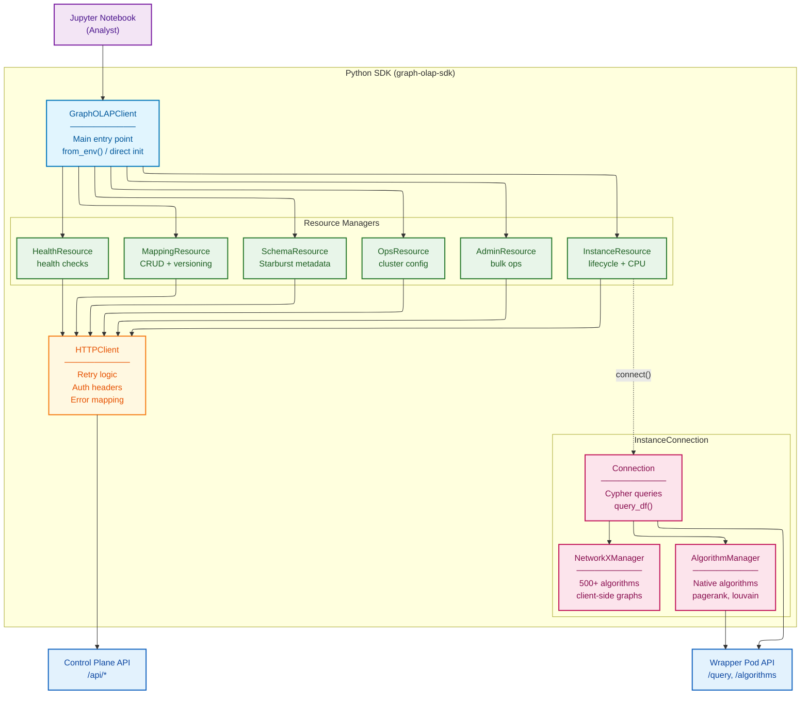
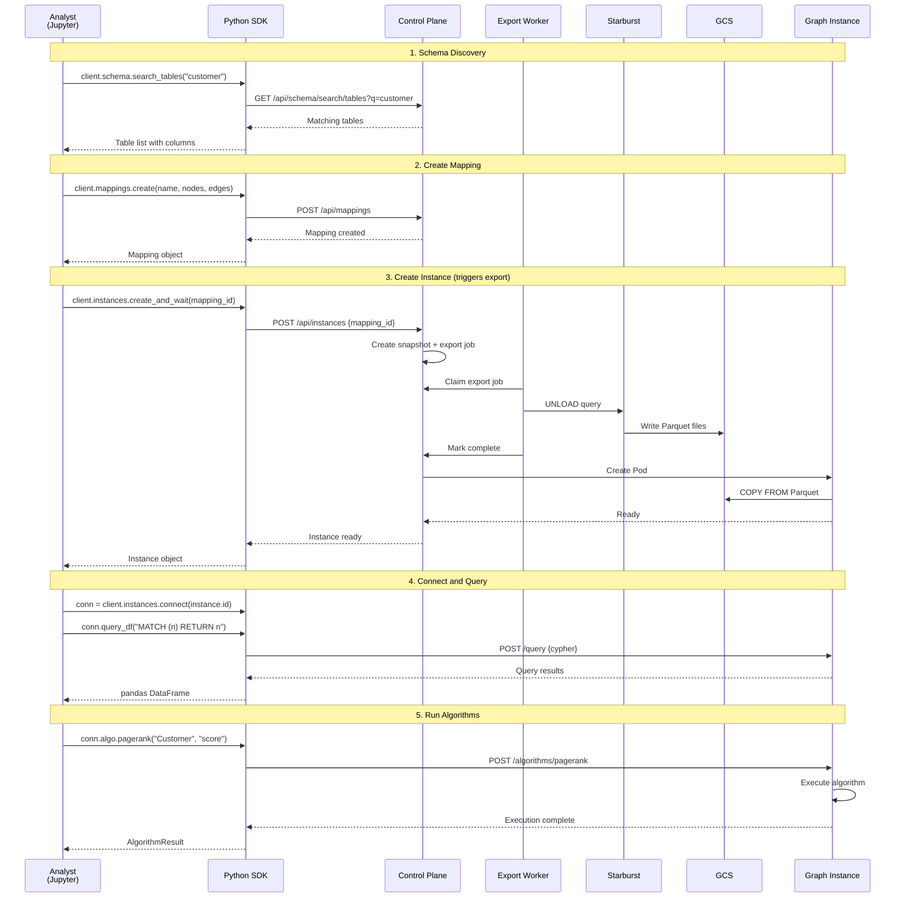

# Python SDK Architecture

**Document Type:** SDK Architecture Specification
**Version:** 1.1
**Status:** Ready for Architectural Review
**Author:** Graph OLAP Platform Team
**Last Updated:** 2026-02-04

---

## Document Structure

This architecture documentation is organized into five focused documents:

| Document | Content |
|----------|---------|
| [Detailed Architecture](detailed-architecture.md) | Executive Summary + C4 Architecture Viewpoints + Resource Management |
| **This document** | Python SDK, Resource Managers, Authentication |
| [Domain & Data Architecture](domain-and-data.md) | Domain Model, State Machines, Data Flows |
| [Platform Operations](platform-operations.md) | Technology, Security, Integration, Operations, NFRs |
| [Authorization & Access Control](authorization.md) | RBAC Roles, Permission Matrix, Ownership Model, Enforcement |

---

The Graph OLAP Platform is **notebook-first** by design. All user interactions happen through the Python SDK in Jupyter notebooks—there is no separate web console or GUI.

## 1. SDK as Sole User Interface

| Operation Category | SDK Resource | Key Methods |
|--------------------|--------------|-------------|
| **Mapping Management** | `client.mappings` | `create()`, `list()`, `get()`, `update()`, `delete()`, `copy()` |
| **Instance Lifecycle** | `client.instances` | `create_and_wait()`, `terminate()`, `update_cpu()`, `list()` |
| **Graph Queries** | `conn.query()` | `query()`, `query_df()`, `query_scalar()`, `query_one()` |
| **Graph Algorithms** | `conn.algo` / `conn.networkx` | `pagerank()`, `louvain()`, `wcc()`, 500+ NetworkX algorithms |
| **Schema Discovery** | `client.schema` | `list_catalogs()`, `list_tables()`, `search_tables()` |
| **Favorites** | `client.favorites` | `add()`, `remove()`, `list()` |
| **Operations (Ops)** | `client.ops` | `get_cluster_health()`, `get_lifecycle_config()`, `trigger_job()` |
| **Administration** | `client.admin` | `bulk_delete()` |

**Why Notebook-First?**

1. **Reproducibility**: All operations are code, making workflows reproducible and version-controllable
2. **Automation**: Scripts can automate common tasks without GUI interaction
3. **Integration**: Seamless integration with data science workflows (pandas, polars, visualization)
4. **Auditability**: Every operation is logged with the user who executed it

---

## 2. SDK Client Architecture


<details>
<summary>Mermaid Source</summary>



</details>

---

## 3. API Capabilities Overview

This section provides a **scannable reference** of SDK capabilities for architects and technical leads. For each resource, method signatures show what operations are available.

<style>
.api-table { width: 100%; border-collapse: collapse; margin: 1em 0; font-size: 0.9em; }
.api-table th, .api-table td { border: 1px solid #ddd; padding: 8px; text-align: left; vertical-align: top; }
.api-table th { background: #f6f8fa; font-weight: 600; }
.api-table code { background: #f0f0f0; padding: 1px 4px; border-radius: 3px; font-size: 0.9em; }
</style>

### 3.1 Client Initialization

```python
from graph_olap import GraphOLAPClient

# Production: reads GRAPH_OLAP_* environment variables
client = GraphOLAPClient.from_env()

# Direct configuration
client = GraphOLAPClient(
    api_url="https://graph.example.com",
    api_key="your-api-key",
    timeout=60.0,
)
```

### 3.2 Mappings — Define Your Graph

`client.mappings` — Mappings define what data to load from Starburst into a graph.

<table class="api-table">
<colgroup><col style="width:18%"><col style="width:30%"><col style="width:18%"><col style="width:34%"></colgroup>
<tr><th>Method</th><th>Parameters</th><th>Returns</th><th>Description</th></tr>
<tr><td><code>list</code></td><td><code>*, owner, search, sort_by, offset, limit</code></td><td><code>PaginatedList[Mapping]</code></td><td>List mappings with filters</td></tr>
<tr><td><code>get</code></td><td><code>mapping_id</code></td><td><code>Mapping</code></td><td>Get mapping by ID</td></tr>
<tr><td><code>create</code></td><td><code>name, description, node_definitions, edge_definitions</code></td><td><code>Mapping</code></td><td>Create new mapping</td></tr>
<tr><td><code>update</code></td><td><code>mapping_id, change_description, *, name, description, node_definitions, edge_definitions</code></td><td><code>Mapping</code></td><td>Update mapping (creates new version)</td></tr>
<tr><td><code>delete</code></td><td><code>mapping_id</code></td><td><code>None</code></td><td>Delete mapping</td></tr>
<tr><td><code>copy</code></td><td><code>mapping_id, new_name</code></td><td><code>Mapping</code></td><td>Copy mapping with new name</td></tr>
<tr><td><code>get_version</code></td><td><code>mapping_id, version</code></td><td><code>MappingVersion</code></td><td>Get specific version</td></tr>
<tr><td><code>list_versions</code></td><td><code>mapping_id</code></td><td><code>list[MappingVersion]</code></td><td>List all versions</td></tr>
<tr><td><code>diff</code></td><td><code>mapping_id, from_version, to_version</code></td><td><code>MappingDiff</code></td><td>Compare two versions</td></tr>
<tr><td><code>list_snapshots</code></td><td><code>mapping_id, *, offset, limit</code></td><td><code>PaginatedList[Snapshot]</code></td><td>List snapshots for mapping</td></tr>
<tr><td><code>list_instances</code></td><td><code>mapping_id, *, offset, limit</code></td><td><code>PaginatedList[Instance]</code></td><td>List instances using mapping</td></tr>
<tr><td><code>set_lifecycle</code></td><td><code>mapping_id, *, ttl, inactivity_timeout</code></td><td><code>Mapping</code></td><td>Set auto-cleanup policy</td></tr>
<tr><td><code>get_tree</code></td><td><code>mapping_id, *, include_instances, status</code></td><td><code>dict</code></td><td>Get hierarchy (mapping → versions → snapshots → instances)</td></tr>
</table>

### 3.3 Instances — Run Your Graph

`client.instances` — Manage running graph instances (lifecycle, scaling, connectivity).

<table class="api-table">
<colgroup><col style="width:18%"><col style="width:30%"><col style="width:18%"><col style="width:34%"></colgroup>
<tr><th>Method</th><th>Parameters</th><th>Returns</th><th>Description</th></tr>
<tr><td><code>list</code></td><td><code>*, snapshot_id, owner, status, search, sort_by, offset, limit</code></td><td><code>PaginatedList[Instance]</code></td><td>List instances with filters</td></tr>
<tr><td><code>get</code></td><td><code>instance_id</code></td><td><code>Instance</code></td><td>Get instance by ID</td></tr>
<tr><td><code>create</code></td><td><code>mapping_id, name, wrapper_type, *, mapping_version, description, ttl, inactivity_timeout, cpu_cores</code></td><td><code>Instance</code></td><td>Create instance (async)</td></tr>
<tr><td><code>create_and_wait</code></td><td><code>mapping_id, name, wrapper_type, *, timeout, poll_interval, on_progress, ...</code></td><td><code>Instance</code></td><td>Create and wait until running</td></tr>
<tr><td><code>update</code></td><td><code>instance_id, *, name, description</code></td><td><code>Instance</code></td><td>Update instance metadata</td></tr>
<tr><td><code>terminate</code></td><td><code>instance_id</code></td><td><code>None</code></td><td>Terminate and delete instance</td></tr>
<tr><td><code>update_cpu</code></td><td><code>instance_id, cpu_cores</code></td><td><code>Instance</code></td><td>Scale CPU (1-8 cores)</td></tr>
<tr><td><code>update_memory</code></td><td><code>instance_id, memory_gb</code></td><td><code>Instance</code></td><td>Upgrade memory (2-32 GB)</td></tr>
<tr><td><code>extend_ttl</code></td><td><code>instance_id, hours=24</code></td><td><code>Instance</code></td><td>Extend TTL from current expiry</td></tr>
<tr><td><code>set_lifecycle</code></td><td><code>instance_id, *, ttl, inactivity_timeout</code></td><td><code>Instance</code></td><td>Set lifecycle parameters</td></tr>
<tr><td><code>get_progress</code></td><td><code>instance_id</code></td><td><code>InstanceProgress</code></td><td>Get startup progress details</td></tr>
<tr><td><code>get_health</code></td><td><code>instance_id, *, timeout</code></td><td><code>dict</code></td><td>Get wrapper health status</td></tr>
<tr><td><code>check_health</code></td><td><code>instance_id, *, timeout</code></td><td><code>bool</code></td><td>Check if wrapper is healthy</td></tr>
<tr><td><code>wait_until_running</code></td><td><code>instance_id, *, timeout, poll_interval</code></td><td><code>Instance</code></td><td>Wait for running status</td></tr>
<tr><td><code>connect</code></td><td><code>instance_id</code></td><td><code>InstanceConnection</code></td><td>Get connection for queries</td></tr>
</table>

### 3.4 Schema Discovery

`client.schema` — Browse Starburst metadata (cached, refreshed every 24h).

<table class="api-table">
<colgroup><col style="width:18%"><col style="width:30%"><col style="width:18%"><col style="width:34%"></colgroup>
<tr><th>Method</th><th>Parameters</th><th>Returns</th><th>Description</th></tr>
<tr><td><code>list_catalogs</code></td><td>—</td><td><code>list[Catalog]</code></td><td>List all Starburst catalogs</td></tr>
<tr><td><code>list_schemas</code></td><td><code>catalog</code></td><td><code>list[Schema]</code></td><td>List schemas in a catalog</td></tr>
<tr><td><code>list_tables</code></td><td><code>catalog, schema</code></td><td><code>list[Table]</code></td><td>List tables in a schema</td></tr>
<tr><td><code>list_columns</code></td><td><code>catalog, schema, table</code></td><td><code>list[Column]</code></td><td>Get columns for a table</td></tr>
<tr><td><code>search_tables</code></td><td><code>pattern, limit=100</code></td><td><code>list[Table]</code></td><td>Search tables by name pattern</td></tr>
<tr><td><code>search_columns</code></td><td><code>pattern, limit=100</code></td><td><code>list[Column]</code></td><td>Search columns by name pattern</td></tr>
<tr><td><code>admin_refresh</code></td><td>—</td><td><code>dict</code></td><td>Trigger cache refresh (admin)</td></tr>
<tr><td><code>get_stats</code></td><td>—</td><td><code>CacheStats</code></td><td>Get cache statistics (admin)</td></tr>
</table>

### 3.5 Operations & Configuration

`client.ops` — Cluster configuration, jobs, and metrics. Requires Ops role.

<table class="api-table">
<colgroup><col style="width:18%"><col style="width:30%"><col style="width:18%"><col style="width:34%"></colgroup>
<tr><th>Method</th><th>Parameters</th><th>Returns</th><th>Description</th></tr>
<tr><td><code>get_lifecycle_config</code></td><td>—</td><td><code>LifecycleConfig</code></td><td>Get TTL defaults for all resource types</td></tr>
<tr><td><code>update_lifecycle_config</code></td><td><code>*, mapping, snapshot, instance</code></td><td><code>bool</code></td><td>Update lifecycle defaults</td></tr>
<tr><td><code>get_concurrency_config</code></td><td>—</td><td><code>ConcurrencyConfig</code></td><td>Get instance limits</td></tr>
<tr><td><code>update_concurrency_config</code></td><td><code>*, per_analyst, cluster_total</code></td><td><code>ConcurrencyConfig</code></td><td>Update instance limits</td></tr>
<tr><td><code>get_maintenance_mode</code></td><td>—</td><td><code>MaintenanceMode</code></td><td>Get maintenance status</td></tr>
<tr><td><code>set_maintenance_mode</code></td><td><code>enabled, message=""</code></td><td><code>MaintenanceMode</code></td><td>Enable/disable maintenance</td></tr>
<tr><td><code>get_export_config</code></td><td>—</td><td><code>ExportConfig</code></td><td>Get export settings</td></tr>
<tr><td><code>update_export_config</code></td><td><code>*, max_duration_seconds</code></td><td><code>ExportConfig</code></td><td>Update export timeout</td></tr>
<tr><td><code>get_cluster_health</code></td><td>—</td><td><code>ClusterHealth</code></td><td>Check cluster health</td></tr>
<tr><td><code>get_cluster_instances</code></td><td>—</td><td><code>ClusterInstances</code></td><td>Get cluster-wide instance summary</td></tr>
<tr><td><code>get_metrics</code></td><td>—</td><td><code>str</code></td><td>Get Prometheus metrics</td></tr>
<tr><td><code>trigger_job</code></td><td><code>job_name, reason="manual-trigger"</code></td><td><code>dict</code></td><td>Trigger background job</td></tr>
<tr><td><code>get_job_status</code></td><td>—</td><td><code>dict</code></td><td>Get all job statuses</td></tr>
<tr><td><code>get_state</code></td><td>—</td><td><code>dict</code></td><td>Get system state summary</td></tr>
<tr><td><code>get_export_jobs</code></td><td><code>status=None, limit=100</code></td><td><code>list[dict]</code></td><td>Get export jobs for debugging</td></tr>
</table>

### 3.6 Utilities (Favorites, Admin, Health)

`client.favorites` — User bookmarks for quick access.

<table class="api-table">
<colgroup><col style="width:18%"><col style="width:30%"><col style="width:18%"><col style="width:34%"></colgroup>
<tr><th>Method</th><th>Parameters</th><th>Returns</th><th>Description</th></tr>
<tr><td><code>list</code></td><td><code>resource_type=None</code></td><td><code>list[Favorite]</code></td><td>List favorites</td></tr>
<tr><td><code>add</code></td><td><code>resource_type, resource_id</code></td><td><code>Favorite</code></td><td>Add to favorites</td></tr>
<tr><td><code>remove</code></td><td><code>resource_type, resource_id</code></td><td><code>None</code></td><td>Remove from favorites</td></tr>
</table>

`client.admin` — Privileged operations. Requires Admin role.

<table class="api-table">
<colgroup><col style="width:18%"><col style="width:30%"><col style="width:18%"><col style="width:34%"></colgroup>
<tr><th>Method</th><th>Parameters</th><th>Returns</th><th>Description</th></tr>
<tr><td><code>bulk_delete</code></td><td><code>resource_type, filters, reason, expected_count=None, dry_run=False</code></td><td><code>dict</code></td><td>Bulk delete with safety checks</td></tr>
</table>

`client.health` — Health checks (no authentication required).

<table class="api-table">
<colgroup><col style="width:18%"><col style="width:30%"><col style="width:18%"><col style="width:34%"></colgroup>
<tr><th>Method</th><th>Parameters</th><th>Returns</th><th>Description</th></tr>
<tr><td><code>check</code></td><td>—</td><td><code>HealthStatus</code></td><td>Basic health check</td></tr>
<tr><td><code>ready</code></td><td>—</td><td><code>HealthStatus</code></td><td>Readiness check with DB connectivity</td></tr>
</table>

### 3.7 Querying & Algorithms

`conn = client.instances.connect(instance_id)` — Query interface to a running instance.

**Cypher Queries**

<table class="api-table">
<colgroup><col style="width:18%"><col style="width:30%"><col style="width:18%"><col style="width:34%"></colgroup>
<tr><th>Method</th><th>Parameters</th><th>Returns</th><th>Description</th></tr>
<tr><td><code>query</code></td><td><code>cypher, parameters=None, *, timeout, coerce_types</code></td><td><code>QueryResult</code></td><td>Execute Cypher query</td></tr>
<tr><td><code>query_df</code></td><td><code>cypher, parameters=None, *, backend="polars"</code></td><td><code>DataFrame</code></td><td>Query returning DataFrame</td></tr>
<tr><td><code>query_scalar</code></td><td><code>cypher, parameters=None</code></td><td><code>Any</code></td><td>Query returning single value</td></tr>
<tr><td><code>query_one</code></td><td><code>cypher, parameters=None</code></td><td><code>dict | None</code></td><td>Query returning single row</td></tr>
<tr><td><code>get_schema</code></td><td>—</td><td><code>Schema</code></td><td>Get graph schema (labels, types, properties)</td></tr>
<tr><td><code>get_lock</code></td><td>—</td><td><code>LockStatus</code></td><td>Get current lock status</td></tr>
<tr><td><code>status</code></td><td>—</td><td><code>dict</code></td><td>Get instance status and resource usage</td></tr>
</table>

**Native Algorithms** — `conn.algo`

<table class="api-table">
<colgroup><col style="width:18%"><col style="width:30%"><col style="width:18%"><col style="width:34%"></colgroup>
<tr><th>Method</th><th>Parameters</th><th>Returns</th><th>Description</th></tr>
<tr><td><code>algorithms</code></td><td><code>category=None</code></td><td><code>list[dict]</code></td><td>List available algorithms</td></tr>
<tr><td><code>algorithm_info</code></td><td><code>algorithm</code></td><td><code>dict</code></td><td>Get algorithm parameters</td></tr>
<tr><td><code>run</code></td><td><code>algorithm, node_label, property_name, edge_type, *, params, timeout, wait</code></td><td><code>AlgorithmExecution</code></td><td>Run any native algorithm</td></tr>
<tr><td><code>pagerank</code></td><td><code>node_label, property_name, edge_type, *, damping, max_iterations, tolerance</code></td><td><code>AlgorithmExecution</code></td><td>PageRank centrality</td></tr>
<tr><td><code>louvain</code></td><td><code>node_label, property_name, *, edge_type, resolution</code></td><td><code>AlgorithmExecution</code></td><td>Louvain community detection</td></tr>
<tr><td><code>connected_components</code></td><td><code>node_label, property_name, edge_type</code></td><td><code>AlgorithmExecution</code></td><td>Weakly connected components</td></tr>
<tr><td><code>scc</code></td><td><code>node_label, property_name, *, edge_type</code></td><td><code>AlgorithmExecution</code></td><td>Strongly connected components</td></tr>
<tr><td><code>kcore</code></td><td><code>node_label, property_name, *, edge_type</code></td><td><code>AlgorithmExecution</code></td><td>K-Core decomposition</td></tr>
<tr><td><code>label_propagation</code></td><td><code>node_label, property_name, edge_type, *, max_iterations</code></td><td><code>AlgorithmExecution</code></td><td>Label propagation</td></tr>
<tr><td><code>triangle_count</code></td><td><code>node_label, property_name, edge_type</code></td><td><code>AlgorithmExecution</code></td><td>Triangle count per node</td></tr>
<tr><td><code>shortest_path</code></td><td><code>source_id, target_id, *, relationship_types, max_depth</code></td><td><code>AlgorithmExecution</code></td><td>Find shortest path</td></tr>
</table>

**NetworkX Algorithms** — `conn.networkx` (500+ algorithms)

<table class="api-table">
<colgroup><col style="width:18%"><col style="width:30%"><col style="width:18%"><col style="width:34%"></colgroup>
<tr><th>Method</th><th>Parameters</th><th>Returns</th><th>Description</th></tr>
<tr><td><code>algorithms</code></td><td><code>category=None</code></td><td><code>list[dict]</code></td><td>List available algorithms</td></tr>
<tr><td><code>algorithm_info</code></td><td><code>algorithm</code></td><td><code>dict</code></td><td>Get algorithm parameters</td></tr>
<tr><td><code>run</code></td><td><code>algorithm, node_label, property_name, *, params, timeout, wait</code></td><td><code>AlgorithmExecution</code></td><td>Run any NetworkX algorithm</td></tr>
<tr><td><code>degree_centrality</code></td><td><code>node_label, property_name</code></td><td><code>AlgorithmExecution</code></td><td>Degree centrality</td></tr>
<tr><td><code>betweenness_centrality</code></td><td><code>node_label, property_name, *, k</code></td><td><code>AlgorithmExecution</code></td><td>Betweenness centrality</td></tr>
<tr><td><code>closeness_centrality</code></td><td><code>node_label, property_name</code></td><td><code>AlgorithmExecution</code></td><td>Closeness centrality</td></tr>
<tr><td><code>eigenvector_centrality</code></td><td><code>node_label, property_name, *, max_iter</code></td><td><code>AlgorithmExecution</code></td><td>Eigenvector centrality</td></tr>
<tr><td><code>clustering_coefficient</code></td><td><code>node_label, property_name</code></td><td><code>AlgorithmExecution</code></td><td>Clustering coefficient</td></tr>
</table>

### 3.8 Query Results

`QueryResult` — Flexible output from Cypher queries.

<table class="api-table">
<colgroup><col style="width:18%"><col style="width:30%"><col style="width:18%"><col style="width:34%"></colgroup>
<tr><th>Method</th><th>Parameters</th><th>Returns</th><th>Description</th></tr>
<tr><td><code>to_polars</code></td><td>—</td><td><code>polars.DataFrame</code></td><td>Convert to Polars DataFrame</td></tr>
<tr><td><code>to_pandas</code></td><td>—</td><td><code>pandas.DataFrame</code></td><td>Convert to Pandas DataFrame</td></tr>
<tr><td><code>to_networkx</code></td><td>—</td><td><code>networkx.DiGraph</code></td><td>Convert to NetworkX graph</td></tr>
<tr><td><code>to_dicts</code></td><td>—</td><td><code>list[dict]</code></td><td>Convert to list of dicts</td></tr>
<tr><td><code>scalar</code></td><td>—</td><td><code>Any</code></td><td>Get single scalar value</td></tr>
<tr><td><code>to_csv</code></td><td><code>path</code></td><td><code>None</code></td><td>Export to CSV file</td></tr>
<tr><td><code>to_parquet</code></td><td><code>path</code></td><td><code>None</code></td><td>Export to Parquet file</td></tr>
<tr><td><code>show</code></td><td><code>max_rows=20</code></td><td>—</td><td>Display in Jupyter (auto-visualization)</td></tr>
</table>

**Iteration**: `for row in result:` yields `dict[str, Any]` for each row.

---

## 4. Typical User Workflow

The SDK enables a complete analytical workflow from data discovery to graph analysis:


<details>
<summary>Mermaid Source</summary>



</details>

---

## 5. Package Structure

```
graph-olap-sdk/
├── src/graph_olap/
│   ├── client.py            # GraphOLAPClient main entry point
│   ├── config.py            # Configuration and authentication
│   ├── notebook.py          # Jupyter integration (connect(), init())
│   ├── resources/
│   │   ├── mappings.py      # MappingResource
│   │   ├── instances.py     # InstanceResource
│   │   ├── schema.py        # SchemaResource (Starburst metadata)
│   │   ├── ops.py           # OpsResource (config, cluster, jobs)
│   │   ├── favorites.py     # FavoriteResource
│   │   ├── admin.py         # AdminResource (bulk delete)
│   │   └── health.py        # HealthResource
│   ├── instance/
│   │   ├── connection.py    # InstanceConnection class
│   │   └── algorithms.py    # Algorithm execution
│   ├── models/              # Pydantic models
│   ├── exceptions.py        # Exception hierarchy
│   └── http.py              # HTTP client wrapper
└── examples/
    ├── basic_workflow.ipynb
    ├── algorithms.ipynb
    └── visualization.ipynb
```

---

## 6. Key Design Decisions

| Decision | Choice | Rationale |
|----------|--------|-----------|
| HTTP Client | httpx | Modern async support, connection pooling, HTTP/2 |
| Models | Pydantic | Type safety, validation, JSON serialization |
| DataFrame Support | pandas + polars | Industry standard, analyst familiarity |
| API Style | Synchronous default | Notebook-friendly, with async support available |
| Error Handling | Typed exceptions | Clear, actionable error messages |

---

## 7. Authentication Flow

Per ADR-104 and ADR-105, identity is carried end-to-end by a single canonical header, `X-Username`. Bearer tokens and internal API keys have been removed from the SDK and from the control-plane auth middleware.

### Canonical identity header

| Header | Status | Read by |
|--------|--------|---------|
| `X-Username` | **Canonical** (ADR-105) | Control-plane middleware (`packages/control-plane/src/control_plane/middleware/identity.py`); wrapper dependencies (`packages/{ryugraph,falkordb}-wrapper/src/wrapper/dependencies.py`). |
| `X-User-ID` | Deprecated alias | Accepted only by the wrapper `get_user_id` dependency as a fallback when `X-Username` is absent, for backward compatibility with legacy callers. The control-plane does NOT accept this alias. |
| `X-User-Name` | Deprecated alias | Accepted only by the wrapper `get_user_name` dependency as a fallback when `X-Username` is absent, for backward compatibility with legacy callers. The control-plane does NOT accept this alias. |

The SDK always sends `X-Username` (see `packages/graph-olap-sdk/src/graph_olap/http.py:78` and `instance/connection.py:82`). New callers MUST send `X-Username`; the aliases above exist solely so that wrappers do not break during rolling upgrades from older SDK/tool versions.

### Additional headers

| Header | Purpose |
|--------|---------|
| `X-Use-Case-Id` | Starburst use-case identifier passed through the middleware (ADR-102) |
| `X-User-Role` | NOT sent by the SDK. Wrappers optionally read it if injected by an upstream component; absent → treated as `analyst` (see ADR-105 §F8). |

### Role resolution

Role is **not** carried in a header. The control plane resolves the authenticated user's role from the `users.role` column after matching `X-Username`. Role hierarchy: `Analyst < Admin < Ops`. Each higher role inherits the permissions of the lower roles; `Ops` has exclusive access to config, cluster, and jobs endpoints.

See [Authorization & Access Control](authorization.md) for the complete permission matrix.

```python
# Environment-based configuration (reads GRAPH_OLAP_API_URL, GRAPH_OLAP_USERNAME)
client = GraphOLAPClient.from_env()

# Explicit username (overrides GRAPH_OLAP_USERNAME and identity.DEFAULT_USERNAME)
client = GraphOLAPClient(
    api_url="https://graph.example.com",
    username="alice@hsbc.com",
    timeout=60.0,
)

# Notebook persona switching (see ADR-105 §F3)
import graph_olap.identity
graph_olap.identity.DEFAULT_USERNAME = "bob@hsbc.com"
bob_client = GraphOLAPClient(api_url="https://graph.example.com")
```

---

## Related Documents

- **[Detailed Architecture](detailed-architecture.md)** - Executive Summary + C4 Architecture Viewpoints + Resource Management
- **[Domain & Data Architecture](domain-and-data.md)** - Domain Model, State Machines, Data Flows
- **[Platform Operations](platform-operations.md)** - Technology, Security, Integration, Operations, NFRs
- **[Authorization & Access Control](authorization.md)** - RBAC Roles, Permission Matrix, Ownership Model, Enforcement

---

*This is part of the Graph OLAP Platform architecture documentation. See also: [Detailed Architecture](detailed-architecture.md), [Domain & Data Architecture](domain-and-data.md), [Platform Operations](platform-operations.md), [Authorization](authorization.md).*
