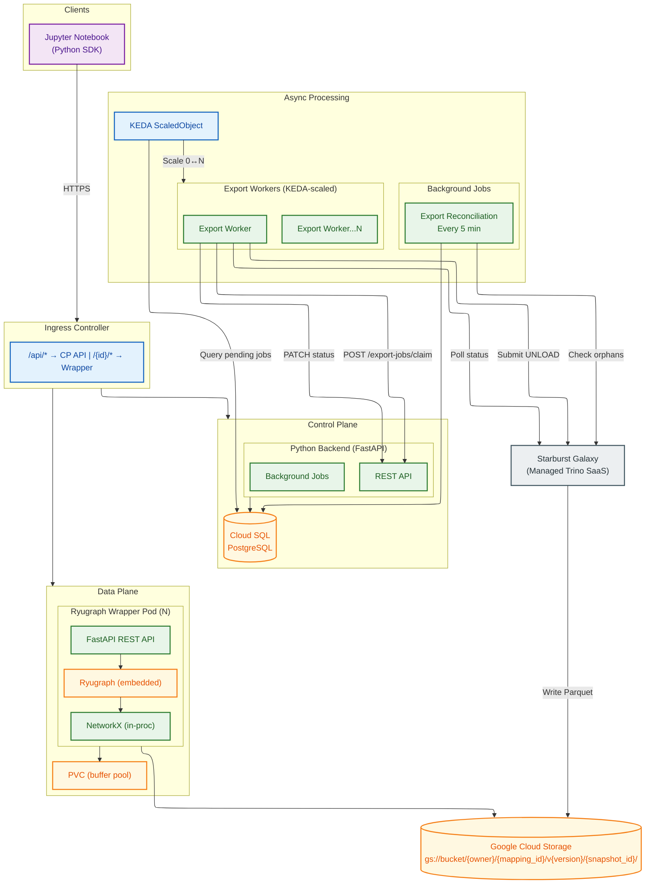
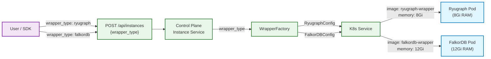
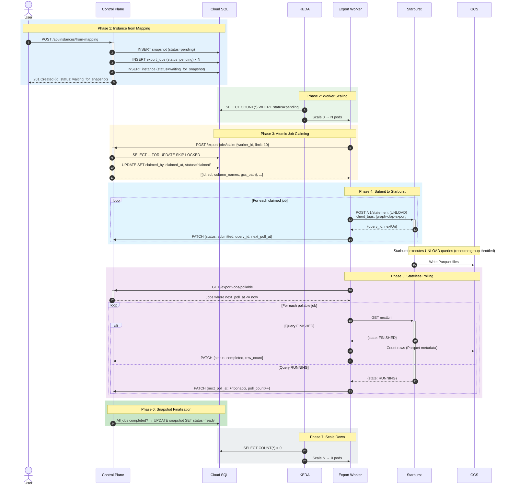
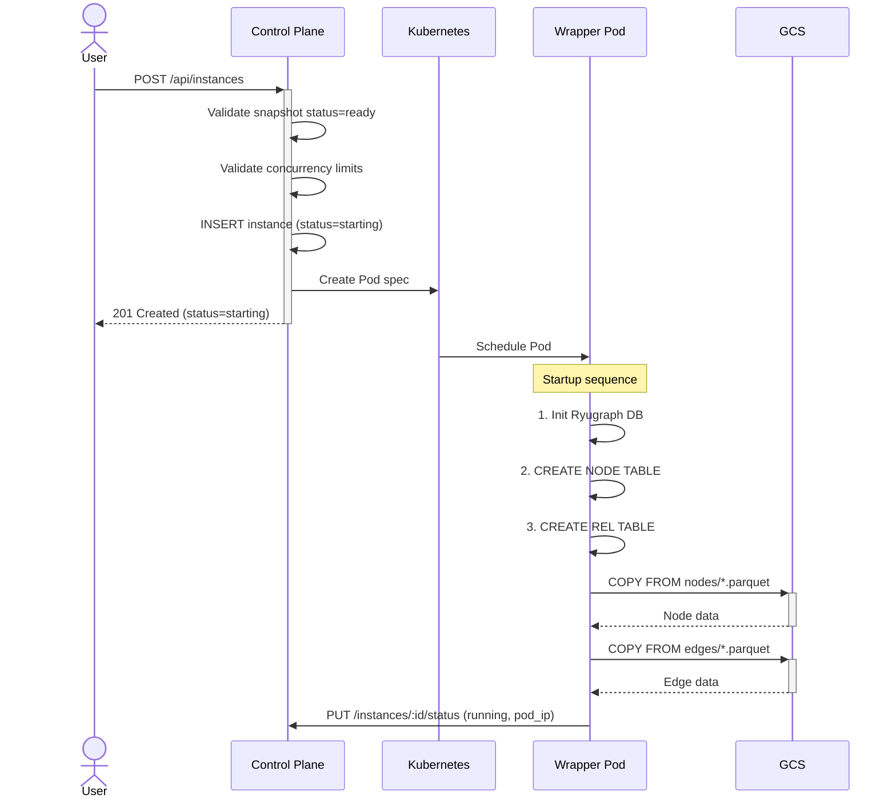
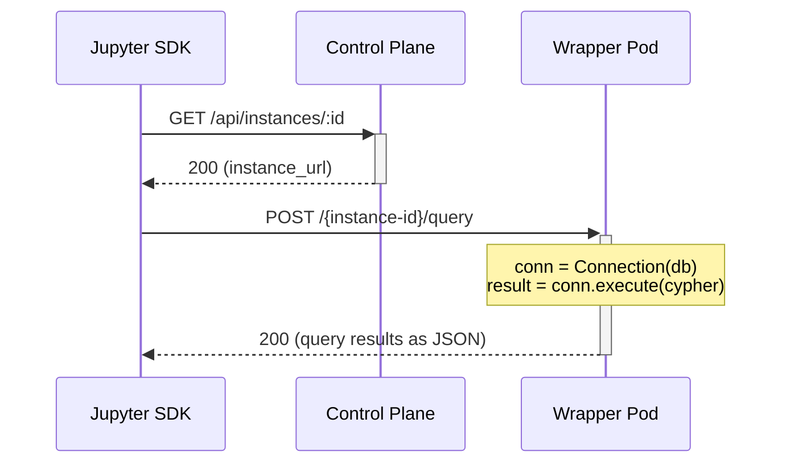
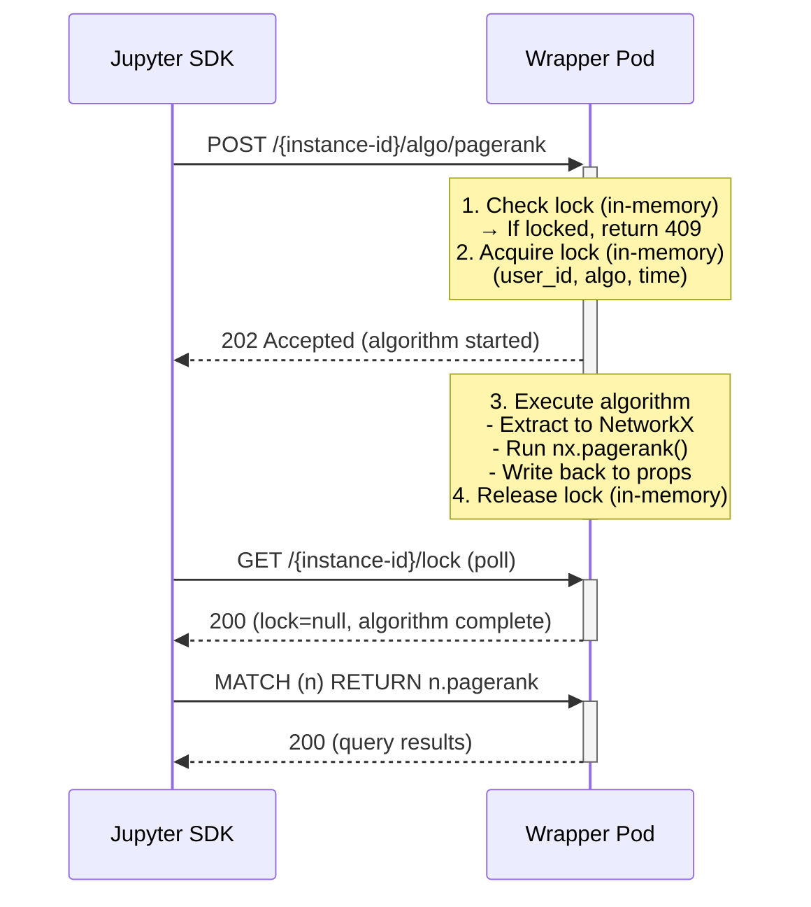
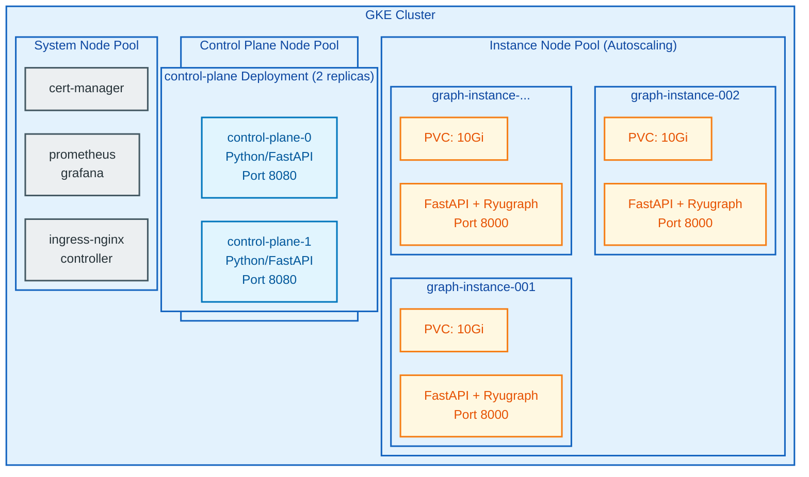
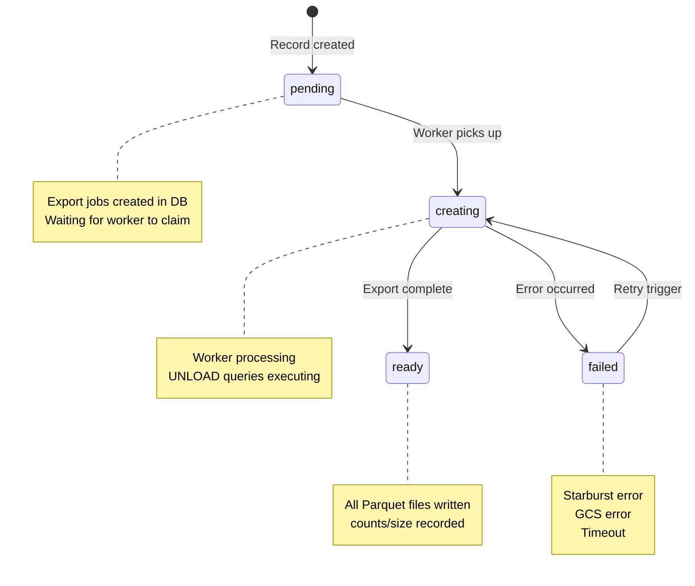
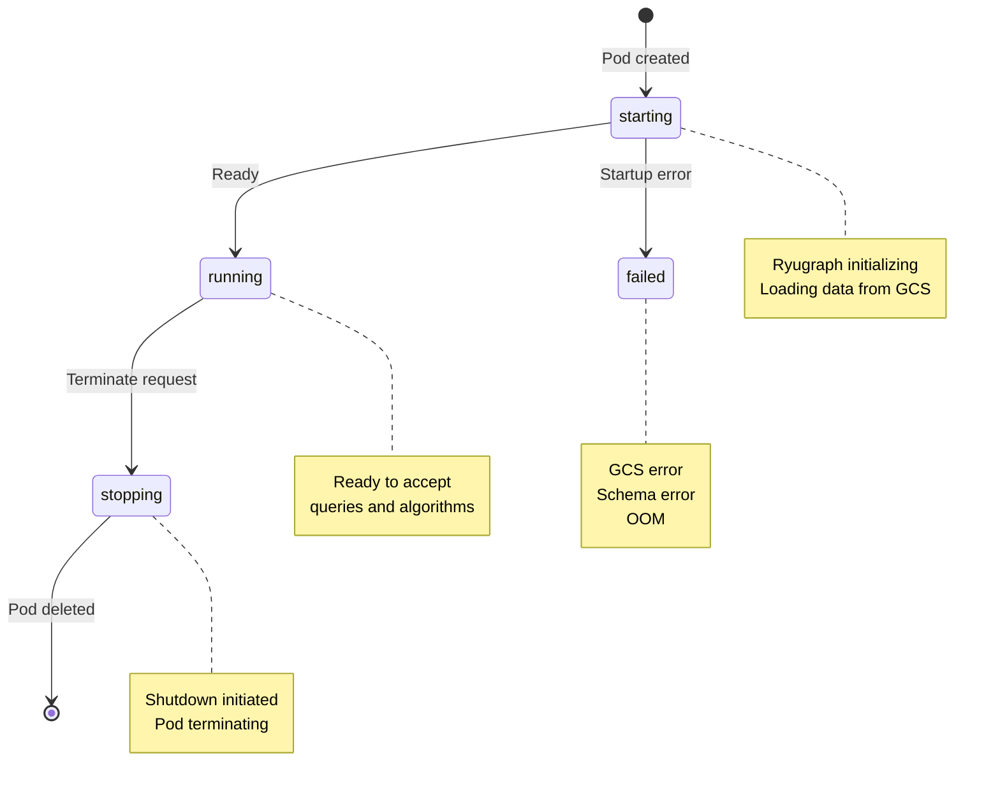
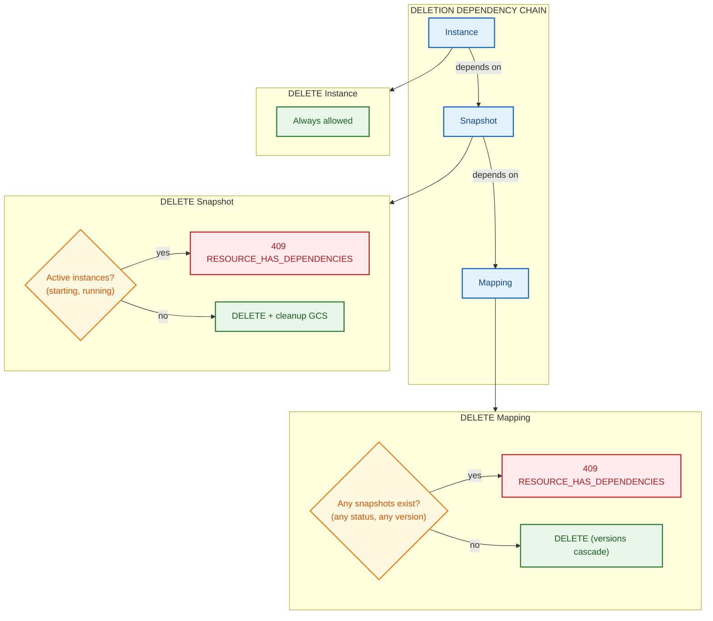

# System Architecture Design

## Overview

The Graph OLAP Platform enables analysts to create ad-hoc graph instances from Starburst SQL queries, run graph algorithms, and share work across teams. Users interact with the platform exclusively through the **Jupyter SDK** (Python client library). The architecture follows a **control plane + data plane** pattern where the Control Plane manages resource lifecycle and the Data Plane (Ryugraph pods) handles graph operations.

## Prerequisites

- [requirements.md](--/foundation/requirements.md) - Functional requirements
- [architectural.guardrails.md](--/foundation/architectural.guardrails.md) - Technology constraints and patterns

## Constraints

- All state managed through Control Plane API (no direct database access from workers/pods)
- Ryugraph runs embedded within Python wrapper (not as separate server)
- Parquet files as the only interchange format between Starburst Galaxy and Ryugraph
- PostgreSQL required in all environments (no SQLite support)
- Pod-per-instance model with ephemeral graph data
- All container images built for AMD64 architecture

**Export Platform:**
- ADR-070: Starburst Galaxy + BigQuery Export Platform
- ADR-071: PyArrow Fallback Export Strategy

---

## Component Diagram


<details>
<summary>Mermaid Source</summary>



</details>

---

## Cross-Component Data Flow Matrix

Consolidated view of all inter-component communication:

### Data Flows

| From | To | Data/Endpoint | Trigger | Error Handling |
|------|-----|---------------|---------|----------------|
| Jupyter SDK | Control Plane | HTTPS /api/* | User code | 4xx/5xx → SDK exception |
| Jupyter SDK | Wrapper Pod | HTTPS /{id}/* | User code | 4xx/5xx → SDK exception |
| Control Plane | Cloud SQL | SQL queries | API requests | 503 until recovered |
| Control Plane | Kubernetes | Create/Delete Pod | Instance lifecycle | Mark instance failed |
| Control Plane | Wrapper Pod | HTTP /shutdown | Terminate request | Force delete after timeout |
| KEDA | Cloud SQL | SELECT COUNT(*) pending jobs | Every 30s | Scale decision delayed |
| KEDA | Export Workers | Scale replicas 0↔N | Pending job count | Kubernetes handles restart |
| Export Worker | Control Plane | POST /export-jobs/claim | Worker loop (continuous) | Retry with backoff |
| Export Worker | Starburst Galaxy | POST /v1/statement (UNLOAD) | After claiming jobs | Retry 3x exp → PyArrow fallback → mark failed |
| Export Worker | Starburst Galaxy | GET nextUri (poll) | next_poll_at reached | Retry on next poll cycle |
| Export Worker | GCS | Count Parquet rows | Query FINISHED | Retry 3x exp |
| Export Worker | Control Plane | PATCH /export-jobs/:id | Status change | Retry 5x fixed 1s |
| Export Reconciliation | Cloud SQL | Reset stale claims, finalize | Every 5 min | Log, continue next run |
| Export Reconciliation | Starburst Galaxy | Check orphaned query status | Orphan detected | Update job status |
| Starburst Galaxy | GCS | Write Parquet | UNLOAD execution | Starburst handles |
| Wrapper Pod | GCS | COPY FROM Parquet | Startup | Fail fast → instance failed |
| Wrapper Pod | Control Plane | PUT /api/internal/instances/:id/status | Status change | Retry 5x fixed 1s |
| Wrapper Pod | Control Plane | PUT /api/internal/instances/:id/metrics | Periodic (60s) | Log, continue |

### Error Recovery Matrix

| Failure Type | Detection | Recovery Action | Terminal State |
|--------------|-----------|-----------------|----------------|
| Export Worker crash (claimed) | claimed_at > 10 min old | Reconciliation resets to pending | Job re-claimed by another worker |
| Export Worker crash (submitted) | next_poll_at stale > 10 min | Reconciliation checks Starburst | Job completed or reset |
| Starburst submission error | Worker exception | Retry 3x exponential → mark failed | Job status=failed |
| Starburst query timeout | Worker poll returns FAILED | Mark export_job failed | Snapshot status=failed |
| GCS count failure | Worker exception | Retry 3x exponential | Retry on reconciliation |
| All workers down | pending jobs accumulate | KEDA scales when load returns | Delayed export |
| Instance pod crash | CP health check (5 min) | Mark failed, delete pod | Instance status=failed |
| Instance startup timeout | CP reconciliation (10 min) | Mark failed | Instance status=failed |
| Control Plane crash | Kubernetes restart | Stateless recovery from DB | N/A (auto-recovers) |
| Export Worker OOM | Kubernetes restart | Pod restarted, jobs reset by reconciliation | None (auto-recovers) |
| Database unavailable | CP health check | 503 responses, workers pause | Until DB recovers |

---

## Multi-Wrapper Architecture

The platform supports multiple graph database backends through a pluggable wrapper architecture. See ADR-049: Multi-Wrapper Pluggable Architecture for full design rationale.

### Wrapper Selection Flow


<details>
<summary>Mermaid Source</summary>



</details>

### WrapperFactory Pattern

**Purpose:** Centralize wrapper-specific configuration to avoid scattered conditional logic.

**Location:** `packages/control-plane/src/control_plane/services/wrapper_factory.py`

**Responsibilities:**
- Map `WrapperType` → `WrapperConfig` (image, resources, env vars, ports)
- Query wrapper capabilities from `WRAPPER_CAPABILITIES` registry
- Provide single source of truth for wrapper configuration

**Configuration Returned:**

| Field | Ryugraph | FalkorDB |
|-------|----------|----------|
| `image_name` | `ryugraph-wrapper` | `falkordb-wrapper` |
| `image_tag` | `latest` | `latest` |
| `container_port` | 8000 | 8000 |
| `resource_limits` | `{memory: 8Gi, cpu: 4}` | `{memory: 12Gi, cpu: 4}` |
| `resource_requests` | `{memory: 4Gi, cpu: 2}` | `{memory: 6Gi, cpu: 2}` |
| `environment_variables` | `{WRAPPER_TYPE: ryugraph, BUFFER_POOL_SIZE: 2GB}` | `{WRAPPER_TYPE: falkordb, PYTHON_VERSION: 3.12}` |

**Usage in K8s Service:**

```python
wrapper_config = self._wrapper_factory.get_wrapper_config(wrapper_type)

pod_spec = {
    "containers": [{
        "image": f"{wrapper_config.image_name}:{wrapper_config.image_tag}",
        "resources": {
            "requests": wrapper_config.resource_requests,
            "limits": wrapper_config.resource_limits,
        },
        "env": [{"name": k, "value": v}
                for k, v in wrapper_config.environment_variables.items()],
    }]
}
```

### Wrapper Capabilities Registry

**Purpose:** Declarative feature discovery, prevent runtime errors from unsupported features.

**Location:** `packages/graph-olap-schemas/src/graph_olap_schemas/wrapper_capabilities.py`

**Key Differences:**

| Capability | Ryugraph | FalkorDB |
|------------|----------|----------|
| **NetworkX Support** | ✓ Yes | ✗ No |
| **Bulk Parquet Import** | ✓ Yes (`COPY FROM`) | ✗ No (row-by-row) |
| **Algorithm Invocation** | REST API (`/algo/*`) | Cypher procedures (`CALL algo.*`) |
| **Algorithm Result Mode** | Property writeback | Query results |
| **Native Algorithms** | pagerank, wcc, louvain, kcore | BFS, betweennessCentrality, WCC, CDLP |
| **Memory Model** | Buffer pool + disk | In-memory only |
| **Python Version** | 3.11+ | 3.12+ |

**Usage:**

```python
from graph_olap_schemas import get_wrapper_capabilities, WrapperType

caps = get_wrapper_capabilities(WrapperType.FALKORDB)
if not caps.supports_networkx:
    raise UnsupportedOperationError("FalkorDB does not support NetworkX algorithms")
```

### Instance Lifecycle with Wrapper Selection

1. **User Request:** `POST /api/instances {"wrapper_type": "falkordb", ...}`
2. **Validation:** Control Plane validates wrapper_type against `WrapperType` enum
3. **Configuration:** `WrapperFactory.get_wrapper_config(wrapper_type)` → `WrapperConfig`
4. **Pod Creation:** K8s service creates pod with wrapper-specific image, resources, env vars
5. **Data Loading:** Wrapper loads data from GCS Parquet (row-by-row for FalkorDB, bulk for Ryugraph)
6. **Ready State:** Wrapper reports status to Control Plane, instance becomes queryable
7. **Query Routing:** Ingress routes `/{url_slug}/*` to correct wrapper pod

### Adding New Wrapper Types

**Required Steps:**

1. **Add enum value:** `WrapperType.NEWDB = "newdb"` in `graph-olap-schemas`
2. **Add capabilities:** Entry in `WRAPPER_CAPABILITIES` registry
3. **Add factory config:** Case in `WrapperFactory.get_wrapper_config()`
4. **Create wrapper package:** `packages/newdb-wrapper/` following wrapper interface
5. **Create deployment manifests:** Kubernetes manifests for the new wrapper under `infrastructure/` with resource specifications (applied via `kubectl apply` from the CD pipeline)
6. **Update tests:** Add wrapper_type to E2E tests, unit tests for WrapperFactory

**No changes required to:**
- Control Plane business logic
- K8s service (uses WrapperFactory abstraction)
- API contracts (wrapper_type is generic field)
- SDK (wrapper_type is enum value)

---

## Data Flow Diagrams

### 1. Snapshot Creation Flow

Stateless export workers with KEDA scaling and database polling. See ADR-025 for architecture details.


<details>
<summary>Mermaid Source</summary>



</details>

### 2. Instance Startup Flow


<details>
<summary>Mermaid Source</summary>



</details>

### 3. Query Execution Flow


<details>
<summary>Mermaid Source</summary>



</details>

### 4. Algorithm Execution Flow (with Implicit Lock)


<details>
<summary>Mermaid Source</summary>



</details>

**Note:** Lock state is managed entirely within the Wrapper Pod (in-memory). Control Plane does not track locks.

---

## Deployment Topology

### GKE Cluster Layout


<details>
<summary>Mermaid Source</summary>



</details>

### Service Exposure

The platform follows a single architectural principle regardless of environment: **only the Control Plane API requires external access**. The Jupyter SDK is the sole client interface.

#### Service Access Matrix

| Service | Cluster-Internal Address | External Access? | Purpose |
|---------|--------------------------|------------------|---------|
| **Control Plane API** | `http://control-plane:8080` (exposed via LoadBalancer + Ingress at platform hostname) | ✅ **YES** | Platform entry point for Jupyter SDK |
| Export Worker | `http://control-plane:8080` | ❌ NO | Background service (cluster-internal) |
| Trino | Starburst Enterprise (VPC, via Private Service Connect) | ❌ NO | SQL engine (cluster-internal) |
| Postgres | Cloud SQL (Private IP, via Cloud SQL Proxy) | ❌ NO | Database (cluster-internal) |
| Wrapper Instances | `http://wrapper-xxx:8000` | ❌ NO | Dynamic pods (cluster-internal) |

**What NOT to expose:**
- Trino/Starburst — accessed only from Export Workers and the Control Plane over the VPC
- Postgres — accessed only from the Control Plane over the private network
- Internal services — never need external access; use `kubectl port-forward` against the test cluster for debugging only

#### Production (GKE)

**LoadBalancer + Ingress:**

```yaml
# Control Plane Service
apiVersion: v1
kind: Service
metadata:
  name: control-plane
spec:
  type: LoadBalancer  # GKE provisions external IP
  selector:
    app: control-plane
  ports:
  - port: 443
    targetPort: 8080

# Ingress with TLS
apiVersion: networking.k8s.io/v1
kind: Ingress
metadata:
  name: control-plane-ingress
  annotations:
    cert-manager.io/cluster-issuer: "<HSBC_TLS_ISSUER>"   # HSBC-provided internal PKI issuer
spec:
  rules:
  - host: api.example.com
    http:
      paths:
      - path: /
        pathType: Prefix
        backend:
          service:
            name: control-plane
            port:
              number: 443
  tls:
  - hosts:
    - api.example.com
    secretName: control-plane-tls
```

**Network Security:**
- Control Plane: Public LoadBalancer (authenticated via API keys/tokens)
- All other services: ClusterIP only (no external access)
- Starburst: Separate VPC, accessed via Private Service Connect
- Cloud SQL: Private IP only, accessed via Cloud SQL Proxy

#### Architectural Principle

**Single Entry Point Pattern:**
- External clients (Jupyter SDK) → Control Plane API only
- Control Plane orchestrates all internal services
- Internal services never exposed externally (defense in depth)
- Same pattern across all deployment environments (consistency)

This minimizes attack surface and ensures all external access goes through authenticated Control Plane API.

### JupyterHub Notebook Sync

**Reference:** ADR-088: Notebook Sync Init Container

JupyterHub pods include an init container that synchronizes notebooks at startup:

```yaml
singleuser:
  initContainers:
    - name: notebook-sync
      image: "${REGISTRY}/notebook-sync:${TAG}"
      env:
        - name: NOTEBOOK_REPO_URL
          value: "https://github.com/org/repo.git"
        - name: NOTEBOOK_BRANCH
          value: "main"
      volumeMounts:
        - name: home
          mountPath: /home/jovyan
```

The init container:
1. Clones/pulls notebooks from git repository
2. Copies CSS from SDK package to JupyterLab custom directory
3. Sets proper permissions (jovyan user)

### Kubernetes Resources per Instance

```yaml
# Pod
apiVersion: v1
kind: Pod
metadata:
  name: graph-instance-{instance_id}
  labels:
    app: graph-instance
    instance-id: "{instance_id}"
spec:
  containers:
  - name: wrapper
    image: graph-olap/ryugraph-wrapper:latest
    ports:
    - containerPort: 8000
    resources:
      # See ryugraph-performance.reference.md for sizing rationale
      requests:
        memory: "3Gi"     # Burstable QoS: 3Gi base for buffer pool + overhead
        cpu: "1000m"      # 1 vCPU baseline
      limits:
        memory: "8Gi"     # Allow burst for NetworkX algorithms
        cpu: "4000m"      # 4 vCPU for parallel operations
    volumeMounts:
    - name: data
      mountPath: /data
    env:
    - name: SNAPSHOT_GCS_PATH
      value: "gs://bucket/{owner}/{mapping_id}/v{mapping_version}/{snapshot_id}/"
    - name: BUFFER_POOL_SIZE
      value: "2147483648"  # 2GB - see ryugraph-performance.reference.md
    - name: MAX_THREADS
      value: "16"          # 4x CPU for I/O-bound GCS reads
  volumes:
  - name: data
    persistentVolumeClaim:
      claimName: graph-instance-{instance_id}-pvc

---
# Service
apiVersion: v1
kind: Service
metadata:
  name: graph-svc-{instance_id}
spec:
  selector:
    instance-id: "{instance_id}"
  ports:
  - port: 8000
    targetPort: 8000

---
# Ingress path (added to main Ingress)
# path: /{instance_id}/*
# backend: graph-svc-{instance_id}:8000
```

---

## State Machine Diagrams

### Snapshot States


<details>
<summary>Mermaid Source</summary>



</details>

### Instance States


<details>
<summary>Mermaid Source</summary>



</details>

### Resource Deletion Rules

Resources have dependencies that must be respected during deletion:


<details>
<summary>Mermaid Source</summary>



</details>

**Deletion Flows:**

User wants to delete a Mapping:

1. List snapshots for mapping (all versions)
2. If snapshots exist → return 409 with snapshot_count
3. User must delete each snapshot first
4. For each snapshot:
   - List instances for snapshot
   - If active instances exist → return 409 with instance details
   - User must terminate instances first (or wait for auto-cleanup)
   - Once no active instances → delete snapshot + cleanup favorites
5. Once no snapshots → delete mapping (versions cascade automatically) + cleanup favorites

Lifecycle auto-cleanup follows same rules:

- Expired instances terminated first
- Expired snapshots deleted only after their instances are gone
- Expired mappings deleted only after their snapshots are gone

**Favorites Cleanup:** 
When any resource is deleted, also delete all user_favorites referencing that resource:

```sql
DELETE FROM user_favorites WHERE resource_type = :type AND resource_id = :id
```

**Note:** `stopping` and `failed` instances do NOT block snapshot deletion. Only `starting` and `running` instances block deletion.

---

## Communication Protocols

### Synchronous (Request-Response)

| Source | Target | Protocol | Authentication |
|--------|--------|----------|----------------|
| Jupyter SDK | Control Plane | HTTPS | API key header |
| Jupyter SDK | Wrapper Pod | HTTPS | API key header |
| Control Plane | Wrapper Pod | HTTP | Internal (cluster network) |
| Wrapper Pod | GCS | HTTPS | Workload Identity |

### Asynchronous (Database Polling)

Export work is coordinated through the `export_jobs` table rather than a message queue. The Export Worker polls the database for claimable jobs using `FOR UPDATE SKIP LOCKED`. See ADR-025 for the full architecture rationale.

| Mechanism | Publisher | Consumer | Details |
|-----------|-----------|----------|---------|
| `export_jobs` table (status=pending) | Control Plane | Export Worker (APScheduler polling) | Worker claims jobs atomically; KEDA scales workers based on pending-job count |

See [data.model.spec.md](-/data.model.spec.md) for the `export_jobs` schema and claim/poll query patterns.

---

## Error Handling

### Failure Scenarios and Recovery

| Scenario | Detection | Recovery |
|----------|-----------|----------|
| Export Worker crash (claimed) | claimed_at > 10 min old | Reconciliation resets job to pending; re-claimed by another worker |
| Starburst submission error | Worker catches exception | Status→failed, error_message set |
| Export Worker crash (submitted) | next_poll_at stale > 10 min | Reconciliation checks Starburst; job completed or reset |
| Starburst query timeout/error | Poller detects FAILED state | export_job→failed, snapshot→failed when all jobs checked |
| GCS count failure | Poller catches exception | Retry on next poll (Fibonacci backoff) |
| Partial export (some jobs complete) | Poller checks all jobs | Mark completed jobs, continue polling running jobs |
| Instance pod OOM | Kubernetes restarts pod | Status→failed (startup OOM) or maintained (runtime OOM with restart) |
| Instance pod crash | Control Plane health check | Status→failed, pod deleted |
| Control Plane crash | Kubernetes restarts pod | Stateless, recovers from database |
| Database unavailable | Control Plane health check fails | 503 responses until recovered |

### Partial Failure Handling

**Snapshot Creation (multi-step UNLOAD):**

- If any UNLOAD fails, entire snapshot fails
- Partial Parquet files remain in GCS (overwritten on retry)
- Worker updates status to failed with specific error

**Instance Startup (multi-step COPY FROM):**

- If any COPY FROM fails, instance fails
- Ryugraph database may be partially loaded
- Pod terminated, PVC deleted

### Orphan Resource Cleanup

Control Plane runs a reconciliation job on startup and periodically to detect and clean orphan resources.

**Startup Reconciliation:**

1. List all Kubernetes pods with label app=graph-instance
2. For each pod, check if matching instance exists in database
   - If no DB record: delete orphan pod
   - If DB record exists but status='starting' for >10 minutes: mark failed, delete pod
3. List all DB instances with status='running' or 'starting'
   - If no matching pod exists: mark instance as failed


**Periodic Reconciliation (every 5 minutes):**

1. Find snapshots with status='creating' for >1 hour
   - Mark as failed with error "Export timeout - no progress update"
2. Find instances with status='starting' for >10 minutes
   - Mark as failed with error "Startup timeout"
   - Delete orphan pod if exists
3. Find instances with status='stopping' for >5 minutes
   - Force delete pod
   - Delete database record

**GCS Cleanup (daily):**

1. List GCS paths for snapshots with status='failed'
2. If snapshot failed >7 days ago and no retry attempted:
   - Delete GCS files to reclaim storage
   - Set gcs_path to NULL or mark as cleaned

### Lifecycle Expiry Cleanup

Control Plane runs a lifecycle cleanup job every 5 minutes to enforce TTL and inactivity timeouts.

**TTL Enforcement:**

```sql
-- Find expired instances (TTL elapsed since creation)
SELECT id FROM instances
WHERE status IN ('starting', 'running')
  AND ttl IS NOT NULL
  AND datetime(created_at, '+' || ttl_hours || ' hours') < datetime('now');
-- Note: ttl_hours computed from ISO 8601 duration

-- For each expired instance:
1. Call POST /instances/:id/terminate
```

**Inactivity Timeout Enforcement:**

```sql
-- Find inactive instances
SELECT id FROM instances
WHERE status = 'running'
  AND inactivity_timeout IS NOT NULL
  AND datetime(last_activity_at, '+' || timeout_hours || ' hours') < datetime('now');

-- For each inactive instance:
1. Call POST /instances/:id/terminate
```

**Snapshot and Mapping Lifecycle:**

- Same pattern for snapshots (check last_used_at for inactivity)
- Same pattern for mappings (less common, typically no TTL)

Cascade consideration

- When snapshot expires, all its instances must be terminated first
- When mapping expires, all its snapshots must be deleted first
- Cleanup job handles dependencies in correct order:
  1. Terminate instances
  2. Delete snapshots (after instances gone)
  3. Delete mappings (after snapshots gone)

**Cleanup Job Sequence:**

1. Find and terminate expired/inactive instances
2. Wait for instances to reach 'stopping' or deleted state
3. Find and delete expired/inactive snapshots (where no active instances)
4. Find and delete expired/inactive mappings (where no snapshots)
5. Log summary: "Cleanup completed: X instances, Y snapshots, Z mappings"

---

## API/Interface Summary

**API Classification:**
- **Client** (Jupyter SDK): Consumes `/api/*` endpoints with user credentials via Ingress.
- **Platform Components** (Wrapper, Worker): Consume `/api/internal/*` endpoints with service accounts via ClusterIP.

### Control Plane API (consumed by Jupyter SDK)

| Endpoint Pattern | Purpose |
|------------------|---------|
| `GET/POST /api/mappings` | List, create mappings |
| `GET/PUT/DELETE /api/mappings/:id` | Manage single mapping |
| `GET /api/mappings/:id/versions` | List mapping versions |
| `GET /api/mappings/:id/tree` | Get mapping resource tree |
| `GET /api/snapshots` | List snapshots (read-only) |
| `GET /api/snapshots/:id` | Get single snapshot (read-only) |
| `GET /api/snapshots/:id/progress` | Get snapshot progress |
| `GET/POST /api/instances` | List, create instances |
| `POST /api/instances/from-mapping` | Create instance from mapping (auto-creates snapshot) |
| `GET/PUT/DELETE /api/instances/:id` | Manage single instance |
| `POST /api/instances/:id/terminate` | Terminate instance |
| `GET /api/instances/:id/progress` | Get instance progress |
| `GET/POST/DELETE /api/favorites` | Manage user favorites |
| `GET /api/schema/catalogs`, `/catalogs/{c}/schemas`, `/catalogs/{c}/schemas/{s}/tables`, `/catalogs/{c}/schemas/{s}/tables/{t}/columns` | Schema browser (cached metadata) |
| `GET /api/schema/search/tables`, `/search/columns` | Search tables and columns by name pattern |
| `POST /api/schema/admin/refresh`, `GET /api/schema/stats` | Admin-only schema cache refresh and stats |
| `GET/PUT /api/config/*` | Ops configuration |
| `GET /api/cluster/*` | Cluster health/metrics |
| `GET /api/exports/*` | Export queue management |

### Wrapper Pod → External

| Endpoint | Purpose |
|----------|---------|
| `POST /query` | Execute Cypher query |
| `POST /algo/{name}` | Run Ryugraph native algorithm |
| `POST /networkx/{name}` | Run NetworkX algorithm |
| `POST /subgraph` | Extract subgraph |
| `GET /lock` | Check lock status |
| `GET /schema` | Get graph schema |
| `GET /health` | Health check |
| `GET /status` | Detailed status (memory, disk) |
| `POST /shutdown` | Graceful shutdown (internal) |

### Wrapper Pod → Control Plane (Internal API, platform component)

| Endpoint | Purpose |
|----------|---------|
| `PUT /api/internal/instances/:id/status` | Report status changes |
| `PUT /api/internal/instances/:id/metrics` | Report resource usage |

### Export Workers → Control Plane (Internal API, platform component)

| Endpoint | Purpose | Component |
|----------|---------|-----------|
| `PUT /api/internal/snapshots/:id/status` | Update snapshot status | Both |
| `POST /api/internal/snapshots/:id/export-jobs` | Create export job records | Submitter |
| `GET /api/internal/snapshots/:id/export-jobs` | Get export jobs (optional status filter) | Poller |
| `PATCH /api/internal/export-jobs/:id` | Update single export job | Poller |

---

## Anti-Patterns

See [architectural.guardrails.md](--/foundation/architectural.guardrails.md#anti-patterns-must-not-do) for the authoritative list of anti-patterns.

Key sections relevant to system architecture:

- **Database & Schema** - No direct DB access from workers/pods
- **Component Communication** - All state updates via Control Plane API
- **Concurrency & Pod Lifecycle** - Single Ryugraph process per pod, implicit locking
- **Data Handling & GCS** - No GCS access from Control Plane

---

## Open Questions

See [decision.log.md](--/process/decision.log.md) for consolidated open questions and architecture decision records.
