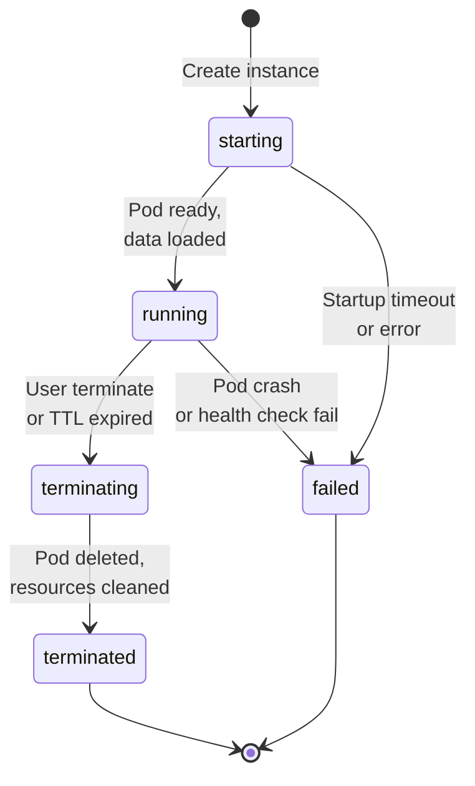

# Control Plane Design

## Overview

The Control Plane is the central management component of the Graph OLAP Platform: a Python/FastAPI backend serving the REST API. It manages all resource lifecycle, coordinates with Kubernetes for instance pods, runs background reconciliation jobs, and serves as the single source of truth for platform state.

## Prerequisites

- [requirements.md](--/foundation/requirements.md) - Functional requirements, user roles, resource definitions
- [architectural.guardrails.md](--/foundation/architectural.guardrails.md) - Technology constraints, patterns to follow
- [system.architecture.design.md](--/system-design/system.architecture.design.md) - Component interactions, data flows
- [data.model.spec.md](--/system-design/data.model.spec.md) - Database schema, query patterns
- [api.common.spec.md](--/system-design/api.common.spec.md) - API conventions, error codes
- [api.mappings.spec.md](--/system-design/api/api.mappings.spec.md), [api.snapshots.spec.md](--/system-design/api/api.snapshots.spec.md), [api.instances.spec.md](--/system-design/api/api.instances.spec.md), [api.admin-ops.spec.md](--/system-design/api/api.admin-ops.spec.md) - API specifications

## Related Components

**Clients** (consume `/api/*` endpoints with user credentials):
- [web-application.design.DEPRECATED.md](-/web-application.design.DEPRECATED.md) - Web UI (DEPRECATED - SDK is now the sole interface)
- [jupyter-sdk.design.md](-/jupyter-sdk.design.md) - Python SDK for Jupyter notebooks (Ingress access)

**Platform Components** (consume `/api/internal/*` endpoints with service accounts):
- [export-worker.design.md](-/export-worker.design.md) - Stateless workers that claim and process export jobs via Control Plane API
- [ryugraph-wrapper.design.md](-/ryugraph-wrapper.design.md) - Wrapper pods managed by Control Plane

## This Document Series

This is the core Control Plane design. Additional details are in:

- **[control-plane.services.design.md](-/control-plane.services.design.md)** - Database access layer, service layer, Starburst client
- **[control-plane.mapping-generator.design.md](-/control-plane.mapping-generator.design.md)** - Mapping Generator subsystem, background jobs

## Constraints

From [architectural.guardrails.md](--/foundation/architectural.guardrails.md):

- Control Plane is the single source of truth for all state
- Workers and pods update state via Control Plane API only (no direct DB access)
- PostgreSQL is required in all environments (SQLite not supported)
- No ORM - use raw SQL with explicit column lists (SQLAlchemy Core for connection management only)
- All errors return JSON (no HTML error pages)
- PostgreSQL-specific features allowed (e.g., FOR UPDATE SKIP LOCKED)

---

## Instance Lifecycle


<details>
<summary>Mermaid Source</summary>



</details>

---

## Request Middleware Flow

```mermaid
flowchart LR
    accTitle: Request Middleware Flow
    accDescr: HTTP request processing through FastAPI middleware stack to handler and response

    classDef input fill:#F3E5F5,stroke:#7B1FA2,stroke-width:2px,color:#4A148C
    classDef middleware fill:#E1F5FE,stroke:#0277BD,stroke-width:2px,color:#01579B
    classDef auth fill:#FFF3E0,stroke:#E65100,stroke-width:2px,color:#E65100
    classDef handler fill:#E8F5E9,stroke:#2E7D32,stroke-width:2px,color:#1B5E20
    classDef output fill:#C8E6C9,stroke:#2E7D32,stroke-width:2px,color:#1B5E20

    Req([HTTP Request]):::input
    RID[RequestID]:::middleware
    LOG[Logging]:::middleware
    EXC[Exception<br/>Handler]:::middleware
    MET[Metrics]:::middleware
    AUTH[Auth<br/>Dependency]:::auth
    H[Route Handler]:::handler
    Res([Response]):::output

    Req --> RID --> LOG --> EXC --> MET --> AUTH --> H --> Res
```


<details>
<summary>Mermaid Source</summary>



</details>

---

## Package Structure

```
control-plane/
├── src/
│   └── control_plane/
│       ├── __init__.py
│       ├── main.py                    # Entrypoint, uvicorn config
│       ├── app.py                     # FastAPI app factory, lifespan management
│       ├── config.py                  # Pydantic Settings, environment parsing
│       ├── dependencies.py            # FastAPI dependency injection
│       │
│       ├── routers/
│       │   ├── __init__.py
│       │   ├── api/
│       │   │   ├── __init__.py        # APIRouter with /api prefix
│       │   │   ├── mappings.py        # /api/mappings endpoints
│       │   │   ├── snapshots.py       # /api/snapshots endpoints
│       │   │   ├── instances.py       # /api/instances endpoints
│       │   │   ├── favorites.py       # /api/favorites endpoints
│       │   │   ├── admin.py           # /api/admin endpoints
│       │   │   ├── cluster.py         # /api/cluster endpoints
│       │   │   ├── ops.py             # /api/ops endpoints (job triggers, system state)
│       │   │   ├── schema.py          # /api/schema endpoints (metadata browser)
│       │   │   └── config.py          # /api/config endpoints (lifecycle, concurrency)
│       │   └── internal/
│       │       ├── __init__.py        # APIRouter with /api/internal prefix
│       │       ├── snapshots.py       # Worker status updates
│       │       ├── instances.py       # Pod status updates
│       │       └── starburst.py       # Starburst introspection proxy
│       │
│       ├── middleware/
│       │   ├── __init__.py
│       │   ├── request_id.py          # X-Request-ID generation/propagation
│       │   ├── logging.py             # Structured request logging
│       │   └── metrics.py             # Prometheus metrics
│       │
│       ├── services/
│       │   ├── __init__.py
│       │   ├── mappings.py            # Mapping business logic
│       │   ├── snapshots.py           # Snapshot business logic
│       │   ├── instances.py           # Instance business logic
│       │   ├── favorites.py           # Favorites business logic
│       │   ├── audit.py               # Audit logging service
│       │   ├── lifecycle.py           # Lifecycle enforcement
│       │   └── validation.py          # SQL validation via Starburst
│       │
│       ├── repositories/
│       │   ├── __init__.py
│       │   ├── base.py                # Base repository, transaction helpers
│       │   ├── mappings.py            # Mapping SQL queries
│       │   ├── snapshots.py           # Snapshot SQL queries
│       │   ├── instances.py           # Instance SQL queries
│       │   ├── users.py               # User SQL queries
│       │   ├── favorites.py           # Favorites SQL queries
│       │   ├── audit.py               # Audit log SQL queries
│       │   └── config.py              # Global config SQL queries
│       │
│       ├── models/
│       │   ├── __init__.py
│       │   ├── domain.py              # Domain models (dataclasses)
│       │   ├── requests.py            # Pydantic request models
│       │   ├── responses.py           # Pydantic response models
│       │   └── errors.py              # Exception hierarchy
│       │
│       ├── cache/
│       │   ├── __init__.py
│       │   └── schema_cache.py        # In-memory schema metadata cache (Trie-indexed)
│       │
│       ├── clients/
│       │   ├── __init__.py
│       │   ├── gcs.py                 # GCS client for snapshot cleanup
│       │   └── starburst_metadata.py  # Starburst REST API client for metadata
│       │
│       ├── infrastructure/
│       │   ├── __init__.py
│       │   ├── database.py            # SQLAlchemy async engine, session factory
│       │   ├── kubernetes.py          # K8s client wrapper
│       │   └── tables.py              # SQLAlchemy table definitions
│       │
│       └── jobs/
│           ├── __init__.py
│           ├── scheduler.py           # APScheduler setup
│           ├── lifecycle.py           # TTL/inactivity cleanup job
│           ├── reconciliation.py      # Orphan resource cleanup job
│           ├── export_reconciliation.py # Export worker crash recovery
│           ├── schema_cache.py        # Starburst schema refresh job
│           ├── instance_orchestration.py # waiting_for_snapshot transitions
│           ├── resource_monitor.py    # Dynamic memory monitoring
│           └── metrics.py             # Prometheus metrics for all jobs
│
├── migrations/
│   ├── env.py                         # Alembic environment
│   └── versions/
│       ├── 001_initial_schema.py
│       └── ...
├── tests/
│   ├── conftest.py                    # pytest fixtures
│   ├── unit/
│   └── integration/
├── pyproject.toml
├── Dockerfile
└── .pre-commit-config.yaml
```

---

## Application Factory

```python
# src/control_plane/app.py

from contextlib import asynccontextmanager
from typing import AsyncIterator

from fastapi import FastAPI

from .config import Settings
from .middleware import RequestIDMiddleware, LoggingMiddleware, MetricsMiddleware
from .routers import api, internal
from .infrastructure.database import create_engine, create_session_factory
from .infrastructure.kubernetes import KubernetesClient
from .jobs.scheduler import create_scheduler
from .infrastructure.starburst import StarburstClient


@asynccontextmanager
async def lifespan(app: FastAPI) -> AsyncIterator[None]:
    """Manage application lifecycle: startup and shutdown."""
    settings: Settings = app.state.settings

    # Startup
    engine = create_engine(settings.database_url)
    app.state.db_session_factory = create_session_factory(engine)
    app.state.k8s_client = KubernetesClient(settings.k8s_namespace)
    app.state.starburst_client = StarburstClient(
        base_url=settings.starburst_url,
        catalog=settings.starburst_catalog,
    )

    # Start background jobs
    scheduler = create_scheduler(app)
    scheduler.start()
    app.state.scheduler = scheduler

    yield

    # Shutdown
    scheduler.shutdown(wait=True)
    await app.state.starburst_client.close()
    await engine.dispose()


def create_app(settings: Settings | None = None) -> FastAPI:
    """Application factory pattern for testability."""
    if settings is None:
        settings = Settings()

    app = FastAPI(
        title="Graph OLAP Control Plane",
        version="1.0.0",
        docs_url="/api/docs" if settings.debug else None,
        redoc_url="/api/redoc" if settings.debug else None,
        lifespan=lifespan,
    )

    app.state.settings = settings

    # Middleware (order matters: first added = outermost)
    app.add_middleware(MetricsMiddleware)
    app.add_middleware(LoggingMiddleware)
    app.add_middleware(RequestIDMiddleware)

    # Health endpoints (no auth)
    @app.get("/health")
    async def health() -> dict:
        return {"status": "ok"}

    @app.get("/ready")
    async def ready() -> dict:
        # Could add DB connectivity check here
        return {"status": "ready"}

    # Mount routers
    app.include_router(api.router)
    app.include_router(internal.router)

    return app
```

---

## Background Jobs

The Control Plane runs six background jobs via APScheduler:

| Job | Interval | Purpose |
|-----|----------|---------|
| `lifecycle.py` | 5 minutes | Enforce TTL and inactivity timeouts on instances, snapshots, mappings |
| `reconciliation.py` | 5 minutes | Cleanup orphan pods, detect stale resources |
| `export_reconciliation.py` | 5 seconds | Reset stale export claims, check orphaned queries, finalize snapshots (deliberate exception to ADR-040: near-real-time export propagation requirement) |
| `schema_cache.py` | 24 hours | Refresh Starburst schema metadata cache |
| `instance_orchestration.py` | 30 seconds | Transition instances from `waiting_for_snapshot` to `starting` when snapshot is ready |
| `resource_monitor.py` | 60 seconds | Monitor pod memory usage and trigger proactive resize when thresholds exceeded |

### Export Reconciliation Job

The export reconciliation job handles crash recovery for the stateless export workers. See ADR-025 for architecture details.

**Responsibilities:**
1. **Reset stale claims:** Export jobs with `status='claimed'` and `claimed_at` > 10 minutes → reset to `pending`
2. **Check orphaned submissions:** Export jobs with `status='submitted'` and `next_poll_at` stale > 10 minutes → query Starburst for actual status
3. **Finalize snapshots:** Snapshots with all jobs `completed` but snapshot still `creating` → update to `ready`

**Implementation:**
```python
# src/control_plane/jobs/export_reconciliation.py

async def export_reconciliation_job():
    """Recover from export worker crashes and finalize completed snapshots."""

    # Phase 1: Reset stale claims
    stale_claimed = await export_job_repo.find_stale_claimed(
        older_than=timedelta(minutes=10)
    )
    for job in stale_claimed:
        await export_job_repo.reset_to_pending(job.id)
        logger.warning("Reset stale claimed job", job_id=job.id, worker=job.claimed_by)

    # Phase 2: Check orphaned submissions
    orphaned = await export_job_repo.find_orphaned_submitted(
        older_than=timedelta(minutes=10)
    )
    for job in orphaned:
        status = await starburst_client.get_query_status(job.starburst_query_id)
        if status == "FINISHED":
            row_count = await gcs_client.count_parquet_rows(job.gcs_path)
            await export_job_repo.complete(job.id, row_count=row_count)
        elif status == "FAILED":
            await export_job_repo.fail(job.id, error="Query failed in Starburst")
        elif status == "RUNNING":
            await export_job_repo.update_poll_time(job.id)  # Still running
        else:
            await export_job_repo.fail(job.id, error=f"Query not found: {job.starburst_query_id}")

    # Phase 3: Finalize completed snapshots
    snapshots_to_finalize = await snapshot_repo.find_ready_to_finalize()
    for snapshot in snapshots_to_finalize:
        totals = await export_job_repo.calculate_totals(snapshot.id)
        await snapshot_repo.finalize(snapshot.id, node_counts=totals.nodes, edge_counts=totals.edges)
        logger.info("Finalized snapshot", snapshot_id=snapshot.id)
```

### Schema Cache Job

The schema cache job refreshes cached Starburst metadata (catalogs, schemas, tables, columns) for the Web Application's Schema Browser. This cache enables instant schema browsing without real-time Starburst queries.

**Cache flow:**
1. Job queries Starburst for allowed catalogs/schemas (configured by Admin/Ops)
2. For each allowed schema: fetch tables and columns
3. Store metadata in Control Plane database with timestamp
4. Web App BFF queries cached data via `/api/starburst/*` endpoints

**Triggers:**
- Scheduled: Every 24 hours (configurable via `schema_cache_job_interval`)
- Manual: Ops triggers via `POST /api/config/schemas/cache/refresh`
- Config change: When allowed schemas configuration changes

See ADR-012 for design rationale.

### Instance Orchestration Job

The instance orchestration job manages the `waiting_for_snapshot` to `starting` transition for instances created via the create-instance-from-mapping flow.

**Responsibilities:**
1. **Monitor waiting instances:** Find all instances with `status='waiting_for_snapshot'`
2. **Check snapshot status:** For each waiting instance, query the pending snapshot's status
3. **Transition to starting:** If snapshot is `ready`, transition instance to `starting` and create K8s pod
4. **Handle failures:** If snapshot is `failed` or `cancelled`, mark instance as `failed` with appropriate error message

**Implementation:**
```python
# src/control_plane/jobs/instance_orchestration.py

async def run_instance_orchestration_job():
    """Check instances waiting for snapshots and transition when ready."""

    # Get all instances waiting for snapshots
    waiting_instances = await instance_repo.get_waiting_for_snapshot()

    for instance in waiting_instances:
        snapshot = await snapshot_repo.get_by_id(instance.pending_snapshot_id)

        if snapshot.status == SnapshotStatus.READY:
            # Transition instance to 'starting', create K8s pod
            await instance_repo.transition_to_starting(instance.id)
            await k8s_service.create_wrapper_pod(...)

        elif snapshot.status in (SnapshotStatus.FAILED, SnapshotStatus.CANCELLED):
            # Mark instance as failed
            await instance_repo.update_status(
                instance_id=instance.id,
                status=InstanceStatus.FAILED,
                error_code=InstanceErrorCode.DATA_LOAD_ERROR,
                error_message=f"Snapshot failed: {snapshot.error_message}",
            )
```

### Resource Monitor Job

The resource monitor job implements dynamic memory monitoring and proactive resize for running instances.

**Multi-Level Trigger Strategy:**

| Level | Trigger | Action |
|-------|---------|--------|
| Proactive | Memory > 80% for 2 min | Initiate in-place resize |
| Urgent | Memory > 90% for 1 min | Expedited resize + notification |
| Recovery | OOMKilled event | Auto-restart with 2x memory |

**Resize Guardrails:**
- Maximum memory per instance: 32Gi (configurable via `sizing_max_memory_gb`)
- Maximum resize steps: 3 (configurable via `sizing_max_resize_steps`)
- Cooldown between resizes: 300 seconds (configurable via `sizing_resize_cooldown_seconds`)

**Implementation:**
```python
# src/control_plane/jobs/resource_monitor.py

async def run_resource_monitor_job():
    """Monitor pod resources and trigger proactive resize."""

    # Skip if sizing is disabled
    if not settings.sizing_enabled:
        return

    # Get all running instances
    instances = await instance_repo.list_instances(
        InstanceFilters(status=InstanceStatus.RUNNING)
    )

    for instance in instances:
        # Get memory usage from K8s metrics API
        memory_usage_percent = await k8s_service.get_pod_memory_usage(instance.pod_name)

        if memory_usage_percent > 0.9:
            # Urgent: > 90% for 1 min
            await _trigger_memory_resize(instance, "urgent")
        elif memory_usage_percent > 0.8:
            # Proactive: > 80% for 2 min
            await _trigger_memory_resize(instance, "proactive")
```

### Wrapper Pod Resource Management

The Control Plane manages resource allocation for **all wrapper types** (Ryugraph and FalkorDB) through a unified sizing strategy. This section documents the initial resource calculation at pod creation time.

**Related:** The Resource Monitor Job (above) handles reactive resize during runtime. This section covers proactive sizing at creation.

#### Dynamic Sizing from Snapshot Size

When an instance is created, `InstanceService._calculate_resources()` determines pod resources based on the snapshot's Parquet file size:

| Wrapper Type | Memory Formula | Rationale |
|--------------|----------------|-----------|
| **Ryugraph** | `parquet_size × 1.2 + 0.5GB` × headroom | Disk-backed with buffer pool |
| **FalkorDB** | `parquet_size × 2.0 + 1.0GB` × headroom | Entire graph loaded into RAM |

**Configuration (from `config.py`):**

| Setting | Default | Description |
|---------|---------|-------------|
| `sizing_enabled` | `true` | Enable dynamic sizing |
| `sizing_ryugraph_memory_multiplier` | `1.2` | Memory multiplier for Ryugraph |
| `sizing_falkordb_memory_multiplier` | `2.0` | Memory multiplier for FalkorDB |
| `sizing_memory_headroom` | `1.5` | Additional headroom multiplier |
| `sizing_min_memory_gb` | `2.0` | Minimum memory allocation |
| `sizing_max_memory_gb` | `32.0` | Maximum memory allocation |
| `sizing_disk_multiplier` | `1.2` | Disk size multiplier |
| `sizing_min_disk_gb` | `10` | Minimum disk allocation |

**Sizing Flow:**
```
snapshot.size_bytes
    → Apply wrapper-specific multiplier (1.2x or 2.0x)
    → Add base memory (0.5GB or 1.0GB)
    → Apply headroom multiplier (1.5x)
    → Clamp to [min_memory_gb, max_memory_gb]
    → Set memory_request = memory_limit (Guaranteed QoS for memory)
```

#### QoS Strategy

| Resource | Strategy | Implementation | Rationale |
|----------|----------|----------------|-----------|
| **Memory** | Guaranteed | `request == limit` | Prevents OOM-kill under node pressure |
| **CPU** | Burstable | `limit = 2 × request` | Cost-efficient; burst capacity for algorithm execution |

**CPU Burst Model:**
```python
cpu_request = str(cpu_cores)           # e.g., "1"
cpu_limit = str(cpu_cores * 2)         # e.g., "2"
```

This allows pods to burst to 2× their requested CPU during query/algorithm execution while sharing cluster resources efficiently during idle periods.

#### In-Place CPU Scaling

The platform supports Kubernetes 1.27+ in-place pod resize for CPU (without pod restart):

```python
# SDK usage
instance.update_cpu(cpu_cores=2)

# Control Plane implementation (k8s_service.resize_pod_cpu)
kubectl patch pod <pod-name> --subresource=resize \
  -p '{"spec":{"containers":[{"name":"wrapper","resources":{"requests":{"cpu":"2"},"limits":{"cpu":"4"}}}]}}'
```

**Constraints:**
- Memory cannot be resized in-place (requires pod recreation)
- CPU limit always set to 2× request
- Subject to resize cooldown (`sizing_resize_cooldown_seconds`)

#### Resource Governance

To prevent resource exhaustion in shared clusters:

| Limit | Setting | Default | Description |
|-------|---------|---------|-------------|
| Per-instance max | `sizing_max_memory_gb` | 32 GB | Maximum memory per wrapper pod |
| Per-user total | `sizing_per_user_max_memory_gb` | 64 GB | Fair share across analysts |
| Cluster soft limit | `sizing_cluster_memory_soft_limit_gb` | 256 GB | Capacity warning threshold |
| Max resize steps | `sizing_max_resize_steps` | 3 | Limit automatic memory upgrades |
| Resize cooldown | `sizing_resize_cooldown_seconds` | 300 | Prevent resize storms |
| Per-analyst instances | `concurrency_per_analyst` | 10 | Max concurrent instances per user |
| Cluster instances | `concurrency_cluster_total` | 50 | Max total instances |

#### Why Not VPA or HPA?

| Autoscaler | Decision | Rationale |
|------------|----------|-----------|
| **VPA** | Not used | Wrapper pods are short-lived (TTL <24h); VPA complexity not justified |
| **HPA** | Not applicable | One pod per instance by design (not horizontally scalable) |

**Instead:** Dynamic sizing at creation + in-place CPU resize + Resource Monitor Job provides simpler, more predictable resource management for ephemeral graph workloads.

#### In-Place Memory Upgrade

The platform supports Kubernetes 1.27+ in-place pod resize for memory (without pod restart). Unlike CPU, memory can only be **increased** (not decreased) due to OS-level constraints.

**Why Memory Increase Only:**
- Memory is a non-compressible resource
- Decreasing memory below current usage triggers OOM kill
- For loaded graph databases, usage approximately equals limit, so decreases always fail

**Endpoint:** `PUT /api/instances/{id}/memory`

**Request:**
```json
{"memory_gb": 8}
```

**Validation:**
- `memory_gb` >= current (no decreases)
- `memory_gb` <= 32 (max per instance)
- Instance must be running
- User must be owner/admin/ops

**Flow:**
1. Validate request
2. Check permissions
3. Verify memory increase (not decrease)
4. Call `k8s_service.resize_pod_memory()`
5. Update `instance_repo.update_memory_gb()`
6. Return updated instance

**SDK Usage:**
```python
# Upgrade from 4GB to 8GB
instance.update_memory(memory_gb=8)
```

**Kubernetes Operation (k8s_service.resize_pod_memory):**
```bash
kubectl patch pod <pod-name> --subresource=resize \
  -p '{"spec":{"containers":[{"name":"wrapper","resources":{"requests":{"memory":"8Gi"},"limits":{"memory":"8Gi"}}}]}}'
```

**Automatic Memory Upgrade (Resource Monitor Job):**

The Resource Monitor Job (documented above) now includes memory upgrade triggers:

| Level | Trigger | Action |
|-------|---------|--------|
| Proactive | Memory > 80% for 2 min | Double memory (up to max) |
| Urgent | Memory > 90% for 1 min | Immediate resize + notification |
| Recovery | OOMKilled event | Auto-restart with 2x memory |

**Constraints:**
- Memory increase works without restart (K8s 1.27+)
- Memory must stay at or above current value
- Maximum memory: 32 GB per instance (`sizing_max_memory_gb`)
- Resize cooldown: 300 seconds between operations (`sizing_resize_cooldown_seconds`)
- Memory request = limit (Guaranteed QoS maintained)

#### Cross-References

- **Ryugraph-specific tuning** (buffer pools, threads): [ryugraph-performance.reference.md](--/reference/ryugraph-performance.reference.md)
- **Wrapper selection and factory**: [system.architecture.design.md](--/system-design/system.architecture.design.md) (Multi-Wrapper Architecture section)
- **K8s pod creation**: [k8s_service.create_wrapper_pod()](-/control-plane.services.design.md)

---

## Trino Compatibility Layer

The Control Plane supports multiple Trino distributions (Starburst Galaxy, vanilla Trino) through a compatibility layer that uses standard SQL instead of vendor-specific extensions.

**Reference:** ADR-067: Trino Compatibility Layer

### Design Principles

1. **Standard SQL queries** - Use `information_schema` instead of `system.metadata.*` tables
2. **Conditional authentication** - Skip auth when `password="unused"` (vanilla Trino)
3. **Rate limiting** - Prevent overwhelming coordinators with concurrent queries

### Implementation

```python
# packages/control-plane/src/control_plane/clients/starburst_metadata.py

# Before (Starburst-specific)
SELECT * FROM system.metadata.table_comments WHERE ...

# After (Standard SQL)
SELECT
    table_schema,
    table_name,
    table_type
FROM information_schema.tables
WHERE table_schema NOT IN ('information_schema', 'pg_catalog')
```

### Conditional Authentication

```python
def _should_authenticate(self) -> bool:
    """Skip authentication when password is 'unused' (vanilla Trino)."""
    return self.password != "unused"
```

This enables:
- **Starburst Galaxy** - Production with enterprise authentication
- **Vanilla Trino** - Local development and testing (no credentials required)

---

## Cache Module

The `cache/` module provides in-memory caching for performance-critical data.

### Schema Metadata Cache

The `SchemaMetadataCache` provides lock-free reads of Starburst schema metadata with Trie-indexed prefix search.

**Design Goals:**
- Lock-free reads for maximum concurrency
- Atomic refresh (exclusive lock during write)
- Fast prefix search via pygtrie indices
- Case-insensitive lookups

**Data Structures:**
```python
# src/control_plane/cache/schema_cache.py

@dataclass(frozen=True, slots=True)
class Column:
    """Column metadata (immutable for thread safety)."""
    name: str
    data_type: str
    is_nullable: bool
    ordinal_position: int
    column_default: str | None = None


@dataclass(frozen=True, slots=True)
class Table:
    """Table metadata with columns."""
    name: str
    table_type: str  # 'BASE TABLE', 'VIEW', etc.
    columns: tuple[Column, ...]  # Immutable tuple


@dataclass(frozen=True, slots=True)
class Schema:
    """Schema metadata with tables."""
    name: str
    tables: dict[str, Table]  # table_name -> Table


@dataclass(frozen=True, slots=True)
class Catalog:
    """Catalog metadata with schemas."""
    name: str
    schemas: dict[str, Schema]  # schema_name -> Schema


class SchemaMetadataCache:
    """Thread-safe in-memory cache for Starburst schema metadata."""

    def __init__(self):
        self._catalogs: dict[str, Catalog] = {}
        self._table_index: pygtrie.StringTrie = pygtrie.StringTrie()  # Prefix search
        self._column_index: pygtrie.StringTrie = pygtrie.StringTrie()
        self._lock = asyncio.Lock()  # Only for refresh
        self._last_refresh: datetime | None = None

    # Lock-free reads
    def list_catalogs(self) -> list[Catalog]: ...
    def get_catalog(self, name: str) -> Catalog | None: ...
    def get_schema(self, catalog: str, schema: str) -> Schema | None: ...
    def get_table(self, catalog: str, schema: str, table: str) -> Table | None: ...
    def search_tables(self, pattern: str, limit: int = 100) -> list[tuple]: ...
    def search_columns(self, pattern: str, limit: int = 100) -> list[tuple]: ...

    # Exclusive lock for atomic swap
    async def refresh(self, new_catalogs: dict[str, Catalog]) -> None: ...
```

**Performance Characteristics:**
- Memory usage: ~350 bytes per table, ~150 bytes per column
- Exact lookup: ~1us
- Prefix search: ~100us

---

## Clients Module

The `clients/` module contains clients for external services.

### GCS Client

The `GCSClient` handles GCS operations for snapshot cleanup.

```python
# src/control_plane/clients/gcs.py

class GCSClient:
    """Client for GCS deletion operations."""

    def __init__(self, project: str, emulator_host: str | None = None):
        """
        Initialize GCS client.

        Args:
            project: GCP project ID
            emulator_host: GCS emulator endpoint (for testing)
        """

    @retry(
        retry=retry_if_exception_type(GoogleAPIError),
        stop=stop_after_attempt(3),
        wait=wait_exponential(multiplier=0.5, min=0.5, max=2),
    )
    def delete_path(self, gcs_path: str) -> tuple[int, int]:
        """
        Delete all files under a GCS path.

        Args:
            gcs_path: GCS path (gs://bucket/prefix/)

        Returns:
            Tuple of (files_deleted, bytes_deleted)
        """
```

**Features:**
- Automatic retry with exponential backoff
- Support for GCS emulator (testing)
- Bulk deletion of snapshot directories

### Starburst Metadata Client

The `StarburstMetadataClient` fetches schema metadata via Trino REST API.

```python
# src/control_plane/clients/starburst_metadata.py

class StarburstMetadataClient:
    """Client for fetching Starburst schema metadata via REST API."""

    def __init__(
        self,
        url: str,
        user: str,
        password: str,
        timeout: float = 30.0,
    ):
        """
        Initialize Starburst metadata client.

        Args:
            url: Starburst coordinator URL
            user: Username for authentication
            password: Password (use "unused" to skip auth for vanilla Trino)
        """

    @classmethod
    def from_config(cls, settings: Settings) -> StarburstMetadataClient:
        """Create client from settings."""

    async def execute_query(self, sql: str) -> list[dict[str, Any]]:
        """Execute SELECT query with polling until complete."""

    async def fetch_catalogs(self) -> list[dict]: ...
    async def fetch_schemas(self, catalog: str) -> list[dict]: ...
    async def fetch_tables(self, catalog: str, schema: str) -> list[dict]: ...
    async def fetch_columns(self, catalog: str, schema: str, table: str) -> list[dict]: ...


class StarburstError(Exception): ...
class StarburstQueryError(StarburstError): ...
class StarburstTimeoutError(StarburstError): ...
```

**Features:**
- Async context manager for connection lifecycle
- Automatic retry for connection errors and timeouts
- Support for both Starburst Galaxy (with auth) and vanilla Trino (no auth)
- Uses `information_schema` for Trino compatibility (see ADR-067)

---

## Router Configuration

### API Router Setup

```python
# src/control_plane/routers/api/__init__.py

from fastapi import APIRouter, Depends

from ...dependencies import get_current_user, require_maintenance_off
from . import mappings, snapshots, instances, favorites, admin, cluster

router = APIRouter(prefix="/api", tags=["api"])


# Apply authentication to all API routes
router.include_router(
    mappings.router,
    prefix="/mappings",
    dependencies=[Depends(get_current_user)],
)
router.include_router(
    snapshots.router,
    prefix="/snapshots",
    dependencies=[Depends(get_current_user)],
)
router.include_router(
    instances.router,
    prefix="/instances",
    dependencies=[Depends(get_current_user)],
)
router.include_router(
    favorites.router,
    prefix="/favorites",
    dependencies=[Depends(get_current_user)],
)
router.include_router(
    admin.router,
    prefix="/admin",
    dependencies=[Depends(get_current_user)],
)
router.include_router(
    cluster.router,
    prefix="/cluster",
    dependencies=[Depends(get_current_user)],
)
router.include_router(
    ops.router,
    # ops router defines its own /api/ops prefix
)
router.include_router(
    schema.router,
    # schema router defines its own /api/schema prefix
)
router.include_router(
    config.router,
    # config router defines its own /api/config prefix
)
```

### Ops Router

Provides operational endpoints for Ops and Admin users to monitor and manage background jobs and system state.

```python
# src/control_plane/routers/api/ops.py

from fastapi import APIRouter
from control_plane.middleware.auth import CurrentUser
from control_plane.models import UserRole

router = APIRouter(prefix="/api/ops", tags=["Ops"])


def require_ops_role(user: CurrentUser) -> None:
    """Require ops or admin role for ops endpoints."""
    if user.role not in [UserRole.OPS, UserRole.ADMIN]:
        raise RoleRequiredError(required_role="ops or admin", user_role=user.role.value)


@router.post("/jobs/trigger")
async def trigger_job(request: TriggerJobRequest, user: CurrentUser) -> TriggerJobResponse:
    """
    Manually trigger background job execution.

    Requires: Ops or admin role
    Rate limit: 1 trigger per job per minute

    Use cases:
    - Production smoke tests
    - Manual reconciliation after incident
    - Debugging
    """


@router.get("/jobs/status")
async def get_jobs_status(user: CurrentUser) -> JobsStatusResponse:
    """Get status of all background jobs (next run times)."""


@router.get("/state")
async def get_system_state(user: CurrentUser) -> SystemStateResponse:
    """
    Get system state summary.

    Returns counts of instances, snapshots, export jobs by status.
    """


@router.get("/export-jobs")
async def get_export_jobs(
    user: CurrentUser,
    status: str | None = None,
    limit: int = 100,
) -> ExportJobsListResponse:
    """Get export jobs for debugging (filterable by status)."""
```

### Schema Metadata Router

Provides REST endpoints for browsing Starburst schema metadata from the in-memory cache.

```python
# src/control_plane/routers/api/schema.py

from fastapi import APIRouter

router = APIRouter(prefix="/api/schema", tags=["Schema Metadata"])


# === Browse Endpoints (any authenticated user) ===

@router.get("/catalogs")
async def list_catalogs() -> list[CatalogResponse]:
    """List all cached Starburst catalogs. Performance: ~1us"""


@router.get("/catalogs/{catalog_name}/schemas")
async def list_schemas(catalog_name: str) -> list[SchemaResponse]:
    """List all schemas in a catalog. Performance: ~1us"""


@router.get("/catalogs/{catalog_name}/schemas/{schema_name}/tables")
async def list_tables(catalog_name: str, schema_name: str) -> list[TableResponse]:
    """List all tables in a schema. Performance: ~1us"""


@router.get("/catalogs/{catalog_name}/schemas/{schema_name}/tables/{table_name}/columns")
async def list_columns(catalog_name: str, schema_name: str, table_name: str) -> list[ColumnResponse]:
    """Get all columns for a table. Performance: ~1us"""


# === Search Endpoints (any authenticated user) ===

@router.get("/search/tables")
async def search_tables(q: str, limit: int = 100) -> list[TableResponse]:
    """Search tables by name pattern (prefix match, case-insensitive). Performance: ~100us"""


@router.get("/search/columns")
async def search_columns(q: str, limit: int = 100) -> list[ColumnResponse]:
    """Search columns by name pattern (prefix match, case-insensitive). Performance: ~100us"""


# === Admin Endpoints (admin role required) ===

@router.post("/admin/refresh")
async def trigger_refresh() -> dict:
    """Manually trigger schema cache refresh (runs in background)."""


@router.get("/stats")
async def get_cache_stats() -> CacheStatsResponse:
    """Get schema cache statistics (catalog/schema/table/column counts, last refresh)."""
```

### Config Router

Provides configuration management endpoints for Ops users.

```python
# src/control_plane/routers/api/config.py

from fastapi import APIRouter

router = APIRouter(prefix="/api/config", tags=["Config"])


# === Lifecycle Configuration ===

@router.get("/lifecycle")
async def get_lifecycle_config() -> LifecycleConfigResponse:
    """Get lifecycle configuration (TTL, inactivity) for all resource types."""


@router.put("/lifecycle")
async def update_lifecycle_config(request: LifecycleConfigRequest) -> UpdatedResponse:
    """Update lifecycle configuration. Requires Ops role."""


# === Concurrency Limits ===

@router.get("/concurrency")
async def get_concurrency_config() -> ConcurrencyConfigResponse:
    """Get concurrency limits (per-analyst, cluster-total)."""


@router.put("/concurrency")
async def update_concurrency_config(request: ConcurrencyConfig) -> ConcurrencyConfigResponse:
    """Update concurrency limits. Requires Ops role."""


# === Maintenance Mode ===

@router.get("/maintenance")
async def get_maintenance_mode() -> MaintenanceModeResponse:
    """Get maintenance mode status."""


@router.put("/maintenance")
async def set_maintenance_mode(request: MaintenanceModeRequest) -> MaintenanceModeResponse:
    """Enable/disable maintenance mode. Requires Ops role."""


# === Export Configuration ===

@router.get("/export")
async def get_export_config() -> ExportConfigResponse:
    """Get export configuration (max duration)."""


@router.put("/export")
async def update_export_config(request: ExportConfigRequest) -> ExportConfigResponse:
    """Update export configuration. Requires Ops role."""
```

### Mappings Router

```python
# src/control_plane/routers/api/mappings.py

from fastapi import APIRouter, Depends, Query, status
from typing import Annotated

from ...dependencies import (
    get_current_user,
    get_mapping_service,
    require_maintenance_off,
)
from ...models.domain import User
from ...models.requests import CreateMappingRequest, UpdateMappingRequest
from ...models.responses import MappingResponse, MappingListResponse
from ...services.mappings import MappingService

router = APIRouter()


@router.get("", response_model=MappingListResponse)
async def list_mappings(
    user: Annotated[User, Depends(get_current_user)],
    service: Annotated[MappingService, Depends(get_mapping_service)],
    owner: str | None = None,
    limit: int = Query(default=50, le=100),
    offset: int = Query(default=0, ge=0),
) -> MappingListResponse:
    """List all mappings with optional owner filter."""
    mappings, total = await service.list(owner=owner, limit=limit, offset=offset)
    return MappingListResponse(data=mappings, total=total, limit=limit, offset=offset)


@router.post(
    "",
    response_model=MappingResponse,
    status_code=status.HTTP_201_CREATED,
    dependencies=[Depends(require_maintenance_off)],
)
async def create_mapping(
    request: CreateMappingRequest,
    user: Annotated[User, Depends(get_current_user)],
    service: Annotated[MappingService, Depends(get_mapping_service)],
) -> MappingResponse:
    """Create a new mapping."""
    mapping = await service.create(request, user)
    return MappingResponse(data=mapping)


@router.get("/{mapping_id}", response_model=MappingResponse)
async def get_mapping(
    mapping_id: int,
    user: Annotated[User, Depends(get_current_user)],
    service: Annotated[MappingService, Depends(get_mapping_service)],
) -> MappingResponse:
    """Get a mapping by ID."""
    mapping = await service.get_by_id(mapping_id)
    return MappingResponse(data=mapping)


@router.put("/{mapping_id}", response_model=MappingResponse)
async def update_mapping(
    mapping_id: int,
    request: UpdateMappingRequest,
    user: Annotated[User, Depends(get_current_user)],
    service: Annotated[MappingService, Depends(get_mapping_service)],
) -> MappingResponse:
    """Update a mapping (creates new version if definitions changed)."""
    mapping = await service.update(mapping_id, request, user)
    return MappingResponse(data=mapping)


@router.delete("/{mapping_id}", status_code=status.HTTP_204_NO_CONTENT)
async def delete_mapping(
    mapping_id: int,
    user: Annotated[User, Depends(get_current_user)],
    service: Annotated[MappingService, Depends(get_mapping_service)],
) -> None:
    """Delete a mapping (fails if snapshots exist)."""
    await service.delete(mapping_id, user)


@router.post(
    "/{mapping_id}/copy",
    response_model=MappingResponse,
    status_code=status.HTTP_201_CREATED,
    dependencies=[Depends(require_maintenance_off)],
)
async def copy_mapping(
    mapping_id: int,
    user: Annotated[User, Depends(get_current_user)],
    service: Annotated[MappingService, Depends(get_mapping_service)],
) -> MappingResponse:
    """Copy a mapping to the current user."""
    mapping = await service.copy(mapping_id, user)
    return MappingResponse(data=mapping)
```

---

## Health Endpoint

### Overview

The `/health` endpoint provides comprehensive cluster health validation, checking all dependencies the Control Plane orchestrates. This enables:
- Pre-test validation (E2E tests verify environment readiness)
- Production health monitoring (Kubernetes liveness/readiness probes)
- Debugging (single endpoint to verify entire stack health)

**Key Design:** Health checks run **inside** the Control Plane container, accessing cluster services directly (no external access required).

### Implementation

**File**: `packages/control-plane/src/control_plane/infrastructure/health.py` (NEW)

```python
"""Health check infrastructure for validating all dependencies."""

import asyncio
import httpx
from typing import Dict, Any
import structlog

logger = structlog.get_logger()

async def check_postgres(db_pool) -> Dict[str, Any]:
    """Check Postgres connectivity."""
    try:
        async with db_pool.acquire() as conn:
            result = await conn.fetchval("SELECT 1")
            return {"healthy": result == 1}
    except Exception as e:
        logger.error("postgres_health_check_failed", error=str(e))
        return {"healthy": False, "error": str(e)}

async def check_trino(trino_url: str = "http://trino:8080") -> Dict[str, Any]:
    """Check Trino connectivity."""
    try:
        async with httpx.AsyncClient(timeout=5.0) as client:
            resp = await client.get(f"{trino_url}/v1/info")
            return {"healthy": resp.status_code == 200}
    except Exception as e:
        logger.error("trino_health_check_failed", error=str(e))
        return {"healthy": False, "error": str(e)}

async def check_export_worker() -> Dict[str, Any]:
    """Check export worker health by querying job queue."""
    try:
        # TODO: Implement actual check (query pending jobs, check worker pod status)
        return {"healthy": True, "note": "Placeholder - implement job queue check"}
    except Exception as e:
        logger.error("export_worker_health_check_failed", error=str(e))
        return {"healthy": False, "error": str(e)}

async def check_fake_gcs(gcs_url: str = "http://fake-gcs-server:4443") -> Dict[str, Any]:
    """Check fake GCS server connectivity."""
    try:
        async with httpx.AsyncClient(timeout=5.0) as client:
            # Fake GCS health endpoint
            resp = await client.get(f"{gcs_url}/storage/v1/b")
            return {"healthy": resp.status_code in (200, 404)}  # 404 is OK (no buckets)
    except Exception as e:
        logger.error("fake_gcs_health_check_failed", error=str(e))
        return {"healthy": False, "error": str(e)}

async def comprehensive_health_check(db_pool) -> Dict[str, Any]:
    """Run all health checks in parallel."""
    checks = await asyncio.gather(
        check_postgres(db_pool),
        check_trino(),
        check_export_worker(),
        check_fake_gcs(),
        return_exceptions=True,
    )

    results = {
        "postgres": checks[0] if not isinstance(checks[0], Exception) else {"healthy": False, "error": str(checks[0])},
        "trino": checks[1] if not isinstance(checks[1], Exception) else {"healthy": False, "error": str(checks[1])},
        "export_worker": checks[2] if not isinstance(checks[2], Exception) else {"healthy": False, "error": str(checks[2])},
        "fake_gcs": checks[3] if not isinstance(checks[3], Exception) else {"healthy": False, "error": str(checks[3])},
    }

    all_healthy = all(check.get("healthy", False) for check in results.values())

    return {
        "status": "healthy" if all_healthy else "degraded",
        "checks": results,
    }
```

### Router Integration

**File**: `packages/control-plane/src/control_plane/routers/api/__init__.py` (MODIFIED)

```python
from fastapi import APIRouter, Depends, status
from control_plane.infrastructure.database import get_db_pool
from control_plane.infrastructure.health import comprehensive_health_check

router = APIRouter()

@router.get("/health")
async def health_check(db_pool=Depends(get_db_pool)):
    """
    Comprehensive health check validating all cluster dependencies.

    Checks:
    - Postgres database connectivity
    - Trino query engine connectivity
    - Export worker health (job queue)
    - Fake GCS server connectivity

    Returns 200 if all checks pass, 503 if any check fails.
    """
    result = await comprehensive_health_check(db_pool)
    status_code = status.HTTP_200_OK if result["status"] == "healthy" else status.HTTP_503_SERVICE_UNAVAILABLE
    return result
```

### Response Format

**Healthy Response (200 OK):**
```json
{
  "status": "healthy",
  "checks": {
    "postgres": {"healthy": true},
    "trino": {"healthy": true},
    "export_worker": {"healthy": true, "note": "Placeholder - implement job queue check"},
    "fake_gcs": {"healthy": true}
  }
}
```

**Degraded Response (503 Service Unavailable):**
```json
{
  "status": "degraded",
  "checks": {
    "postgres": {"healthy": true},
    "trino": {"healthy": false, "error": "Connection refused"},
    "export_worker": {"healthy": true, "note": "Placeholder - implement job queue check"},
    "fake_gcs": {"healthy": true}
  }
}
```

### Usage

**Local Development:**
```bash
# Pre-test validation
curl http://localhost:8080/health

# Makefile integration
make test  # Automatically calls validate-test-environment.sh → curl /health
```

**Kubernetes Probes:**
```yaml
# Liveness probe (restart if unhealthy)
livenessProbe:
  httpGet:
    path: /health
    port: 8080
  initialDelaySeconds: 30
  periodSeconds: 10

# Readiness probe (remove from load balancer if unhealthy)
readinessProbe:
  httpGet:
    path: /health
    port: 8080
  initialDelaySeconds: 10
  periodSeconds: 5
```

**Architecture Benefits:**
- ✅ Single endpoint validates entire stack
- ✅ No external service access required (all checks cluster-internal)
- ✅ Parallel execution (fast response time)
- ✅ Detailed failure information (which dependency is unhealthy)
- ✅ Standard HTTP status codes (200 healthy, 503 degraded)

---

## Dependency Injection

### Header-Based Identity Extraction (Updated for ADR-104)

The Control Plane extracts user identity from the `X-Username` header set by the upstream authentication proxy (oauth2-proxy). The user's role is looked up from the `role` column in the `users` table — there is no JWT token parsing, no Bearer auth, and no `X-User-Role` header extraction in the API layer.

**Reference:** ADR-104: DB-backed user records

| Header | Purpose |
|--------|---------|
| `X-Username` | User identifier (resolved to DB record on every request) |

**Security assumption:** Control Plane is network-isolated and only accessible through oauth2-proxy. See [architectural.guardrails.md](--/foundation/architectural.guardrails.md#10-dual-authentication-paths) for network security requirements.

### Implementation

```python
# src/control_plane/dependencies.py

from typing import Annotated, AsyncIterator

from fastapi import Depends, Header, HTTPException, Request, status
from sqlalchemy.ext.asyncio import AsyncSession

from .models.domain import User, UserRole
from .models.errors import UnauthorizedError, MaintenanceError
from .repositories.users import UserRepository
from .repositories.config import ConfigRepository
from .services.mappings import MappingService
from .services.snapshots import SnapshotService
from .services.instances import InstanceService


async def get_db_session(request: Request) -> AsyncIterator[AsyncSession]:
    """Yield a database session for the request."""
    session_factory = request.app.state.db_session_factory
    async with session_factory() as session:
        yield session


async def get_current_user(
    x_username: Annotated[str, Header()],
    x_user_role: Annotated[str, Header()],
    session: Annotated[AsyncSession, Depends(get_db_session)],
) -> User:
    """
    Extract user from headers (set by upstream auth proxy).

    Headers are trusted - authentication happens at the infrastructure layer.
    """
    if not x_username:
        raise UnauthorizedError("Missing X-Username header")

    try:
        role = UserRole(x_user_role.lower())
    except ValueError:
        raise UnauthorizedError(f"Invalid role: {x_user_role}")

    # Ensure user exists in database (create on first access)
    user_repo = UserRepository(session)
    user = await user_repo.get_or_create(username=x_username, role=role)

    return user


async def require_admin(
    user: Annotated[User, Depends(get_current_user)],
) -> User:
    """Require admin or ops role."""
    if user.role not in (UserRole.ADMIN, UserRole.OPS):
        raise HTTPException(
            status_code=status.HTTP_403_FORBIDDEN,
            detail={"code": "PERMISSION_DENIED", "message": "Admin access required"},
        )
    return user


async def require_ops(
    user: Annotated[User, Depends(get_current_user)],
) -> User:
    """Require ops role."""
    if user.role != UserRole.OPS:
        raise HTTPException(
            status_code=status.HTTP_403_FORBIDDEN,
            detail={"code": "PERMISSION_DENIED", "message": "Ops access required"},
        )
    return user


async def require_maintenance_off(
    session: Annotated[AsyncSession, Depends(get_db_session)],
) -> None:
    """Block request if maintenance mode is enabled."""
    config_repo = ConfigRepository(session)
    enabled = await config_repo.get_bool("maintenance.enabled")
    if enabled:
        message = await config_repo.get_string("maintenance.message") or "System under maintenance"
        raise MaintenanceError(message)


# Service dependencies
async def get_mapping_service(
    session: Annotated[AsyncSession, Depends(get_db_session)],
    request: Request,
) -> MappingService:
    """Construct MappingService with dependencies."""
    return MappingService(
        session=session,
        starburst_client=request.app.state.starburst_client,
    )


async def get_snapshot_service(
    session: Annotated[AsyncSession, Depends(get_db_session)],
    request: Request,
) -> SnapshotService:
    """Construct SnapshotService with dependencies."""
    return SnapshotService(
        session=session,
    )


async def get_instance_service(
    session: Annotated[AsyncSession, Depends(get_db_session)],
    request: Request,
) -> InstanceService:
    """Construct InstanceService with dependencies."""
    return InstanceService(
        session=session,
        k8s_client=request.app.state.k8s_client,
    )
```

---

## Middleware

### Request ID Middleware

```python
# src/control_plane/middleware/request_id.py

import uuid
from starlette.middleware.base import BaseHTTPMiddleware, RequestResponseEndpoint
from starlette.requests import Request
from starlette.responses import Response


class RequestIDMiddleware(BaseHTTPMiddleware):
    """Generate or propagate X-Request-ID for distributed tracing."""

    async def dispatch(
        self, request: Request, call_next: RequestResponseEndpoint
    ) -> Response:
        # Use provided ID or generate new one
        request_id = request.headers.get("X-Request-ID") or str(uuid.uuid4())

        # Store in request state for handlers and logging
        request.state.request_id = request_id

        response = await call_next(request)

        # Include in response for client correlation
        response.headers["X-Request-ID"] = request_id

        return response
```

### Logging Middleware

```python
# src/control_plane/middleware/logging.py

import time
import structlog
from starlette.middleware.base import BaseHTTPMiddleware, RequestResponseEndpoint
from starlette.requests import Request
from starlette.responses import Response

logger = structlog.get_logger()


class LoggingMiddleware(BaseHTTPMiddleware):
    """Structured request/response logging."""

    async def dispatch(
        self, request: Request, call_next: RequestResponseEndpoint
    ) -> Response:
        start_time = time.perf_counter()

        response = await call_next(request)

        duration_ms = (time.perf_counter() - start_time) * 1000

        # Skip health check logging to reduce noise
        if request.url.path not in ("/health", "/ready"):
            logger.info(
                "request",
                method=request.method,
                path=request.url.path,
                status=response.status_code,
                duration_ms=round(duration_ms, 2),
                request_id=getattr(request.state, "request_id", None),
                username=request.headers.get("X-Username"),
                user_agent=request.headers.get("User-Agent"),
                client_ip=request.client.host if request.client else None,
            )

        return response
```

### Maintenance Middleware

Applied to resource creation endpoints only via dependency injection. Terminate, delete, and read operations remain available during maintenance.

```python
# Implemented as dependency (see require_maintenance_off in dependencies.py)
# Applied selectively to routes that create resources
```

---

## Error Handling

### Exception Hierarchy

```python
# src/control_plane/models/errors.py

from typing import Any


class AppError(Exception):
    """Base application error."""

    def __init__(
        self,
        code: str,
        status: int,
        message: str,
        details: dict[str, Any] | None = None,
    ):
        self.code = code
        self.status = status
        self.message = message
        self.details = details or {}
        super().__init__(message)


class NotFoundError(AppError):
    """Resource not found."""

    def __init__(self, resource_type: str, resource_id: int | str):
        super().__init__(
            code="RESOURCE_NOT_FOUND",
            status=404,
            message=f"{resource_type} {resource_id} not found",
            details={"resource_type": resource_type, "resource_id": resource_id},
        )


class UnauthorizedError(AppError):
    """Authentication required."""

    def __init__(self, message: str = "Authentication required"):
        super().__init__(code="UNAUTHORIZED", status=401, message=message)


class PermissionDeniedError(AppError):
    """Permission denied."""

    def __init__(self, resource_type: str, resource_id: int | str):
        super().__init__(
            code="PERMISSION_DENIED",
            status=403,
            message=f"Permission denied for {resource_type} {resource_id}",
        )


class ValidationError(AppError):
    """Validation failed."""

    def __init__(self, field: str, message: str):
        super().__init__(
            code="VALIDATION_FAILED",
            status=400,
            message=message,
            details={"field": field},
        )


class DependencyError(AppError):
    """Resource has dependencies preventing deletion."""

    def __init__(
        self,
        resource_type: str,
        resource_id: int,
        dependent_type: str,
        dependent_count: int,
    ):
        super().__init__(
            code="RESOURCE_HAS_DEPENDENCIES",
            status=409,
            message=f"Cannot delete {resource_type} {resource_id}: has {dependent_count} {dependent_type}(s)",
            details={
                "resource_type": resource_type,
                "resource_id": resource_id,
                "dependent_type": dependent_type,
                "dependent_count": dependent_count,
            },
        )


class ConcurrencyLimitError(AppError):
    """Concurrency limit exceeded."""

    def __init__(self, limit_type: str, current_count: int, max_allowed: int):
        super().__init__(
            code="CONCURRENCY_LIMIT_EXCEEDED",
            status=409,
            message=f"Cannot create instance: {limit_type} limit exceeded",
            details={
                "limit_type": limit_type,
                "current_count": current_count,
                "max_allowed": max_allowed,
            },
        )


class InvalidStateError(AppError):
    """Resource is in invalid state for operation."""

    def __init__(self, resource: str, resource_id: int, current: str, required: str):
        super().__init__(
            code="INVALID_STATE",
            status=409,
            message=f"{resource} {resource_id} is in state '{current}', required '{required}'",
            details={"current_state": current, "required_state": required},
        )


class MaintenanceError(AppError):
    """System is in maintenance mode."""

    def __init__(self, message: str):
        super().__init__(
            code="SERVICE_UNAVAILABLE",
            status=503,
            message=message,
        )
```

### Exception Handlers

```python
# src/control_plane/app.py (add to create_app)

from fastapi import Request
from fastapi.responses import JSONResponse
from .models.errors import AppError


def register_exception_handlers(app: FastAPI) -> None:
    """Register global exception handlers."""

    @app.exception_handler(AppError)
    async def app_error_handler(request: Request, exc: AppError) -> JSONResponse:
        return JSONResponse(
            status_code=exc.status,
            content={
                "error": {
                    "code": exc.code,
                    "message": exc.message,
                    "details": exc.details,
                },
                "meta": {"request_id": getattr(request.state, "request_id", None)},
            },
        )

    @app.exception_handler(Exception)
    async def generic_error_handler(request: Request, exc: Exception) -> JSONResponse:
        # Log the full exception
        logger.exception("unhandled_exception", request_id=getattr(request.state, "request_id", None))

        # Return generic error (don't expose internals)
        return JSONResponse(
            status_code=500,
            content={
                "error": {
                    "code": "INTERNAL_ERROR",
                    "message": "An internal error occurred",
                },
                "meta": {"request_id": getattr(request.state, "request_id", None)},
            },
        )
```

---

## Configuration

```python
# src/control_plane/config.py

from datetime import timedelta
from pydantic_settings import BaseSettings, SettingsConfigDict


class Settings(BaseSettings):
    """Application settings loaded from environment."""

    model_config = SettingsConfigDict(
        env_prefix="GRAPH_OLAP_",
        env_file=".env",
        env_file_encoding="utf-8",
    )

    # Server
    port: int = 8080
    debug: bool = False
    shutdown_timeout: timedelta = timedelta(seconds=30)

    # Database
    database_url: str
    db_pool_size: int = 25
    db_max_overflow: int = 5

    # Kubernetes
    k8s_namespace: str = "graph-olap"
    wrapper_image: str
    storage_class: str = "standard"

    # Starburst
    starburst_url: str
    starburst_catalog: str = "analytics"

    # Jobs
    lifecycle_job_interval: timedelta = timedelta(minutes=5)
    reconciliation_job_interval: timedelta = timedelta(minutes=5)
    schema_cache_job_interval: timedelta = timedelta(hours=24)

    # Internal
    internal_url: str = "http://control-plane.graph-olap.svc.cluster.local"
```

---

## Entry Point

```python
# src/control_plane/main.py

import uvicorn
from .app import create_app
from .config import Settings


def main() -> None:
    """Application entry point."""
    settings = Settings()
    app = create_app(settings)

    uvicorn.run(
        app,
        host="0.0.0.0",
        port=settings.port,
        log_level="info" if not settings.debug else "debug",
        access_log=False,  # We handle logging in middleware
    )


if __name__ == "__main__":
    main()
```

---

## Anti-Patterns

### Architectural

See [architectural.guardrails.md](--/foundation/architectural.guardrails.md#anti-patterns-must-not-do) for the authoritative list. Key sections relevant to Control Plane:

- **Database & Schema** - No direct DB access from workers/pods, no PostgreSQL-specific features
- **Query Patterns** - No SELECT *, no ORM lazy loading, always use LIMIT
- **API Design** - JSON only, no bulk endpoints, no explicit lock endpoints
- **Resource Lifecycle** - Respect deletion dependencies, enforce lifecycle limits

### Component-Specific

These constraints are specific to the Python/FastAPI implementation:

- DO NOT use blocking I/O in async handlers (use async libraries: httpx, asyncpg, aiofiles)
- DO NOT share database sessions across requests (create per-request via dependency injection)
- DO NOT use `asyncio.run()` inside async functions (already in event loop)
- DO NOT use `time.sleep()` in async code (use `asyncio.sleep()`)
- DO NOT mix sync and async database calls in the same request handler

---

## Open Questions

See [decision.log.md](--/process/decision.log.md) for:

- OQ-001: Authentication mechanism
- OQ-003: Domain configuration
- OQ-004: CORS configuration
- OQ-010: User management and IdP integration
