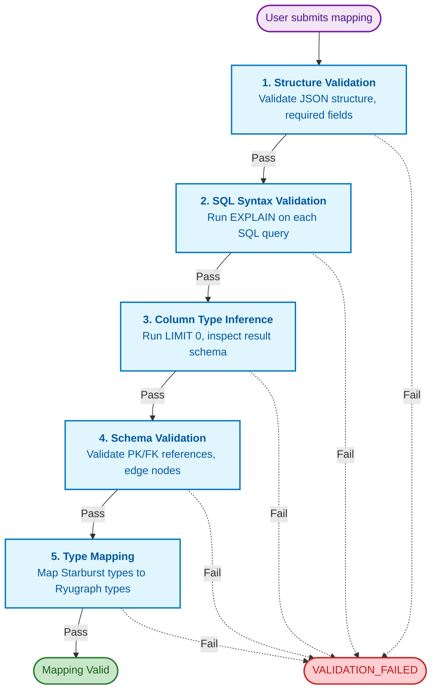

# Control Plane Mapping Generator Design

SQL validation, type inference, schema generation, and background jobs for the Control Plane.

## Prerequisites

- [control-plane.design.md](-/control-plane.design.md) - Core Control Plane design
- [control-plane.services.design.md](-/control-plane.services.design.md) - Service layer

## Related Components

- [reference/data-pipeline.reference.md](--/reference/data-pipeline.reference.md) - Type mapping reference
- [export-worker.design.md](-/export-worker.design.md) - Consumes export messages

---

## Mapping Generator Subsystem

The Mapping Generator is a subsystem within the Control Plane responsible for validating and processing mapping definitions. It parses user-provided SQL queries, validates them against Starburst, infers column types, and generates the appropriate Ryugraph schema. The generator ensures that mappings are valid before export and provides helpful error messages when validation fails.

### Mapping Generator Architecture

```
control-plane/src/control_plane/
├── services/
│   └── validation.py       # Main validation orchestrator
├── mapping/
│   ├── __init__.py
│   ├── validator.py        # Definition validation rules
│   ├── sql_parser.py       # SQL parsing and column extraction
│   ├── type_mapper.py      # Starburst → Ryugraph type mapping
│   ├── schema_generator.py # Ryugraph schema generation
│   └── errors.py           # Validation error types
├── infrastructure/
│   └── starburst.py        # Starburst connection and introspection
```

### Validation Pipeline


<details>
<summary>Mermaid Source</summary>



</details>

### Validation Stages

| Stage | Validation | Blocking | Error Code |
|-------|------------|----------|------------|
| 1. Structure | JSON schema, required fields | Yes | VALIDATION_FAILED |
| 2. SQL Syntax | EXPLAIN query succeeds | Yes | VALIDATION_FAILED |
| 3. Column Inference | LIMIT 0 returns expected columns | Yes | VALIDATION_FAILED |
| 4. Schema | References valid, PKs exist | Yes | VALIDATION_FAILED |
| 5. Type Mapping | All types mappable | Yes | VALIDATION_FAILED |

### Mapping Engine Implementation

```python
# mapping/engine.py
from dataclasses import dataclass
from typing import Any

from control_plane.infrastructure.starburst import StarburstClient
from control_plane.mapping.type_mapper import TypeMapper
from control_plane.mapping.errors import ValidationError


@dataclass
class ColumnSchema:
    name: str
    type: str


@dataclass
class NodeSchema:
    label: str
    primary_key: ColumnSchema
    properties: list[ColumnSchema]


@dataclass
class EdgeSchema:
    type: str
    from_node: str
    to_node: str
    from_key: ColumnSchema
    to_key: ColumnSchema
    properties: list[ColumnSchema]


@dataclass
class NodeValidationResult:
    label: str
    valid: bool
    error: str | None = None
    schema: NodeSchema | None = None


@dataclass
class EdgeValidationResult:
    type: str
    valid: bool
    error: str | None = None
    schema: EdgeSchema | None = None


@dataclass
class ValidationResult:
    valid: bool
    node_results: list[NodeValidationResult]
    edge_results: list[EdgeValidationResult]


class MappingEngine:
    """Validates mapping definitions against Starburst and generates Ryugraph schemas."""

    def __init__(self, starburst_client: StarburstClient) -> None:
        self.starburst = starburst_client
        self.type_mapper = TypeMapper()

    async def validate(
        self,
        node_definitions: list[dict[str, Any]],
        edge_definitions: list[dict[str, Any]],
    ) -> ValidationResult:
        """
        Validate a complete mapping definition.
        Called on mapping create and update.
        """
        result = ValidationResult(
            valid=True,
            node_results=[],
            edge_results=[],
        )

        # 1. Structure validation (handled by Pydantic models at API layer)

        # 2 & 3. Validate nodes (SQL + column inference)
        node_schemas: dict[str, NodeSchema] = {}  # label -> schema for edge validation

        for node_def in node_definitions:
            try:
                node_result = await self._validate_node(node_def)
                result.node_results.append(node_result)
                if node_result.schema:
                    node_schemas[node_def["label"]] = node_result.schema
            except ValidationError as e:
                result.valid = False
                result.node_results.append(
                    NodeValidationResult(
                        label=node_def.get("label", "unknown"),
                        valid=False,
                        error=str(e),
                    )
                )

        # 2 & 3. Validate edges (SQL + column inference + reference validation)
        for edge_def in edge_definitions:
            try:
                edge_result = await self._validate_edge(edge_def, node_schemas)
                result.edge_results.append(edge_result)
            except ValidationError as e:
                result.valid = False
                result.edge_results.append(
                    EdgeValidationResult(
                        type=edge_def.get("type", "unknown"),
                        valid=False,
                        error=str(e),
                    )
                )

        return result

    async def _validate_node(self, node_def: dict[str, Any]) -> NodeValidationResult:
        """Validate a single node definition."""
        label = node_def["label"]

        # Validate SQL syntax via EXPLAIN
        try:
            await self.starburst.explain(node_def["sql"])
        except Exception as e:
            raise ValidationError(
                field="sql",
                message=f"SQL syntax error: {e}",
                details={"label": label},
            )

        # Infer column types via LIMIT 0
        try:
            columns = await self.starburst.infer_columns(node_def["sql"])
        except Exception as e:
            raise ValidationError(
                field="sql",
                message=f"Failed to infer columns: {e}",
                details={"label": label},
            )

        # Validate primary key column exists and is first
        pk_def = node_def["primary_key"]
        if not columns or columns[0].name != pk_def["name"]:
            raise ValidationError(
                field="primary_key",
                message=f"Primary key '{pk_def['name']}' must be first column",
                details={"label": label},
            )

        # Map primary key type to Ryugraph
        try:
            pk_type = self.type_mapper.map(columns[0].type)
        except ValueError as e:
            raise ValidationError(
                field="primary_key",
                message=f"Unsupported primary key type '{columns[0].type}'",
                details={"label": label, "column": columns[0].name},
            )

        # Validate user-specified PK type matches inferred type
        if pk_def["type"] != pk_type:
            raise ValidationError(
                field="primary_key.type",
                message=(
                    f"Primary key type mismatch: specified '{pk_def['type']}' "
                    f"but column is '{columns[0].type}' (maps to '{pk_type}')"
                ),
                details={"label": label},
            )

        # Validate and map property columns
        properties = self._validate_property_columns(
            node_def.get("properties", []),
            columns[1:],  # Skip primary key
            label,
        )

        return NodeValidationResult(
            label=label,
            valid=True,
            schema=NodeSchema(
                label=label,
                primary_key=ColumnSchema(name=pk_def["name"], type=pk_type),
                properties=properties,
            ),
        )

    async def _validate_edge(
        self,
        edge_def: dict[str, Any],
        node_schemas: dict[str, NodeSchema],
    ) -> EdgeValidationResult:
        """Validate a single edge definition."""
        edge_type = edge_def["type"]

        # Validate from_node and to_node exist
        from_node = node_schemas.get(edge_def["from_node"])
        if not from_node:
            raise ValidationError(
                field="from_node",
                message=f"Unknown node label '{edge_def['from_node']}'",
                details={"edge_type": edge_type},
            )

        to_node = node_schemas.get(edge_def["to_node"])
        if not to_node:
            raise ValidationError(
                field="to_node",
                message=f"Unknown node label '{edge_def['to_node']}'",
                details={"edge_type": edge_type},
            )

        # Validate SQL syntax
        try:
            await self.starburst.explain(edge_def["sql"])
        except Exception as e:
            raise ValidationError(
                field="sql",
                message=f"SQL syntax error: {e}",
                details={"edge_type": edge_type},
            )

        # Infer column types
        try:
            columns = await self.starburst.infer_columns(edge_def["sql"])
        except Exception as e:
            raise ValidationError(
                field="sql",
                message=f"Failed to infer columns: {e}",
                details={"edge_type": edge_type},
            )

        # Validate from_key is first column
        if len(columns) < 2:
            raise ValidationError(
                field="sql",
                message="Edge SQL must return at least 2 columns (from_key, to_key)",
                details={"edge_type": edge_type, "column_count": len(columns)},
            )

        if columns[0].name != edge_def["from_key"]:
            raise ValidationError(
                field="from_key",
                message=f"First column must be from_key '{edge_def['from_key']}', got '{columns[0].name}'",
                details={"edge_type": edge_type},
            )

        # Validate to_key is second column
        if columns[1].name != edge_def["to_key"]:
            raise ValidationError(
                field="to_key",
                message=f"Second column must be to_key '{edge_def['to_key']}', got '{columns[1].name}'",
                details={"edge_type": edge_type},
            )

        # Validate from_key type matches from_node primary key
        from_key_type = self.type_mapper.map(columns[0].type)
        if from_key_type != from_node.primary_key.type:
            raise ValidationError(
                field="from_key",
                message=(
                    f"from_key type '{from_key_type}' doesn't match "
                    f"{edge_def['from_node']} primary key type '{from_node.primary_key.type}'"
                ),
                details={"edge_type": edge_type},
            )

        # Validate to_key type matches to_node primary key
        to_key_type = self.type_mapper.map(columns[1].type)
        if to_key_type != to_node.primary_key.type:
            raise ValidationError(
                field="to_key",
                message=(
                    f"to_key type '{to_key_type}' doesn't match "
                    f"{edge_def['to_node']} primary key type '{to_node.primary_key.type}'"
                ),
                details={"edge_type": edge_type},
            )

        # Validate property columns
        properties = self._validate_property_columns(
            edge_def.get("properties", []),
            columns[2:],  # Skip from_key, to_key
            edge_type,
        )

        return EdgeValidationResult(
            type=edge_type,
            valid=True,
            schema=EdgeSchema(
                type=edge_type,
                from_node=edge_def["from_node"],
                to_node=edge_def["to_node"],
                from_key=ColumnSchema(name=edge_def["from_key"], type=from_key_type),
                to_key=ColumnSchema(name=edge_def["to_key"], type=to_key_type),
                properties=properties,
            ),
        )

    def _validate_property_columns(
        self,
        property_defs: list[dict[str, Any]],
        columns: list,
        context: str,
    ) -> list[ColumnSchema]:
        """Validate property columns exist and map types."""
        result = []
        for i, prop_def in enumerate(property_defs):
            if i >= len(columns):
                raise ValidationError(
                    field=f"properties[{i}]",
                    message=f"Property '{prop_def['name']}' not found in query result",
                    details={"context": context},
                )

            col = columns[i]
            if col.name != prop_def["name"]:
                raise ValidationError(
                    field=f"properties[{i}]",
                    message=f"Expected column '{prop_def['name']}', got '{col.name}'",
                    details={"context": context},
                )

            mapped_type = self.type_mapper.map(col.type)
            result.append(ColumnSchema(name=col.name, type=mapped_type))

        return result
```

### Type Mapper

For the authoritative Starburst→Ryugraph type mapping table, see [data-pipeline.reference.md](--/reference/data-pipeline.reference.md#type-mapping).

```python
# mapping/type_mapper.py
import re


class TypeMapper:
    """
    Maps Starburst SQL types to Ryugraph types.

    Type mapping table is defined in data-pipeline.reference.md (authoritative source).
    This implementation follows that specification.
    """

    # Valid types for primary keys
    VALID_PK_TYPES = frozenset({"STRING", "INT64", "DATE", "UUID"})

    def map(self, starburst_type: str) -> str:
        """
        Convert a Starburst type to a Ryugraph type.

        Raises:
            ValueError: If the type is not supported.
        """
        # Normalize: uppercase and remove precision/scale
        normalized = starburst_type.upper().strip()
        if "(" in normalized:
            normalized = normalized[: normalized.index("(")]
        normalized = normalized.strip()

        # Import mapping from reference (defined in data-pipeline.reference.md)
        from control_plane.mapping.type_mappings import STARBURST_TO_RYUGRAPH

        if normalized in STARBURST_TO_RYUGRAPH:
            return STARBURST_TO_RYUGRAPH[normalized]

        raise ValueError(f"Unsupported type: {starburst_type}")

    def map_complex_type(self, starburst_type: str) -> str:
        """
        Handle ARRAY, MAP, and ROW types with element types.

        Examples:
            - "ARRAY(VARCHAR)" -> "STRING[]"
            - "MAP(VARCHAR, INTEGER)" -> "MAP(STRING, INT32)"
        """
        normalized = starburst_type.upper().strip()

        # Handle ARRAY(element_type)
        if normalized.startswith("ARRAY(") and normalized.endswith(")"):
            element_type = normalized[6:-1]
            mapped_element = self.map(element_type)
            return f"{mapped_element}[]"

        # Handle MAP(key_type, value_type)
        if normalized.startswith("MAP(") and normalized.endswith(")"):
            inner = normalized[4:-1]
            parts = inner.split(",", 1)
            if len(parts) != 2:
                raise ValueError(f"Invalid MAP type: {starburst_type}")
            key_type = self.map(parts[0].strip())
            value_type = self.map(parts[1].strip())
            return f"MAP({key_type}, {value_type})"

        # Fall back to simple type mapping
        return self.map(starburst_type)

    def is_primary_key_type(self, ryugraph_type: str) -> bool:
        """Check if a type can be used as primary key."""
        return ryugraph_type in self.VALID_PK_TYPES

    @property
    def valid_primary_key_types(self) -> list[str]:
        """Return types valid for primary keys."""
        return list(self.VALID_PK_TYPES)
```

### SQL Parser for Auto-Generation

The "Generate from SQL" feature in the UI parses SQL queries to suggest node/edge definitions.

```python
# mapping/sql_parser.py
import re
from dataclasses import dataclass, field


@dataclass
class PropertyDef:
    name: str
    type: str


@dataclass
class SuggestedNodeDef:
    sql: str
    label: str
    primary_key: PropertyDef | None = None
    properties: list[PropertyDef] = field(default_factory=list)
    inferred: bool = True


@dataclass
class SuggestedEdgeDef:
    sql: str
    type: str
    from_key: str = ""
    to_key: str = ""
    from_node: str = ""
    to_node: str = ""
    properties: list[PropertyDef] = field(default_factory=list)
    warnings: list[str] = field(default_factory=list)
    inferred: bool = True


class SQLParser:
    """Parses SQL queries to suggest node/edge definitions."""

    # Regex for extracting table name from FROM clause
    FROM_PATTERN = re.compile(r"(?i)FROM\s+([a-zA-Z0-9_.]+)")

    def parse_node_query(
        self,
        sql: str,
        columns: list,
    ) -> SuggestedNodeDef:
        """Analyze a SQL query and suggest node definition."""
        # Extract table name for label suggestion
        table_name = self._extract_table_name(sql)
        label = self._to_node_label(table_name)

        suggestion = SuggestedNodeDef(sql=sql, label=label)

        # First column is typically primary key
        if columns:
            suggestion.primary_key = PropertyDef(
                name=columns[0].name,
                type=columns[0].type,
            )

        # Remaining columns are properties
        for col in columns[1:]:
            suggestion.properties.append(
                PropertyDef(name=col.name, type=col.type)
            )

        return suggestion

    def parse_edge_query(
        self,
        sql: str,
        columns: list,
    ) -> SuggestedEdgeDef:
        """Analyze a SQL query and suggest edge definition."""
        # Extract table name for type suggestion
        table_name = self._extract_table_name(sql)
        edge_type = table_name.upper()

        suggestion = SuggestedEdgeDef(sql=sql, type=edge_type)

        # First two columns are from_key and to_key
        if len(columns) >= 2:
            suggestion.from_key = columns[0].name
            suggestion.to_key = columns[1].name

            # Try to infer node labels from column names
            suggestion.from_node = self._infer_node_label(columns[0].name)
            suggestion.to_node = self._infer_node_label(columns[1].name)

            if not suggestion.from_node or not suggestion.to_node:
                suggestion.warnings.append(
                    "from_node and to_node must be set manually"
                )

        # Remaining columns are properties
        for col in columns[2:]:
            suggestion.properties.append(
                PropertyDef(name=col.name, type=col.type)
            )

        return suggestion

    def _extract_table_name(self, sql: str) -> str:
        """Extract the primary table name from a SQL query."""
        match = self.FROM_PATTERN.search(sql)
        if match:
            parts = match.group(1).split(".")
            return parts[-1]  # Return last part (table name without schema)
        return "unknown"

    def _to_node_label(self, table_name: str) -> str:
        """Convert a table name to a node label (PascalCase, singular)."""
        # Simple conversion: capitalize first letter, remove 's' suffix
        label = table_name.lower()
        label = label[0].upper() + label[1:] if label else label
        if label.endswith("s"):
            label = label[:-1]
        return label

    def _infer_node_label(self, column_name: str) -> str:
        """Try to infer a node label from a column name."""
        # Common patterns: customer_id -> Customer, product_id -> Product
        if column_name.endswith("_id"):
            base = column_name[:-3]  # Remove '_id'
            return base[0].upper() + base[1:] if base else ""
        return ""
```

### Schema Generator

Generates Ryugraph DDL from validated mapping definitions.

```python
# mapping/schema_generator.py
from control_plane.mapping.engine import NodeSchema, EdgeSchema


class SchemaGenerator:
    """Generates Ryugraph DDL from validated mapping definitions."""

    def generate_node_ddl(self, schema: NodeSchema) -> str:
        """Generate CREATE NODE TABLE statement."""
        parts = []

        # Primary key first
        parts.append(
            f"{schema.primary_key.name} {schema.primary_key.type} PRIMARY KEY"
        )

        # Properties
        for prop in schema.properties:
            parts.append(f"{prop.name} {prop.type}")

        return f"CREATE NODE TABLE {schema.label}({', '.join(parts)});"

    def generate_edge_ddl(self, schema: EdgeSchema) -> str:
        """Generate CREATE REL TABLE statement."""
        parts = []

        # FROM/TO declaration
        parts.append(f"FROM {schema.from_node} TO {schema.to_node}")

        # Properties
        for prop in schema.properties:
            parts.append(f"{prop.name} {prop.type}")

        return f"CREATE REL TABLE {schema.type}({', '.join(parts)});"

    def generate_copy_from(self, table_name: str, gcs_path: str) -> str:
        """Generate COPY FROM statement for data loading."""
        return f"COPY {table_name} FROM '{gcs_path}*.parquet';"

    def generate_full_schema(
        self,
        node_schemas: list[NodeSchema],
        edge_schemas: list[EdgeSchema],
    ) -> str:
        """Generate complete schema DDL for a mapping."""
        ddl = []

        # Nodes first
        for node in node_schemas:
            ddl.append(self.generate_node_ddl(node))

        # Then edges
        for edge in edge_schemas:
            ddl.append(self.generate_edge_ddl(edge))

        return "\n".join(ddl)
```

### Mapping Validation Errors

```python
# mapping/errors.py
from dataclasses import dataclass, field
from typing import Any


@dataclass
class ValidationError(Exception):
    """Raised when mapping validation fails."""

    field: str
    message: str
    details: dict[str, Any] = field(default_factory=dict)

    def __str__(self) -> str:
        return f"{self.field}: {self.message}"
```

### Mapping Generator Error Messages

| Scenario | Error Code | Message Example |
|----------|------------|-----------------|
| SQL syntax error | VALIDATION_FAILED | "SQL syntax error at position 45: unexpected token 'FORM'" |
| Table not found | VALIDATION_FAILED | "Table 'analytics.customers' does not exist" |
| Column not found | VALIDATION_FAILED | "Column 'customer_id' not found in result of node 'Customer'" |
| Type mismatch | VALIDATION_FAILED | "Primary key 'id' has type INTEGER, expected STRING" |
| Missing node reference | VALIDATION_FAILED | "Edge 'PURCHASED' references unknown node 'Customer'" |
| Column order error | VALIDATION_FAILED | "First column must be from_key 'customer_id', got 'product_id'" |
| Unsupported type | VALIDATION_FAILED | "Unsupported column type 'INTERVAL' for property 'duration'" |

### Snapshot Pre-Validation

Before queueing a snapshot export, the engine re-validates that the mapping is still valid against the current Starburst schema.

```python
# mapping/engine.py (additional method on MappingEngine class)

async def validate_for_snapshot(self, mapping: "Mapping") -> None:
    """
    Re-validate a mapping before snapshot creation.
    This catches schema changes since the mapping was created.

    Raises:
        AppError: If validation fails due to schema changes.
    """
    from control_plane.models import AppError

    # Re-run validation
    result = await self.validate(
        node_definitions=mapping.node_definitions,
        edge_definitions=mapping.edge_definitions,
    )

    if not result.valid:
        # Collect errors
        errors = []
        for nr in result.node_results:
            if not nr.valid:
                errors.append(f"Node '{nr.label}': {nr.error}")
        for er in result.edge_results:
            if not er.valid:
                errors.append(f"Edge '{er.type}': {er.error}")

        raise AppError(
            code="STARBURST_ERROR",
            status=400,
            message="Schema has changed since mapping was created",
            details={
                "errors": errors,
                "hint": "Update the mapping to fix SQL queries",
            },
        )
```

### Mapping Generator Handler Integration

```python
# handlers/api/mappings.py
from fastapi import APIRouter, Depends, HTTPException

from control_plane.mapping.engine import MappingEngine
from control_plane.models import AppError, CreateMappingRequest
from control_plane.dependencies import get_mapping_engine


router = APIRouter(prefix="/mappings", tags=["mappings"])


@router.post("")
async def create_mapping(
    request: CreateMappingRequest,
    engine: MappingEngine = Depends(get_mapping_engine),
):
    """Create a new mapping with validation."""
    # Validate using mapping engine
    validation_result = await engine.validate(
        node_definitions=request.node_definitions,
        edge_definitions=request.edge_definitions,
    )

    if not validation_result.valid:
        # Return detailed validation errors
        raise HTTPException(
            status_code=400,
            detail={
                "code": "VALIDATION_FAILED",
                "message": "Mapping validation failed",
                "details": {
                    "node_results": [
                        {"label": nr.label, "valid": nr.valid, "error": nr.error}
                        for nr in validation_result.node_results
                    ],
                    "edge_results": [
                        {"type": er.type, "valid": er.valid, "error": er.error}
                        for er in validation_result.edge_results
                    ],
                },
            },
        )

    # Proceed with creation...
```

### Mapping Generator Service Integration

```python
# services/snapshots.py
from control_plane.mapping.engine import MappingEngine
from control_plane.repositories import MappingRepository
from control_plane.models import Snapshot, CreateSnapshotRequest


class SnapshotService:
    def __init__(
        self,
        mapping_repo: MappingRepository,
        mapping_engine: MappingEngine,
    ) -> None:
        self.mapping_repo = mapping_repo
        self.mapping_engine = mapping_engine

    async def create(self, request: CreateSnapshotRequest) -> Snapshot:
        """Create a new snapshot with pre-validation."""
        # Get mapping
        mapping = await self.mapping_repo.get_by_id(request.mapping_id)

        # Pre-validate against current Starburst schema
        await self.mapping_engine.validate_for_snapshot(mapping)

        # Proceed with snapshot creation (export worker polls export_jobs table via APScheduler — no Pub/Sub; see ADR-025)...
```

### Mapping Generator Anti-Patterns

- DO NOT cache Starburst schema indefinitely (may become stale; use TTL-based cache)
- DO NOT validate SQL synchronously for large mappings (use background validation with progress)
- DO NOT trust column order from Starburst metadata (verify against schema definition)

---

## Background Jobs

### Scheduler Setup

```python
# src/control_plane/jobs/scheduler.py

from apscheduler.schedulers.asyncio import AsyncIOScheduler
from apscheduler.triggers.interval import IntervalTrigger
from fastapi import FastAPI

from .lifecycle import LifecycleJob
from .reconciliation import ReconciliationJob
from .schema_cache import SchemaCacheJob


def create_scheduler(app: FastAPI) -> AsyncIOScheduler:
    """Create and configure background job scheduler."""
    settings = app.state.settings
    scheduler = AsyncIOScheduler()

    # Lifecycle cleanup job
    lifecycle_job = LifecycleJob(app)
    scheduler.add_job(
        lifecycle_job.run,
        IntervalTrigger(seconds=settings.lifecycle_job_interval.total_seconds()),
        id="lifecycle_cleanup",
        name="Lifecycle Cleanup",
    )

    # Reconciliation job
    reconciliation_job = ReconciliationJob(app)
    scheduler.add_job(
        reconciliation_job.run,
        IntervalTrigger(seconds=settings.reconciliation_job_interval.total_seconds()),
        id="reconciliation",
        name="Orphan Resource Reconciliation",
    )

    # Schema cache refresh job
    schema_cache_job = SchemaCacheJob(app)
    scheduler.add_job(
        schema_cache_job.run,
        IntervalTrigger(seconds=settings.schema_cache_job_interval.total_seconds()),
        id="schema_cache_refresh",
        name="Schema Cache Refresh",
    )

    return scheduler
```

### Lifecycle Cleanup Job

```python
# src/control_plane/jobs/lifecycle.py

import structlog
from fastapi import FastAPI

from ..repositories.instances import InstanceRepository
from ..repositories.snapshots import SnapshotRepository
from ..repositories.mappings import MappingRepository
from ..services.instances import InstanceService
from ..services.snapshots import SnapshotService
from ..services.mappings import MappingService
from ..models.errors import DependencyError

logger = structlog.get_logger()


class LifecycleJob:
    """Background job for TTL/inactivity cleanup."""

    def __init__(self, app: FastAPI):
        self._app = app

    async def run(self) -> None:
        """Execute lifecycle cleanup."""
        logger.info("lifecycle_cleanup_started")

        terminated = 0
        deleted_snapshots = 0
        deleted_mappings = 0

        async with self._app.state.db_session_factory() as session:
            instance_repo = InstanceRepository(session)
            snapshot_repo = SnapshotRepository(session)
            mapping_repo = MappingRepository(session)

            # 1. Terminate expired/inactive instances first
            expired_instances = await instance_repo.find_expired()
            for instance in expired_instances:
                try:
                    instance_service = InstanceService(
                        session, self._app.state.k8s_client
                    )
                    await instance_service.terminate(
                        instance.id,
                        user=None,  # System action
                        reason="lifecycle_expiry",
                    )
                    terminated += 1
                except Exception as e:
                    logger.error("terminate_instance_failed", instance_id=instance.id, error=str(e))

            # 2. Delete expired/inactive snapshots (only if no active instances)
            expired_snapshots = await snapshot_repo.find_expired()
            for snapshot in expired_snapshots:
                try:
                    snapshot_service = SnapshotService(session, self._app.state.publisher)
                    await snapshot_service.delete(snapshot.id, user=None)
                    deleted_snapshots += 1
                except DependencyError:
                    # Expected if instances still exist
                    pass
                except Exception as e:
                    logger.error("delete_snapshot_failed", snapshot_id=snapshot.id, error=str(e))

            # 3. Delete expired/inactive mappings (only if no snapshots)
            expired_mappings = await mapping_repo.find_expired()
            for mapping in expired_mappings:
                try:
                    mapping_service = MappingService(
                        session,
                        self._app.state.publisher,
                        self._app.state.starburst_client,
                    )
                    await mapping_service.delete(mapping.id, user=None)
                    deleted_mappings += 1
                except DependencyError:
                    pass
                except Exception as e:
                    logger.error("delete_mapping_failed", mapping_id=mapping.id, error=str(e))

        logger.info(
            "lifecycle_cleanup_completed",
            instances_terminated=terminated,
            snapshots_deleted=deleted_snapshots,
            mappings_deleted=deleted_mappings,
        )
```

### Reconciliation Job

```python
# src/control_plane/jobs/reconciliation.py

from datetime import timedelta
import structlog
from fastapi import FastAPI

from ..repositories.instances import InstanceRepository
from ..models.domain import InstanceStatus

logger = structlog.get_logger()


class ReconciliationJob:
    """Background job for orphan resource cleanup."""

    def __init__(self, app: FastAPI):
        self._app = app

    async def run(self) -> None:
        """Execute reconciliation."""
        logger.info("reconciliation_started")

        async with self._app.state.db_session_factory() as session:
            instance_repo = InstanceRepository(session)
            k8s = self._app.state.k8s_client

            # Find orphan pods (pods without DB records)
            pods = await k8s.list_pods(label_selector="app=graph-instance")

            for pod in pods:
                instance_id = pod.labels.get("instance-id")
                if not instance_id:
                    continue

                exists = await instance_repo.exists(int(instance_id))
                if not exists:
                    logger.warning("deleting_orphan_pod", pod=pod.name, instance_id=instance_id)
                    await k8s.delete_pod(pod.name)

            # Find stale instances (DB records without pods or stuck in starting)
            stale_instances = await instance_repo.find_stale(timeout=timedelta(minutes=10))

            for instance in stale_instances:
                logger.warning(
                    "marking_stale_instance_failed",
                    instance_id=instance.id,
                    status=instance.status,
                )
                await instance_repo.update_status(
                    instance.id,
                    InstanceStatus.FAILED,
                    "Startup timeout",
                )

                # Clean up pod if exists
                pod_name = f"graph-instance-{instance.id}"
                await k8s.delete_pod(pod_name, ignore_not_found=True)

        logger.info("reconciliation_completed")
```

---

