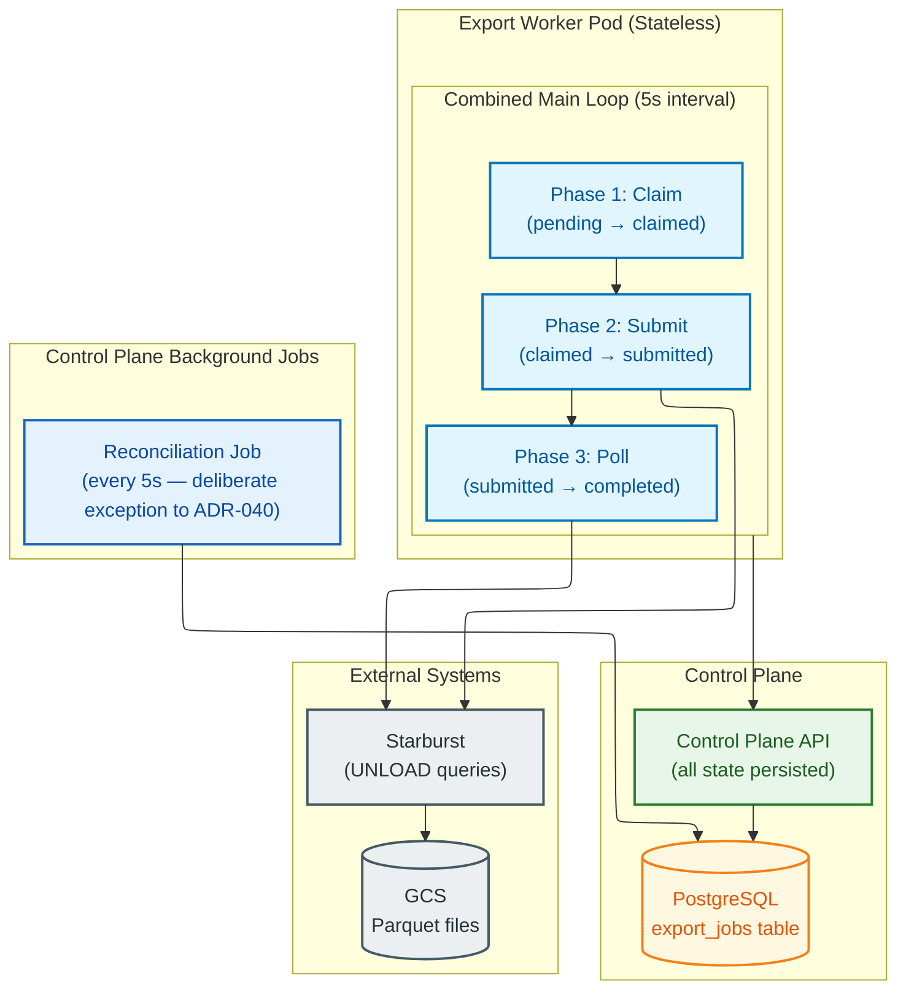
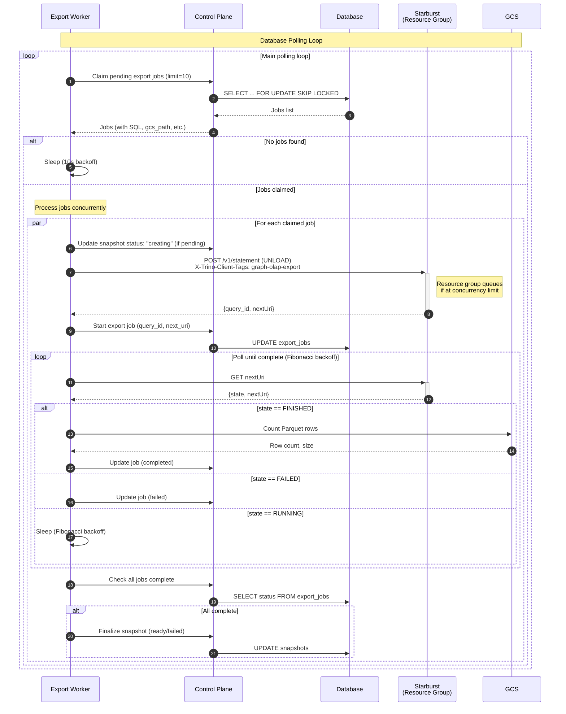

# Export Worker Design

> **Note:** Explicit snapshot APIs have been disabled. The Export Worker now processes
> snapshot creation requests that are triggered internally when instances are created
> directly from mappings. Users do not interact with snapshots directly.

## Overview

The Export Worker is a Kubernetes-based service for processing snapshot creation requests. It handles the complete export lifecycle:

1. Poll database for pending export jobs
2. Execute the export (two runtimes — see below)
3. Count rows from exported Parquet files
4. Update snapshot status in Control Plane

This architecture runs entirely within GKE, enabling unified monitoring, testing, and deployment. Query throttling is handled by Starburst resource groups rather than client-side semaphores.

### Runtime default: `direct_export` (PyArrow, ADR-071)

The worker runs in **direct-export mode by default** (`direct_export=True`, env `DIRECT_EXPORT`, defined in `export_worker/config.py`). In this mode:

- The worker issues the Starburst SQL query **synchronously** via the Starburst REST API, streams result batches, and writes them as Parquet to GCS using PyArrow client-side (see ADR-071).
- There is no separate submit → poll → finalize cycle for the export itself; `execute_and_export_async()` returns `(row_count, size_bytes)` when done, and the worker marks the job `completed` in one step.
- The Fibonacci-backoff poll loop documented below is used only for the legacy `system.unload` path (`direct_export=False`) and as a safety net for any pre-existing `submitted` jobs. It is **not** the default code path for new jobs.

The legacy `system.unload` (server-side UNLOAD) path is still supported as a fallback — triggered automatically if Starburst reports `function_not_found` / `not registered` on `system.unload`. Everything below about submit + poll + reconciliation applies to that fallback path.

### `starburst_role` — hard fail

Every job carries a per-job `starburst_role` (ADR-102, use-case-ID / `X-Use-Case-Id`). The worker **fails the job immediately** if `starburst_role` is missing; it does not exit the process, but it does mark the job `failed` with the error `"Missing use case ID (X-Use-Case-Id header required)"`. There is no implicit worker-wide default role — roles are passed explicitly per Starburst call so that concurrent `asyncio.gather()` executions remain thread-safe and audit-correct (see `worker.py` `_submit_job` around the `if not starburst_role:` branch).

> Deployment implication: if the control plane issues jobs without a `starburst_role`, every such job fails fast. This is by design for HSBC auditability — do **not** add a fallback default role to the worker.

### Starburst cold-start retry

Starburst Galaxy resource groups may be cold when the first job of a session arrives, causing the initial `execute_and_export_async()` call to exceed `request_timeout`. The direct-export path catches any exception whose type or message contains `"Timeout"` / `"timeout"` and retries up to **2 times** with a fixed **5-second sleep** between attempts (see `worker.py` `_submit_job_direct_export` exception handler, `max_retries = 2`, `await asyncio.sleep(5)`). All other exceptions fail the job immediately — no retry. After all retries are exhausted the job is marked `failed` with `"Direct export failed after 2 retries: <ErrorType>"`.

This cold-start retry is **per-job**, not per-worker — it does not affect KEDA scaling or reconciliation semantics.

## Prerequisites

- [requirements.md](--/foundation/requirements.md) - Snapshot creation flow, data model
- [architectural.guardrails.md](--/foundation/architectural.guardrails.md) - Stateless worker pattern, async export pattern, retry configuration
- [system.architecture.design.md](--/system-design/system.architecture.design.md) - Data flow diagrams, error recovery
- [data.model.spec.md](--/system-design/data.model.spec.md) - `export_jobs` table schema
- [data-pipeline.reference.md](--/reference/data-pipeline.reference.md) - Starburst UNLOAD syntax, Parquet requirements, **Starburst REST API protocol**
- [api.internal.spec.md](--/system-design/api/api.internal.spec.md) - Worker to Control Plane communication
- ADR-025 - Architecture simplification (database polling + Starburst resource groups)
- ADR-070 - Starburst Galaxy as production platform
- ADR-071 - PyArrow fallback for client-side export
- ADR-072 - Removal of local Trino emulation stack

## Related Components

- [control-plane.design.md](-/control-plane.design.md) - Creates export_jobs records, receives status updates
- [control-plane.design.md#mapping-generator-subsystem](-/control-plane.design.md#mapping-generator-subsystem) - Validates mappings before snapshot creation

## Constraints

From [architectural.guardrails.md](--/foundation/architectural.guardrails.md):

- Workers are stateless and can be scaled horizontally
- All status updates go through Control Plane API (no direct database access)
- Parquet is the only interchange format
- Parquet column order must match schema definition order
- Export polling uses Fibonacci backoff (2s, 3s, 5s, 8s, ... 90s cap)
- Instance creation blocked until snapshot status = `ready`

From ADR-025:

- Kubernetes Deployment with KEDA for event-driven scaling
- Scale to zero when no pending jobs in database
- Query throttling delegated to Starburst resource groups (no client-side semaphore)
- All queries tagged with `client_tags: ["graph-olap-export"]` for workload isolation

## This Document Series

This is the core Export Worker design. Additional details are in:

- **[export-worker.clients.design.md](-/export-worker.clients.design.md)** - External client implementations (Starburst, GCS, Control Plane), error handling, and observability

---

## Project Structure

```
export-worker/
├── src/
│   └── export_worker/
│       ├── __init__.py
│       ├── worker.py             # Main worker entry point
│       ├── backoff.py            # Fibonacci backoff calculation
│       ├── clients/
│       │   ├── __init__.py
│       │   ├── starburst.py      # Starburst REST API client (async)
│       │   ├── gcs.py            # GCS operations (row counting, size calculation)
│       │   └── control_plane.py  # Control Plane internal API client
│       ├── models.py             # Request/job data classes
│       ├── config.py             # Configuration from environment
│       └── exceptions.py         # Custom exceptions
├── tests/
│   ├── unit/
│   │   ├── test_worker.py
│   │   ├── test_starburst_client.py
│   │   └── test_backoff.py
│   └── integration/
├── deploy/
│   ├── deployment.yaml           # K8s Deployment
│   ├── service.yaml              # K8s Service
│   ├── configmap.yaml            # Configuration
│   ├── keda-scaledobject.yaml    # KEDA scaling config
│   └── kustomization.yaml        # Kustomize overlay
├── Dockerfile
├── pyproject.toml
└── README.md
```

---

## Architecture Overview

### Stateless Worker Design

The Export Worker is **fully stateless** - all job state is persisted in the database via Control Plane API. This enables:

- **Crash recovery**: If a worker dies, another worker (or reconciliation) resumes the job
- **Horizontal scaling**: Multiple workers can run without coordination
- **No lost work**: Polling state (`next_poll_at`, `poll_count`) survives restarts


<details>
<summary>Mermaid Source</summary>



</details>

### Component Responsibilities

| Component | Responsibility |
|-----------|----------------|
| **Claim Phase** | `POST /export-jobs/claim` → get pending jobs atomically |
| **Submit Phase** | Submit UNLOAD to Starburst, update job to `submitted` |
| **Poll Phase** | `GET /export-jobs/pollable` → check Starburst status, update job |
| **Starburst Client** | Build UNLOAD queries with client_tags, submit via REST API, poll status |
| **GCS Client** | Count Parquet rows, calculate size |
| **Control Plane Client** | Claim jobs, update job status, finalize snapshot |
| **Reconciliation Job** | Crash recovery: reset stale jobs, finalize orphaned snapshots |

### Adaptive Fibonacci Backoff

Polling frequency adapts to export duration:

| Poll # | Delay | Cumulative | Typical Export |
|--------|-------|------------|----------------|
| 1 | 2s | 2s | Instant queries |
| 2 | 3s | 5s | Quick queries |
| 3 | 5s | 10s | Small tables |
| 4 | 8s | 18s | |
| 5 | 13s | 31s | Medium tables |
| 6 | 21s | 52s | |
| 7 | 34s | 1m 26s | Large tables |
| 8 | 55s | 2m 21s | |
| 9 | 89s | 3m 50s | Very large |
| 10+ | 90s | +1.5m each | Multi-hour exports |

---

## Starburst Integration Architecture

### Production Platform: Starburst Galaxy

The Export Worker connects to **Starburst Galaxy** (managed Trino SaaS) in production environments. See ADR-070 for rationale.

| Environment | Platform | Data Source |
|-------------|----------|-------------|
| **HSBC (`graph-olap-platform`)** | Starburst Galaxy | Starburst catalogues as configured on the cluster |
| **E2E Testing** | Same Starburst as the target cluster | Same catalogues as the target cluster |

For E2E execution, see [e2e-tests.design.md](-/e2e-tests.design.md).

### Shared Infrastructure Context

**Critical constraint:** Starburst is a **shared multi-tenant infrastructure** serving the wider organization, NOT dedicated to Graph OLAP exports.

**Implications:**
- **Internal job queue**: Submitted queries wait in Starburst's resource group queue before execution
- **No push notifications**: Starburst does not provide webhooks or callbacks for query completion
- **Polling is mandatory**: The ONLY way to detect completion is periodic polling via REST API
- **Unpredictable duration**: Query execution time depends on:
  - Queue wait time (other teams' workloads)
  - Data volume being exported
  - GCS write throughput
  - Typical range: seconds to hours

**Why async architecture is required:**
- Cannot block waiting for query completion (hours-long duration)
- Cannot assume instant execution (queue may be backed up)
- Must poll indefinitely until Starburst returns FINISHED or FAILED

### Non-Blocking Worker Concurrency

**Key insight:** One worker can handle 50+ concurrent export jobs without blocking threads.

**How it works:**
```python
# Main loop does NOT block on individual jobs
while not shutdown:
    # Phase 1: Claim up to 10 NEW jobs (non-blocking)
    claimed_jobs = claim_export_jobs(worker_id, limit=10)

    # Phase 2: Submit all claimed jobs to Starburst (async, non-blocking)
    for job in claimed_jobs:
        query_id = starburst.submit_unload_async(job.sql)
        update_job(status=SUBMITTED, next_poll_at=now+2s)

    # Phase 3: Poll ALL jobs where next_poll_at <= now (non-blocking)
    pollable_jobs = get_pollable_export_jobs(limit=50)
    for job in pollable_jobs:
        result = starburst.poll_query_async(job.next_uri)
        if result.state == FINISHED:
            finalize_job()
        elif result.state == RUNNING:
            update_job(next_poll_at=now+fibonacci_delay(poll_count+1))

    sleep(5 seconds)  # Main loop interval
```

**Architectural properties:**
1. **Database-driven backoff**: Fibonacci delays stored in `next_poll_at` field (not in-memory timers)
2. **Concurrent job handling**: One worker polls 50+ jobs per iteration without blocking
3. **Stateless**: All state in database → crash-safe
4. **Main loop**: Runs every 5 seconds to claim new jobs and poll ready jobs

**Worker iteration timing:**
- Poll 50 Starburst APIs @ ~200ms each = 10 seconds
- Sleep 5 seconds between iterations
- Total cycle: ~15 seconds
- Claim throughput: 10 jobs/cycle = ~40 jobs/minute per worker

### Race Condition Safety

**User concern:** Does reconciliation job interfere with active worker polling?

**Answer: NO - the architecture is race-condition safe.**

**Job lifecycle states:**
1. `PENDING` → worker claims → `CLAIMED` (with `claimed_at` timestamp)
2. `CLAIMED` → worker submits to Starburst → **`SUBMITTED`** (status changes immediately)
3. `SUBMITTED` → worker polls every 90s → stays `SUBMITTED`
4. `SUBMITTED` → Starburst finishes → `COMPLETED`

**Reconciliation job (runs every 5 seconds — deliberate exception to ADR-040) ONLY resets:**
- Jobs with `status = 'CLAIMED'` (not SUBMITTED)
- Where `claimed_at > 10 minutes ago`

**Once a job is SUBMITTED, reconciliation never touches it.**

**Example trace proving safety:**
```
T=0:      Worker-A claims job → status=CLAIMED, claimed_at=T=0
T=0.5s:   Worker-A submits to Starburst → status=SUBMITTED
T=5m:     Reconciliation runs → sees status=SUBMITTED → IGNORES ✅
T=10m:    Reconciliation runs → sees status=SUBMITTED → IGNORES ✅
T=3h:     Starburst completes 3-hour query
T=3h+90s: Worker-B polls, detects completion, finalizes
```

**What reconciliation DOES handle:**
- Worker crashes AFTER claiming but BEFORE submitting to Starburst
- Jobs stuck in `CLAIMED` state (never submitted)
- The 10-minute threshold only resets these stuck claims

**No race condition exists between worker polling and reconciliation.**

### Scalability Model

**Load calculation for multi-hour queries:**

Assume:
- 500 concurrent Starburst queries running (mixed: some finishing in seconds, some running for hours)
- Each worker polls up to 50 jobs per iteration (poll_limit=50)
- Main loop: 5 seconds + 10 seconds polling = 15 seconds per iteration

**Workers needed:** 500 jobs ÷ 50 jobs/worker = **10 workers**

**NOT 500 workers** because:
- Workers don't block waiting for Starburst
- Fibonacci backoff stored in database (not in-memory)
- One worker polls many jobs concurrently each iteration

**KEDA scaling behavior:**
```yaml
triggers:
  - type: postgresql
    query: "SELECT COUNT(*) FROM export_jobs WHERE status = 'pending'"
    targetQueryValue: "10"  # Scale up when 10+ pending jobs per replica
```

**Scaling example:**
- 50 pending jobs → KEDA scales to 5 workers (50 ÷ 10)
- Each worker claims 10 jobs per iteration → all claimed in ~15 seconds
- Workers continue polling submitted jobs until completion
- When queue empties → KEDA scales to 0

**This architecture is optimal for K8s with shared Starburst infrastructure.**

### Stale Claim Threshold Analysis

**Current threshold:** 10 minutes (`claimed_at < NOW() - INTERVAL '10 minutes'`)

**Rationale:**
- Starburst submission API typically completes in < 1 second
- 10 minutes is generous buffer for network issues/retries
- Prevents jobs from being stuck in CLAIMED state indefinitely

**Potential edge case:**
```
T=0:      Worker claims job → status=CLAIMED
T=0-10m:  Worker tries to submit to Starburst
          Starburst API is slow/timing out/retrying
          Status still CLAIMED (submission hasn't succeeded yet)
T=10m:    Reconciliation resets claim → status=PENDING
T=10m:    Another worker claims the same job
          RISK: Duplicate submission if first worker eventually succeeds
```

**Is this a real concern?**
- Depends on Starburst API reliability and latency
- 10-minute threshold is generous for submission (usually < 1 second)
- If Starburst queue is severely backed up, submission could timeout and retry

**Mitigation:**
- Monitor `stale_export_claims_reset_total` metric in Prometheus
- If this fires frequently → investigate Starburst API latency
- If rare (expected) → 10-minute threshold is appropriate

**No changes needed** - current threshold is reasonable for production use.

---

## Export Worker

### Entry Point

```python
# src/export_worker/worker.py
"""Kubernetes-based Export Worker (Stateless).

All job state is persisted in database - worker can crash and restart at any point.

Main loop has three phases:
1. Claim: POST /export-jobs/claim → get pending jobs atomically
2. Submit: Submit UNLOAD to Starburst, update job to 'submitted' with next_poll_at
3. Poll: GET /export-jobs/pollable → check Starburst, update job or complete

Query throttling is handled by Starburst resource groups, not client-side semaphores.
Crash recovery is handled by Control Plane reconciliation job.
"""

from __future__ import annotations

import asyncio
import os
import signal
from datetime import UTC, datetime, timedelta

import structlog

from export_worker.backoff import get_poll_delay
from export_worker.clients.control_plane import ControlPlaneClient
from export_worker.clients.gcs import GCSClient
from export_worker.clients.starburst import StarburstClient
from export_worker.config import get_settings
from export_worker.exceptions import StarburstError
from export_worker.models import ExportJob, ExportJobStatus

logger = structlog.get_logger()

# Configuration
LOOP_INTERVAL_SECONDS = 5  # How often to run main loop
EMPTY_POLL_BACKOFF = 10    # Backoff when no work found


class ExportWorker:
    """Stateless export worker - all state in database.

    Key properties:
    - No in-memory job state (crash-safe)
    - Polling state (next_poll_at, poll_count) persisted in database
    - Multiple workers can run without coordination
    - Starburst resource groups handle query throttling
    """

    def __init__(self, settings: Settings) -> None:
        """Initialize export worker.

        Clients are constructed internally from settings (see
        ``worker.py`` lines 82-99). Callers pass the aggregated
        ``Settings`` object rather than pre-built clients.
        """
        self.settings = settings
        self._shutdown_event = asyncio.Event()
        self._worker_id = os.environ.get("HOSTNAME", f"worker-{os.getpid()}")
        self._logger = logger.bind(component="export_worker", worker_id=self._worker_id)

        # Clients constructed from settings
        self._starburst = StarburstClient.from_config(
            settings.starburst,
            gcp_project=settings.gcp_project,
        )
        self._control_plane = ControlPlaneClient.from_config(settings.control_plane)
        self._gcs = GCSClient.from_config(settings.gcs)

    async def run(self) -> None:
        """Main loop: claim, submit, and poll jobs.

        All state is in database - we can crash at any point and recover.
        """
        self._logger.info("Export worker started (stateless)")

        while not self._shutdown_event.is_set():
            try:
                work_done = False

                # Phase 1: Claim pending jobs
                claimed = await self._claim_and_submit_jobs()
                if claimed > 0:
                    work_done = True

                # Phase 2: Poll submitted jobs that are ready
                polled = await self._poll_submitted_jobs()
                if polled > 0:
                    work_done = True

                # Backoff if no work
                if not work_done:
                    await asyncio.sleep(EMPTY_POLL_BACKOFF)
                else:
                    await asyncio.sleep(LOOP_INTERVAL_SECONDS)

            except Exception as e:
                self._logger.exception("Error in main loop", error=str(e))
                await asyncio.sleep(LOOP_INTERVAL_SECONDS)

        self._logger.info("Export worker stopped")

    async def _claim_and_submit_jobs(self) -> int:
        """Claim pending jobs and submit to Starburst.

        Returns:
            Number of jobs claimed and submitted.
        """
        # Claim jobs atomically via Control Plane.
        # NOTE: ControlPlaneClient methods are SYNCHRONOUS (no await) — see
        # ``control_plane.py:610`` ``def claim_export_jobs``.
        jobs = self._control_plane.claim_export_jobs(
            worker_id=self._worker_id,
            limit=self.settings.claim_limit,
        )

        if not jobs:
            return 0

        self._logger.info("Claimed jobs", count=len(jobs))

        # Submit each to Starburst
        for job in jobs:
            await self._submit_job(job)

        return len(jobs)

    async def _submit_job(self, job: ExportJob) -> None:
        """Submit a single job to Starburst.

        After submission, job state is 'submitted' with next_poll_at set.
        If we crash after this, another worker (or reconciliation) will poll it.
        """
        log = self._logger.bind(job_id=job.id, entity_name=job.entity_name)

        try:
            # Update parent snapshot status if needed (sync; no await)
            self._control_plane.update_snapshot_status_if_pending(
                job.snapshot_id,
                "creating",
            )

            # Submit UNLOAD query with client_tags
            log.info("Submitting UNLOAD query")
            result = await self._starburst.submit_unload_async(
                sql=job.sql,
                columns=job.column_names,
                destination=job.gcs_path,
                catalog=job.starburst_catalog,
                client_tags=["graph-olap-export"],
                source="graph-olap-export-worker",
            )

            # Calculate first poll time (Fibonacci: 2s)
            now = datetime.now(UTC)
            next_poll_at = now + timedelta(seconds=get_poll_delay(1))

            # Persist submission state - job is now 'submitted' (sync; no await)
            self._control_plane.update_export_job(
                job.id,
                status="submitted",
                starburst_query_id=result.query_id,
                next_uri=result.next_uri,
                next_poll_at=next_poll_at.isoformat(),
                poll_count=1,
                submitted_at=now.isoformat(),
            )
            log.info("Job submitted to Starburst", query_id=result.query_id)

        except StarburstError as e:
            log.error("Starburst submission failed", error=str(e))
            self._control_plane.update_export_job(
                job.id,
                status="failed",
                error_message=str(e),
                completed_at=datetime.now(UTC).isoformat(),
            )

        except Exception as e:
            log.exception("Unexpected error during submission", error=str(e))
            self._control_plane.update_export_job(
                job.id,
                status="failed",
                error_message=str(e),
                completed_at=datetime.now(UTC).isoformat(),
            )

    async def _poll_submitted_jobs(self) -> int:
        """Poll Starburst for jobs that are ready.

        Returns:
            Number of jobs polled.
        """
        # Get jobs where next_poll_at <= now (sync; no await)
        jobs = self._control_plane.get_pollable_export_jobs(
            limit=self.settings.poll_limit,
        )

        if not jobs:
            return 0

        self._logger.debug("Polling jobs", count=len(jobs))

        for job in jobs:
            await self._poll_job(job)

        return len(jobs)

    async def _poll_job(self, job: ExportJob) -> None:
        """Poll Starburst for a single job's status.

        State is persisted after each poll - crash-safe.
        """
        log = self._logger.bind(job_id=job.id, entity_name=job.entity_name)

        try:
            poll_result = await self._starburst.poll_query_async(job.next_uri)

            if poll_result.state == "FINISHED":
                await self._complete_job(job, log)

            elif poll_result.state == "FAILED":
                await self._fail_job(job, poll_result.error_message or "Query failed", log)

            else:
                # Still running - update next_poll_at with Fibonacci backoff
                now = datetime.now(UTC)
                next_poll_count = job.poll_count + 1
                next_poll_at = now + timedelta(seconds=get_poll_delay(next_poll_count))

                self._control_plane.update_export_job(
                    job.id,
                    next_uri=poll_result.next_uri,
                    next_poll_at=next_poll_at.isoformat(),
                    poll_count=next_poll_count,
                )
                log.debug("Job still running", poll_count=next_poll_count)

        except Exception as e:
            log.exception("Error polling job", error=str(e))
            # Don't fail job on transient errors - reconciliation will retry

    async def _complete_job(self, job: ExportJob, log) -> None:
        """Handle successful job completion."""
        now = datetime.now(UTC).isoformat()

        # Count rows from Parquet files
        try:
            row_count, size_bytes = await self._gcs.count_parquet_rows_async(job.gcs_path)
            log.info("Counted Parquet rows", row_count=row_count, size_bytes=size_bytes)
        except Exception as e:
            log.warning("Failed to count rows", error=str(e))
            row_count = 0
            size_bytes = 0

        # Update job as completed (sync; no await)
        self._control_plane.update_export_job(
            job.id,
            status="completed",
            row_count=row_count,
            size_bytes=size_bytes,
            completed_at=now,
        )
        log.info("Job completed", row_count=row_count)

        # Check if snapshot can be finalized
        self._maybe_finalize_snapshot(job.snapshot_id)

    async def _fail_job(self, job: ExportJob, error_message: str, log) -> None:
        """Handle job failure."""
        now = datetime.now(UTC).isoformat()

        self._control_plane.update_export_job(
            job.id,
            status="failed",
            error_message=error_message,
            completed_at=now,
        )
        log.error("Job failed", error=error_message)

        # Check if snapshot can be finalized (as failed)
        self._maybe_finalize_snapshot(job.snapshot_id)

    def _maybe_finalize_snapshot(self, snapshot_id: int) -> None:
        """Finalize snapshot if all jobs are complete.

        Two-level finalization:
        1. Job completion: individual job done
        2. Snapshot completion: ALL jobs for snapshot done
        """
        # ControlPlaneClient is sync per ADR-104 / control_plane.py:610
        result = self._control_plane.get_snapshot_jobs_result(snapshot_id)

        if not result.all_complete:
            return  # Jobs still pending/running

        if result.any_failed:
            self._logger.error("Snapshot failed", snapshot_id=snapshot_id)
            self._control_plane.finalize_snapshot(
                snapshot_id,
                success=False,
                error_message=result.first_error or "Export failed",
            )
        else:
            self._logger.info(
                "Snapshot ready",
                snapshot_id=snapshot_id,
                node_counts=result.node_counts,
                edge_counts=result.edge_counts,
            )
            self._control_plane.finalize_snapshot(
                snapshot_id,
                success=True,
                node_counts=result.node_counts,
                edge_counts=result.edge_counts,
                size_bytes=result.total_size,
            )

    def shutdown(self) -> None:
        """Signal graceful shutdown."""
        self._logger.info("Shutdown requested")
        self._shutdown_event.set()


async def main() -> None:
    """Main entry point for the export worker.

    Clients are constructed inside ``ExportWorker.__init__`` from the
    aggregated ``Settings`` object — the caller only builds settings.
    """
    settings = get_settings()
    worker = ExportWorker(settings)

    # Setup signal handlers for graceful shutdown
    loop = asyncio.get_event_loop()
    for sig in (signal.SIGTERM, signal.SIGINT):
        loop.add_signal_handler(sig, worker.shutdown)

    # Run the main loop
    await worker.run()


if __name__ == "__main__":
    asyncio.run(main())
```

---

## Fibonacci Backoff

```python
# src/export_worker/backoff.py
"""Adaptive polling backoff using Fibonacci-like sequence."""

# Delays in seconds: aggressive early, then settles to 90s cap
POLL_DELAYS = [2, 3, 5, 8, 13, 21, 34, 55, 89, 90]


def get_poll_delay(attempt: int) -> int:
    """
    Get delay in seconds for next poll attempt.

    Args:
        attempt: Poll attempt number (1-indexed)

    Returns:
        Delay in seconds before next poll

    Examples:
        attempt=1  → 2s   (cumulative: 2s)
        attempt=2  → 3s   (cumulative: 5s)
        attempt=3  → 5s   (cumulative: 10s)
        attempt=4  → 8s   (cumulative: 18s)
        attempt=5  → 13s  (cumulative: 31s)
        attempt=6  → 21s  (cumulative: 52s)
        attempt=7  → 34s  (cumulative: 1m 26s)
        attempt=8  → 55s  (cumulative: 2m 21s)
        attempt=9  → 89s  (cumulative: 3m 50s)
        attempt=10+ → 90s (capped)
    """
    index = min(attempt - 1, len(POLL_DELAYS) - 1)
    return POLL_DELAYS[index]
```

---

## Export Job Model

The worker retrieves export jobs from the Control Plane API. Each job contains all information needed to execute the export, including stateless polling state:

```python
# src/models.py
from dataclasses import dataclass
from datetime import datetime
from enum import Enum


class ExportJobStatus(Enum):
    PENDING = "pending"      # Waiting to be claimed
    CLAIMED = "claimed"      # Claimed by worker, not yet submitted
    SUBMITTED = "submitted"  # Submitted to Starburst, polling
    COMPLETED = "completed"  # Query finished, rows counted
    FAILED = "failed"        # Error occurred


@dataclass
class ExportJob:
    """Export job from Control Plane. Schema in data.model.spec.md."""
    id: int
    snapshot_id: int
    job_type: str  # "node" or "edge"
    entity_name: str  # Label for nodes, type for edges
    status: ExportJobStatus
    gcs_path: str

    # Job definition (denormalized for worker efficiency)
    sql: str
    column_names: list[str]
    starburst_catalog: str

    # Claiming state
    claimed_by: str | None = None
    claimed_at: datetime | None = None

    # Starburst tracking
    starburst_query_id: str | None = None
    next_uri: str | None = None

    # Stateless polling state (persisted, not in-memory)
    next_poll_at: datetime | None = None
    poll_count: int = 0

    # Results (set on completion)
    row_count: int | None = None
    size_bytes: int | None = None
    error_message: str | None = None
```

**Key design decisions:**
- `sql`, `column_names`, `starburst_catalog` are denormalized so workers don't need to fetch mapping separately
- `claimed_by`/`claimed_at` enable lease-based ownership with timeout
- `next_poll_at`/`poll_count` persist Fibonacci backoff state (worker is stateless)

---

## Sequence Diagram

### Export Flow


<details>
<summary>Mermaid Source</summary>



</details>

## KEDA (Kubernetes Event-Driven Autoscaling)

KEDA extends Kubernetes' native Horizontal Pod Autoscaler (HPA) with two key capabilities:

1. **Scale to zero** - HPA can only scale down to 1 replica minimum. KEDA can scale to 0 when there's no work.
2. **Scale on external metrics** - HPA only scales on CPU/memory. KEDA can scale based on database queries, message queues, etc.

### How KEDA Works

```
┌─────────────────────────────────────────────────────────────────────────────┐
│  KEDA Metrics Adapter (keda-system namespace)                               │
│                                                                              │
│  • Runs as a separate deployment (not part of Export Worker)                │
│  • Has its own ServiceAccount with read-only database access                │
│  • Periodically runs: SELECT COUNT(*) FROM export_jobs WHERE status='pending│
│  • Scales Export Worker deployment based on query result                    │
└─────────────────────────────────────────────────────────────────────────────┘
                              │
                              │ Read-only query
                              ▼
┌─────────────────────────────────────────────────────────────────────────────┐
│  Cloud SQL (read replica or read-only user)                                  │
└─────────────────────────────────────────────────────────────────────────────┘

┌─────────────────────────────────────────────────────────────────────────────┐
│  Export Worker                                                               │
│                                                                              │
│  • Has NO direct database credentials                                       │
│  • All DB operations go through Control Plane API                           │
│  • Doesn't know or care about KEDA                                          │
└─────────────────────────────────────────────────────────────────────────────┘
```

**Separation of concerns:**
- **KEDA**: "How many workers should exist?" (scaling decision based on pending job count)
- **Export Worker**: "What work should I do?" (claim jobs via Control Plane API)
- **Control Plane**: "Who owns what job?" (state management with atomic claiming)

---

## Crash Recovery

The stateless architecture enables automatic crash recovery:

### Crash Scenarios and Recovery

| Crash Point | State After Crash | Recovery |
|-------------|-------------------|----------|
| After claim, before submit | `status='claimed'`, no `query_id` | Lease expires → reconciliation resets to `pending` |
| After submit, before first poll | `status='submitted'`, has `query_id` | Another worker polls via `next_poll_at` |
| Mid-polling | `status='submitted'`, has `next_uri` | Another worker continues polling |
| After Starburst finishes, before job update | `status='submitted'`, Starburst done | Reconciliation checks Starburst, completes job |
| After job complete, before snapshot finalize | `job='completed'`, `snapshot='creating'` | Reconciliation detects and finalizes |

### Reconciliation Job (Control Plane Background)

The Control Plane runs a reconciliation job every 5 seconds to handle orphaned work (deliberate exception to ADR-040):

```python
# control_plane/services/reconciliation.py
async def reconcile_export_jobs():
    """Recover from worker crashes and finalize orphaned snapshots."""

    # 1. Reset stale claimed jobs (lease expired after 10 minutes)
    await db.execute("""
        UPDATE export_jobs
        SET status = 'pending',
            claimed_by = NULL,
            claimed_at = NULL
        WHERE status = 'claimed'
          AND claimed_at < NOW() - INTERVAL '10 minutes'
    """)

    # 2. Check orphaned submitted jobs against Starburst
    stale_submitted = await db.fetch("""
        SELECT * FROM export_jobs
        WHERE status = 'submitted'
          AND updated_at < NOW() - INTERVAL '30 minutes'
    """)

    for job in stale_submitted:
        # Query Starburst directly by query_id (doesn't need next_uri)
        status = await starburst.get_query_status(job.starburst_query_id)

        if status == 'FINISHED':
            await complete_job(job)
        elif status == 'FAILED':
            await fail_job(job, status.error_message)
        # else still running - Starburst is slow, will complete eventually

    # 2b. Fail jobs that exceed export.max_duration_seconds (default: 1 hour)
    max_duration = await config_repo.get_int("export.max_duration_seconds", default=3600)
    timed_out = await db.fetch("""
        SELECT * FROM export_jobs
        WHERE status = 'submitted'
          AND submitted_at < NOW() - INTERVAL ':max_duration seconds'
    """, {"max_duration": max_duration})

    for job in timed_out:
        await fail_job(
            job,
            f"Export job exceeded maximum duration ({max_duration}s)"
        )

    # 3. Finalize snapshots where all jobs complete but snapshot not ready
    await db.execute("""
        UPDATE snapshots s
        SET status = CASE
            WHEN EXISTS (SELECT 1 FROM export_jobs WHERE snapshot_id = s.id AND status = 'failed')
            THEN 'failed'
            ELSE 'ready'
        END,
        updated_at = NOW()
        WHERE s.status = 'creating'
          AND NOT EXISTS (
              SELECT 1 FROM export_jobs
              WHERE snapshot_id = s.id
                AND status NOT IN ('completed', 'failed')
          )
    """)
```

### Key Recovery Properties

- **No lost work**: If worker crashes, another worker (or reconciliation) picks up the job
- **No duplicate work**: Atomic claiming (`FOR UPDATE SKIP LOCKED`) prevents race conditions
- **Eventual completion**: Reconciliation ensures all snapshots eventually reach `ready` or `failed`
- **Starburst query survives**: Even if we lose `next_uri`, we can query by `starburst_query_id`

---

## Configuration

### Environment Variables

| Variable | Required | Default | Description |
|----------|----------|---------|-------------|
| `GCP_PROJECT` | Yes | - | GCP project ID |
| `STARBURST_URL` | Yes | - | Starburst REST API URL |
| `STARBURST_USER` | Yes | - | Starburst username |
| `STARBURST_PASSWORD` | Yes | - | Starburst password |
| `STARBURST_CATALOG` | No | `bigquery` | Default Starburst catalog (BigQuery for Galaxy) |
| `STARBURST_ROLE` | No | - | Starburst role for `SET ROLE` (usually per-job via ADR-102; no worker-wide default) |
| `STARBURST_SSL_VERIFY` | No | `true` | Verify SSL certificates on Starburst requests |
| `STARBURST_CLIENT_TAGS` | No | `graph-olap-export` | Client tags for resource group routing |
| `STARBURST_SOURCE` | No | `graph-olap-export-worker` | Source identifier for Starburst |
| `CONTROL_PLANE_URL` | Yes | - | Control Plane internal URL |
| `POLL_INTERVAL_SECONDS` | No | `5` | Main loop interval when work was found |
| `EMPTY_POLL_BACKOFF_SECONDS` | No | `10` | Backoff seconds when no jobs found |
| `CLAIM_LIMIT` | No | `10` | Max jobs to claim per cycle |
| `POLL_LIMIT` | No | `10` | Max jobs to poll per cycle |
| `DIRECT_EXPORT` | No | `true` | Use PyArrow direct export (ADR-071). When `false`, fall back to legacy `system.unload`. |
| `LOG_LEVEL` | No | `INFO` | Logging level |

**Note:** Maximum export job duration is configured via `global_config.export.max_duration_seconds` in the database (default: 3600 seconds). See [data.model.spec.md](--/system-design/data.model.spec.md#global_config) for details.

**ADR-122 split HTTP timeouts:** Starburst HTTP requests use two different timeout profiles, hard-coded as module-level constants in `packages/export-worker/src/export_worker/clients/starburst.py:28-30`:

- `SUBMIT_TIMEOUT = httpx.Timeout(connect=60, read=300, write=60, pool=60)` — longer `read` tolerates Starburst Galaxy cold-start (auto-suspend wake takes ~30-60s).
- `POLL_TIMEOUT = httpx.Timeout(connect=10, read=60, write=10, pool=10)` — shorter timeout for pagination/poll calls where data should flow quickly once the query is running.

These constants OVERRIDE the legacy `STARBURST_REQUEST_TIMEOUT_SECONDS` / `request_timeout_seconds` config field inside the submit/poll methods that matter (the field is retained for backwards compatibility but is not the effective timeout).

### Secrets Management

Sensitive configuration stored in K8s Secrets:

```yaml
apiVersion: v1
kind: Secret
metadata:
  name: starburst-credentials
type: Opaque
stringData:
  url: "https://starburst.example.com"
  user: "export-worker"
  password: "<password>"
```

---

## Deployment

### Kubernetes Deployment

```yaml
# deploy/deployment.yaml
apiVersion: apps/v1
kind: Deployment
metadata:
  name: export-worker
  labels:
    app: export-worker
spec:
  replicas: 1  # KEDA manages scaling
  selector:
    matchLabels:
      app: export-worker
  template:
    metadata:
      labels:
        app: export-worker
    spec:
      serviceAccountName: export-worker
      containers:
      - name: worker
        image: graph-olap/export-worker:latest
        resources:
          requests:
            memory: "256Mi"
            cpu: "100m"
          limits:
            memory: "512Mi"
            cpu: "500m"
        env:
        - name: GCP_PROJECT
          valueFrom:
            configMapKeyRef:
              name: export-worker-config
              key: gcp-project
        - name: CONTROL_PLANE_URL
          value: "http://control-plane:8080"
        - name: STARBURST_CLIENT_TAGS
          value: "graph-olap-export"
        - name: STARBURST_SOURCE
          value: "graph-olap-export-worker"
        - name: STARBURST_URL
          valueFrom:
            secretKeyRef:
              name: starburst-credentials
              key: url
        - name: STARBURST_USER
          valueFrom:
            secretKeyRef:
              name: starburst-credentials
              key: user
        - name: STARBURST_PASSWORD
          valueFrom:
            secretKeyRef:
              name: starburst-credentials
              key: password
        livenessProbe:
          httpGet:
            path: /health
            port: 8080
          initialDelaySeconds: 10
          periodSeconds: 30
        readinessProbe:
          httpGet:
            path: /ready
            port: 8080
          initialDelaySeconds: 5
          periodSeconds: 10
      terminationGracePeriodSeconds: 300  # Allow in-flight jobs to complete
```

### KEDA ScaledObject

```yaml
# deploy/keda-scaledobject.yaml
apiVersion: keda.sh/v1alpha1
kind: ScaledObject
metadata:
  name: export-worker-scaler
spec:
  scaleTargetRef:
    name: export-worker
  minReplicaCount: 0  # Scale to zero when idle
  maxReplicaCount: 5  # Limit workers (Starburst resource group handles query throttling)
  cooldownPeriod: 300  # 5 minutes before scale-down
  triggers:
  - type: postgresql
    metadata:
      connectionFromEnv: DATABASE_URL
      query: "SELECT COUNT(*) FROM export_jobs WHERE status = 'pending'"
      targetQueryValue: "10"  # Scale up when 10+ pending jobs per replica
    authenticationRef:
      name: export-worker-db-auth
```

### Database Connection

The Export Worker polls the Control Plane API (not direct database). KEDA uses a separate PostgreSQL trigger for scaling decisions:

```yaml
# deploy/keda-trigger-auth.yaml
apiVersion: keda.sh/v1alpha1
kind: TriggerAuthentication
metadata:
  name: export-worker-db-auth
spec:
  secretTargetRef:
  - parameter: connection
    name: control-plane-db
    key: url
```

### IAM Requirements

```yaml
# Service account: export-worker@${PROJECT_ID}.iam.gserviceaccount.com
roles:
  - roles/storage.objectAdmin       # Read GCS for row counting
  - roles/secretmanager.secretAccessor  # Read secrets (if using Secret Manager)
```

## Anti-Patterns

### Architectural

See [architectural.guardrails.md](--/foundation/architectural.guardrails.md#anti-patterns-must-not-do) for the authoritative list. Key sections relevant to Export Worker:

- **Database & Schema** - No direct DB access (all updates via Control Plane API)
- **Data Handling & GCS** - Parquet only, nodes before edges
- **Export Processing** - Use adaptive polling
- **Authentication** - No credentials in logs or responses

### Component-Specific

These constraints are specific to the database-polling architecture:

- DO NOT submit queries without `client_tags` (required for resource group routing)
- DO NOT implement client-side query throttling (Starburst resource groups handle this)
- DO NOT use fixed-interval polling (use Fibonacci backoff for query status)
- DO NOT store query state locally (use `export_jobs` table via Control Plane)
- DO NOT continue polling after Starburst returns FINISHED or FAILED
- DO NOT mark snapshot as `ready` until ALL export_jobs are `completed`
- DO NOT lose `next_uri` between poll iterations (persist via Control Plane)
- DO NOT ignore SIGTERM (implement graceful shutdown)
- DO NOT exceed `terminationGracePeriodSeconds` for in-flight jobs
- DO NOT query database directly (use Control Plane API for job claiming)

---

## Open Questions

See [decision.log.md](--/process/decision.log.md) for open questions and architecture decisions.
