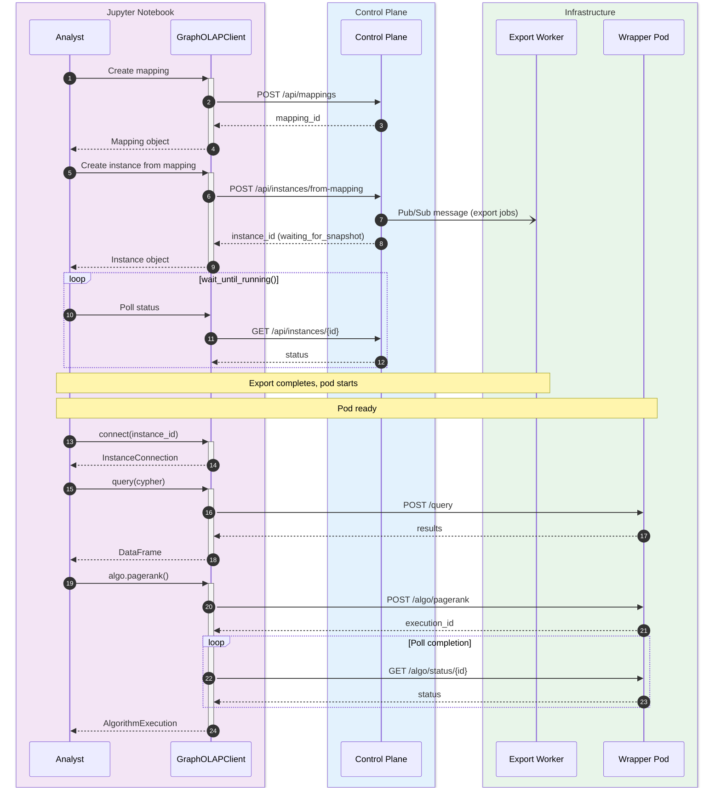

# Jupyter SDK Connection Design

Instance connection, queries, visualization, and exceptions for the Jupyter SDK.

The SDK is the **sole user interface** for the Graph OLAP Platform. This document covers
the data plane operations available once connected to a running instance.

## Prerequisites

- [jupyter-sdk.design.md](-/jupyter-sdk.design.md) - Core SDK design (client, resources)

## Related Components

- [jupyter-sdk.models.spec.md](-/jupyter-sdk.models.spec.md) - Model definitions
- [jupyter-sdk.algorithms.design.md](-/jupyter-sdk.algorithms.design.md) - Algorithm extensions
- [ryugraph-wrapper.design.md](-/ryugraph-wrapper.design.md) - Server-side implementation

---

## Instance Lifecycle Summary

Before connecting to an instance, the SDK provides complete lifecycle management through
`client.instances`:

| Operation | Method | Description |
|-----------|--------|-------------|
| Create | `create_from_mapping_and_wait()` | Create instance from mapping (recommended) |
| List | `list()` | List instances with filters (owner, status, search) |
| Get | `get()` | Get instance details by ID |
| Connect | `connect()` | Get connection for queries and algorithms |
| Terminate | `terminate()` | Stop and delete an instance |
| Update CPU | `update_cpu()` | Scale instance CPU allocation |
| Get Progress | `get_progress()` | Monitor startup progress |

See [jupyter-sdk.design.md](-/jupyter-sdk.design.md) for full InstanceResource documentation.

---

## Instance Connection

### Query and Algorithm Interface

```python
# instance/connection.py
import httpx
from graph_olap.models import QueryResult, AlgorithmExecution, LockStatus, Schema
from graph_olap.instance.algorithms import AlgorithmManager, NetworkXManager

class InstanceConnection:
    """
    Connection to a running graph instance.

    Provides methods for executing Cypher queries and graph algorithms.
    """

    def __init__(self, instance_url: str, api_key: str, instance_id: int):
        self._instance_url = instance_url.rstrip("/")
        self._instance_id = instance_id
        self._client = httpx.Client(
            base_url=self._instance_url,
            headers={
                "Authorization": f"Bearer {api_key}",
                "Content-Type": "application/json",
            },
            timeout=120.0,  # Longer timeout for graph operations
        )

        # Algorithm managers
        self.algo = AlgorithmManager(self._client)
        self.networkx = NetworkXManager(self._client)

    def close(self) -> None:
        """Close the connection."""
        self._client.close()

    def __enter__(self) -> "InstanceConnection":
        return self

    def __exit__(self, *args) -> None:
        self.close()

    def query(
        self,
        cypher: str,
        parameters: dict | None = None,
        timeout_ms: int = 60000,
        coerce_types: bool = True,
    ) -> QueryResult:
        """
        Execute a Cypher query.

        Args:
            cypher: Cypher query string
            parameters: Query parameters (optional)
            timeout_ms: Query timeout in milliseconds
            coerce_types: If True (default), convert DATE/TIMESTAMP/INTERVAL strings
                         to Python datetime types. Set False for raw string values.

        Returns:
            QueryResult with columns, rows, column_types, and metadata

        Examples:
            >>> result = conn.query("MATCH (n:Customer) WHERE n.city = $city RETURN n.name", {"city": "London"})
            >>> for row in result.rows:
            ...     print(row)

            >>> # With type coercion (default) - dates are datetime objects
            >>> result = conn.query("MATCH (n) RETURN n.created_at")
            >>> result.rows[0][0]  # datetime.datetime(2024, 1, 15, 10, 30, 0)

            >>> # Without type coercion - dates remain strings
            >>> result = conn.query("MATCH (n) RETURN n.created_at", coerce_types=False)
            >>> result.rows[0][0]  # "2024-01-15T10:30:00Z"
        """
        response = self._client.post(
            "/query",
            json={
                "cypher": cypher,
                "parameters": parameters or {},
                "timeout_ms": timeout_ms,
            },
        )
        self._handle_response(response)
        return QueryResult.from_dict(response.json()["data"], coerce_types=coerce_types)

    def query_df(
        self,
        cypher: str,
        parameters: dict | None = None,
        timeout_ms: int = 60000,
        use_polars: bool = True,
    ):
        """
        Execute a Cypher query and return results as a DataFrame.

        Args:
            cypher: Cypher query string
            parameters: Query parameters (optional)
            timeout_ms: Query timeout in milliseconds
            use_polars: If True, return polars DataFrame; else pandas

        Returns:
            polars.DataFrame or pandas.DataFrame

        Example:
            >>> df = conn.query_df("MATCH (n)-[r]->(m) RETURN n.id, type(r), m.id")
            >>> df.head()
        """
        result = self.query(cypher, parameters, timeout_ms)

        if use_polars:
            import polars as pl
            return pl.DataFrame(dict(zip(result.columns, zip(*result.rows))))
        else:
            import pandas as pd
            return pd.DataFrame(result.rows, columns=result.columns)

    def query_scalar(
        self,
        cypher: str,
        parameters: dict | None = None,
        timeout_ms: int = 60000,
    ) -> any:
        """
        Execute a Cypher query expecting a single scalar value.

        Convenience method for COUNT(*), SUM(), AVG(), etc.

        Args:
            cypher: Cypher query returning single value
            parameters: Query parameters (optional)
            timeout_ms: Query timeout in milliseconds

        Returns:
            The single scalar value

        Raises:
            ValueError: If result has multiple rows or columns

        Examples:
            >>> count = conn.query_scalar("MATCH (n:Customer) RETURN count(n)")
            >>> avg_age = conn.query_scalar("MATCH (n:Customer) RETURN avg(n.age)")
            >>> exists = conn.query_scalar("MATCH (n {id: $id}) RETURN count(n) > 0", {"id": 123})
        """
        return self.query(cypher, parameters, timeout_ms).scalar()

    def query_one(
        self,
        cypher: str,
        parameters: dict | None = None,
        timeout_ms: int = 60000,
    ) -> dict | None:
        """
        Execute a Cypher query expecting a single row.

        Convenience method for lookups by ID or unique property.
        Returns None if no rows match.

        Args:
            cypher: Cypher query returning single row
            parameters: Query parameters (optional)
            timeout_ms: Query timeout in milliseconds

        Returns:
            Dict of column->value for first row, or None if empty

        Examples:
            >>> user = conn.query_one("MATCH (u:User {id: $id}) RETURN u.*", {"id": 123})
            >>> if user:
            ...     print(user["name"])

            >>> # With property projection
            >>> customer = conn.query_one('''
            ...     MATCH (c:Customer {customer_id: $id})
            ...     RETURN c.name AS name, c.email AS email, c.created_at AS created
            ... ''', {"id": "C001"})
        """
        return self.query(cypher, parameters, timeout_ms).first()

    def get_schema(self) -> Schema:
        """
        Get the graph schema (node and relationship tables with properties).

        Returns:
            Schema object with nodes and relationships
        """
        response = self._client.get("/schema")
        self._handle_response(response)
        return Schema.from_dict(response.json()["data"])

    def get_lock(self) -> LockStatus:
        """
        Check if the instance is locked by an algorithm.

        Returns:
            LockStatus with lock information
        """
        response = self._client.get("/lock")
        self._handle_response(response)
        return LockStatus.from_dict(response.json()["data"])

    def status(self) -> dict:
        """
        Get detailed instance status including resource usage.

        Returns:
            Status dict with memory, disk, uptime, graph_stats, lock
        """
        response = self._client.get("/status")
        self._handle_response(response)
        return response.json()["data"]

    def _handle_response(self, response: httpx.Response) -> None:
        """Handle error responses from the wrapper."""
        if response.is_success:
            return

        try:
            error = response.json().get("error", {})
        except ValueError:
            raise ServerError(f"Invalid response: {response.text}")

        code = error.get("code", "UNKNOWN_ERROR")
        message = error.get("message", "Unknown error")
        details = error.get("details", {})

        if code == "QUERY_TIMEOUT":
            raise QueryTimeoutError(message)
        elif code == "RYUGRAPH_ERROR":
            raise RyugraphError(message, details)
        elif code == "RESOURCE_LOCKED":
            raise ResourceLockedError(message, details)
        elif code == "PERMISSION_DENIED":
            raise PermissionDeniedError(message, details)
        elif code == "ALGORITHM_NOT_FOUND":
            raise AlgorithmNotFoundError(message)
        elif code == "EXECUTION_NOT_FOUND":
            raise ExecutionNotFoundError(message)
        else:
            raise GraphOLAPError(f"{code}: {message}")
```

### Algorithm Managers

```python
# instance/algorithms.py
import time
from graph_olap.models import AlgorithmExecution

class AlgorithmManager:
    """Execute Ryugraph native algorithms."""

    def __init__(self, client: httpx.Client):
        self._client = client

    def pagerank(
        self,
        node_label: str,
        property_name: str,
        damping: float = 0.85,
        max_iterations: int = 100,
        tolerance: float = 1e-6,
        wait: bool = True,
        timeout: int = 300,
    ) -> AlgorithmExecution:
        """
        Run PageRank algorithm.

        Args:
            node_label: Label of nodes to process
            property_name: Property name to store results
            damping: Damping factor (default 0.85)
            max_iterations: Maximum iterations
            tolerance: Convergence tolerance
            wait: If True, wait for completion; else return immediately
            timeout: Wait timeout in seconds (if wait=True)

        Returns:
            AlgorithmExecution with results

        Example:
            >>> exec = conn.algo.pagerank("Customer", "pr_score")
            >>> print(f"Updated {exec.result['nodes_updated']} nodes")
        """
        return self._execute(
            "pagerank",
            {
                "node_label": node_label,
                "property_name": property_name,
                "damping": damping,
                "max_iterations": max_iterations,
                "tolerance": tolerance,
            },
            wait=wait,
            timeout=timeout,
        )

    def connected_components(
        self,
        node_label: str,
        property_name: str,
        wait: bool = True,
        timeout: int = 300,
    ) -> AlgorithmExecution:
        """Run connected components algorithm."""
        return self._execute(
            "connected_components",
            {"node_label": node_label, "property_name": property_name},
            wait=wait,
            timeout=timeout,
        )

    def shortest_path(
        self,
        source_id: str,
        target_id: str,
        weight_property: str | None = None,
    ) -> dict:
        """
        Find shortest path between two nodes.

        Returns path directly (synchronous, no property write).
        """
        params = {"source_id": source_id, "target_id": target_id}
        if weight_property:
            params["weight_property"] = weight_property

        response = self._client.post("/algo/shortest_path", json=params)
        return response.json()["data"]

    def louvain(
        self,
        node_label: str,
        property_name: str,
        resolution: float = 1.0,
        wait: bool = True,
        timeout: int = 300,
    ) -> AlgorithmExecution:
        """Run Louvain community detection."""
        return self._execute(
            "louvain",
            {
                "node_label": node_label,
                "property_name": property_name,
                "resolution": resolution,
            },
            wait=wait,
            timeout=timeout,
        )

    def scc(
        self,
        node_label: str,
        property_name: str,
        wait: bool = True,
        timeout: int = 300,
    ) -> AlgorithmExecution:
        """Run strongly connected components (Tarjan's algorithm)."""
        return self._execute(
            "scc",
            {"node_label": node_label, "property_name": property_name},
            wait=wait,
            timeout=timeout,
        )

    def scc_kosaraju(
        self,
        node_label: str,
        property_name: str,
        wait: bool = True,
        timeout: int = 300,
    ) -> AlgorithmExecution:
        """Run strongly connected components (Kosaraju's algorithm)."""
        return self._execute(
            "scc_kosaraju",
            {"node_label": node_label, "property_name": property_name},
            wait=wait,
            timeout=timeout,
        )

    def kcore(
        self,
        node_label: str,
        property_name: str,
        k: int = 1,
        wait: bool = True,
        timeout: int = 300,
    ) -> AlgorithmExecution:
        """
        Run k-core decomposition.

        Args:
            node_label: Label of nodes to process
            property_name: Property name to store core number
            k: Minimum degree (default: 1)
        """
        return self._execute(
            "kcore",
            {"node_label": node_label, "property_name": property_name, "k": k},
            wait=wait,
            timeout=timeout,
        )

    def label_propagation(
        self,
        node_label: str,
        property_name: str,
        max_iterations: int = 100,
        wait: bool = True,
        timeout: int = 300,
    ) -> AlgorithmExecution:
        """Run label propagation community detection."""
        return self._execute(
            "label_propagation",
            {
                "node_label": node_label,
                "property_name": property_name,
                "max_iterations": max_iterations,
            },
            wait=wait,
            timeout=timeout,
        )

    def triangle_count(
        self,
        node_label: str,
        property_name: str,
        wait: bool = True,
        timeout: int = 300,
    ) -> AlgorithmExecution:
        """Count triangles for each node."""
        return self._execute(
            "triangle_count",
            {"node_label": node_label, "property_name": property_name},
            wait=wait,
            timeout=timeout,
        )

    def _execute(
        self,
        name: str,
        params: dict,
        wait: bool,
        timeout: int,
    ) -> AlgorithmExecution:
        """Execute an algorithm."""
        response = self._client.post(f"/algo/{name}", json=params)

        if response.status_code == 409:
            error = response.json().get("error", {})
            raise ResourceLockedError(
                error.get("message", "Instance is locked"),
                error.get("details", {}),
            )

        data = response.json()["data"]
        execution = AlgorithmExecution.from_dict(data)

        if wait:
            execution = self._wait_for_completion(execution.execution_id, timeout)

        return execution

    def _wait_for_completion(
        self,
        execution_id: str,
        timeout: int,
    ) -> AlgorithmExecution:
        """Poll for algorithm completion."""
        start = time.time()

        while time.time() - start < timeout:
            response = self._client.get(f"/algo/status/{execution_id}")
            data = response.json()["data"]
            execution = AlgorithmExecution.from_dict(data)

            if execution.status == "completed":
                return execution

            if execution.status == "failed":
                raise AlgorithmFailedError(execution.error)

            time.sleep(2)

        raise AlgorithmTimeoutError(f"Algorithm did not complete within {timeout}s")


class NetworkXManager:
    """Execute NetworkX algorithms via the /networkx endpoints."""

    def __init__(self, client: httpx.Client):
        self._client = client
        # Reuse the wait logic from AlgorithmManager
        self._wait_for_completion = AlgorithmManager(client)._wait_for_completion

    def degree_centrality(
        self,
        node_label: str,
        property_name: str,
        wait: bool = True,
        timeout: int = 300,
    ) -> AlgorithmExecution:
        """Run degree centrality."""
        return self._execute(
            "degree_centrality",
            {"node_label": node_label, "property_name": property_name},
            wait=wait,
            timeout=timeout,
        )

    def betweenness_centrality(
        self,
        node_label: str,
        property_name: str,
        normalized: bool = True,
        k: int | None = None,
        wait: bool = True,
        timeout: int = 300,
    ) -> AlgorithmExecution:
        """Run betweenness centrality."""
        params = {
            "node_label": node_label,
            "property_name": property_name,
            "normalized": normalized,
        }
        if k is not None:
            params["k"] = k

        return self._execute("betweenness_centrality", params, wait=wait, timeout=timeout)

    def closeness_centrality(
        self,
        node_label: str,
        property_name: str,
        normalized: bool = True,
        wait: bool = True,
        timeout: int = 300,
    ) -> AlgorithmExecution:
        """
        Run closeness centrality.

        Measures how close a node is to all other reachable nodes.
        """
        return self._execute(
            "closeness_centrality",
            {
                "node_label": node_label,
                "property_name": property_name,
                "normalized": normalized,
            },
            wait=wait,
            timeout=timeout,
        )

    def eigenvector_centrality(
        self,
        node_label: str,
        property_name: str,
        max_iter: int = 100,
        tol: float = 1e-6,
        wait: bool = True,
        timeout: int = 300,
    ) -> AlgorithmExecution:
        """
        Run eigenvector centrality.

        Measures influence based on connections to other high-scoring nodes.
        """
        return self._execute(
            "eigenvector_centrality",
            {
                "node_label": node_label,
                "property_name": property_name,
                "max_iter": max_iter,
                "tol": tol,
            },
            wait=wait,
            timeout=timeout,
        )

    def clustering_coefficient(
        self,
        node_label: str,
        property_name: str,
        wait: bool = True,
        timeout: int = 300,
    ) -> AlgorithmExecution:
        """Run clustering coefficient."""
        return self._execute(
            "clustering_coefficient",
            {"node_label": node_label, "property_name": property_name},
            wait=wait,
            timeout=timeout,
        )

    def _execute(
        self,
        name: str,
        params: dict,
        wait: bool,
        timeout: int,
    ) -> AlgorithmExecution:
        """Execute a NetworkX algorithm."""
        response = self._client.post(f"/networkx/{name}", json=params)

        if response.status_code == 409:
            error = response.json().get("error", {})
            raise ResourceLockedError(
                error.get("message", "Instance is locked"),
                error.get("details", {}),
            )

        data = response.json()["data"]
        execution = AlgorithmExecution.from_dict(data)

        if wait:
            execution = self._wait_for_completion(execution.execution_id, timeout)

        return execution
```

---

## Visualization Helpers

### QueryResult Visualization Methods

The `QueryResult` class provides built-in visualization methods for query results that contain nodes and edges:

```python
# models/common.py - QueryResult visualization methods

class QueryResult:
    # ... other methods ...

    def to_networkx(self) -> "nx.DiGraph":
        """
        Convert to NetworkX graph (when result contains nodes/edges).

        Query results containing node and edge objects (with _id, _label,
        _from, _to, _type fields) are automatically parsed into a graph.

        Returns:
            networkx.DiGraph

        Raises:
            ImportError: If networkx is not installed.

        Example:
            >>> result = conn.query("MATCH (c:Customer)-[p:PURCHASED]->(pr:Product) RETURN c, p, pr")
            >>> G = result.to_networkx()
            >>> print(f"Graph has {G.number_of_nodes()} nodes, {G.number_of_edges()} edges")
        """
        import networkx as nx

        G = nx.DiGraph()

        for row in self:
            for value in row.values():
                if isinstance(value, dict):
                    if "_label" in value:  # Node
                        node_id = value.get("_id")
                        G.add_node(node_id, **value)
                    elif "_from" in value and "_to" in value:  # Edge
                        G.add_edge(value["_from"], value["_to"], **value)

        return G

    def show(self, max_rows: int = 100):
        """
        Auto-detect and display results in best format.

        For graph data (nodes/edges): shows interactive PyVis visualization
        For tabular data: shows interactive itables/DataTable

        Args:
            max_rows: Maximum rows for tabular display

        Example:
            >>> result = conn.query("MATCH (n)-[r]->(m) RETURN n, r, m LIMIT 50")
            >>> result.show()  # Shows interactive graph

            >>> result = conn.query("MATCH (n) RETURN n.name, n.age")
            >>> result.show()  # Shows interactive table
        """
        if self._is_graph_result():
            return self._show_graph(max_rows)
        else:
            return self._show_table(max_rows)

    def _show_graph(self, max_rows: int):
        """Show as interactive graph visualization using PyVis."""
        from pyvis.network import Network

        G = self.to_networkx()
        net = Network(notebook=True, height="500px", width="100%")
        net.from_nx(G)
        return net.show("graph.html")
```

### Standalone Visualization Functions

For more control, standalone functions are also available:

```python
# viz/networkx.py
import networkx as nx
from graph_olap.models import QueryResult

def to_networkx(result: QueryResult, directed: bool = True) -> nx.Graph:
    """
    Convert query results to NetworkX graph.

    Args:
        result: QueryResult containing nodes and edges
        directed: If True, return DiGraph; else Graph

    Returns:
        NetworkX Graph or DiGraph
    """
    G = nx.DiGraph() if directed else nx.Graph()
    # Parse nodes and edges from result rows...
    return G


# viz/pyvis.py
def to_pyvis(result: QueryResult | dict, notebook: bool = True):
    """
    Convert query results to PyVis network for visualization.

    Args:
        result: QueryResult or subgraph dict
        notebook: If True, configure for Jupyter notebook

    Returns:
        pyvis.network.Network object
    """
    from pyvis.network import Network

    G = to_networkx(result)

    net = Network(notebook=notebook, height="600px", width="100%")
    net.from_nx(G)

    return net


# viz/plotly.py
def to_plotly(result: QueryResult | dict, layout: str = "spring"):
    """
    Convert query results to Plotly figure.

    Args:
        result: QueryResult or subgraph dict
        layout: Layout algorithm (spring, circular, random)

    Returns:
        plotly.graph_objects.Figure
    """
    import plotly.graph_objects as go

    G = to_networkx(result)

    if layout == "spring":
        pos = nx.spring_layout(G)
    elif layout == "circular":
        pos = nx.circular_layout(G)
    else:
        pos = nx.random_layout(G)

    # Create edges trace
    edge_x, edge_y = [], []
    for edge in G.edges():
        x0, y0 = pos[edge[0]]
        x1, y1 = pos[edge[1]]
        edge_x.extend([x0, x1, None])
        edge_y.extend([y0, y1, None])

    edge_trace = go.Scatter(
        x=edge_x, y=edge_y,
        line=dict(width=0.5, color="#888"),
        hoverinfo="none",
        mode="lines",
    )

    # Create nodes trace
    node_x = [pos[node][0] for node in G.nodes()]
    node_y = [pos[node][1] for node in G.nodes()]
    node_text = [str(node) for node in G.nodes()]

    node_trace = go.Scatter(
        x=node_x, y=node_y,
        mode="markers",
        hoverinfo="text",
        text=node_text,
        marker=dict(size=10, color="#1f77b4"),
    )

    fig = go.Figure(
        data=[edge_trace, node_trace],
        layout=go.Layout(
            showlegend=False,
            hovermode="closest",
            xaxis=dict(showgrid=False, zeroline=False, showticklabels=False),
            yaxis=dict(showgrid=False, zeroline=False, showticklabels=False),
        ),
    )

    return fig
```

---

## Exception Hierarchy

```python
# exceptions.py

class GraphOLAPError(Exception):
    """Base exception for all Graph OLAP SDK errors."""
    pass


# Authentication
class AuthenticationError(GraphOLAPError):
    """Invalid or missing API key."""
    pass


class PermissionDeniedError(GraphOLAPError):
    """User doesn't have permission for this operation."""
    def __init__(self, message: str, details: dict = None):
        super().__init__(message)
        self.details = details or {}


class ForbiddenError(PermissionDeniedError):
    """Access forbidden (HTTP 403).

    Raised when user lacks required role (e.g., Ops role for config endpoints).
    """
    pass


# Resource errors
class NotFoundError(GraphOLAPError):
    """Resource not found."""
    def __init__(self, message: str, details: dict = None):
        super().__init__(message)
        self.details = details or {}


class ValidationError(GraphOLAPError):
    """Request validation failed."""
    def __init__(self, message: str, details: dict = None):
        super().__init__(message)
        self.details = details or {}


# Conflict errors
class ConflictError(GraphOLAPError):
    """Operation conflicts with current state."""
    def __init__(self, message: str, details: dict = None):
        super().__init__(message)
        self.details = details or {}


class ResourceLockedError(ConflictError):
    """Instance is locked by an algorithm."""
    @property
    def holder_name(self) -> str | None:
        return self.details.get("holder_name")

    @property
    def algorithm(self) -> str | None:
        return self.details.get("algorithm")


class ConcurrencyLimitError(ConflictError):
    """Instance creation limit exceeded."""
    @property
    def limit_type(self) -> str | None:
        return self.details.get("limit_type")

    @property
    def current_count(self) -> int | None:
        return self.details.get("current_count")

    @property
    def max_allowed(self) -> int | None:
        return self.details.get("max_allowed")


class DependencyError(ConflictError):
    """Resource has dependencies that prevent deletion."""
    pass


class InvalidStateError(ConflictError):
    """Operation invalid for current resource state."""
    pass


# Timeout errors
class TimeoutError(GraphOLAPError):
    """Operation timed out."""
    pass


class QueryTimeoutError(TimeoutError):
    """Cypher query exceeded timeout."""
    pass


class AlgorithmTimeoutError(TimeoutError):
    """Algorithm execution exceeded timeout."""
    pass


# Graph operation errors
class RyugraphError(GraphOLAPError):
    """Ryugraph/Cypher error."""
    def __init__(self, message: str, details: dict = None):
        super().__init__(message)
        self.details = details or {}


class FalkorDBError(GraphOLAPError):
    """FalkorDB/Cypher error."""
    def __init__(self, message: str, details: dict = None):
        super().__init__(message)
        self.details = details or {}


class AlgorithmNotFoundError(GraphOLAPError):
    """Unknown algorithm name."""
    pass


class AlgorithmFailedError(GraphOLAPError):
    """Algorithm execution failed."""
    pass


# Resource lifecycle errors
class SnapshotFailedError(GraphOLAPError):
    """Snapshot export failed."""
    pass


class InstanceFailedError(GraphOLAPError):
    """Instance startup failed."""
    pass


# Server errors
class ServerError(GraphOLAPError):
    """Server-side error (5xx)."""
    pass


class ServiceUnavailableError(ServerError):
    """Service temporarily unavailable (HTTP 503)."""
    pass
```

---

## Typical Workflow


<details>
<summary>Mermaid Source</summary>



</details>

## Usage Examples

### Basic Workflow

```python
from graph_olap import GraphOLAPClient, NodeDefinition, EdgeDefinition

# Initialize client
client = GraphOLAPClient(
    api_url="https://graph.example.com",
    api_key="your-api-key",
)

# Create a mapping
mapping = client.mappings.create(
    name="Customer Transactions",
    description="Customer purchase behavior graph",
    node_definitions=[
        NodeDefinition(
            label="Customer",
            sql="SELECT customer_id, name, city FROM analytics.customers",
            primary_key={"name": "customer_id", "type": "STRING"},
            properties=[
                {"name": "name", "type": "STRING"},
                {"name": "city", "type": "STRING"},
            ],
        ),
        NodeDefinition(
            label="Product",
            sql="SELECT product_id, name, category FROM analytics.products",
            primary_key={"name": "product_id", "type": "STRING"},
            properties=[
                {"name": "name", "type": "STRING"},
                {"name": "category", "type": "STRING"},
            ],
        ),
    ],
    edge_definitions=[
        EdgeDefinition(
            type="PURCHASED",
            from_node="Customer",
            to_node="Product",
            sql="SELECT customer_id, product_id, amount FROM analytics.transactions",
            from_key="customer_id",
            to_key="product_id",
            properties=[{"name": "amount", "type": "DOUBLE"}],
        ),
    ],
)

print(f"Created mapping: {mapping.id}")

# Create a snapshot
snapshot = client.snapshots.create(
    mapping_id=mapping.id,
    name="Q4 2024 Data",
)

# Wait for export to complete
snapshot = client.snapshots.wait_until_ready(snapshot.id, timeout=600)
print(f"Snapshot ready: {snapshot.node_counts}")

# Create an instance
instance = client.instances.create(
    snapshot_id=snapshot.id,
    name="Analysis Instance",
)

# Wait for startup
instance = client.instances.wait_until_running(instance.id)
print(f"Instance running: {instance.instance_url}")

# Connect and query
conn = client.instances.connect(instance.id)

# Run a query
result = conn.query("MATCH (c:Customer) WHERE c.city = 'London' RETURN c.name LIMIT 10")
for row in result.rows:
    print(row)

# Get as DataFrame
df = conn.query_df("MATCH (c)-[p:PURCHASED]->(pr) RETURN c.name, pr.name, p.amount")
print(df.head())

# Run PageRank
exec = conn.algo.pagerank("Customer", "pr_score")
print(f"PageRank completed: {exec.result['nodes_updated']} nodes updated")

# Query top customers
top_customers = conn.query_df("""
    MATCH (c:Customer)
    RETURN c.name, c.pr_score
    ORDER BY c.pr_score DESC
    LIMIT 10
""")
print(top_customers)

# Clean up
conn.close()
client.instances.terminate(instance.id)
client.close()
```

---

