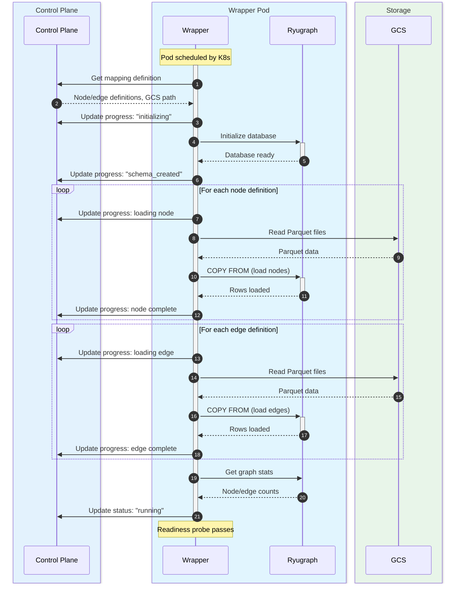
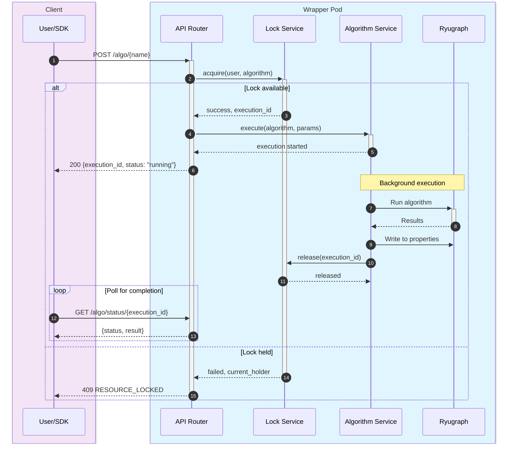
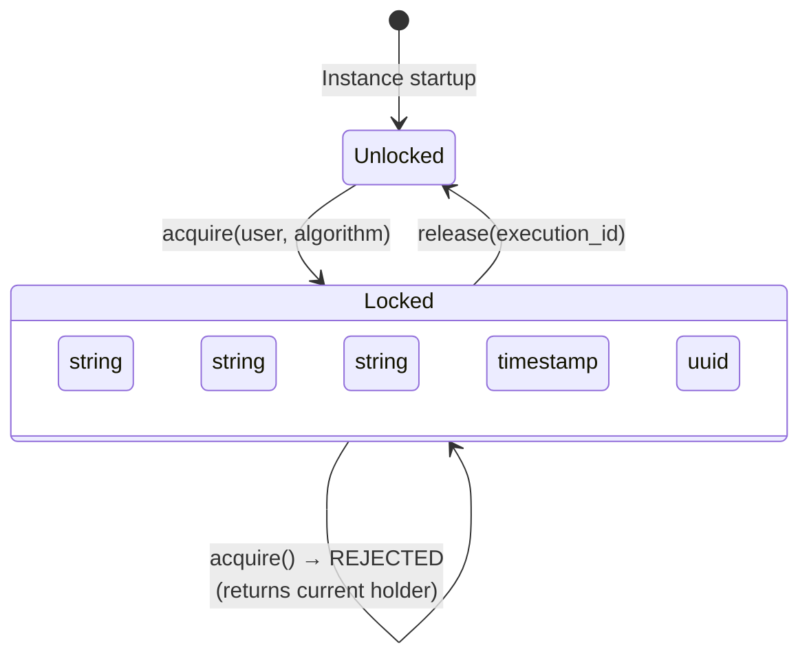

# Ryugraph Wrapper Design

## Overview

The Ryugraph Wrapper is a Python FastAPI service that runs embedded Ryugraph (KuzuDB fork) within each graph instance pod. It provides REST API endpoints for Cypher queries, graph algorithms (both native Ryugraph and NetworkX), and instance management. Each pod hosts a single graph database loaded from snapshot Parquet files.

## Prerequisites

- [requirements.md](--/foundation/requirements.md) - Instance model, algorithm requirements, lock model
- [architectural.guardrails.md](--/foundation/architectural.guardrails.md) - Embedded Ryugraph pattern, implicit locking
- [system.architecture.design.md](--/system-design/system.architecture.design.md) - Pod architecture, startup flow
- [ryugraph-networkx.reference.md](--/reference/ryugraph-networkx.reference.md) - Ryugraph/NetworkX API reference
- [ryugraph-performance.reference.md](--/reference/ryugraph-performance.reference.md) - Threading, buffer pool, I/O characteristics
- [data-pipeline.reference.md](--/reference/data-pipeline.reference.md) - Schema creation, COPY FROM syntax, type mapping
- [api.wrapper.spec.md](--/system-design/api/api.wrapper.spec.md) - REST API specification
- [api.internal.spec.md](--/system-design/api/api.internal.spec.md) - Internal communication with Control Plane

## Related Components

- [control-plane.design.md](-/control-plane.design.md) - Creates pods, receives status/metrics updates
- [export-worker.design.md](-/export-worker.design.md) - Creates the Parquet files that Wrapper loads
- [jupyter-sdk.design.md](-/jupyter-sdk.design.md) - Client that calls Wrapper Pod APIs

## Core Dependencies

The Ryugraph Wrapper requires these packages as **mandatory dependencies** (not optional):

| Package | Purpose | Why Required |
|---------|---------|--------------|
| `ryugraph` | Embedded graph database (KuzuDB fork) | Core purpose of the wrapper - cannot function without it |
| `networkx` | Graph algorithm library | Provides 100+ algorithms exposed via `/networkx/*` endpoints |
| `numpy` | Numerical computing | Required by NetworkX for algorithm implementations |
| `scipy` | Scientific computing | Required by NetworkX for PageRank, clustering, etc. |

These are not optional because:
- A "Ryugraph Wrapper" without Ryugraph is nonsensical
- The wrapper's API contract includes NetworkX algorithm endpoints
- NetworkX algorithms depend on numpy/scipy for numerical computations
- The Dockerfile and production deployment assume these are installed

## Constraints

From [architectural.guardrails.md](--/foundation/architectural.guardrails.md):

- Ryugraph runs embedded (in-process), not as a separate server
- One Ryugraph database per pod (file locking prevents multiple writers)
- Concurrent read queries allowed; exclusive lock for algorithm writes
- Lock is implicit (automatic acquire/release, no explicit lock API)
- Algorithm results written to node/edge properties, not exportable
- All status updates go through Control Plane API

## This Document Series

This is the core Ryugraph Wrapper design. Additional details are in:

- **[ryugraph-wrapper.services.design.md](-/ryugraph-wrapper.services.design.md)** - Database Service, Lock Service, and Algorithm Service implementations
- **[ryugraph-wrapper.deployment.design.md](-/ryugraph-wrapper.deployment.design.md)** - Deployment model: no Helm chart; pods are spawned imperatively by the control plane's `K8sService.create_wrapper_pod`

---

## Project Structure

```
ryugraph-wrapper/
├── src/
│   └── wrapper/
│       ├── __init__.py
│       ├── main.py              # FastAPI app entrypoint
│       ├── config.py            # Configuration from environment (pydantic-settings)
│       ├── lifespan.py          # Application lifecycle management (startup/shutdown)
│       ├── dependencies.py      # FastAPI dependency injection providers
│       ├── logging.py           # Structured logging configuration (structlog)
│       ├── exceptions.py        # Custom exceptions (ControlPlaneError, DatabaseError, etc.)
│       ├── routers/
│       │   ├── __init__.py
│       │   ├── health.py        # /health, /ready, /status endpoints
│       │   ├── query.py         # /query endpoint
│       │   ├── schema.py        # /schema endpoint
│       │   ├── lock.py          # /lock endpoint
│       │   ├── algo.py          # /algo/{name} endpoints
│       │   └── networkx.py      # /networkx/{name} endpoints
│       ├── services/
│       │   ├── __init__.py
│       │   ├── database.py      # Ryugraph database management
│       │   ├── algorithm.py     # Algorithm execution service
│       │   └── lock.py          # Lock management service
│       ├── algorithms/
│       │   ├── __init__.py
│       │   ├── native.py        # Ryugraph native algorithms (fixed set)
│       │   ├── networkx.py      # NetworkX algorithms (explicit + dynamic discovery)
│       │   ├── registry.py      # Algorithm registry for discovery
│       │   └── writeback.py     # Result write-back to Ryugraph
│       ├── models/
│       │   ├── __init__.py
│       │   ├── requests.py      # Request body models
│       │   ├── responses.py     # Response models
│       │   ├── lock.py          # Lock state model
│       │   ├── execution.py     # Algorithm execution model
│       │   └── mapping.py       # Mapping definition model
│       ├── clients/
│       │   ├── __init__.py
│       │   └── control_plane.py # Control Plane API client
│       └── utils/
│           ├── __init__.py
│           └── ddl.py           # DDL generation utilities
├── tests/
│   ├── unit/
│   └── integration/
├── pyproject.toml
└── README.md
```

### Core Module Descriptions

#### `lifespan.py` - Application Lifecycle Management

Handles the complete startup and shutdown sequences for the wrapper pod:

- **Startup sequence**: Initializes Control Plane client, services (database, lock, algorithm), creates schema from mapping definition, loads data from GCS Parquet files, registers algorithms, starts metrics reporter, and reports ready status.
- **Shutdown sequence**: Cancels metrics reporter, force-releases any held locks, reports stopping status, closes database connection and HTTP clients.
- **Error handling**: Maps exceptions to standardized error codes (`STARTUP_FAILED`, `MAPPING_FETCH_ERROR`, `SCHEMA_CREATE_ERROR`, `DATA_LOAD_ERROR`, `DATABASE_ERROR`) and reports failures to Control Plane with stack traces.
- **Background metrics**: Spawns an async task that periodically reports memory usage to Control Plane for resource monitoring.

#### `dependencies.py` - FastAPI Dependency Injection

Provides dependency injection functions for route handlers:

- **Service dependencies**: `get_database_service()`, `get_lock_service()`, `get_algorithm_service()`, `get_control_plane_client()` - retrieve services from FastAPI app state.
- **User context**: `get_user_id()`, `get_user_name()`, `get_user_role()` - extract user information from request headers.
- **Authorization**: `require_algorithm_permission()` - verifies user has permission to execute algorithms (admin/ops can execute on any instance, analysts only on instances they own).
- **Type aliases**: Provides `Annotated` type aliases (`SettingsDep`, `DatabaseServiceDep`, etc.) for clean route handler signatures.
- **M2M token handling**: Extracts email from JWT custom claims for machine-to-machine authentication (see ADR-095).

#### `logging.py` - Structured Logging Configuration

Configures structured logging using `structlog`:

- **JSON format**: For production (GCP Cloud Logging) - includes timestamps, log levels, exception info.
- **Console format**: For local development - colored output with human-readable formatting.
- **Context binding**: `bind_context()`, `clear_context()`, `unbind_context()` for adding request-scoped context (instance_id, user_id) to all log entries.
- **Noise reduction**: Suppresses verbose logging from third-party libraries (httpx, httpcore, uvicorn.access).

---

## Application Lifecycle

### Startup Sequence


<details>
<summary>Mermaid Source</summary>



</details>

```python
# main.py
from contextlib import asynccontextmanager
from fastapi import FastAPI
from wrapper.lifespan import startup, shutdown

@asynccontextmanager
async def lifespan(app: FastAPI):
    # Startup
    await startup(app)
    yield
    # Shutdown
    await shutdown(app)

app = FastAPI(
    title="Ryugraph Wrapper",
    lifespan=lifespan,
)
```

### Lifespan Management

```python
# lifespan.py
import ryugraph
from wrapper.config import Config
from wrapper.services.database import DatabaseService
from wrapper.services.lock import LockService
from wrapper.clients.control_plane import ControlPlaneClient

async def startup(app: FastAPI) -> None:
    """Initialize the wrapper on startup."""
    config = Config.from_env()
    app.state.config = config

    # Initialize Control Plane client
    cp_client = ControlPlaneClient(
        base_url=config.control_plane_url,
        service_account_token=await get_service_account_token(),
    )
    app.state.cp_client = cp_client

    # Report starting status
    await cp_client.update_instance_progress(
        instance_id=config.instance_id,
        phase="initializing",
        steps=[{"name": "pod_scheduled", "status": "completed"}],
    )

    # Initialize Ryugraph database
    db_service = DatabaseService(
        database_path=config.database_path,
        buffer_pool_size=config.buffer_pool_size,
        max_threads=config.max_threads,
    )

    try:
        # Get mapping definition from Control Plane
        mapping = await cp_client.get_instance_mapping(config.instance_id)

        # Create schema
        await cp_client.update_instance_progress(
            instance_id=config.instance_id,
            phase="initializing",
            steps=[
                {"name": "pod_scheduled", "status": "completed"},
                {"name": "schema_created", "status": "in_progress"},
            ],
        )

        await db_service.create_schema(mapping.node_definitions, mapping.edge_definitions)

        await cp_client.update_instance_progress(
            instance_id=config.instance_id,
            phase="loading_nodes",
            steps=[
                {"name": "pod_scheduled", "status": "completed"},
                {"name": "schema_created", "status": "completed"},
            ],
        )

        # Load data from GCS Parquet files
        await db_service.load_data(
            gcs_path=mapping.gcs_path,
            node_definitions=mapping.node_definitions,
            edge_definitions=mapping.edge_definitions,
            progress_callback=lambda step, status, count: cp_client.update_instance_progress(
                config.instance_id, step, status, count
            ),
        )

        # Initialize lock service
        lock_service = LockService()
        app.state.lock_service = lock_service

        # Store services in app state
        app.state.db_service = db_service

        # Report running status
        graph_stats = await db_service.get_stats()
        await cp_client.update_instance_status(
            instance_id=config.instance_id,
            status="running",
            pod_ip=get_pod_ip(),
            instance_url=f"https://{config.domain}/{config.instance_id}/",
            graph_stats=graph_stats,
        )

        logger.info("Wrapper startup complete",
                   instance_id=config.instance_id,
                   node_count=graph_stats["node_count"],
                   edge_count=graph_stats["edge_count"])

    except Exception as e:
        logger.exception("Startup failed", error=str(e))
        await cp_client.update_instance_status(
            instance_id=config.instance_id,
            status="failed",
            error_message=str(e),
            failed_phase="startup",
        )
        raise


async def shutdown(app: FastAPI) -> None:
    """Clean shutdown of the wrapper."""
    logger.info("Initiating shutdown")

    # Close database
    if hasattr(app.state, "db_service"):
        await app.state.db_service.close()

    logger.info("Shutdown complete")
```

---

## Algorithm Execution


<details>
<summary>Mermaid Source</summary>



</details>

---

## Lock State Machine


<details>
<summary>Mermaid Source</summary>



</details>

## API Routers

### Query Router

```python
# routers/query.py
from fastapi import APIRouter, Depends, HTTPException
from wrapper.dependencies import get_db_service, get_user, get_audit_client
from wrapper.models.requests import QueryRequest
from wrapper.models.responses import QueryResponse

router = APIRouter()

@router.post("/query", response_model=QueryResponse)
async def execute_query(
    request: QueryRequest,
    db: DatabaseService = Depends(get_db_service),
    user: User = Depends(get_user),
    audit: AuditClient = Depends(get_audit_client),
    cp_client: ControlPlaneClient = Depends(get_cp_client),
    config: Config = Depends(get_config),
):
    """Execute a read-only Cypher query."""
    try:
        result = await db.execute_query(
            cypher=request.cypher,
            parameters=request.parameters,
            timeout_ms=request.timeout_ms or 60000,
        )

        # Record activity for inactivity timeout tracking
        asyncio.create_task(cp_client.record_activity(config.instance_id))

        # Audit log
        await audit.log_query(
            user_id=user.id,
            cypher=request.cypher,
            row_count=result.row_count,
            execution_time_ms=result.execution_time_ms,
            success=True,
        )

        return QueryResponse(
            data={
                "columns": result.columns,
                "rows": result.rows,
                "row_count": result.row_count,
                "execution_time_ms": result.execution_time_ms,
            }
        )

    except QueryTimeoutError as e:
        raise HTTPException(status_code=408, detail={
            "error": {"code": "QUERY_TIMEOUT", "message": str(e)}
        })

    except RyugraphError as e:
        raise HTTPException(status_code=400, detail={
            "error": {"code": "RYUGRAPH_ERROR", "message": str(e)}
        })
```

### Algorithm Router

```python
# routers/algo.py
from fastapi import APIRouter, Depends, HTTPException
from wrapper.dependencies import get_algorithm_service, get_user, get_config
from wrapper.services.algorithm import AlgorithmService

router = APIRouter()

@router.post("/algo/{name}")
async def run_algorithm(
    name: str,
    request: AlgorithmRequest,
    algo_service: AlgorithmService = Depends(get_algorithm_service),
    user: User = Depends(get_user),
    config: Config = Depends(get_config),
    cp_client: ControlPlaneClient = Depends(get_cp_client),
):
    """Run a Ryugraph native algorithm."""
    # Authorization check - only owner or admin can run algorithms
    if user.username != config.owner_username and user.role not in ("admin", "ops"):
        raise HTTPException(status_code=403, detail={
            "error": {
                "code": "PERMISSION_DENIED",
                "message": "Only instance owner or admin can run algorithms",
                "details": {"owner_username": config.owner_username},
            }
        })

    try:
        execution = await algo_service.execute(
            user_id=user.id,
            user_name=user.name,
            algorithm_name=name,
            params=request.dict(exclude_unset=True),
        )

        # Record activity for inactivity timeout tracking
        asyncio.create_task(cp_client.record_activity(config.instance_id))

        return {
            "data": {
                "execution_id": execution.execution_id,
                "algorithm": execution.algorithm,
                "status": execution.status,
                "lock_acquired": True,
                "started_at": execution.started_at.isoformat() + "Z",
            }
        }

    except AlgorithmNotFoundError:
        raise HTTPException(status_code=404, detail={
            "error": {"code": "ALGORITHM_NOT_FOUND", "message": f"Unknown algorithm: {name}"}
        })

    except ResourceLockedError as e:
        raise HTTPException(status_code=409, detail={
            "error": {
                "code": "RESOURCE_LOCKED",
                "message": f"Instance locked by user '{e.holder_name}' running algorithm '{e.algorithm}' since {e.acquired_at.isoformat()}Z",
                "details": {
                    "holder_id": e.holder_id,
                    "holder_name": e.holder_name,
                    "algorithm": e.algorithm,
                    "acquired_at": e.acquired_at.isoformat() + "Z",
                },
            }
        })


@router.get("/algo/status/{execution_id}")
async def get_execution_status(
    execution_id: str,
    algo_service: AlgorithmService = Depends(get_algorithm_service),
):
    """Get algorithm execution status."""
    execution = await algo_service.get_execution(execution_id)

    if execution is None:
        raise HTTPException(status_code=404, detail={
            "error": {"code": "EXECUTION_NOT_FOUND", "message": f"Unknown execution: {execution_id}"}
        })

    response = {
        "execution_id": execution.execution_id,
        "algorithm": execution.algorithm,
        "status": execution.status,
        "started_at": execution.started_at.isoformat() + "Z",
    }

    if execution.status == "completed":
        response.update({
            "completed_at": execution.completed_at.isoformat() + "Z",
            "duration_seconds": execution.duration_seconds,
            "result": execution.result,
        })
    elif execution.status == "failed":
        response.update({
            "failed_at": execution.completed_at.isoformat() + "Z",
            "error": execution.error,
        })
    else:
        response["elapsed_seconds"] = int(
            (datetime.utcnow() - execution.started_at).total_seconds()
        )

    return {"data": response}
```

### NetworkX Router

```python
# routers/networkx.py
from fastapi import APIRouter, Depends, HTTPException
from wrapper.dependencies import get_networkx_service, get_user, get_config, get_cp_client
from wrapper.services.networkx import NetworkXAlgorithmService

router = APIRouter()

@router.post("/networkx/{name}")
async def run_networkx_algorithm(
    name: str,
    request: NetworkXRequest,
    nx_service: NetworkXAlgorithmService = Depends(get_networkx_service),
    user: User = Depends(get_user),
    config: Config = Depends(get_config),
    cp_client: ControlPlaneClient = Depends(get_cp_client),
):
    """Run a NetworkX algorithm."""
    # Authorization check - only owner or admin can run algorithms
    if user.username != config.owner_username and user.role not in ("admin", "ops"):
        raise HTTPException(status_code=403, detail={
            "error": {
                "code": "PERMISSION_DENIED",
                "message": "Only instance owner or admin can run algorithms",
            }
        })

    try:
        execution = await nx_service.execute(
            user_id=user.id,
            user_name=user.name,
            algorithm_name=name,
            params=request.dict(exclude_unset=True),
        )

        # Record activity for inactivity timeout tracking
        asyncio.create_task(cp_client.record_activity(config.instance_id))

        return {"data": execution}

    except AlgorithmNotFoundError:
        raise HTTPException(status_code=404, detail={
            "error": {"code": "ALGORITHM_NOT_FOUND", "message": f"Unknown algorithm: {name}"}
        })

    except ResourceLockedError as e:
        raise HTTPException(status_code=409, detail={
            "error": {
                "code": "RESOURCE_LOCKED",
                "message": str(e),
                "details": e.details,
            }
        })


@router.get("/networkx/algorithms")
async def list_networkx_algorithms(
    category: str | None = None,
    search: str | None = None,
    nx_service: NetworkXAlgorithmService = Depends(get_networkx_service),
):
    """List available NetworkX algorithms (discovered dynamically)."""
    algorithms = nx_service.list_algorithms(category=category, search=search)
    categories = list(set(a["category"] for a in algorithms))
    return {
        "data": {
            "algorithms": algorithms,
            "categories": sorted(categories),
        }
    }


@router.get("/networkx/algorithms/{name}")
async def get_networkx_algorithm_info(
    name: str,
    nx_service: NetworkXAlgorithmService = Depends(get_networkx_service),
):
    """Get detailed info about a NetworkX algorithm."""
    try:
        info = nx_service.get_algorithm_info(name)
        return {"data": info}
    except AlgorithmNotFoundError:
        raise HTTPException(status_code=404, detail={
            "error": {"code": "ALGORITHM_NOT_FOUND", "message": f"Unknown algorithm: {name}"}
        })
```

### Health Router

```python
# routers/health.py
from fastapi import APIRouter, Depends, Response
from wrapper.dependencies import get_db_service, get_config

router = APIRouter()

@router.get("/health")
async def health(db: DatabaseService = Depends(get_db_service)):
    """Liveness probe."""
    try:
        # Basic check - can we get a connection?
        conn = db.get_connection()
        return {
            "status": "healthy",
            "ryugraph": "ready",
            "gcs": "accessible",
        }
    except Exception as e:
        return Response(
            content='{"status": "unhealthy", "error": "' + str(e) + '"}',
            status_code=503,
            media_type="application/json",
        )


@router.get("/ready")
async def ready(db: DatabaseService = Depends(get_db_service)):
    """Readiness probe."""
    if db._loaded_at is None:
        return Response(
            content='{"ready": false, "phase": "loading"}',
            status_code=503,
            media_type="application/json",
        )

    return {
        "ready": True,
        "loaded_at": db._loaded_at.isoformat() + "Z",
    }


@router.get("/status")
async def status(
    db: DatabaseService = Depends(get_db_service),
    lock: LockService = Depends(get_lock_service),
    config: Config = Depends(get_config),
):
    """Detailed instance status."""
    import psutil

    process = psutil.Process()
    memory = process.memory_info()

    stats = await db.get_stats()
    lock_status = await lock.get_status()

    return {
        "data": {
            "instance_id": config.instance_id,
            "status": "running",
            "uptime_seconds": int((datetime.utcnow() - db._loaded_at).total_seconds()),
            "memory_usage_bytes": memory.rss,
            "disk_usage_bytes": get_directory_size(config.database_path),
            "graph_stats": stats,
            "lock": lock_status,
        }
    }
```

---

## Control Plane Client

```python
# clients/control_plane.py
import httpx
from tenacity import retry, retry_if_exception_type, stop_after_attempt, wait_exponential

class ControlPlaneClient:
    def __init__(self, base_url: str, service_account_token: str):
        self.base_url = base_url.rstrip("/")
        self.token = service_account_token

    @retry(stop=stop_after_attempt(5), wait=wait_fixed(1))
    async def update_instance_status(
        self,
        instance_id: int,
        status: str,
        pod_ip: str | None = None,
        instance_url: str | None = None,
        graph_stats: dict | None = None,
        error_message: str | None = None,
        failed_phase: str | None = None,
    ) -> None:
        """Update instance status in Control Plane."""
        async with aiohttp.ClientSession() as session:
            body = {"status": status}
            if pod_ip:
                body["pod_ip"] = pod_ip
            if instance_url:
                body["instance_url"] = instance_url
            if graph_stats:
                body["graph_stats"] = graph_stats
            if error_message:
                body["error_message"] = error_message
            if failed_phase:
                body["failed_phase"] = failed_phase

            async with session.patch(
                f"{self.base_url}/api/internal/instances/{instance_id}/status",
                json=body,
                headers={
                    "Authorization": f"Bearer {self.token}",
                    "X-Component": "wrapper",
                },
            ) as response:
                if response.status != 200:
                    raise ControlPlaneError(f"Status update failed: {response.status}")

    @retry(stop=stop_after_attempt(5), wait=wait_fixed(1))
    async def update_instance_metrics(
        self,
        instance_id: int,
        memory_usage_bytes: int,
        disk_usage_bytes: int,
        last_activity_at: str,
    ) -> None:
        """Update instance metrics (called periodically)."""
        async with aiohttp.ClientSession() as session:
            async with session.put(
                f"{self.base_url}/api/internal/instances/{instance_id}/metrics",
                json={
                    "memory_usage_bytes": memory_usage_bytes,
                    "disk_usage_bytes": disk_usage_bytes,
                    "last_activity_at": last_activity_at,
                },
                headers={
                    "Authorization": f"Bearer {self.token}",
                    "X-Component": "wrapper",
                },
            ) as response:
                if response.status != 200:
                    logger.warning("Metrics update failed", status=response.status)

    async def get_instance_mapping(self, instance_id: int) -> MappingDefinition:
        """Get mapping definition for instance startup."""
        async with aiohttp.ClientSession() as session:
            async with session.get(
                f"{self.base_url}/api/internal/instances/{instance_id}/mapping",
                headers={
                    "Authorization": f"Bearer {self.token}",
                    "X-Component": "wrapper",
                },
            ) as response:
                if response.status != 200:
                    raise ControlPlaneError(f"Get mapping failed: {response.status}")
                data = await response.json()
                return MappingDefinition(**data["data"])

    async def record_activity(self, instance_id: int) -> None:
        """
        Record instance activity for inactivity timeout tracking.

        Called after each query or algorithm execution to provide real-time
        activity updates. This ensures accurate inactivity timeout enforcement
        without waiting for the periodic metrics push.
        """
        async with aiohttp.ClientSession() as session:
            async with session.post(
                f"{self.base_url}/api/internal/instances/{instance_id}/activity",
                headers={
                    "Authorization": f"Bearer {self.token}",
                    "X-Component": "wrapper",
                },
            ) as response:
                if response.status != 204:
                    logger.warning("Activity update failed", status=response.status)
```

---

## Configuration

```python
# config.py
from dataclasses import dataclass
import os

@dataclass
class Config:
    # Instance identification
    instance_id: int
    snapshot_id: int
    owner_username: str

    # Networking
    domain: str
    control_plane_url: str

    # GCS (for Parquet loading)
    gcs_path: str  # e.g., "gs://bucket/snapshots/123/"

    # Ryugraph settings
    database_path: str
    buffer_pool_size: int
    max_threads: int

    # Metrics reporting
    metrics_interval_seconds: int

    @classmethod
    def from_env(cls) -> "Config":
        return cls(
            instance_id=int(os.environ["INSTANCE_ID"]),
            snapshot_id=int(os.environ["SNAPSHOT_ID"]),
            owner_username=os.environ["OWNER_USERNAME"],
            domain=os.environ.get("DOMAIN", "graph.example.com"),
            control_plane_url=os.environ.get(
                "CONTROL_PLANE_URL",
                "http://control-plane.graph-olap.svc.cluster.local"
            ),
            gcs_path=os.environ["GCS_PATH"],
            database_path=os.environ.get("DATABASE_PATH", "/data/graph"),
            buffer_pool_size=int(os.environ.get("BUFFER_POOL_SIZE", "2147483648")),  # 2GB
            max_threads=int(os.environ.get("MAX_THREADS", "16")),  # 4x CPU for I/O-bound loading
            metrics_interval_seconds=int(os.environ.get("METRICS_INTERVAL", "60")),
        )
```

---

## GCS Authentication

The Wrapper Pod reads Parquet files from GCS using Workload Identity. The pod's Kubernetes service account is bound to a GCP service account with `storage.objectViewer` permission on the snapshot bucket.

```yaml
# Pod annotation for Workload Identity (set by Control Plane)
metadata:
  annotations:
    iam.gke.io/gcp-service-account: graph-wrapper@PROJECT_ID.iam.gserviceaccount.com
```

Ryugraph uses the `gcsfs` library which automatically picks up credentials from the GKE metadata server when Workload Identity is configured.

---

## Metrics Reporting Background Task

```python
# services/metrics.py
import asyncio
import psutil
from datetime import datetime

class MetricsReporter:
    """Reports instance metrics to Control Plane periodically."""

    def __init__(
        self,
        cp_client: ControlPlaneClient,
        instance_id: int,
        database_path: str,
        interval_seconds: int = 60,
    ):
        self.cp_client = cp_client
        self.instance_id = instance_id
        self.database_path = database_path
        self.interval = interval_seconds
        self._task: asyncio.Task | None = None
        self._last_activity: datetime = datetime.utcnow()

    def update_activity(self) -> None:
        """Call this on each query/algorithm to track activity."""
        self._last_activity = datetime.utcnow()

    async def start(self) -> None:
        """Start the background metrics reporting task."""
        self._task = asyncio.create_task(self._report_loop())

    async def stop(self) -> None:
        """Stop the background task."""
        if self._task:
            self._task.cancel()
            try:
                await self._task
            except asyncio.CancelledError:
                pass

    async def _report_loop(self) -> None:
        """Periodically report metrics to Control Plane."""
        while True:
            try:
                process = psutil.Process()
                memory_usage = process.memory_info().rss
                disk_usage = self._get_directory_size(self.database_path)

                await self.cp_client.update_instance_metrics(
                    instance_id=self.instance_id,
                    memory_usage_bytes=memory_usage,
                    disk_usage_bytes=disk_usage,
                    last_activity_at=self._last_activity.isoformat() + "Z",
                )
            except Exception as e:
                logger.warning("Failed to report metrics", error=str(e))

            await asyncio.sleep(self.interval)

    def _get_directory_size(self, path: str) -> int:
        """Calculate total size of directory."""
        import os
        total = 0
        for dirpath, _, filenames in os.walk(path):
            for f in filenames:
                fp = os.path.join(dirpath, f)
                total += os.path.getsize(fp)
        return total
```

---

## Deployment

### Dockerfile

```dockerfile
FROM python:3.11-slim

WORKDIR /app

# Install system dependencies
RUN apt-get update && apt-get install -y --no-install-recommends \
    build-essential \
    && rm -rf /var/lib/apt/lists/*

# Install Python dependencies
COPY pyproject.toml poetry.lock ./
RUN pip install poetry && \
    poetry config virtualenvs.create false && \
    poetry install --no-dev --no-interaction

# Copy application
COPY src/ ./src/
COPY explorer/ ./explorer/

# Run as non-root
RUN useradd -m appuser
USER appuser

EXPOSE 8000

CMD ["uvicorn", "wrapper.main:app", "--host", "0.0.0.0", "--port", "8000"]
```

### Pod Spec (from Control Plane)

See [system.architecture.design.md](--/system-design/system.architecture.design.md#kubernetes-resources-per-instance) for the complete Pod specification.

---

## Testing

### Unit Tests

```python
# tests/unit/test_control_plane_client.py
import pytest
from unittest.mock import AsyncMock, patch
from wrapper.control_plane.client import ControlPlaneClient


class TestRecordActivity:
    """Tests for the record_activity method."""

    @pytest.fixture
    def client(self):
        return ControlPlaneClient(
            base_url="http://control-plane.test",
            service_account_token="test-token",
        )

    @pytest.mark.asyncio
    async def test_record_activity_success(self, client):
        """Activity recording should succeed with 204 response."""
        with patch("aiohttp.ClientSession.post") as mock_post:
            mock_response = AsyncMock()
            mock_response.status = 204
            mock_post.return_value.__aenter__.return_value = mock_response

            # Should not raise
            await client.record_activity(instance_id=123)

    @pytest.mark.asyncio
    async def test_record_activity_failure_logs_warning(self, client, caplog):
        """Activity recording failure should log warning, not raise."""
        with patch("aiohttp.ClientSession.post") as mock_post:
            mock_response = AsyncMock()
            mock_response.status = 500
            mock_post.return_value.__aenter__.return_value = mock_response

            # Should not raise (fire-and-forget)
            await client.record_activity(instance_id=123)

            assert "Activity update failed" in caplog.text

    @pytest.mark.asyncio
    async def test_record_activity_sends_correct_headers(self, client):
        """Activity request should include service account auth."""
        with patch("aiohttp.ClientSession.post") as mock_post:
            mock_response = AsyncMock()
            mock_response.status = 204
            mock_post.return_value.__aenter__.return_value = mock_response

            await client.record_activity(instance_id=123)

            call_kwargs = mock_post.call_args.kwargs
            assert call_kwargs["headers"]["Authorization"] == "Bearer test-token"
            assert call_kwargs["headers"]["X-Component"] == "wrapper"
```

### Integration Tests

```python
# tests/integration/test_activity_recording.py
import pytest
import asyncio
from httpx import AsyncClient
from wrapper.main import app


class TestActivityRecordingIntegration:
    """Integration tests for activity recording on endpoints."""

    @pytest.fixture
    async def client(self):
        async with AsyncClient(app=app, base_url="http://test") as client:
            yield client

    @pytest.mark.asyncio
    async def test_query_records_activity(self, client, mock_cp_client):
        """POST /query should trigger activity recording."""
        response = await client.post(
            "/query",
            json={"cypher": "MATCH (n) RETURN n LIMIT 1"},
            headers={"Authorization": "Bearer test-user-token"},
        )

        assert response.status_code == 200
        # Verify activity was recorded (async, so may need small delay)
        await asyncio.sleep(0.1)
        mock_cp_client.record_activity.assert_called_once()

    @pytest.mark.asyncio
    async def test_algorithm_records_activity(self, client, mock_cp_client):
        """POST /algo/{name} should trigger activity recording."""
        response = await client.post(
            "/algo/pagerank",
            json={"node_label": "Customer", "property_name": "pr"},
            headers={"Authorization": "Bearer test-user-token"},
        )

        assert response.status_code == 200
        await asyncio.sleep(0.1)
        mock_cp_client.record_activity.assert_called_once()

    @pytest.mark.asyncio
    async def test_networkx_records_activity(self, client, mock_cp_client):
        """POST /networkx/{name} should trigger activity recording."""
        response = await client.post(
            "/networkx/betweenness_centrality",
            json={"node_label": "Customer", "property_name": "bc"},
            headers={"Authorization": "Bearer test-user-token"},
        )

        assert response.status_code == 200
        await asyncio.sleep(0.1)
        mock_cp_client.record_activity.assert_called_once()

    @pytest.mark.asyncio
    async def test_subgraph_records_activity(self, client, mock_cp_client):
        """POST /subgraph should trigger activity recording."""
        response = await client.post(
            "/subgraph",
            json={"cypher": "MATCH (n)-[r]->(m) RETURN n, r, m LIMIT 10"},
            headers={"Authorization": "Bearer test-user-token"},
        )

        assert response.status_code == 200
        await asyncio.sleep(0.1)
        mock_cp_client.record_activity.assert_called_once()

    @pytest.mark.asyncio
    async def test_activity_failure_does_not_fail_request(self, client, mock_cp_client):
        """Activity recording failure should not fail the main request."""
        mock_cp_client.record_activity.side_effect = Exception("Network error")

        response = await client.post(
            "/query",
            json={"cypher": "MATCH (n) RETURN n LIMIT 1"},
            headers={"Authorization": "Bearer test-user-token"},
        )

        # Request should still succeed
        assert response.status_code == 200


@pytest.fixture
def mock_cp_client(monkeypatch):
    """Mock the Control Plane client for testing."""
    mock = AsyncMock()
    mock.record_activity = AsyncMock()
    monkeypatch.setattr("wrapper.dependencies.get_cp_client", lambda: mock)
    return mock
```

### Test Coverage Requirements

| Component | Coverage Target | Key Test Scenarios |
|-----------|-----------------|-------------------|
| `ControlPlaneClient.record_activity` | 100% | Success, failure logging, correct headers |
| Query Router | 90% | Activity recorded, fire-and-forget behavior |
| Algorithm Router | 90% | Activity recorded on start, lock handling |
| NetworkX Router | 90% | Activity recorded, algorithm discovery |
| Subgraph Router | 90% | Activity recorded, graph extraction |

---

## Anti-Patterns

### Architectural

See [architectural.guardrails.md](--/foundation/architectural.guardrails.md#anti-patterns-must-not-do) for the authoritative list. Key sections relevant to Ryugraph Wrapper:

- **Concurrency & Pod Lifecycle** - Single Ryugraph process per pod, no concurrent algorithms, no shared connections
- **Data Handling & GCS** - No structure modification after creation, no algorithm results in GCS
- **Component Communication** - Lock state queried from pod directly, not stored in Control Plane

### Component-Specific

These constraints are specific to the Ryugraph/Python implementation:

- DO NOT use Ryugraph Connection across multiple asyncio tasks (not thread-safe)
- DO NOT hold Ryugraph connections open during algorithm execution (release to pool)
- DO NOT cache NetworkX graph objects between requests (memory management)

---

## Open Questions

See [decision.log.md](--/process/decision.log.md) for:

- OQ-011: WebSocket for algorithm progress (vs polling)
- OQ-012: Algorithm cancellation support
