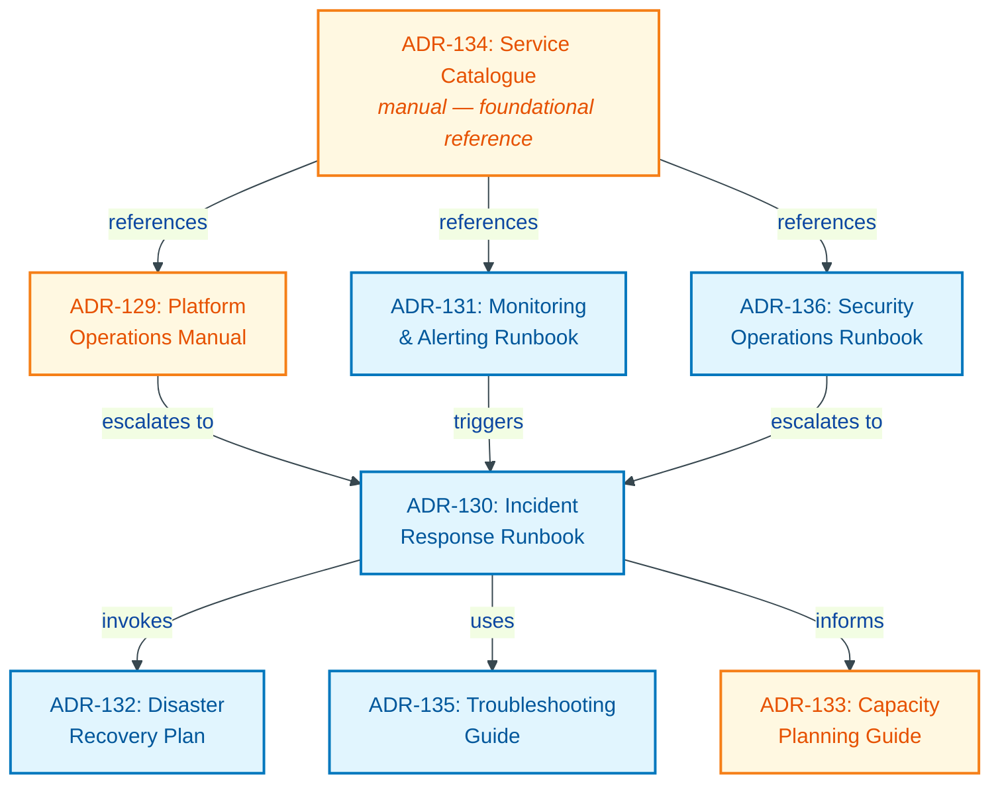

| | |
|---|---|
| **Date** | 2026-04-08 |
| **Status** | Accepted |
| **Category** | operations |


## Context

The Graph OLAP Platform is being handed off to HSBC for production operation on their private GKE infrastructure. The platform comprises nine services (control-plane, export-worker, wrapper-proxy, extension-server, ryugraph-wrapper, falkordb-wrapper, jupyter-labs, notebook-sync, docs) backed by Cloud SQL PostgreSQL, Google Cloud Storage, Managed Prometheus, and orchestrated through ArgoCD/Terraform.

### The Documentation Gap

The project has thorough **design documentation** that describes how the system was built:

| Existing Document | Type | What It Covers |
|---|---|---|
| `docs/operations/deployment.design.md` | Design | CI/CD pipelines, ArgoCD config, Helm charts, GitOps setup |
| `docs/operations/observability.design.md` | Design | Logging architecture, metrics catalogue, alert rules, SLOs |
| `docs/operations/deployment-rollback-procedures.md` | Design | Canary strategy, Argo Rollouts config, rollback commands |
| `docs/operations/e2e-tests.runbook.md` | Runbook | E2E test execution procedures (the one operational doc that exists) |
| `docs/governance/change-control-framework.governance.md` | Governance | Deliverance SOX compliance framework |
| `docs/architecture/platform-operations.md` | Architecture | Technology stack, SLOs, DR targets, cost model |

One document -- `deployment-rollback-procedures.md` -- contains partial operational procedures (numbered rollback steps in imperative voice), but these are written for the development toolchain (ArgoCD, Argo Rollouts) and would not work in HSBC's `kubectl apply` / `deploy.sh` deployment model.

None of these documents answer the questions an HSBC operator will ask on day one:

- "The control-plane is returning 503s -- what do I check?"
- "Cloud SQL is at 90% storage -- what is the expansion procedure?"
- "We received a SOX audit request for change evidence -- where do I find it?"
- "An analyst reports JupyterHub is unreachable -- what is the escalation path?"
- "We need to failover to a different region -- what are the steps?"

Design docs explain **why** the system is built a certain way. Operators need docs that explain **what to do** when specific situations arise. This is the fundamental gap: the project has architecture documentation but no operator-facing runbooks.

### Regulatory Context

HSBC operates under banking regulatory requirements including SOX (Sarbanes-Oxley) compliance for change management, audit trail requirements for all production changes, and segregation of duties enforcement through Deliverance. Operational documentation must be written with these constraints in mind -- procedures must include audit trail steps, change approval references, and evidence collection guidance.

### HSBC Deployment Model Differences

The HSBC target environment differs from the development environment in ways that affect operational procedures:

| Aspect | Development (current) | HSBC Production |
|---|---|---|
| CI | GitHub Actions | Jenkins `gke_CI()` |
| CD | ArgoCD (Helm) | `kubectl apply` via `deploy.sh` |
| Charts | Helm with values overlays | Raw YAML manifests (sed-templated) |
| Change control | Git merge to main | Deliverance approval workflow |
| Monitoring | Grafana dashboards | Cloud Monitoring (GCP console) |

Operational documentation must be written for the HSBC deployment model, not the development model.

---

## Decision

Create eight operational documents that convert existing design knowledge into operator-facing procedures. Each document targets a specific operational domain and is written for the HSBC Platform Operations team as its primary audience.

### Document Taxonomy

Two document types are defined by file suffix:

| Suffix | Type | Purpose | Style |
|---|---|---|---|
| `.manual.md` | Manual | Reference material consulted as needed | Descriptive, organized by topic |
| `.runbook.md` | Runbook | Step-by-step procedures executed during incidents or operations | Imperative, organized by scenario |

This follows an established convention in the codebase (see `e2e-tests.runbook.md` for an existing example).

### The Eight Documents

**ADR-129: Platform Operations Manual** (`docs/operations/platform-operations.manual.md`)
- Type: Manual
- Purpose: Single-source reference for day-to-day platform operations -- startup/shutdown, health checks, routine maintenance, configuration management
- Derives from: `deployment.design.md` (deployment procedures), `platform-operations.md` (background jobs, OpsResource API)
- Audience: Platform Operations team (daily use)

**ADR-130: Incident Response Runbook** (`docs/operations/incident-response.runbook.md`)
- Type: Runbook
- Purpose: Structured incident response procedures -- severity classification, escalation paths, communication templates, post-incident review process
- Derives from: `observability.design.md` (alert severity levels), `change-control-framework.governance.md` (Deliverance audit requirements)
- Audience: On-call engineers, incident commanders

**ADR-131: Monitoring and Alerting Runbook** (`docs/operations/monitoring-alerting.runbook.md`)
- Type: Runbook
- Purpose: Alert-by-alert response procedures -- what each alert means, diagnostic steps, remediation actions, escalation criteria
- Derives from: `observability.design.md` (alert rules, metrics catalogue, dashboards), `platform-operations.md` (SLOs/SLIs)
- Audience: On-call engineers, SRE team

**ADR-132: Disaster Recovery Plan** (`docs/operations/disaster-recovery.runbook.md`)
- Type: Runbook
- Purpose: Recovery procedures for major failure scenarios -- Cloud SQL failure, GCS data loss, regional outage, full cluster rebuild
- Derives from: `platform-operations.md` (DR targets: RTO/RPO table), `deployment.design.md` (infrastructure architecture)
- Audience: Platform Operations team, DR coordinators

**ADR-133: Capacity Planning Guide** (`docs/operations/capacity-planning.manual.md`)
- Type: Manual
- Purpose: Resource sizing guidance, growth forecasting, scaling thresholds, cost optimization -- when and how to scale each component
- Derives from: `platform-operations.md` (node pool sizing, cost model, scalability targets), `observability.design.md` (resource metrics)
- Audience: Platform Operations team, capacity planners

**ADR-134: Service Catalogue and Dependency Map** (`docs/operations/service-catalogue.manual.md`)
- Type: Manual
- Purpose: Complete inventory of all services, their dependencies, health check endpoints, ports, resource requirements, and inter-service communication flows
- Derives from: `deployment.design.md` (Helm charts, service configs), `platform-operations.md` (component dependencies, technology stack)
- Audience: All operations staff (reference)

**ADR-135: Troubleshooting Guide** (`docs/operations/troubleshooting.runbook.md`)
- Type: Runbook
- Purpose: Symptom-based troubleshooting trees -- "pod in CrashLoopBackOff", "export jobs stuck", "JupyterHub 502", with diagnostic commands and resolution steps
- Derives from: `deployment-rollback-procedures.md` (troubleshooting section), `e2e-tests.runbook.md` (existing troubleshooting patterns), `observability.design.md` (log queries, metric queries)
- Audience: On-call engineers, L1/L2 support

**ADR-136: Security Operations Runbook** (`docs/operations/security-operations.runbook.md`)
- Type: Runbook
- Purpose: Security-specific operational procedures -- secret rotation, certificate renewal, access review, vulnerability response, audit evidence collection
- Derives from: `deployment.design.md` (secret management, access controls), `change-control-framework.governance.md` (SOX compliance), `platform-operations.md` (security controls matrix)
- Audience: Security Operations, compliance team

---

## Document Inventory

| ADR | Document | Type | Primary Audience | Related Existing Docs | Priority |
|---|---|---|---|---|---|
| 129 | Platform Operations Manual | Manual | Platform Ops | `deployment.design.md`, `platform-operations.md` | P0 -- Day 1 |
| 130 | Incident Response Runbook | Runbook | On-call engineers | `observability.design.md`, `change-control-framework.governance.md` | P0 -- Day 1 |
| 131 | Monitoring & Alerting Runbook | Runbook | On-call / SRE | `observability.design.md`, `platform-operations.md` | P0 -- Day 1 |
| 132 | Disaster Recovery Plan | Runbook | DR coordinators | `platform-operations.md`, `deployment.design.md` | P0 -- Day 1 |
| 133 | Capacity Planning Guide | Manual | Capacity planners | `platform-operations.md`, `observability.design.md` | P1 -- Week 1 |
| 134 | Service Catalogue | Manual | All Ops staff | `deployment.design.md`, `platform-operations.md` | P0 -- Day 1 |
| 135 | Troubleshooting Guide | Runbook | On-call / L1-L2 | `deployment-rollback-procedures.md`, `e2e-tests.runbook.md` | P1 -- Week 1 |
| 136 | Security Operations Runbook | Runbook | Security Ops | `deployment.design.md`, `change-control-framework.governance.md` | P1 -- Week 1 |

---

## Document Relationships

### Dependency Graph


<details>
<summary>Mermaid Source</summary>



</details>

> **Legend:** Amber nodes are **manuals** (reference material); blue nodes are **runbooks** (step-by-step procedures).

### Reading Order for a New Operator

A new operator joining the HSBC Platform Operations team should read the documents in this order:

1. **Service Catalogue (ADR-134)** -- Understand what services exist, how they connect, and where to find health endpoints. This is the foundational reference.
2. **Platform Operations Manual (ADR-129)** -- Learn routine procedures: startup, shutdown, deployments, health checks, configuration changes.
3. **Monitoring and Alerting Runbook (ADR-131)** -- Learn what alerts fire, what they mean, and what to do for each one.
4. **Incident Response Runbook (ADR-130)** -- Understand the incident management process, severity levels, escalation paths, and Deliverance compliance requirements.
5. **Troubleshooting Guide (ADR-135)** -- Build familiarity with common failure modes and diagnostic procedures.
6. **Security Operations Runbook (ADR-136)** -- Learn secret rotation schedules, certificate management, access review procedures.
7. **Disaster Recovery Plan (ADR-132)** -- Understand recovery procedures for major failures. Participate in DR drill.
8. **Capacity Planning Guide (ADR-133)** -- Understand growth patterns, scaling thresholds, and cost management.

### Cross-Reference Conventions

All eight documents follow these cross-referencing rules:

- Reference other operational documents by ADR number and relative path (e.g., "See [Incident Response Runbook](incident-response.runbook.md) for escalation procedures")
- Reference design documents when explaining *why* a procedure exists (e.g., "This threshold is derived from the SLO defined in `observability.design.md`")
- Never duplicate procedural content across documents; reference instead
- Each document includes a "Related Documents" section listing its dependencies

---

## Delivery Plan

### P0 -- Required for Day 1 Operations

These five documents must be complete before the handoff is executed. Without them, the HSBC operations team cannot safely run the platform.

| Document | Rationale |
|---|---|
| Service Catalogue (ADR-134) | Foundational reference for all other documents; operators must understand the service inventory first |
| Platform Operations Manual (ADR-129) | Operators need to know how to perform routine operations from day one |
| Incident Response Runbook (ADR-130) | Incidents will happen; the team needs a structured response process |
| Monitoring & Alerting Runbook (ADR-131) | Alerts will fire; operators need to know what each alert means and how to respond |
| Disaster Recovery Plan (ADR-132) | Regulatory requirement; must be in place before production handoff |

### P1 -- Required Within First Week

These three documents enhance operational capability but are not blocking for initial handoff.

| Document | Rationale |
|---|---|
| Capacity Planning Guide (ADR-133) | Not urgent for day 1 but needed before first scaling event |
| Troubleshooting Guide (ADR-135) | Supplements the alerting runbook with deeper diagnostic trees |
| Security Operations Runbook (ADR-136) | First secret rotation is weeks away; first access review is monthly |

### Authoring Standards

All eight documents must adhere to these standards:

- **Target length:** 300-800 lines per document (per project documentation standards)
- **Imperative voice for procedures:** "Run `kubectl get pods`" not "You can run kubectl get pods"
- **Concrete commands:** Every procedure includes copy-paste-ready commands for the HSBC environment
- **HSBC deployment model:** All procedures use `kubectl apply` / `deploy.sh`, not Helm/ArgoCD
- **Deliverance references:** Procedures that modify production state include the required Deliverance change request step
- **No placeholder content:** Every section must contain actionable information, not "TBD" markers
- **Consistent severity levels:** Use Critical / Warning / Info for alert severity (per observability design). Use P1--P4 for incident severity (per incident response runbook). These are complementary scales used in different contexts

---

## Integration with HSBC Handoff Package

### Package Inclusion

The HSBC handoff package (built by `tools/repo-split/build-hsbc-package.sh`) already creates a `docs/runbooks/` directory at `build/hsbc/docs/runbooks/`. All eight operational documents must be copied into this directory during the build.

### Required Change to build-hsbc-package.sh

The build script's docs assembly section (line 76, `# Step 6: Assemble docs/`) must be extended to copy operational documents. Insert after the SDK user manual copy (line 96):

```bash
# Operational runbooks and manuals
cp "$REPO_ROOT"/docs/operations/*.manual.md "$HSBC_DIR/docs/runbooks/" 2>/dev/null || true
cp "$REPO_ROOT"/docs/operations/*.runbook.md "$HSBC_DIR/docs/runbooks/" 2>/dev/null || true
log_info "  Copied operational runbooks and manuals"
```

### Package Validation

The `make hsbc-validate` target should be extended to verify that all eight operational documents are present in `build/hsbc/docs/runbooks/`. Add these checks:

```bash
# Verify operational documentation
for doc in \
    platform-operations.manual.md \
    incident-response.runbook.md \
    monitoring-alerting.runbook.md \
    disaster-recovery.runbook.md \
    capacity-planning.manual.md \
    service-catalogue.manual.md \
    troubleshooting.runbook.md \
    security-operations.runbook.md; do
    check_file "docs/runbooks/$doc"
done
```

### Runbooks README

The handoff package README (`build/hsbc/README.md`) already references `docs/runbooks/` in its documentation section. However, the ADR's reading order and document taxonomy are not included in the handoff package. The build script must generate a `docs/runbooks/README.md` that lists all operational documents with their type, purpose, and the recommended reading order from Section "Reading Order for a New Operator" above.

---

## Pre-Handoff Validation

Before the handoff is executed, all P0 documents must be validated:

- **Desk-check:** Walk through every procedure against the HSBC staging environment. Verify that all commands execute correctly with HSBC namespace names, project IDs, and secret names.
- **DR tabletop exercise:** Execute the Disaster Recovery Plan (ADR-132) as a tabletop exercise with HSBC operations staff present. "Documented and testable" does not satisfy banking regulatory requirements -- procedures must be validated.
- **Command audit:** Confirm that no procedure references ArgoCD, Helm, or other development-model tooling. All commands must use `kubectl apply` / `deploy.sh` as specified in the HSBC deployment model.

---

## Maintenance Plan

Ownership of all eight documents transfers to the HSBC Platform Operations team at handoff. The following maintenance contract applies:

- **Review triggers:** Any infrastructure change (new service, changed dependency, updated alert rule, new secret) must trigger an update to the affected documents.
- **Annual full review:** All eight documents must be reviewed for accuracy regardless of whether a specific trigger has occurred.
- **Hypercare period (90 days post-handoff):** The development team will update documents for inaccuracies reported by HSBC operators during this period.
- **Feedback channel:** HSBC operators report documentation issues via the same ITSM ticketing system used for platform incidents, tagged with category "documentation."
- **Version tracking:** Each document includes a `Version` and `Last Updated` header. Increment the version on every substantive change.

---

## Consequences

**Positive:**

- HSBC operators receive actionable procedures written for their specific deployment model (Jenkins CI, kubectl apply, Deliverance change control) rather than generic Kubernetes documentation
- Incident response time decreases because operators have pre-written diagnostic steps and remediation procedures for every alert
- SOX compliance is embedded in procedures -- every production-modifying step includes the required Deliverance change request reference
- The separation between design docs (how it was built) and operational docs (how to run it) prevents operators from needing to reverse-engineer procedures from architecture documents
- New operator onboarding follows a structured reading path rather than ad-hoc knowledge transfer
- DR procedures are documented and testable before the handoff, satisfying banking regulatory requirements
- The document taxonomy (`.manual.md` / `.runbook.md`) is consistent with the existing `e2e-tests.runbook.md` convention

**Negative:**

- Eight additional documents require ongoing maintenance as the platform evolves -- procedures must be updated when infrastructure changes
- Some content in the operational docs will be derived from design docs, creating a potential consistency risk if design docs are updated but operational docs are not
- The documents are written for the HSBC deployment model (kubectl apply); if HSBC later adopts ArgoCD or Helm, the procedural sections will need rewriting
- Authoring eight documents in parallel requires coordination to avoid contradictions (e.g., different severity definitions, different escalation paths)

---

## References

- `docs/operations/deployment.design.md` -- Deployment architecture, CI/CD pipelines, Helm charts
- `docs/operations/observability.design.md` -- Metrics catalogue, alert rules, logging architecture, SLOs
- `docs/operations/deployment-rollback-procedures.md` -- Canary strategy, rollback procedures
- `docs/operations/e2e-tests.runbook.md` -- Existing operational runbook (format reference)
- `docs/governance/change-control-framework.governance.md` -- Deliverance SOX compliance framework
- `docs/architecture/platform-operations.md` -- Technology stack, security controls, DR targets, cost model
- `tools/repo-split/build-hsbc-package.sh` -- HSBC handoff package build script
- ADR-096: Repository Split for CI System Compatibility
- ADR-103: Repo Split Alignment with HSBC Target Structure
