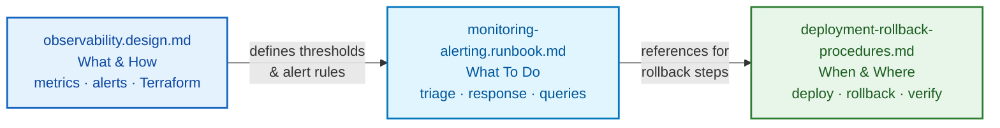

| | |
|---|---|
| **Date** | 2026-04-08 |
| **Status** | Accepted |
| **Category** | operations |

## Context

The Graph OLAP Platform is being handed off to HSBC operational teams. While the observability stack is fully defined in [observability.design.md](--/--/--/operations/observability.design.md) -- covering structured logging, Prometheus metrics, Cloud Monitoring dashboards, and alerting rules -- there is no single document that tells an on-call engineer *what to do* when an alert fires.

Without a consolidated runbook:

1. **Slow incident response** -- engineers must read design docs to understand thresholds and meaning of each alert.
2. **Inconsistent triage** -- different team members follow different investigation paths.
3. **Knowledge loss** -- tribal knowledge about common failure modes is not captured.
4. **HSBC onboarding gap** -- new operators have no reference for day-to-day monitoring tasks.

The observability design document is authoritative for *what* is monitored and *how*. This ADR records the decision to create a companion runbook that covers the *when* and *what to do*.

---

## Decision

Create a monitoring and alerting runbook at `docs/operations/monitoring-alerting.runbook.md` that provides:

1. **Dashboard inventory** -- every Cloud Monitoring dashboard, its purpose, and navigation path.
2. **Alert catalogue** -- each alert rule with name, severity, threshold, meaning, and step-by-step response procedure.
3. **Key metrics reference** -- normal ranges, warning thresholds, and PromQL queries for investigation.
4. **Log query cookbook** -- Cloud Logging filter expressions for common investigation scenarios.
5. **Prometheus query cookbook** -- PromQL queries for latency, error rate, resource utilization, and export pipeline health.
6. **Silence and acknowledge procedures** -- how to suppress alerts during planned maintenance.
7. **Dashboard creation guide** -- how to add new dashboards and alert policies.

The runbook references the observability design document for metric definitions and architecture. It does not duplicate metric schemas or Terraform configuration.

Mermaid Source

---

## Consequences

**Positive:**

- On-call engineers have a single document for alert response.
- Consistent triage steps reduce mean time to resolution.
- HSBC operators can onboard without relying on the original development team.
- Runbook links back to design docs, maintaining a single source of truth for architecture.

**Negative:**

- Runbook must be kept in sync with changes to alerting rules in `observability.design.md`.
- Alert thresholds documented in two places (design doc defines them, runbook references them).
- Runbook may drift from actual Cloud Monitoring configuration if Terraform changes are not reflected.
- Runbook assumes direct `kubectl` and GCP Console access. If HSBC wraps cluster access through a bastion, PAM tool, or different RBAC model, response procedures will need adaptation.

**Drift mitigation:**

- PRs that modify `infrastructure/helm/charts/observability/templates/alerting-rules.yaml` or `observability.design.md` must update the runbook in the same PR.
- The runbook's alert catalogue should be validated against the Helm alerting-rules template during review. A CI lint that compares alert names between the two files is recommended.

---

## Alternatives Considered

### 1. Embed Response Procedures in Alerting Rule Annotations

Each Prometheus/Cloud Monitoring alert supports an `annotations.runbook` field. We could embed triage steps directly in the alert definition.

**Partially adopted.** Alert annotations contain a `runbook` URL that links to the relevant section of the consolidated runbook. However, annotations are not sufficient as the sole location for response procedures because:

- Annotations have limited formatting (no tables, no multi-step procedures).
- Scatters operational knowledge across many YAML files instead of one document.
- Does not cover dashboards, PromQL cookbook, or silence procedures.
- Harder for HSBC operators to review holistically during onboarding.

### 2. Use a Wiki or Confluence Instead of a Markdown File

Many organisations maintain runbooks in a wiki platform with richer formatting and search.

**Rejected because:**

- The Graph OLAP Platform documentation is version-controlled in Git alongside the code.
- A wiki creates a second source of truth that can drift from the codebase.
- Markdown runbooks can be reviewed in pull requests alongside alerting rule changes.
- HSBC can migrate the markdown to their preferred wiki platform after handoff if they choose.

### 3. Rely on the Observability Design Document Alone

The existing `observability.design.md` already documents all metrics, alerts, and dashboards.

**Rejected because:**

- The design document explains *what* and *how* (architecture, Terraform, code samples).
- On-call engineers need *what to do when it breaks*, not how the system was built.
- Mixing design rationale with operational procedures makes both harder to use.
- The design document is 930+ lines; adding response procedures would push it well past maintainable size.

---

## References

- [ADR-128: Operational Documentation Strategy](adr-128-operational-documentation-strategy.md) -- umbrella strategy for handoff documentation
- [ADR-130: Incident Response Runbook](adr-130-incident-response-runbook.md) -- escalation paths, severity classification, postmortem process
- [Observability Design](--/--/--/operations/observability.design.md) -- metrics, logging, alerting architecture
- [Deployment and Rollback Procedures](--/--/--/operations/deployment-rollback-procedures.md) -- deployment strategy
- [Monitoring and Alerting Runbook](--/--/--/operations/monitoring-alerting.runbook.md) -- the runbook itself
- [Platform Operations Architecture](--/--/--/architecture/platform-operations.md) -- SLOs, SLIs, technology stack
- [ADR-130: Incident Response Runbook](adr-130-incident-response-runbook.md) -- incident playbooks referenced by alert procedures
