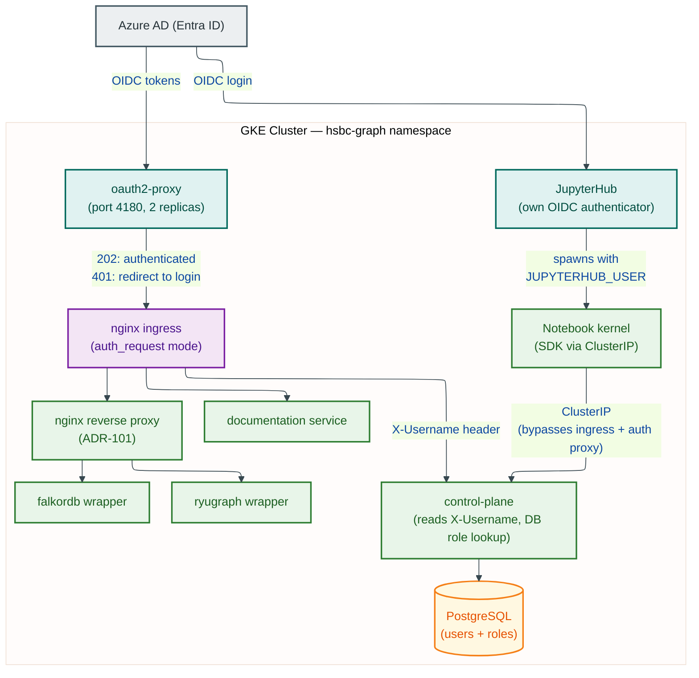
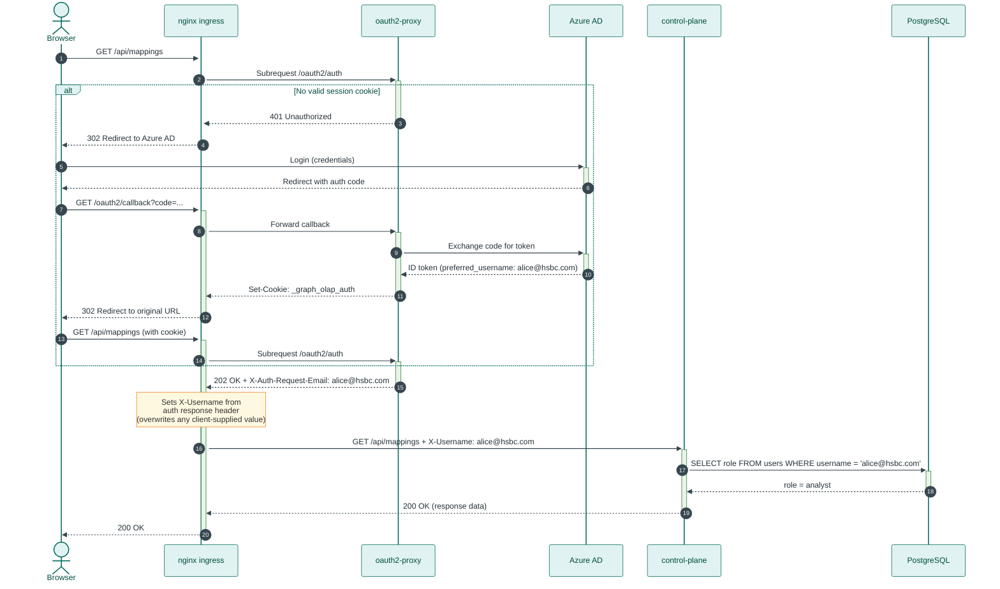
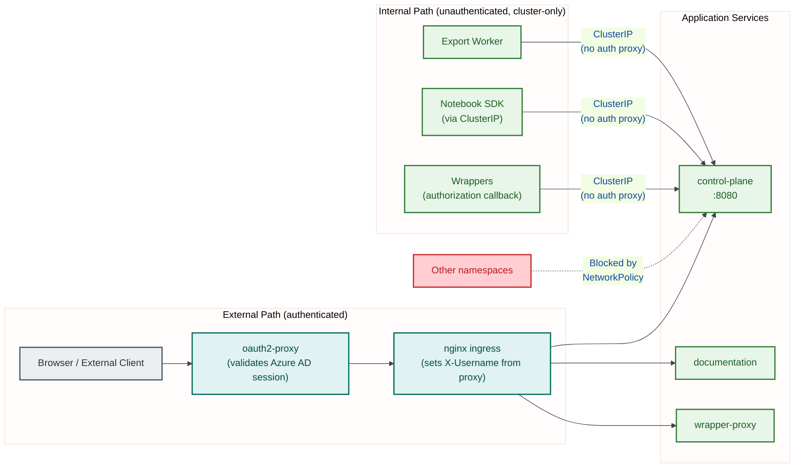
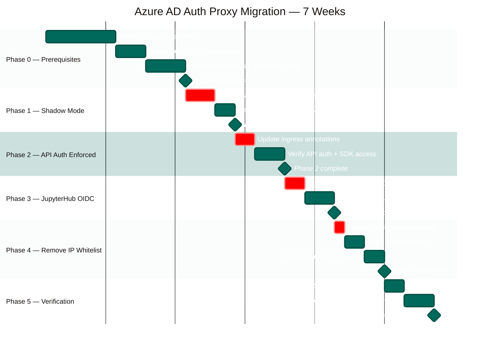

| | |
|---|---|
| **Date** | 2026-04-09 |
| **Status** | Proposed |
| **Category** | security |


## Context

### The Interim Solution

The platform currently has **no authentication enforcement** at the infrastructure layer. Auth0, oauth2-proxy, JWT middleware, and Bearer tokens were all removed in ADR-112. Today: the SDK sets a self-declared `X-Username` header (defaulting to `analyst_alice@e2e.local`, ADR-105); the control plane looks up the user in PostgreSQL and reads their role (ADR-104); JupyterHub has no login screen; and IP whitelisting (`<HSBC_ALLOWED_IP_CIDR>`) is the only access control.

The critical gap: **identity is self-declared, not verified.** Any client that can reach the ingress can impersonate any provisioned user. This is acceptable for a single-developer demo behind IP whitelisting but not for HSBC production.

### The Original Design Intent

ADR-006 established that authentication was always intended to be external via OAuth 2.0 / OIDC with Active Directory, with upstream infrastructure setting `X-Username` and `X-User-Role` headers before requests reach the platform. ADR-084 defined the dual-path architecture (oauth2-proxy for browsers, Bearer tokens for API). ADR-085 established the "trust the edge" principle. The interim solution (ADR-104/105/112) removed the proxy but preserved the header-based identity model. Restoring an authentication proxy completes the original design.

### What This ADR Addresses

HSBC's infrastructure team needs to configure Azure Active Directory (Entra ID) as the authentication proxy for the platform. This ADR provides:

1. The target authentication architecture with Azure AD
2. A phased migration plan from the interim solution to verified identity
3. Configuration guidance for HSBC's identity and infrastructure teams
4. Rollback procedures for each phase

### Architecture Context

Users launch notebooks from JupyterHub (in-cluster), and the SDK makes REST calls to the control plane and wrappers. All services are exposed via nginx ingress with TLS termination and IP whitelisting. The SDK within JupyterHub uses the ClusterIP URL (`http://graph-olap-control-plane.hsbc-graph.svc.cluster.local:8080`), bypassing the ingress.

### Constraints

1. **Application code MUST NOT change.** The control plane already reads `X-Username` and resolves roles from PostgreSQL. The migration is purely infrastructure.
2. **SDK code MUST NOT change.** The SDK sends `X-Username`, which the auth proxy will override with the verified identity. The SDK's `username` parameter becomes a no-op for production (the proxy always wins).
3. **HSBC uses Azure AD (Entra ID)** as their identity provider.
4. **All production changes require Deliverance approval** (HSBC change-control governance).
5. **HSBC deploys with `kubectl apply` via `deploy.sh`**, not Helm or ArgoCD.
6. **Service-to-service calls within the cluster must bypass the auth proxy.** Internal traffic between pods uses ClusterIP services, not the ingress.

---

## Decision

Deploy **oauth2-proxy** (v7.x) in front of all ingress routes, configured with Azure AD as the OIDC provider. This reinstates the architecture defined in ADR-084 but replaces Auth0 with Azure AD.

### Alternatives Considered

| Option | Verdict | Reasoning |
|--------|---------|-----------|
| **oauth2-proxy with Azure AD** | **Chosen** | Battle-tested in the platform's history (ADR-084). Kubernetes-native. Supports `auth_request` mode with nginx ingress. Open-source, no licensing. HSBC can audit the code. Already has Azure AD provider support. |
| Azure AD Application Proxy | Rejected | Designed for on-premises apps, not Kubernetes workloads. Requires the Azure AD Application Proxy Connector agent. Adds a non-standard network hop outside the cluster. Does not integrate with nginx ingress `auth_request`. |
| nginx `auth_request` to a custom service | Rejected | Requires building and maintaining a custom authentication service. oauth2-proxy already implements this pattern with production-grade session management, token refresh, and claim extraction. |
| Reinstating Auth0 | Rejected | Auth0 billing was suspended. HSBC's identity infrastructure is Azure AD. Introducing a third-party IdP adds cost, complexity, and a dependency outside HSBC's control. |

### Target Architecture


<details>
<summary>Mermaid Source</summary>



</details>

### Header Mapping

Azure AD tokens contain claims. oauth2-proxy extracts these claims and sets response headers that nginx ingress forwards to upstream services.

| Azure AD Claim | oauth2-proxy Response Header | nginx Upstream Header | Application Usage |
|----------------|------------------------------|----------------------|-------------------|
| `preferred_username` or `email` | `X-Auth-Request-Email` | `X-Username` | Identity resolution in `get_request_user()`. **Note:** `preferred_username` in Azure AD is typically a UPN (e.g., `alice.smith@hsbc.com`) but is not guaranteed to be an email address for guest accounts or B2B users. HSBC's identity team must verify that the claim value returned for all users matches the email-format usernames provisioned in PostgreSQL. |
| `groups` (group Object IDs) | `X-Auth-Request-Groups` | Available for future use | Not used by the application today |

The `X-Username` header is set by nginx ingress from the oauth2-proxy response header. The SDK's `X-Username` header on the original request is **overwritten** by the ingress configuration, preventing spoofing.

**Critical detail:** The nginx ingress `auth_request` annotation causes nginx to make a subrequest to oauth2-proxy before forwarding to the upstream service. If oauth2-proxy returns 202, nginx sets headers from the auth response and forwards the original request. If oauth2-proxy returns 401, nginx returns a redirect to the Azure AD login page.

### What Changes and What Does Not Change

| Component | Changes? | Detail |
|-----------|----------|--------|
| Control plane application code | **No** | `get_request_user()` in `middleware/identity.py` continues to read `X-Username` header and look up the user in PostgreSQL. No code change. |
| Graph OLAP SDK | **No** | The SDK continues to set `X-Username`. In production, the auth proxy overwrites this header with the verified identity. The SDK's `username` parameter becomes vestigial but harmless. |
| Wrapper application code | **No** | Wrapper `require_algorithm_permission`, `get_user_id`, and `get_user_name` dependencies all read `X-Username` as the canonical identity header per ADR-105 (see `packages/{ryugraph,falkordb}-wrapper/src/wrapper/dependencies.py`). The legacy `X-User-ID` and `X-User-Name` headers are still accepted as deprecated aliases for backward compatibility but are no longer required. No wrapper code change is needed for the auth proxy migration. |
| PostgreSQL user/role tables | **No** | Roles remain database-backed. Users must still be pre-provisioned via `POST /api/users/bootstrap` or `POST /api/users`. The proxy provides verified identity; the database provides authorization. |
| nginx ingress configuration | **Yes** | Add `auth-url`, `auth-signin`, `auth-response-headers` annotations. Remove `whitelist-source-range` annotation (Phase 4). |
| Kubernetes deployments | **Yes** | Deploy oauth2-proxy as a Deployment + Service in the `hsbc-graph` namespace. |
| JupyterHub configuration | **Yes** | Switch from no-auth to `OIDCAuthenticator` (or `AzureAdOAuthenticator`) using the same Azure AD tenant. |
| IP whitelisting | **Removed** (Phase 4) | Replaced by Azure AD authentication. Network-level restrictions are no longer needed once every request is authenticated. |
| SDK `DEFAULT_USERNAME` | **Overridden** | On the ingress path, the proxy overwrites it. On the ClusterIP path, `GRAPH_OLAP_USERNAME` (set from `JUPYTERHUB_USER` in the spawner config) takes precedence. The hard-coded default `analyst_alice@e2e.local` is never used in production. |

### Authorization Model: Proxy Provides Identity, Database Provides Authorization

The auth proxy's job is **authentication** (verifying who the user is). The database's job is **authorization** (determining what the user can do).


<details>
<summary>Mermaid Source</summary>



</details>

This separation means:
- **AD group membership does NOT replace the database role.** Roles are managed in the application's PostgreSQL user table, not in Azure AD groups.
- **Provisioning is still required.** A user who authenticates via Azure AD but is not provisioned in the database will receive `403 USER_NOT_PROVISIONED`, the same as today.
- **AD groups can optionally drive provisioning automation** (future work), but the application never reads group claims directly.

### Service-to-Service Calls

Internal service-to-service communication within the GKE cluster does not traverse the ingress and therefore bypasses the auth proxy entirely. This is the correct behavior:

- **Export Worker to Control Plane**: Uses the ClusterIP service `graph-olap-control-plane.hsbc-graph.svc.cluster.local:8080` directly. No auth proxy involved.
- **Wrappers to Control Plane** (authorization callback): Same ClusterIP path.
- **Control Plane to Wrappers**: Pod-to-pod communication via the nginx reverse proxy (ADR-101), all cluster-internal.

Kubernetes NetworkPolicy should restrict ingress to these services from within the namespace only, preventing external bypass of the auth proxy.

### Network Trust Boundary

The diagram below shows the complete trust boundary model. External traffic (left) always passes through the auth proxy. Internal traffic (right) uses ClusterIP services directly. NetworkPolicy (Phase 4.3) enforces this boundary.


<details>
<summary>Mermaid Source</summary>



</details>

### JupyterHub Integration

JupyterHub authenticates users with the same Azure AD tenant using the `oauthenticator` library's Azure AD support. After authentication:

1. JupyterHub sets `JUPYTERHUB_USER` environment variable in the spawned notebook kernel.
2. The JupyterHub spawner configuration MUST set `GRAPH_OLAP_USERNAME` from `JUPYTERHUB_USER` so the SDK uses the authenticated identity on the ClusterIP path (see Phase 3.2). Without this, the SDK falls back to `DEFAULT_USERNAME` (`analyst_alice@e2e.local`), which will not be provisioned in the HSBC database, causing `403 USER_NOT_PROVISIONED` errors.
3. When the SDK makes requests through the ingress, the auth proxy validates the user's session and overwrites `X-Username` with the verified identity regardless.

**JupyterHub-specific consideration:** JupyterHub sits behind its own ingress route. The oauth2-proxy must either handle JupyterHub's ingress as well (protecting the JupyterHub UI with Azure AD login), or JupyterHub can use its own OIDC authenticator. The recommended approach is **JupyterHub's own OIDC authenticator** because JupyterHub manages its own sessions and kernel lifecycle, and wrapping it in oauth2-proxy can cause WebSocket conflicts with the notebook kernel protocol.

### The SDK Username Parameter

After migration, the SDK's `username` parameter and `DEFAULT_USERNAME` constant become **vestigial but not harmful**:

- In production, the auth proxy overwrites `X-Username` with the verified identity from Azure AD. Whatever the SDK sends is ignored.
- In development/testing environments without an auth proxy, the SDK's `username` parameter continues to work as designed (ADR-105).
- No SDK code change is required. The `username` parameter should NOT be removed -- it provides development-time convenience and test persona switching.

---

## Migration Plan


<details>
<summary>Mermaid Source</summary>



</details>

### Phase 0: Prerequisites (Weeks 1-2)

**Objective:** Configure Azure AD and prepare the cluster. No production traffic changes.

**Deliverance:** Not required (no production change).

#### 0.1 Azure AD App Registration

HSBC's identity team registers an application in Azure AD (Entra ID):

```
Azure Portal → Entra ID → App registrations → New registration

Display name:  graph-olap-platform
Supported account types:  Accounts in this organizational directory only
                          (HSBC tenant - Single tenant)

Redirect URIs (Web):
  https://<HSBC_API_HOST>/oauth2/callback
  https://<HSBC_JUPYTER_HOST>/hub/oauth_callback
```

After registration, note:
- **Application (client) ID**: `<client-id>`
- **Directory (tenant) ID**: `<tenant-id>`

Create a client secret:

```
App registration → Certificates & secrets → New client secret
Description: graph-olap-oauth2-proxy
Expires: 24 months
```

Note the **client secret value** (shown only once).

#### 0.2 Token Configuration

Configure the token to include the `email` or `preferred_username` claim and optionally group membership:

```
App registration → Token configuration → Add optional claim

Token type: ID
Claims:
  - email
  - preferred_username

Token type: Access
Claims:
  - email
  - preferred_username
```

If group-based provisioning automation is desired in the future:

```
App registration → Token configuration → Add groups claim

Group types: Security groups
Customize token properties:
  - Group ID (ID token)
  - Group ID (Access token)
```

#### 0.3 API Permissions

```
App registration → API permissions → Add a permission

Microsoft Graph:
  - openid   (Delegated)
  - profile  (Delegated)
  - email    (Delegated)

Grant admin consent for HSBC tenant.
```

#### 0.4 Create Kubernetes Secrets

Store the Azure AD credentials in the cluster:

```bash
kubectl create secret generic oauth2-proxy-secrets \
  --namespace hsbc-graph \
  --from-literal=client-id='<client-id>' \
  --from-literal=client-secret='<client-secret>' \
  --from-literal=cookie-secret="$(openssl rand -base64 32)" \
  --dry-run=client -o yaml > oauth2-proxy-secrets.yaml

# Review the manifest, then apply
kubectl apply -f oauth2-proxy-secrets.yaml -n hsbc-graph
```

#### 0.5 Provision Users in PostgreSQL

Ensure that all Azure AD users who will access the platform are provisioned in the control plane database with the correct roles. The `username` in PostgreSQL must match the Azure AD claim value that oauth2-proxy will extract (typically `preferred_username` or `email`).

```python
# Via the SDK (from a notebook with ops-level access):
from graph_olap import GraphOLAPClient

client = GraphOLAPClient(api_url=API_URL, username="ops_dave@e2e.local")

# Provision users matching their Azure AD email addresses
client.users.create(username="alice.smith@hsbc.com", role="analyst", display_name="Alice Smith")
client.users.create(username="bob.jones@hsbc.com", role="admin", display_name="Bob Jones")
client.users.create(username="carol.williams@hsbc.com", role="ops", display_name="Carol Williams")
```

**IMPORTANT:** The `username` value must exactly match the claim value that Azure AD returns. If Azure AD returns `alice.smith@hsbc.com` as the `preferred_username` claim, then the PostgreSQL user record must have `username = 'alice.smith@hsbc.com'`. Case sensitivity depends on the database collation.

---

### Phase 1: Deploy Auth Proxy in Shadow Mode (Week 3)

**Objective:** Deploy oauth2-proxy alongside the current setup. The proxy is reachable but not enforced. Validates that Azure AD login works and tokens are issued correctly.

**Deliverance:** Required (new deployment to production cluster).

#### 1.1 Deploy oauth2-proxy

Create the manifest `oauth2-proxy-deployment.yaml` with a Deployment (2 replicas) and ClusterIP Service on port 4180. Key container args:

```yaml
# oauth2-proxy container args (image: quay.io/oauth2-proxy/oauth2-proxy:v7.6.0)
args:
  - --provider=oidc
  - --oidc-issuer-url=https://login.microsoftonline.com/<tenant-id>/v2.0
  - --client-id=$(CLIENT_ID)           # from oauth2-proxy-secrets
  - --client-secret=$(CLIENT_SECRET)   # from oauth2-proxy-secrets
  - --cookie-secret=$(COOKIE_SECRET)   # from oauth2-proxy-secrets
  - --cookie-secure=true
  - --cookie-httponly=true
  - --cookie-samesite=lax
  - --cookie-name=_graph_olap_auth
  - --cookie-expire=8h
  - --cookie-refresh=1h
  - --email-domain=hsbc.com
  - --redirect-url=https://<HSBC_API_HOST>/oauth2/callback
  - --whitelist-domain=.<HSBC_DOMAIN>
  - --upstream=static://202
  - --http-address=0.0.0.0:4180
  - --reverse-proxy=true
  - --set-xauthrequest=true
  - --skip-provider-button=true
  - --oidc-email-claim=preferred_username
  - --session-store-type=cookie
  - --logging-format=json
```

Resource requests: 50m CPU / 64Mi memory. Limits: 200m CPU / 128Mi memory. Health probes on `/ping` port 4180. With 2 replicas and cookie-based sessions, each replica handles ~1000 concurrent sessions; 2 replicas provide adequate headroom for the expected 20-50 concurrent users.

Create a PodDisruptionBudget to ensure at least one replica remains available during node maintenance:

```yaml
# oauth2-proxy-pdb.yaml
apiVersion: policy/v1
kind: PodDisruptionBudget
metadata:
  name: oauth2-proxy
  namespace: hsbc-graph
spec:
  minAvailable: 1
  selector:
    matchLabels:
      app: oauth2-proxy
```

Deploy:

```bash
kubectl apply -f oauth2-proxy-pdb.yaml -n hsbc-graph
kubectl apply -f oauth2-proxy-deployment.yaml -n hsbc-graph
kubectl rollout status deployment/oauth2-proxy -n hsbc-graph
```

#### 1.2 Verify oauth2-proxy Health

```bash
# Check pod status
kubectl get pods -n hsbc-graph -l app=oauth2-proxy

# Check logs for successful OIDC discovery
kubectl logs -n hsbc-graph -l app=oauth2-proxy --tail=50

# Port-forward and test the auth endpoint directly
kubectl port-forward svc/oauth2-proxy 4180:4180 -n hsbc-graph
curl -s -o /dev/null -w '%{http_code}' http://localhost:4180/ping
# Expected: 200
```

#### 1.3 Test Azure AD Login (Manual)

Port-forward oauth2-proxy and visit `http://localhost:4180/oauth2/sign_in` in a browser. Verify:

- Redirects to Azure AD login page
- After login, redirects back to the callback URL
- Cookie `_graph_olap_auth` is set
- `/oauth2/userinfo` returns the authenticated user's email/username

**Rollback:** `kubectl delete -f oauth2-proxy-deployment.yaml -n hsbc-graph`

---

### Phase 2: Enable Auth Proxy for API Routes (Week 4)

**Objective:** Enforce Azure AD authentication on API routes. The IP whitelist remains as a fallback.

**Deliverance:** Required (ingress configuration change).

#### 2.1 Update Ingress Annotations

Add auth annotations to the control-plane and documentation service ingresses. The IP whitelist is kept during this phase for safety.

**Pre-requisite:** Set `proxy-buffer-size: 8k` in the nginx ingress controller ConfigMap to prevent 502 errors from oversized oauth2-proxy cookies:

```bash
kubectl edit configmap ingress-nginx-controller -n ingress-nginx
# Add under data:
#   proxy-buffer-size: "8k"
```

For the control-plane ingress (in the raw YAML manifest used by `deploy.sh`):

```yaml
# Add these annotations to the existing ingress for the control-plane
metadata:
  annotations:
    # Existing annotations (keep these)
    cert-manager.io/cluster-issuer: "<HSBC_TLS_ISSUER>"   # HSBC-provided internal PKI issuer — Let's Encrypt cannot reach HSBC-internal hosts
    nginx.ingress.kubernetes.io/whitelist-source-range: "<HSBC_ALLOWED_IP_CIDR>"  # Keep during Phase 2

    # New auth annotations
    nginx.ingress.kubernetes.io/auth-url: "http://oauth2-proxy.hsbc-graph.svc.cluster.local:4180/oauth2/auth"
    nginx.ingress.kubernetes.io/auth-signin: "https://<HSBC_API_HOST>/oauth2/start?rd=$escaped_request_uri"
    nginx.ingress.kubernetes.io/auth-response-headers: "X-Auth-Request-Email"

    # Exempt health endpoints and CORS preflight from authentication.
    # Health/ready: required for GCP load balancer probes.
    # OPTIONS: required for cross-origin preflight requests (e.g.,
    # browser-based SDK calls across subdomains).
    nginx.ingress.kubernetes.io/auth-snippet: |
      if ($request_uri ~* "^/(health|ready)") {
        return 200;
      }
      if ($request_method = OPTIONS) {
        return 200;
      }

    # Override the upstream X-Username with the verified identity.
    # The first line blanks X-Username as a safety default so that if
    # auth_request is misconfigured on a new path, the header is empty
    # rather than client-supplied. The second line sets it from the
    # oauth2-proxy response.
    nginx.ingress.kubernetes.io/configuration-snippet: |
      proxy_set_header X-Username "";
      auth_request_set $auth_email $upstream_http_x_auth_request_email;
      proxy_set_header X-Username $auth_email;
```

Add an ingress rule for the oauth2-proxy callback path:

```yaml
# oauth2-proxy-ingress.yaml
apiVersion: networking.k8s.io/v1
kind: Ingress
metadata:
  name: oauth2-proxy
  namespace: hsbc-graph
  annotations:
    cert-manager.io/cluster-issuer: "<HSBC_TLS_ISSUER>"   # HSBC-provided internal PKI issuer — Let's Encrypt cannot reach HSBC-internal hosts
spec:
  ingressClassName: nginx
  rules:
    - host: <HSBC_API_HOST>
      http:
        paths:
          - path: /oauth2
            pathType: Prefix
            backend:
              service:
                name: oauth2-proxy
                port:
                  number: 4180
  tls:
    - secretName: api-tls
      hosts:
        - <HSBC_API_HOST>
```

Apply the same `auth-url`, `auth-signin`, `auth-response-headers`, `auth-snippet`, and `configuration-snippet` annotations to the **documentation service ingress**. The docs service contains the SDK user manual and API reference, which may include sensitive operational details.

Deploy:

```bash
kubectl apply -f oauth2-proxy-ingress.yaml -n hsbc-graph
# Apply the updated control-plane and documentation ingresses via deploy.sh or kubectl apply
```

#### 2.2 Verify API Authentication

```bash
# Health endpoint is exempted from auth (required for load balancer probes)
curl -s -o /dev/null -w '%{http_code}' \
  https://<HSBC_API_HOST>/health
# Expected: 200

# Unauthenticated request to a protected API route should redirect
curl -s -o /dev/null -w '%{http_code}' \
  https://<HSBC_API_HOST>/api/mappings
# Expected: 302 (redirect to Azure AD)

# Authenticated request (with valid session cookie) should succeed
# Test from a browser after logging in via Azure AD
```

#### 2.3 Test SDK Access from Notebooks

From a JupyterHub notebook (still accessed without auth in this phase):

```python
# The SDK request will fail with a redirect because the auth proxy
# intercepts the request. This is expected.
# Users must now authenticate via Azure AD before SDK calls work.
```

At this point, SDK users cannot make API calls without an auth proxy session. This is addressed in Phase 3 (JupyterHub OIDC) and Phase 2.4 (service account tokens).

#### 2.4 Service Account Access for Automation

CI/CD pipelines and background jobs need an alternative to browser-based login.

**Option A -- ClusterIP bypass (recommended for in-cluster workloads):** The SDK within JupyterHub and the E2E test job use the ClusterIP URL (`http://graph-olap-control-plane.hsbc-graph.svc.cluster.local:8080`), which bypasses the ingress and auth proxy entirely. No change required.

**Option B -- Client credentials flow (for external automation):** Register a separate Azure AD app for the service account. Use the OAuth2 client credentials grant to obtain a Bearer token. Configure oauth2-proxy with `--skip-jwt-bearer-tokens=true` to accept these tokens alongside browser sessions.

**Rollback:** Remove the `auth-url`, `auth-signin`, `auth-response-headers`, and `configuration-snippet` annotations from the control-plane ingress. Delete `oauth2-proxy-ingress.yaml`.

---

### Phase 3: Enable Azure AD for JupyterHub (Week 5)

**Objective:** JupyterHub requires Azure AD login. Users authenticate once and access both notebooks and the API.

**Deliverance:** Required (JupyterHub configuration change).

#### 3.1 Install OAuthenticator

The `oauthenticator` package should be included in the JupyterHub image. If not already present, add it to the image's requirements and rebuild. This is an infrastructure packaging change (Docker image), not an application code change.

```dockerfile
# In the JupyterHub Dockerfile
RUN pip install oauthenticator==16.3.1
```

Rebuild and push the image using the standard image build pipeline (Jenkins `gke_CI()` or the development `make build` / `make push` targets, depending on environment).

#### 3.2 Configure JupyterHub OIDC

Update the JupyterHub configuration (raw YAML used by `deploy.sh`):

```yaml
# jupyterhub-gke-london.yaml (additions)
hub:
  config:
    JupyterHub:
      authenticator_class: generic-oauth
    GenericOAuthenticator:
      client_id: "<client-id>"
      client_secret: "<client-secret>"
      oauth_callback_url: "https://<HSBC_JUPYTER_HOST>/hub/oauth_callback"
      authorize_url: "https://login.microsoftonline.com/<tenant-id>/oauth2/v2.0/authorize"
      token_url: "https://login.microsoftonline.com/<tenant-id>/oauth2/v2.0/token"
      userdata_url: "https://graph.microsoft.com/oidc/userinfo"
      scope:
        - openid
        - profile
        - email
      username_claim: "preferred_username"
      # Allow all users from the HSBC tenant
      # (Azure AD app registration already restricts to single tenant)
      allow_all: true
    Authenticator:
      admin_users:
        - "carol.williams@hsbc.com"
        - "dave.ops@hsbc.com"

# CRITICAL: Propagate the authenticated username to the SDK.
# Without this, SDK calls on the ClusterIP path use the hard-coded
# DEFAULT_USERNAME, which will not be provisioned in HSBC's database.
singleuser:
  extraEnv:
    GRAPH_OLAP_USERNAME:
      valueFrom:
        fieldRef:
          fieldPath: metadata.labels['hub.jupyter.org/username']
```

The `GRAPH_OLAP_USERNAME` environment variable is read by `Config.from_env()` in the SDK and takes precedence over `identity.DEFAULT_USERNAME` (see ADR-105 priority chain: `username= param > GRAPH_OLAP_USERNAME env var > identity.DEFAULT_USERNAME`).

Apply:

```bash
# Via deploy.sh or kubectl apply with the updated values
kubectl apply -f jupyterhub-config.yaml -n hsbc-graph
kubectl rollout restart deployment/hub -n hsbc-graph
```

#### 3.3 Verify JupyterHub Login

1. Navigate to `https://<HSBC_JUPYTER_HOST>`
2. Expect redirect to Azure AD login page
3. After login, expect redirect back to JupyterHub
4. Verify the notebook server spawns with `JUPYTERHUB_USER` set to the Azure AD username
5. Verify SDK calls from the notebook succeed (using the ClusterIP path)

**Rollback:** Revert the JupyterHub config to remove the authenticator class. Restart the hub deployment.

---

### Phase 4: Remove IP Whitelisting (Week 6)

**Objective:** Remove the interim access control. Azure AD authentication is now the sole access control mechanism.

**Deliverance:** Required (ingress configuration change, security posture change).

#### 4.1 Remove Whitelist Annotations

Remove `nginx.ingress.kubernetes.io/whitelist-source-range` from all ingress resources:

- Control-plane ingress
- Documentation ingress
- JupyterHub ingress

HSBC deploys with `kubectl apply` via `deploy.sh`, so these edits land in the
ingress manifests under `infrastructure/cd/resources/`:

```yaml
# Remove this line from all ingress annotations:
# nginx.ingress.kubernetes.io/whitelist-source-range: "<HSBC_ALLOWED_IP_CIDR>"
```

In Terraform (if applicable):

```hcl
# Remove this annotation from all kubernetes_ingress_v1 resources:
# "nginx.ingress.kubernetes.io/whitelist-source-range" = "<HSBC_ALLOWED_IP_CIDR>"
```

Apply the changes:

```bash
# Apply updated ingress manifests
kubectl apply -f <updated-ingress-manifests> -n hsbc-graph
```

#### 4.2 Verify Open Access with Authentication

```bash
# From ANY IP: health endpoint should be accessible (auth-exempted)
curl -s -o /dev/null -w '%{http_code}' \
  https://<HSBC_API_HOST>/health
# Expected: 200 (no longer 403 from IP whitelist, no auth required)

# From ANY IP: protected API route should redirect to Azure AD
curl -s -o /dev/null -w '%{http_code}' \
  https://<HSBC_API_HOST>/api/mappings
# Expected: 302 (redirect to Azure AD)

# After Azure AD login, API calls succeed from any IP
```

#### 4.3 NetworkPolicy Hardening

With IP whitelisting removed, apply Kubernetes NetworkPolicies to prevent direct pod access that bypasses the auth proxy. This is the enforcement mechanism for the "trust the edge" model.

```yaml
# networkpolicy-control-plane.yaml
apiVersion: networking.k8s.io/v1
kind: NetworkPolicy
metadata:
  name: control-plane-ingress
  namespace: hsbc-graph
spec:
  podSelector:
    matchLabels:
      app: control-plane
  policyTypes:
    - Ingress
  ingress:
    # Allow from nginx ingress controller (proxied + authenticated requests)
    - from:
        - namespaceSelector:
            matchLabels:
              kubernetes.io/metadata.name: ingress-nginx
      ports:
        - protocol: TCP
          port: 8080
    # Allow from within the hsbc-graph namespace (service-to-service)
    - from:
        - podSelector: {}
      ports:
        - protocol: TCP
          port: 8080
```

Apply equivalent policies to the documentation service and wrapper-proxy pods (same structure, different `podSelector` labels). Apply and verify:

```bash
kubectl apply -f networkpolicy-control-plane.yaml -n hsbc-graph

# Verify: direct access from a pod in a different namespace should fail
kubectl run --rm -it nettest --image=busybox -n default -- \
  wget -qO- --timeout=3 http://graph-olap-control-plane.hsbc-graph.svc.cluster.local:8080/health
# Expected: timeout / connection refused
```

**Rollback:** Re-add the `whitelist-source-range` annotation to all ingress resources. Delete the NetworkPolicy resources.

---

### Phase 5: Verification and Hardening (Week 7)

**Objective:** End-to-end verification, security hardening, and operational documentation.

**Deliverance:** Required (security posture verification).

#### 5.1 End-to-End Verification Checklist

| # | Test | Expected Result | Verified |
|---|------|----------------|----------|
| 1 | Unauthenticated `curl` to `/api/mappings` | 302 redirect to Azure AD | [ ] |
| 1b | Unauthenticated `curl` to `/health` | 200 OK (exempted from auth) | [ ] |
| 2 | Authenticated browser access to `/api/mappings` | 200 OK | [ ] |
| 3 | JupyterHub login via Azure AD | Notebook server spawns, `JUPYTERHUB_USER` set | [ ] |
| 4 | SDK call from notebook (ClusterIP path) | 200 OK with correct `X-Username` | [ ] |
| 5 | SDK call from external client (ingress path) | 302 redirect (requires auth session) | [ ] |
| 6 | User not provisioned in DB authenticates via Azure AD | `403 USER_NOT_PROVISIONED` | [ ] |
| 7 | Disabled user authenticates via Azure AD | `403 USER_DISABLED` | [ ] |
| 8 | Internal service-to-service call (export worker to CP) | 200 OK (no auth proxy involved) | [ ] |
| 9 | Direct pod access from outside namespace | Blocked by NetworkPolicy | [ ] |
| 10 | Header spoofing attempt via ingress | `X-Username` overwritten by proxy | [ ] |
| 11 | E2E test suite | All tests pass | [ ] |
| 12 | oauth2-proxy metrics endpoint | Prometheus scraping `/metrics` on port 4180 | [ ] |
| 13 | oauth2-proxy down alert fires | Kill oauth2-proxy pod, verify alert within 2m | [ ] |

#### 5.2 Header Spoofing Verification

Verify that a malicious client cannot spoof the `X-Username` header:

```bash
# Attempt to set X-Username manually (after authenticating as alice@hsbc.com)
curl -H "X-Username: admin@hsbc.com" \
  -H "Cookie: _graph_olap_auth=<valid-cookie>" \
  https://<HSBC_API_HOST>/api/users/me

# Expected: Response shows alice@hsbc.com (the authenticated user),
# NOT admin@hsbc.com (the spoofed header).
# The nginx configuration-snippet overwrites X-Username with the
# oauth2-proxy response.
```

#### 5.3 Security Hardening

Rotate the cookie secret after migration is complete. **Note:** Rotating the cookie secret invalidates all active sessions — users must re-authenticate. Schedule rotation during a maintenance window. Verify cookie domain is hostname-specific (not wildcard). Confirm `--cookie-secure=true`, `--cookie-httponly=true`, `--cookie-expire=8h`, `--cookie-refresh=1h`, `--email-domain=hsbc.com`, `--redirect-url`, and `--whitelist-domain` are set. Add the oauth2-proxy cookie secret to the rotation schedule in the [Security Operations Runbook (ADR-136)](adr-136-security-operations-runbook.md).

**CSRF protection:** The OIDC `state` parameter prevents CSRF on the login flow. `--cookie-samesite=lax` limits cross-site cookie attachment for API requests. The platform's API is header-authenticated (not cookie-authenticated from the application's perspective), which limits the CSRF attack surface.

**Open redirect prevention:** `--redirect-url` locks the OIDC callback to `https://<HSBC_API_HOST>/oauth2/callback`. `--whitelist-domain=.<HSBC_DOMAIN>` restricts post-login redirects to the platform's domain, preventing the `rd` parameter from being used to redirect users to external sites.

**Session storage:** Cookie-based sessions (`--session-store-type=cookie`) are used. This avoids a Redis dependency. If concurrent users exceed ~2000 or cookie size causes 502 errors despite the 8k proxy buffer, migrate to Redis session storage by adding `--session-store-type=redis --redis-connection-url=redis://<redis-host>:6379`.

**Logging for audit retention:** oauth2-proxy authentication events must be shipped to HSBC's log aggregation system for audit retention. Configure structured JSON logging via `--logging-format=json` and ensure the log pipeline captures authentication successes, failures, and token refresh events. Retention policy is owned by HSBC (the specific retention period is set by HSBC's central compliance function and is not asserted here).

#### 5.4 Monitoring and Alerting

oauth2-proxy is a critical-path component -- if it is unavailable, all authenticated external access fails. Add the following to the [Monitoring and Alerting Runbook (ADR-131)](adr-131-monitoring-alerting-runbook.md):

**Prometheus metrics:** oauth2-proxy exposes metrics on `/metrics` (port 4180). Add a `ServiceMonitor` or Prometheus scrape annotation:

```yaml
# In the oauth2-proxy Service metadata
metadata:
  annotations:
    prometheus.io/scrape: "true"
    prometheus.io/port: "4180"
    prometheus.io/path: "/metrics"
```

**Alert rules:**

| Alert | Condition | Severity | Action |
|-------|-----------|----------|--------|
| OAuth2ProxyDown | `up{job="oauth2-proxy"} == 0` for 2m | Critical | All external auth fails. Check pod status, restart deployment. |
| OAuth2ProxyErrorRate | `rate(oauth2_proxy_requests_total{code=~"5.."}[5m]) > 0.05` for 5m | Warning | Investigate oauth2-proxy logs. May indicate Azure AD connectivity issues. |
| OAuth2ProxyLatency | `histogram_quantile(0.95, rate(oauth2_proxy_request_duration_seconds_bucket[5m])) > 2` for 5m | Warning | Auth subrequests are slow. Check Azure AD endpoint latency. |

**Dashboard:** Add an oauth2-proxy panel to the platform Cloud Monitoring dashboard showing request rate, error rate, and latency percentiles.

---

## Token Refresh and Long-Running Notebook Sessions

SDK calls from notebooks use the ClusterIP path (see [Service-to-Service Calls](#service-to-service-calls)) and are unaffected by oauth2-proxy session expiry. JupyterHub browser sessions have a separate lifetime; if they expire, running notebook kernels are unaffected. External SDK users must re-authenticate when their session expires, or use the client credentials flow (Phase 2.4, Option B) for long-running automation.

---

## Azure AD Configuration Reference

This section consolidates the Azure AD requirements from Phase 0 as a standalone reference for HSBC's identity team.

The full step-by-step instructions are in [Phase 0](#phase-0-prerequisites-weeks-1-2). Key values:

| Setting | Value |
|---------|-------|
| Display name | `graph-olap-platform` |
| Supported account types | Single tenant (HSBC only) |
| Redirect URIs | `https://<HSBC_API_HOST>/oauth2/callback`, `https://<HSBC_JUPYTER_HOST>/hub/oauth_callback` |
| API permissions | `openid`, `profile`, `email` (Delegated, Microsoft Graph, admin consent granted) |
| Client secret expiry | 24 months (set calendar reminder for rotation) |

### Group-to-Role Mapping (Future Enhancement)

The platform does not currently read Azure AD group claims. Roles are managed in PostgreSQL. HSBC can implement automated provisioning by mapping AD security groups (`sg-graph-olap-analysts`, `sg-graph-olap-admins`, `sg-graph-olap-ops`) to platform roles via a provisioning script that calls `POST /api/users`. The application code does not change.

---

## SDK and E2E Test Considerations

**Notebook users:** Navigate to JupyterHub, authenticate via Azure AD, and use the SDK as before. SDK calls go via the ClusterIP path and do not traverse the auth proxy. The `GRAPH_OLAP_USERNAME` environment variable (set from `JUPYTERHUB_USER` in the spawner config, Phase 3.2) provides the authenticated identity.

**E2E tests:** Tests run from within the cluster using the ClusterIP URL. They bypass the auth proxy and continue to use `X-Username` for persona switching. No test changes required.

**External API access from a laptop:** Requires Azure AD authentication via browser (session cookie) or the client credentials flow (Bearer token, Phase 2.4 Option B).

---

## Rollback Plan

Each phase can be rolled back independently. Later phases depend on earlier phases, so rollback proceeds in reverse order.

| Phase | Rollback Procedure | Impact |
|-------|-------------------|--------|
| Phase 4 (remove IP whitelist) | Re-add `whitelist-source-range: "<HSBC_ALLOWED_IP_CIDR>"` annotation to all ingress resources. `kubectl apply`. | Users from non-whitelisted IPs lose access. Auth proxy continues to work for whitelisted IPs. |
| Phase 3 (JupyterHub OIDC) | Remove `authenticator_class` from JupyterHub config. Restart hub. | JupyterHub returns to no-auth mode. Users access directly. |
| Phase 2 (API auth proxy) | Remove `auth-url`, `auth-signin`, `auth-response-headers`, and `configuration-snippet` annotations from API ingress. Delete `oauth2-proxy-ingress.yaml`. | API returns to IP-whitelist-only access. `X-Username` header is no longer overwritten. |
| Phase 1 (deploy oauth2-proxy) | `kubectl delete -f oauth2-proxy-deployment.yaml`. | oauth2-proxy pods removed. No impact if Phase 2 was already rolled back. |
| Phase 0 (Azure AD config) | No cluster-side rollback needed. Azure AD app registration can be deleted or disabled. Remove Kubernetes secret. | Clean state. |

### Full Rollback (Emergency)

To revert to the pre-migration state in a single operation: (1) remove `auth-url`, `auth-signin`, `auth-response-headers`, and `configuration-snippet` annotations from all ingress resources; (2) re-add `whitelist-source-range: "<HSBC_ALLOWED_IP_CIDR>"` to all ingresses; (3) revert JupyterHub config to remove the authenticator class and restart the hub; (4) delete the oauth2-proxy Deployment, Service, Ingress, and Secret.

---

## Transition Period Considerations

### Mixed-Mode Operation (Phase 2, Before Phase 3)

During Phase 2, the API ingress requires Azure AD authentication but JupyterHub does not. This is acceptable because `GRAPH_OLAP_API_URL` is set to the ClusterIP URL, so SDK calls from notebooks never traverse the public ingress. The mixed-mode window is one week (Phase 2 to Phase 3).

### If Azure AD Configuration Takes Months

The interim solution (IP whitelisting + self-declared `X-Username`) remains in place. Risks -- header spoofing from whitelisted IPs, no verified audit trail, no session management -- are documented and accepted in ADR-112. The interim solution should not be extended beyond the handoff period without a written risk acceptance from HSBC's security team.

### Defense-in-Depth: Should the Application Validate X-Username Against a JWT?

ADR-085 established the "trust the edge" principle: the application does not re-validate tokens because the proxy has already done so. This ADR follows the same principle:

- The application trusts the `X-Username` header because the auth proxy is the only entity that can set it (via nginx `proxy_set_header`).
- Adding JWT validation in the application would require distributing Azure AD JWKS endpoints, managing token refresh, and coupling the application to the IdP -- exactly what the proxy is designed to avoid.
- **NetworkPolicy** ensures that direct pod access (bypassing the proxy) is blocked, eliminating the primary attack vector for header spoofing.

If HSBC's security team requires defense-in-depth beyond NetworkPolicy, the recommended approach is to add a lightweight middleware that validates the `X-Auth-Request-Email` header is present (indicating the request passed through oauth2-proxy), rather than full JWT re-validation. This is a minor code change that can be implemented after the migration is complete.

---

## Consequences

### Positive

- **Verified identity.** Users are authenticated by Azure AD before accessing any platform resource. Self-declared headers are no longer trusted.
- **No application code changes.** The control plane, SDK, and wrappers work exactly as designed. The migration is purely infrastructure.
- **Single sign-on.** Users authenticate once via Azure AD and access both JupyterHub and the API with a single identity.
- **Completes the original design.** ADR-006's vision of external OAuth 2.0 / OIDC authentication is realized.
- **Audit trail.** oauth2-proxy logs every authentication event, providing a verifiable audit trail that can be fed into HSBC's audit-log pipeline.
- **Standard tooling.** oauth2-proxy is widely used, well-documented, and has an active security advisory process.

### Negative

- **Infrastructure complexity.** Adds a new deployment (oauth2-proxy) with its own secrets, configuration, and lifecycle management.
- **Session management overhead.** Cookie-based sessions require monitoring for expiry, rotation, and storage (Redis for HA).
- **Dependency on Azure AD availability.** If Azure AD is unreachable, no user can authenticate. Mitigated by Azure AD's 99.99% SLA.
- **User provisioning remains manual.** Users must be provisioned in both Azure AD (by HSBC's identity team) and the platform's PostgreSQL database. A provisioning mismatch results in `403 USER_NOT_PROVISIONED`.

### Risks

| Risk | Likelihood | Impact | Mitigation |
|------|-----------|--------|------------|
| Azure AD app registration delayed by HSBC identity team | Medium | Low (interim solution continues) | Phase 0 can start immediately; document requirements clearly |
| Claim value mismatch between Azure AD and PostgreSQL usernames | Medium | High (users locked out) | Test with a single user in Phase 1 before enabling enforcement |
| oauth2-proxy cookie too large for nginx default header buffer | Low | Medium (502 errors) | Set `proxy-buffer-size: 8k` in nginx ingress ConfigMap |
| WebSocket conflict between oauth2-proxy and JupyterHub kernel protocol | Low | High (notebooks broken) | JupyterHub uses its own OIDC authenticator, not oauth2-proxy |
| Client secret expiry causes authentication outage | Medium | High (all users locked out) | Set calendar reminder 30 days before expiry; document rotation procedure in ADR-136 security runbook |
| oauth2-proxy pod failure causes auth outage | Low | High (all external access fails) | Deploy 2 replicas with PodDisruptionBudget; add Prometheus alert (Phase 5.4); internal ClusterIP traffic is unaffected |

---

## References

### ADR Chain (Authentication History)

| ADR | Title | Relationship |
|-----|-------|-------------|
| [ADR-006](--/security/adr-006-authentication-mechanism.md) | Authentication Mechanism | Original design intent: external OAuth 2.0/OIDC. **This ADR completes ADR-006.** |
| [ADR-027](--/security/adr-027-per-request-role-authentication.md) | Per-Request Role Authentication | Superseded by ADR-104. Roles now from database, not headers. |
| [ADR-084](--/security/adr-084-dual-authentication-paths.md) | Dual Authentication Paths | Architecture pattern for oauth2-proxy + Bearer tokens. **This ADR reinstates ADR-084 with Azure AD.** |
| [ADR-085](--/security/adr-085-auth-middleware-jwt-extraction.md) | Auth Middleware JWT Extraction | "Trust the edge" principle. **This ADR follows the same principle.** |
| [ADR-095](--/security/adr-095-jwt-claim-extraction.md) | Server-Side JWT Claim Extraction | M2M token pattern. Relevant for service account access (Phase 2.4). |
| [ADR-097](--/security/adr-097-hierarchical-role-model.md) | Hierarchical Role Model | Role hierarchy (Analyst < Admin < Ops). Unchanged by this migration. |
| [ADR-104](--/security/adr-104-database-backed-user-role-management.md) | Database-Backed User and Role Management | Established database-backed roles and removed all authentication. **This ADR restores authentication while keeping database-backed roles.** |
| [ADR-105](--/security/adr-105-x-username-header-identity-with-static-default.md) | X-Username Header Identity | SDK identity model. SDK code unchanged; proxy overrides the header. |
| [ADR-112](--/security/adr-112-remove-auth0-replace-with-ip-whitelisting.md) | Remove Auth0, Replace with IP Whitelisting | Interim solution. **This ADR supersedes ADR-112 upon completion of Phase 4.** |

### Operational Documentation

| Document | Relationship |
|----------|-------------|
| [ADR-128](adr-128-operational-documentation-strategy.md) | Operational documentation strategy. ADR-137 is a companion. |
| [ADR-131](adr-131-monitoring-alerting-runbook.md) | Monitoring and alerting runbook. Update with oauth2-proxy alert rules (Phase 5.4). |
| [ADR-136](adr-136-security-operations-runbook.md) | Security operations runbook. Update with oauth2-proxy secret rotation, Azure AD client secret rotation, and cookie secret rotation procedures. |
| [ADR-101](--/infrastructure/adr-101-nginx-reverse-proxy-for-wrapper-routing.md) | Nginx reverse proxy for wrapper routing. Passes `X-Username` header to wrappers. |

### External References

| Resource | URL |
|----------|-----|
| oauth2-proxy documentation | https://oauth2-proxy.github.io/oauth2-proxy/ |
| oauth2-proxy Azure AD provider | https://oauth2-proxy.github.io/oauth2-proxy/configuration/providers/azure |
| Microsoft identity platform (Entra ID) | https://learn.microsoft.com/en-us/entra/identity-platform/ |
| JupyterHub OAuthenticator | https://oauthenticator.readthedocs.io/en/latest/reference/api/gen/oauthenticator.azuread.html |
| nginx ingress external auth | https://kubernetes.github.io/ingress-nginx/examples/auth/oauth-external-auth/ |
