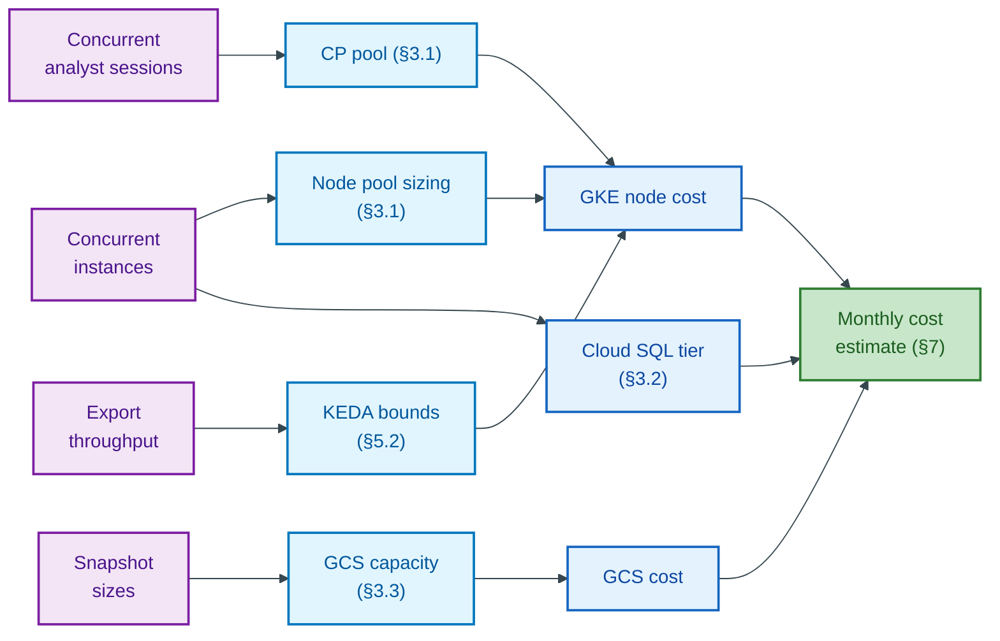
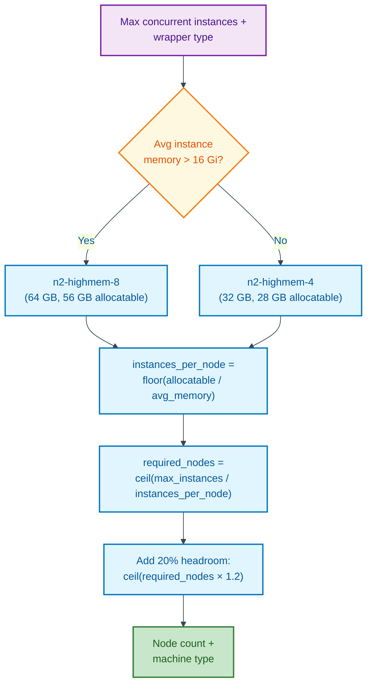
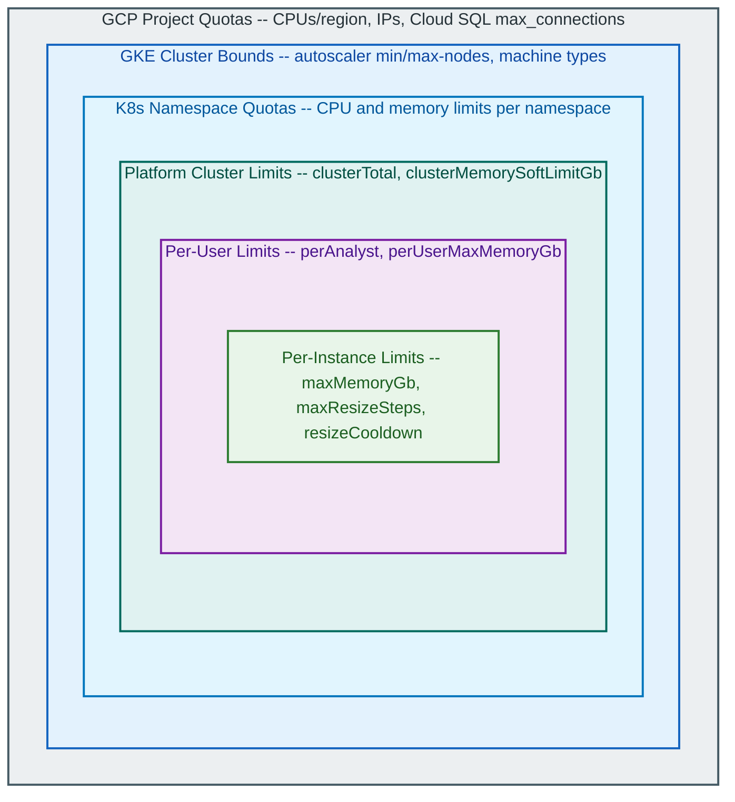

# Capacity Planning Guide

**Document Type:** Operations Manual
**Last Updated:** 2026-04-17
**ADR:** [ADR-133](--/process/adr/operations/adr-133-capacity-planning-guide.md)


> **Environment note:** Resource values in this guide are **platform defaults** captured from the HSBC deployment manifests under `infrastructure/cd/resources/` and the baseline Terraform variables. Operators should verify values against their environment-specific manifests (`infrastructure/cd/resources/<service>-deployment.yaml`) and Terraform configuration before acting on these numbers.

---

## 1. Current Resource Allocation

### 1.1 Platform Services

| Service | Replicas | CPU Request | CPU Limit | Memory Request | Memory Limit | Autoscaling |
|---------|----------|-------------|-----------|----------------|--------------|-------------|
| control-plane | 2 | 250m | 1000m | 2Gi | 6Gi | HPA (2→3, 70% CPU / 80% memory) |
| export-worker | 1 | 250m | 1000m | 512Mi | 1Gi | KEDA (1→5) |
| wrapper-proxy | 1 | 100m | 500m | 128Mi | 256Mi | None |
| documentation | 1 | 10m | 100m | 32Mi | 64Mi | None |

*Source: `infrastructure/cd/resources/` deployment manifests (HSBC Jenkins pipeline).*

### 1.2 Graph Instance Pods (Dynamic)

Graph instances are created on demand. Resources are determined by wrapper type and snapshot size.

| Wrapper | Memory Request | Memory Limit | CPU Request | CPU Limit | QoS Class |
|---------|----------------|--------------|-------------|-----------|-----------|
| Ryugraph (static default) | 2Gi | 4Gi | 1 | 2 | Burstable |
| FalkorDB (static default) | 2Gi | 4Gi | 1 | 2 | Burstable |
| Ryugraph (dynamic sizing) | 2--32Gi | = request | 1 | 2 | Guaranteed (memory) |
| FalkorDB (dynamic sizing) | 2--32Gi | = request | 1 | 2 | Guaranteed (memory) |

*Source: control-plane configuration (`config.ryugraph` / `config.falkordb` in the control-plane ConfigMap). Dynamic sizing is enabled by default (`sizing.enabled=true`). Platform default for `maxMemoryGb` is 32 GB.*

Dynamic sizing formula (when `sizing.enabled=true`):

```
base_memory = max(minMemoryGb, parquet_size_gb * multiplier + base_offset)
memory_gb   = min(base_memory * headroom, maxMemoryGb)

Ryugraph:  min(max(2.0, parquet_gb * 1.2 + 0.5) * 1.5, 32.0)
FalkorDB:  min(max(2.0, parquet_gb * 2.0 + 1.0) * 1.5, 32.0)
```

*Source: `instance_service.py:_calculate_resources`. The base offsets (+0.5 GB Ryugraph, +1.0 GB FalkorDB) account for process overhead before headroom is applied. Memory is rounded up to the nearest integer Gi.*

### 1.3 Analyst Notebook Capacity (HSBC-owned)

JupyterHub is **not deployed** in the HSBC target. Analyst notebook capacity
is provided by HSBC's VDI estate (ADR-108) or HSBC Dataproc clusters and
is sized, scaled, and culled by HSBC — the platform does not own the
analyst-side compute. The sections below discuss capacity only for the
platform services that run inside the HSBC GKE cluster.

### 1.4 Infrastructure Services

| Component | Module Default | Production Override | Notes |
|-----------|----------------|---------------------|-------|
| Cloud SQL PostgreSQL | db-custom-4-16384 | db-custom-4-16384 | 4 vCPU, 16 GB RAM, HA (REGIONAL) |
| GCS bucket | Standard, regional | Standard, regional | Region set per environment |
| GKE system node pool | e2-standard-4, 1--3 nodes | e2-standard-4, 3--5 nodes | Ingress, cert-manager, KEDA |
| GKE control-plane pool | e2-standard-4, 2--4 nodes | e2-standard-8, 3--10 nodes | Platform services, export workers |
| GKE instance node pool | n2-highmem-4, 0--20 nodes | n2-highmem-8, 0--50 nodes | Graph instance pods (Spot VMs) |

*Source: `infrastructure/terraform/modules/gke/variables.tf` (defaults) and `infrastructure/terraform/environments/production/terraform.tfvars` (overrides).*

---

## 2. Scaling Dimensions

The four primary factors that drive resource consumption:

| Dimension | Primary Resource Impact | Secondary Impact |
|-----------|------------------------|------------------|
| Concurrent graph instances | Node pool memory and CPU | Cloud SQL connections, GCS read IOPS |
| Concurrent analyst sessions (HSBC VDI / Dataproc) | Control-plane API load, wrapper-proxy load | (analyst-side compute is HSBC-owned) |
| Export job throughput | GCS write throughput, Starburst Galaxy query slots | Export worker CPU, Cloud SQL connections |
| Data volume (snapshot size) | Per-instance memory, GCS storage | Export duration, instance startup time |

These four dimensions feed independent sizing calculations that converge at a monthly cost estimate:


<details>
<summary>Mermaid Source</summary>



</details>

### 2.1 What Drives Scaling

**Graph instances are the main bottleneck.** Each instance is a pod that consumes 2--32 GB of memory. A single n2-highmem-8 node (64 GB RAM, ~56 GB allocatable) can host 7--14 Ryugraph instances or 5--10 FalkorDB instances depending on snapshot size. With the module-default n2-highmem-4 (32 GB RAM, ~28 GB allocatable), capacity is halved. When the instance node pool is full, new instances will pend until the cluster autoscaler provisions additional nodes (typically 2--5 minutes).

**Concurrent analyst sessions.** Analysts run the SDK from the HSBC VDI or
from HSBC Dataproc notebooks. Their compute is HSBC-owned; what the platform
cares about is the rate at which those sessions hit the control-plane API
and the wrapper-proxy. A running session typically issues a small number of
control-plane calls per minute plus bursty wrapper query traffic; sizing
headroom on the control-plane pool (§3.1) is driven by peak concurrent
sessions.

**Exports are rarely a bottleneck.** Export workers are lightweight and KEDA scales them from 0 to 5. Throughput is limited by Starburst Galaxy resource group quotas (concurrent query slots), not worker resources.

---

## 3. Sizing Formulas

### 3.1 Node Pool Sizing

**Instance node pool (graph pods):**

```
allocatable_memory_per_node = machine_memory * 0.875   # ~12.5% reserved for system
instances_per_node          = floor(allocatable_memory_per_node / avg_instance_memory)
required_nodes              = ceil(max_concurrent_instances / instances_per_node)
```

Example with production n2-highmem-8 (64 GB) and 4 Gi average instance:

```
allocatable = 64 * 0.875 = 56 GB
instances_per_node = floor(56 / 4) = 14
For 50 concurrent instances: ceil(50 / 14) = 4 nodes
```

Example with module-default n2-highmem-4 (32 GB) and 4 Gi average instance:

```
allocatable = 32 * 0.875 = 28 GB
instances_per_node = floor(28 / 4) = 7
For 50 concurrent instances: ceil(50 / 7) = 8 nodes
```

The following flowchart connects these formulas into a decision sequence:


<details>
<summary>Mermaid Source</summary>



</details>

**Control-plane node pool (platform services):**

```
platform_overhead = 1 Gi (control-plane: 2 replicas × 512Mi request) + 0.25 Gi (export-worker) + 0.2 Gi (docs + ext)
jupyter_overhead  = 0.25 Gi (hub: 256Mi request) + (concurrent_users * 0.5 Gi)
total             = platform_overhead + jupyter_overhead
required_nodes    = ceil(total / allocatable_memory_per_node)
```

### 3.2 Cloud SQL Sizing

| Workload Profile | Recommended Tier | vCPU | RAM | Storage |
|------------------|-----------------|------|-----|---------|
| Development (< 10 instances) | db-f1-micro | shared | 0.6 GB | 10 GB |
| Small (10--30 instances) | db-custom-2-8192 | 2 | 8 GB | 20 GB |
| Medium (30--100 instances) | db-custom-4-16384 | 4 | 16 GB | 50 GB |
| Large (100+ instances) | db-custom-8-32768 | 8 | 32 GB | 100 GB |

Key factors:

- Connection pool: default 25 connections per control-plane replica + 5 overflow
- Storage growth: ~1 KB per mapping, ~2 KB per snapshot, ~0.5 KB per instance record
- At 1000 total resources: ~5 MB metadata. Storage is dominated by WAL and backups.

### 3.3 GCS Capacity

```
gcs_storage = (avg_snapshot_size * active_snapshots) + (avg_export_size * export_retention_count)
```

| Parameter | Typical Value | Notes |
|-----------|---------------|-------|
| Average snapshot size | 50--500 MB | Parquet files, depends on row counts |
| Active snapshots | 2--5 per mapping | Old snapshots cleaned by lifecycle job |
| Export Parquet retention | 30 days default | Configurable via lifecycle rules |
| Growth rate | 1--10 GB/month | Depends on export frequency |

For 100 active snapshots at 200 MB average: ~20 GB. With lifecycle rules, GCS storage typically stays under 100 GB.

---

## 4. Growth Projections

### 4.1 Estimation Worksheet

Fill in projected values to estimate infrastructure requirements:

| Parameter | Current | 6 Months | 12 Months |
|-----------|---------|----------|-----------|
| Max concurrent graph instances | ___ | ___ | ___ |
| Average instance memory (Gi) | ___ | ___ | ___ |
| Max concurrent analyst sessions (VDI + Dataproc) | ___ | ___ | ___ |
| Exports per day | ___ | ___ | ___ |
| Average snapshot size (MB) | ___ | ___ | ___ |
| Active snapshot retention count | ___ | ___ | ___ |

### 4.2 Applying the Worksheet

1. **Node count** = `ceil(max_instances * avg_memory / allocatable_per_node)` + headroom (20%)
2. **Cloud SQL tier** = match against the sizing table in section 3.2
3. **GCS capacity** = `active_snapshots * avg_snapshot_size * retention_count`
4. **Monthly cost** = see section 7 for per-unit costs

---

## 5. Scaling Procedures

> For day-to-day scaling operations and broader operational procedures, see the [Platform Operations Manual](platform-operations.manual.md) ([ADR-129](--/process/adr/operations/adr-129-platform-operations-manual.md)). This section covers capacity-specific sizing changes.
>
> **Change Control:** All scaling procedures in this section are subject to HSBC Deliverance change control.

### 5.1 Horizontal Scaling: Add Replicas

**Control-plane** (increase API throughput):

```bash
# Option A: kubectl patch HPA (temporary — will be overwritten on next deploy)
kubectl patch hpa control-plane -n graph-olap-platform \
  -p '{"spec":{"minReplicas":3,"maxReplicas":15}}'

# Option B: Manual scale (temporary — reverts on next deploy)
kubectl scale deployment control-plane -n graph-olap-platform --replicas=3
```

> **Note:** Both options above are temporary. The `kubectl patch` change will be overwritten when `deploy.sh` next applies the deployment manifests. To make the change persistent, update the HPA specification in the deployment manifest under `infrastructure/cd/resources/` (typically `control-plane-deployment.yaml` or a sibling `control-plane-hpa.yaml`) and run `./infrastructure/cd/deploy.sh <service|all> <image-tag>`.

**Export-worker** (increase export throughput):

```bash
# Adjust KEDA ScaledObject max replicas (temporary — persist in manifest + deploy.sh)
kubectl patch scaledobject export-worker -n graph-olap-platform \
  --type merge -p '{"spec":{"maxReplicaCount":10}}'
```

### 5.2 Vertical Scaling: Resize Pods

**Wrapper instances** support in-place CPU and memory resizing via the SDK or API:

```python
# Increase CPU (both directions supported)
await client.instances.update_cpu(instance_id, cpu_cores=2)

# Increase memory (increase only -- decrease not supported)
await client.instances.update_memory(instance_id, memory_gb=8)
```

**Platform services** require a deployment update:

```bash
# Update control-plane resource limits
kubectl set resources deployment control-plane -n graph-olap-platform \
  --requests=cpu=500m,memory=1Gi \
  --limits=cpu=2,memory=2Gi
```

Persist the change in the deployment manifest under `infrastructure/cd/resources/control-plane-deployment.yaml` for the target environment and run `./infrastructure/cd/deploy.sh <service|all> <image-tag>` (or wait for Jenkins to apply) to make it permanent.

### 5.3 Node Pool Scaling

**Cluster autoscaler** manages the instance node pool automatically. To adjust bounds:

```bash
# Update autoscaler bounds via gcloud (persists)
gcloud container node-pools update graph-instances \
  --cluster=<CLUSTER_NAME> \
  --location=<REGION> \
  --enable-autoscaling \
  --min-nodes=0 \
  --max-nodes=75
```

**Add a larger machine type** if individual instances need more than the current node's allocatable memory:

```bash
# Create a new node pool with larger machines
gcloud container node-pools create graph-instances-large \
  --cluster=<CLUSTER_NAME> \
  --location=<REGION> \
  --machine-type=n2-highmem-16 \
  --num-nodes=0 \
  --enable-autoscaling \
  --min-nodes=0 \
  --max-nodes=10 \
  --node-labels=workload-type=graph-large
```

### 5.4 Database Scaling

**Resize Cloud SQL** (causes a brief restart, ~1--2 minutes):

```bash
gcloud sql instances patch <CLOUD_SQL_INSTANCE> \
  --tier=db-custom-8-32768 \
  --project=<PROJECT>
```

**Increase connection pool** (requires control-plane restart):

Update `database.poolSize` in the control-plane ConfigMap manifest under `infrastructure/cd/resources/` for the target environment and run `./infrastructure/cd/deploy.sh <service|all> <image-tag>` (or wait for Jenkins to apply).

### 5.5 Storage Scaling

GCS scales automatically. To adjust lifecycle rules:

```bash
# Set lifecycle rule: delete Parquet files older than 90 days
gsutil lifecycle set lifecycle-config.json gs://<BUCKET_NAME>
```

Example `lifecycle-config.json`:

```json
{
  "rule": [
    {
      "action": {"type": "Delete"},
      "condition": {"age": 90, "matchesPrefix": ["snapshots/"]}
    }
  ]
}
```

---

## 6. Resource Governance

Resource governance operates as a defense-in-depth hierarchy -- inner limits fire before outer ones. If a per-user limit is raised, the cluster-level and GKE-level limits serve as the next safeguard:


<details>
<summary>Mermaid Source</summary>



</details>

*Layers are listed by scope: outermost (GCP) catches what inner layers do not. See sections 6.1--6.3 for current values at each layer.*

### 6.1 Platform-Enforced Limits

The control-plane enforces these limits at runtime:

| Limit | Platform Default | Config Key | Purpose |
|-------|------------------|------------|---------|
| Max instances per analyst | 10 | `concurrency.perAnalyst` | Fair share across users |
| Max instances cluster-wide | 50 | `concurrency.clusterTotal` | Prevent cluster exhaustion |
| Per-instance max memory | 32 GB | `sizing.maxMemoryGb` | Limit single pod size |
| Per-user max memory | 64 GB | `sizing.perUserMaxMemoryGb` | Per-user memory cap (sum of all instances) |
| Cluster memory soft limit | 256 GB | `sizing.clusterMemorySoftLimitGb` | Warn when total wrapper memory exceeds this |
| Max auto-resize steps | 3 | `sizing.maxResizeSteps` | Cap automatic memory upgrades |
| Resize cooldown | 300s | `sizing.resizeCooldownSeconds` | Prevent resize storms |

*Source: platform defaults come from the control-plane ConfigMap (`config.sizing` / `config.concurrency`) shipped in `infrastructure/cd/resources/control-plane-configmap.yaml`.*

### 6.2 GKE and GCP Quotas

Check these quotas periodically. Exhaustion causes pod scheduling failures or API errors.

| Quota | Default | How to Check |
|-------|---------|--------------|
| CPUs per region | 24 (free tier), varies | `gcloud compute regions describe <REGION>` |
| In-use IP addresses | 23 per region | GCP Console > IAM & Admin > Quotas |
| GKE nodes per cluster | 5000 | GKE cluster settings |
| Persistent disks per project | 2500 | GCP Console > Quotas |
| Cloud SQL connections | 4000 (db-custom-4) | `SHOW max_connections;` on the database |

### 6.3 Kubernetes Resource Quotas

If namespace-level quotas are configured:

```bash
# Check current quota usage
kubectl describe resourcequota -n graph-olap-platform
```

---

## 7. Cost Estimation

### 7.1 Per-Unit Costs (asia-east2 / Hong Kong, on-demand, approximate)

| Resource | Unit | Monthly Cost | Notes |
|----------|------|--------------|-------|
| n2-highmem-8 node | per node | ~$360 | 8 vCPU, 64 GB RAM (production instance pool) |
| n2-highmem-4 node | per node | ~$180 | 4 vCPU, 32 GB RAM (module-default instance pool) |
| e2-standard-8 node | per node | ~$195 | 8 vCPU, 32 GB RAM (production CP pool) |
| e2-standard-4 node | per node | ~$100 | 4 vCPU, 16 GB RAM (system pool) |
| Cloud SQL db-custom-4-16384 HA | per instance | ~$400--600 | With HA and 50 GB storage |
| GCS Standard storage | per GB/month | ~$0.02 | Regional |
| GCS Class A operations | per 10K ops | ~$0.05 | CREATE, LIST |
| Spot VMs (n2-highmem-8) | per node | ~$108 | 60--80% discount (varies by availability) |

*Costs are approximate and region-dependent. Verify against the [GCP Pricing Calculator](https://cloud.google.com/products/calculator) for your deployment region.*

### 7.2 Cost Per Graph Instance

```
cost_per_instance_hour = (instance_memory_gb / node_allocatable_gb) * node_hourly_cost
```

Using production n2-highmem-8 (~$360/month, ~$0.50/hr, 56 GB allocatable):

| Instance Size | On-Demand (per hour) | Spot (per hour) | Monthly (8h/day, 22 days) |
|---------------|---------------------|-----------------|---------------------------|
| 2 Gi (small) | $0.018 | $0.005 | $3.17 |
| 4 Gi (typical) | $0.036 | $0.011 | $6.34 |
| 8 Gi (large) | $0.071 | $0.021 | $12.50 |
| 16 Gi | $0.143 | $0.043 | $25.17 |
| 32 Gi (platform max) | $0.286 | $0.086 | $50.34 |

### 7.3 Cost Per Analyst Session

Analyst notebook compute is HSBC-owned (VDI / Dataproc) and is not a platform
cost line. The only platform-side cost attributable to a concurrent analyst
session is incremental control-plane and wrapper-proxy capacity, already
accounted for under §3.1 (CP pool) and the wrapper-proxy sizing.

### 7.4 Monthly Cost Model

| Component | Small (10 instances, 5 users) | Medium (50 instances, 20 users) | Large (100+ instances, 50 users) |
|-----------|-------------------------------|----------------------------------|-----------------------------------|
| GKE cluster fee | $74 | $74 | $74 |
| System nodes (3x e2-standard-4) | $300 | $300 | $500 (5 nodes) |
| CP nodes (3x e2-standard-8) | $585 | $975 (5 nodes) | $1,560 (8 nodes) |
| Instance nodes (on-demand) | $360 (1 node) | $1,440 (4 nodes) | $2,880 (8 nodes) |
| Instance nodes (Spot) | $108 | $432 | $864 |
| Cloud SQL | $200 | $500 | $800 |
| GCS | $5 | $20 | $50 |
| Networking/NAT | $100 | $200 | $300 |
| Observability | $100 | $200 | $400 |
| **Total (on-demand)** | **$1,724** | **$3,709** | **$6,564** |
| **Total (Spot instances)** | **$1,472** | **$2,701** | **$4,548** |

### 7.5 Cost Optimisation Levers

| Lever | Savings | Trade-off |
|-------|---------|-----------|
| Spot VMs for instance pool | 60--80% on instance nodes | Preemption risk (mitigated by ephemeral nature of graph pods) |
| KEDA scale-to-zero | 100% when no exports pending | Cold start delay (~30s for first export) |
| Instance TTL + idle timeout | Proportional to idle time saved | Users must recreate expired instances |
| GCS lifecycle rules | Proportional to deleted data | Old snapshots unavailable for re-loading |
| Committed use discounts (1yr/3yr) | 37%/55% on nodes | Capacity commitment required |

---

## 8. Monitoring for Capacity

### 8.1 Key Metrics and Thresholds

| Metric | Warning Threshold | Critical Threshold | Action |
|--------|-------------------|--------------------|--------|
| Node pool utilisation (allocatable) | > 70% | > 85% | Increase max-nodes or add larger machine type |
| Pending pods (> 5 min) | any | > 3 pods pending | Check autoscaler status, node quotas |
| Cloud SQL connection count | > 80% of max_connections | > 90% | Resize Cloud SQL or reduce pool size |
| Cloud SQL CPU | > 70% sustained | > 85% sustained | Resize to higher tier |
| GCS storage total | > 80% of budget | > 90% of budget | Review lifecycle rules, reduce retention |
| Control-plane HPA at max replicas | sustained > 10 min | sustained > 30 min | Increase maxReplicas or vertical scale |
| Wrapper OOMKilled events | > 2 per day | > 5 per day | Increase sizing.maxMemoryGb or headroom |
| Export queue depth | > 50 pending | > 100 pending | Scale KEDA maxReplicaCount, check Starburst Galaxy |

### 8.2 Prometheus Queries

```promql
# Node pool memory utilisation
sum(container_memory_usage_bytes{namespace="graph-olap-platform"}) /
sum(kube_node_status_allocatable{resource="memory"}) * 100

# Pending wrapper pods
count(kube_pod_status_phase{namespace="graph-olap-platform", phase="Pending", pod=~".*wrapper.*"})

# Cloud SQL connections in use (via Cloud Monitoring)
cloudsql.googleapis.com/database/postgresql/num_backends

# OOMKilled events
increase(kube_pod_container_status_last_terminated_reason{reason="OOMKilled", namespace="graph-olap-platform"}[24h])

# Export queue depth
graph_olap_export_jobs_pending
```

### 8.3 Capacity Review Cadence

| Review | Frequency | Scope |
|--------|-----------|-------|
| Daily health check | Daily | Pending pods, OOMKills, export queue depth |
| Capacity review | Monthly | Node utilisation trends, Cloud SQL sizing, GCS growth |
| Cost review | Quarterly | Actual vs. budget, Spot VM savings, CUD opportunities |
| Growth planning | Bi-annually | Forecast based on user adoption, new use cases |

---

## 9. Operational Scaling Checklist

Use this checklist before changing cluster capacity. It summarises the four places capacity is bounded (platform governance limits, instance node pool, control-plane node pool, cost levers) and the main diagnostic and verification steps. Sections 1–8 above hold the derivations, formulas, and cost model; this section is the actionable summary.

> **Change Control:** every item that edits Terraform, manifests under `infrastructure/cd/resources/`, or persistent `global_config` is in scope for Deliverance change control. Open a change request before starting.

### 9.1 Before Scaling — Diagnose

Do not scale reflexively. First determine whether the bottleneck is the platform-level governance cap or real infrastructure exhaustion — scaling the node pool alone does not help if the control-plane cap is the limiter.

- [ ] Read `GET /api/config/concurrency` and `GET /api/cluster/instances` to see the configured limits and current counts. See [Troubleshooting — Instance Limit Reached](troubleshooting.runbook.md#instance-limit-reached--409-concurrency_limit_exceeded).
- [ ] If a `409 CONCURRENCY_LIMIT_EXCEEDED` has fired, check the `details.limit_type` field. Values of `per_analyst`, `cluster_total`, `user_memory`, or `cluster_memory` mean the platform cap is the limiter, not the node pool.
- [ ] Check instance node pool utilisation: `kubectl top nodes -l graph-olap.io/workload=instance`. Under 60% memory use means the cluster is not the limit.
- [ ] Check for pending pods: `kubectl get events -n graph-olap-platform --field-selector reason=FailedScheduling`. Anything pending for more than 5 minutes indicates a stuck autoscaler (quota, zonal stockout, `max_node_count` reached). See [§8.1 Monitoring Signals](#8-monitoring-signals).
- [ ] Check for stuck or idle instances inflating the active count: instances in `CREATING`/`DELETING` for over 10 minutes, or `running` instances with stale `last_used_at`. See [Troubleshooting — Graph Instance Stuck](troubleshooting.runbook.md#graph-instance-stuck-in-creating-or-deleting).

### 9.2 Platform-Level Governance Limits (Runtime Config — Cheapest Lever)

These are in-database or env-var caps enforced before the control plane asks Kubernetes for a pod. Changing them is cheaper and faster than changing node-pool capacity, and is often the only thing needed.

- [ ] `concurrency.per_analyst` — per-user active instance cap. Default `5` seeded from env (env default `10`). Change via `PUT /api/config/concurrency`. See [Configuration Reference — Runtime Configuration](configuration-reference.md#runtime-configuration-database-global_config).
- [ ] `concurrency.cluster_total` — cluster-wide active instance cap. Default `50`. Same endpoint.
- [ ] `GRAPH_OLAP_SIZING_MAX_MEMORY_GB` — per-instance memory cap. Default `32 GiB`. Control-plane env var; requires pod restart.
- [ ] `GRAPH_OLAP_SIZING_PER_USER_MAX_MEMORY_GB` — per-user total memory cap. Default `64 GiB`.
- [ ] `GRAPH_OLAP_SIZING_CLUSTER_MEMORY_SOFT_LIMIT_GB` — cluster-wide memory soft cap. Default `256 GiB`. **Raising this without raising node-pool capacity trades `CONCURRENCY_LIMIT_EXCEEDED` errors for `FailedScheduling` events** — it is a soft budget that protects the cluster, not a hard enforcement.

### 9.3 Instance Node Pool (GKE — Where Graph Pods Run)

- [ ] Read current bounds: `gcloud container node-pools describe graph-instances --cluster=<CLUSTER> --zone=<ZONE>`.
- [ ] Confirm GCP project quota for the extra CPUs, IPs, and the chosen machine type: `gcloud compute project-info describe --project=<PROJECT>`. Quotas are the real ceiling — see [§6.2 GKE and GCP Quotas](#62-gke-and-gcp-quotas).
- [ ] Prefer raising `--max-nodes` (horizontal) over changing machine types. Larger machines change per-instance packing and resize-step behaviour and should be a deliberate decision, documented in an ADR.
- [ ] Apply via Terraform (`infrastructure/terraform/environments/production/terraform.tfvars`), not ad-hoc `gcloud` — otherwise the next Terraform apply reverts the change. See [§5.3 Node Pool Scaling](#53-node-pool-scaling).
- [ ] Raise the control-plane `cluster_memory` soft limit in lock-step, otherwise the new capacity will sit idle behind the platform cap.
- [ ] After the change, watch `kubectl get nodes -l graph-olap.io/workload=instance` for 5–10 minutes and re-run §9.1.

### 9.4 Control-Plane Node Pool (Platform Services)

- [ ] Only scale this when the control-plane, export-worker, or wrapper-proxy itself is saturated. Verify with `kubectl top pods -n graph-olap-platform -l app.kubernetes.io/name=control-plane`. It is usually not the bottleneck.
- [ ] Prefer HPA/replica increases over node-pool changes. The platform services are horizontally scalable.

### 9.5 Cost Levers — Highest Impact First

Ranked by rough return on effort. See [§7.5 Cost Optimisation Levers](#75-cost-optimisation-levers) for per-unit savings estimates.

- [ ] **Instance TTL.** Lower `snapshot_ttl_hours` and instance TTL via `PUT /api/ops/lifecycle-config` so idle instances are reaped faster. Idle instances are the dominant cost driver.
- [ ] **Spot VMs for the instance node pool.** Confirm the node pool's Spot setting in Terraform (`infrastructure/terraform/environments/<env>/terraform.tfvars`) before disabling. Spot VMs are 60–80% cheaper than on-demand; preemptions are handled by the reconciliation job.
- [ ] **Right-size per-instance memory.** Encourage analysts to request smaller instances when the dataset allows; enforce with `GRAPH_OLAP_SIZING_MAX_MEMORY_GB`.
- [ ] **GCS lifecycle rule.** 90-day auto-delete on the snapshot bucket is the backstop for the [GCS cleanup gap](known-issues.md#gcs-bucket-permission-failure-silently-disables-cleanup). Confirm it is in place.
- [ ] **Cloud SQL tier.** Control-plane database is low-write; a smaller tier meaningfully reduces fixed monthly cost for non-prod. Production should stay on a HA tier.
- [ ] **Scale the instance node pool to zero outside business hours** if the workload is not 24/7. Combined with Spot VMs, this is the second biggest lever after TTL.

### 9.6 After Any Change — Verify

- [ ] Re-run §9.1 diagnostics. Confirm `GET /api/cluster/instances` reports the new limits and `kubectl top nodes` shows the expected headroom.
- [ ] Persist the change in `infrastructure/terraform/environments/production/terraform.tfvars` and the deployment manifests under `infrastructure/cd/resources/` so it survives Terraform reconciliation and Jenkins redeploys.
- [ ] Record before/after values, the new steady-state cost estimate from [§7.4 Monthly Cost Model](#74-monthly-cost-model), and the Deliverance ticket number in the change request.

---

## Related Documents

- [Platform Operations Manual (ADR-129)](platform-operations.manual.md)
- [Monitoring and Alerting Runbook (ADR-131)](monitoring-alerting.runbook.md)
- [Service Catalogue (ADR-134)](service-catalogue.manual.md)
- [Platform Operations Architecture](--/architecture/platform-operations.md) -- SLOs, cost model, operational architecture
- [Observability Design](observability.design.md)
- [Detailed Architecture](--/architecture/detailed-architecture.md) -- resource management, dynamic sizing, governance
- [ADR-051: Wrapper Resource Allocation Strategy](--/process/adr/infrastructure/adr-051-wrapper-resource-allocation-strategy.md)
- [ADR-068: Wrapper Resource Optimization](--/process/adr/infrastructure/adr-068-wrapper-resource-optimization.md)
- [ADR-129: Platform Operations Manual](--/process/adr/operations/adr-129-platform-operations-manual.md) -- companion operations manual; scaling execution steps
- [ADR-133: Capacity Planning Guide](--/process/adr/operations/adr-133-capacity-planning-guide.md)
- [ADR-135: Troubleshooting Guide](--/process/adr/operations/adr-135-troubleshooting-guide.md) -- diagnostic trees for capacity-related failures
