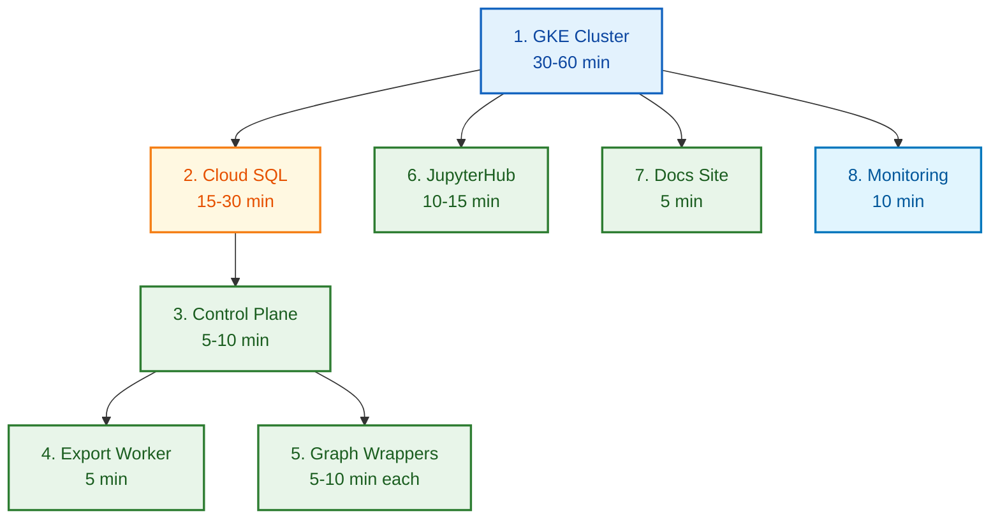
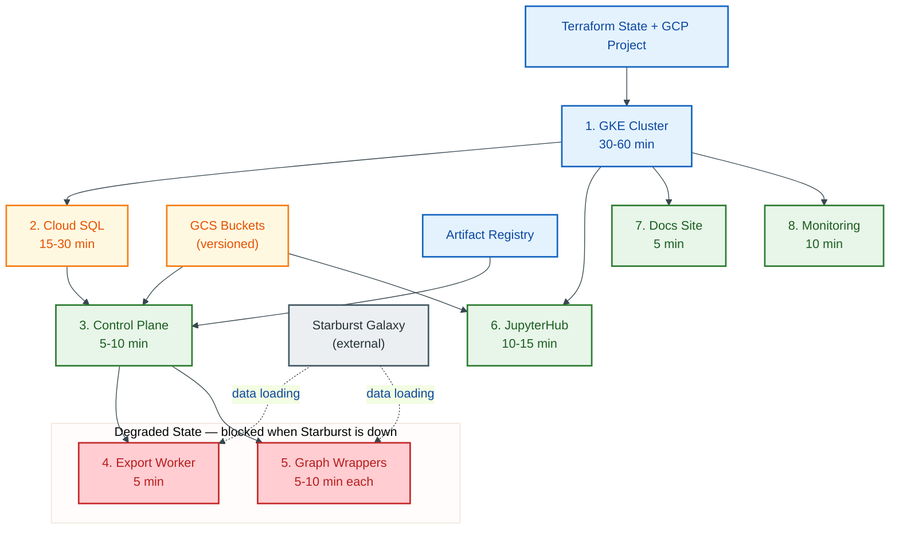
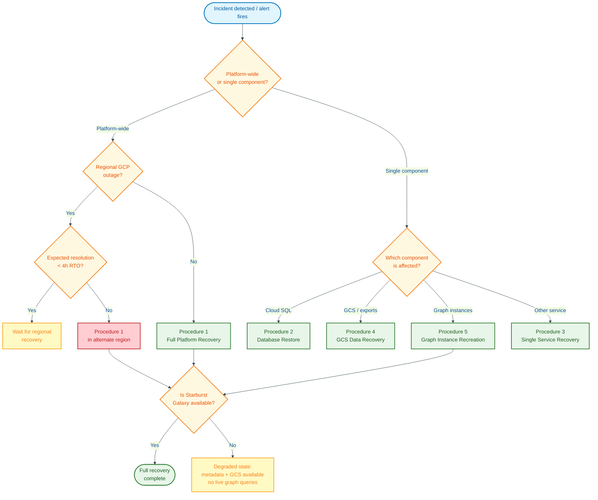
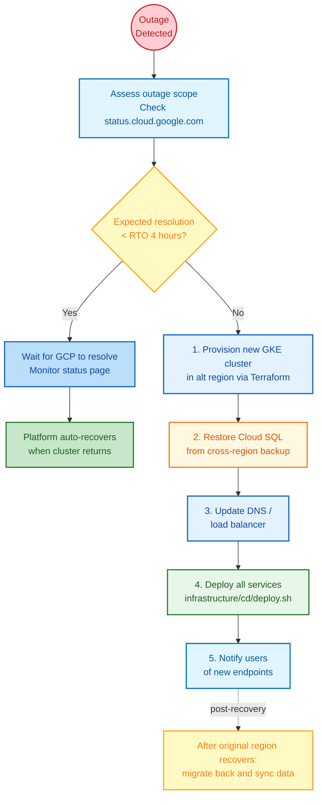

# Disaster Recovery Runbook

**Version:** 1.0
**Last Updated:** 2026-04-08

This runbook defines the disaster recovery plan for the Graph OLAP Platform, including RPO/RTO targets, backup inventory, recovery procedures, and DR testing schedules.

**References:**

- [ADR-132: Disaster Recovery Plan](--/process/adr/operations/adr-132-disaster-recovery-plan.md)
- [Deployment Design](-/deployment.design.md) -- infrastructure architecture
- [Observability Design](-/observability.design.md) -- monitoring and alerting
- [Security Operations Runbook](-/security-operations.runbook.md) -- access control and secret management

## Table of Contents

- [Data Classification](#data-classification)
- [RPO/RTO Targets](#rporto-targets)
- [Recovery Priority Table](#recovery-priority-table)
- [Backup Inventory](#backup-inventory)
- [Recovery Procedures](#recovery-procedures)
- [Failover Procedures](#failover-procedures)
- [External Dependency Matrix](#external-dependency-matrix)
- [Access Control Requirements](#access-control-requirements)
- [DR Testing Schedule](#dr-testing-schedule)
- [Communication Plan](#communication-plan)

---

## Data Classification

### Critical Data (Must Be Restored)

| Data | Location | Why Critical |
|------|----------|--------------|
| Instance configurations | Cloud SQL PostgreSQL | Defines all graph instances, their mappings, and current state |
| Mapping definitions | Cloud SQL PostgreSQL | Source-to-graph transformation rules created by users |
| Snapshot metadata | Cloud SQL PostgreSQL | Tracks which snapshots exist, their status, and GCS locations |
| Export job records | Cloud SQL PostgreSQL | Export history, status, and audit trail |
| User session data | Cloud SQL PostgreSQL | JupyterHub user state and permissions |

### Important Data (Should Be Restored if Possible)

| Data | Location | Why Important |
|------|----------|---------------|
| Parquet snapshots | GCS bucket | Export outputs used for downstream analytics |
| Notebook content | GCS bucket | User-created and curriculum notebooks |
| Exported data files | GCS bucket | Completed export artifacts |

### Reconstructable Data (Can Be Rebuilt)

| Data | Location | Why Reconstructable |
|------|----------|---------------------|
| Graph instances (pods) | GKE cluster | Ephemeral; recreated from mappings + source data via the control plane |
| Schema cache | In-memory / Cloud SQL | Rebuilt automatically by the schema cache background job |
| Prometheus metrics | Managed Prometheus | Historical metrics are useful but not required for recovery |
| Application logs | Cloud Logging | Useful for investigation but not required for recovery |

---

## RPO/RTO Targets

| Component | RPO | RTO | Notes |
|-----------|-----|-----|-------|
| Cloud SQL PostgreSQL | 5 minutes | 30 minutes | Point-in-time recovery within backup window |
| GCS Buckets | 0 (versioned) | 15 minutes | Object versioning provides zero data loss |
| GKE Cluster | N/A | 2 hours | Cluster can be rebuilt from infrastructure-as-code; no persistent state |
| Control Plane | N/A | 15 minutes | Stateless; redeploy from container image |
| Export Worker | N/A | 15 minutes | Stateless; KEDA rescales automatically |
| Graph Wrappers | N/A | 10 minutes per instance | Ephemeral; recreated from source data |
| JupyterHub | N/A | 20 minutes | Redeploy from deployment manifest; user servers are ephemeral |
| Docs Site | N/A | 10 minutes | Static content; redeploy from container image |
| Full Platform | 5 minutes | 4 hours | Complete rebuild from scratch |

**Definitions:**

- **RPO (Recovery Point Objective):** Maximum acceptable data loss measured in time.
- **RTO (Recovery Time Objective):** Maximum acceptable downtime from disaster to full service restoration.

> **Caveat:** RPO/RTO targets above represent *technical recovery time* and exclude Deliverance change-control approval overhead. HSBC operations must account for emergency change-request lead time when setting SLA commitments. During P1 incidents, the Deliverance emergency change process applies (see [Recovery Procedures](#recovery-procedures)).

---

## Recovery Priority Table

Recover components in priority order. The diagram below shows technical dependencies — components that share only a GKE dependency can be restored in parallel.


<details>
<summary>Mermaid Source</summary>



</details>

| Priority | Component | Estimated Time | Dependencies | Validation |
|----------|-----------|---------------|--------------|------------|
| 1 | GKE Cluster | 30-60 min | Terraform state, GCP project | Nodes are Ready |
| 2 | Cloud SQL PostgreSQL | 15-30 min | GKE cluster (for connectivity) | `pg_isready` succeeds |
| 3 | Control Plane | 5-10 min | Cloud SQL, GCS, container registry | `/health` returns 200 |
| 4 | Export Worker | 5 min | Control Plane, Starburst Galaxy | KEDA ScaledObject active |
| 5 | Graph Wrappers | 5-10 min each | Control Plane | Instances reach RUNNING state |
| 6 | JupyterHub | 10-15 min | GKE cluster, GCS | Hub pod Ready, login works |
| 7 | Docs Site | 5 min | GKE cluster | Pod Ready, site loads |
| 8 | Monitoring and Alerting | 10 min | GKE cluster, Managed Prometheus | Dashboards load, test alert fires |

**Total estimated recovery time (full rebuild): 2-4 hours**

### Recovery Dependency Graph

The priority table above is not strictly linear — several components can recover in parallel, and two depend on the external Starburst Galaxy service. When Starburst is unavailable, the platform recovers in a **degraded state** (shaded red below).


<details>
<summary>Mermaid Source</summary>



</details>

**Key insight:** Components 6-8 (JupyterHub, Docs, Monitoring) depend only on GKE and GCS — they can recover in parallel with components 3-5 once the cluster is up. If Starburst Galaxy is also down during a DR event, proceed with recovery of all other components; graph instances and exports resume automatically when Starburst returns (see [Starburst Galaxy Unavailability](#starburst-galaxy-unavailability)).

---

## Backup Inventory

### Cloud SQL PostgreSQL

> **Environment scope:** The table below describes the **HSBC production** posture. The `gcp-london-demo` environment runs its Cloud SQL instance with `backup_configuration { enabled = false }` and no deletion protection (see `infrastructure/terraform/environments/gcp-london-demo/main.tf`) -- demo data is ephemeral, backup/restore commands in this runbook will not produce results against that instance, and DR procedures cannot be exercised against it. HSBC production uses the shared module at `infrastructure/terraform/modules/cloudsql/` with the settings below.

| Setting | Value (production) |
|---------|--------------------|
| Terraform source | `infrastructure/terraform/modules/cloudsql/` (used by `environments/production/main.tf` and `environments/staging/main.tf`) |
| Backup type | Automated daily + continuous WAL archiving |
| Frequency | Daily full backup at 03:00 UTC (`start_time = "03:00"` in the module) |
| Point-in-time recovery | Enabled (`point_in_time_recovery = true`, recoverable to any second within retention) |
| Retention | 7 days by default (`backup_retention_days`); on-demand backups retained per their individual `--description` unless deleted manually |
| Location | Same region as the Cloud SQL instance |
| Encryption | Google-managed encryption keys (CMEK is not yet wired -- see ADR-149 Tier-A.10) |

**Verification:** Cloud Console > SQL > Instance > Backups tab shows daily backups with status "Successful".

> **Retention override:** If a retention window longer than 7 days is required for compliance, set `backup_retention_days` in the production Terraform vars and `terraform apply`. Do not rely on 30/365-day figures -- those were historical planning targets, not the current module defaults.

### Google Cloud Storage

| Bucket | Versioning | Lifecycle | Contents |
|--------|-----------|-----------|----------|
| `graph-olap-<env>-snapshots` | Enabled | Delete non-current versions after 90 days (default) | Parquet snapshots, exports, notebooks |

> **Note:** Only one GCS bucket is currently provisioned by Terraform (`infrastructure/terraform/modules/gcs/`). Consider whether separate buckets for exports and notebooks are needed.

**Verification:** `gsutil versioning get gs://<BUCKET>` returns `Enabled`.

### Kubernetes (GKE-Managed)

| Component | Backup Method | Notes |
|-----------|--------------|-------|
| etcd | GKE-managed automatic backups | Google manages etcd backups for GKE clusters |
| Deployment manifests | Git repository (source of truth) | All manifests in `infrastructure/cd/resources/` |
| Terraform state | GCS backend bucket | Backend defined inline in each environment's `main.tf` (e.g. `infrastructure/terraform/environments/production/main.tf`) |
| Container images | Artifact Registry | Tagged images persist until deleted |

### Configuration as Code

| Artifact | Repository Location | Notes |
|----------|-------------------|-------|
| Deployment manifests | `infrastructure/cd/resources/` | Raw Kubernetes YAML with `${VERSION}` placeholders |
| Terraform modules | `infrastructure/terraform/` | GKE, Cloud SQL, GCS, IAM, monitoring |
| Alerting rules | `infrastructure/cd/resources/monitoring/` | Raw Kubernetes YAML applied by `infrastructure/cd/deploy.sh` |
| Deploy script | `infrastructure/cd/deploy.sh` | Runs `sed ${VERSION}` on templates then `kubectl apply -f` |

---

## Recovery Procedures

> **Change Control:** All recovery procedures require a Deliverance change request before execution. During P1 incidents, use the Deliverance emergency change request process. Do not skip change control -- it is required for SOX compliance even during emergencies. Obtain retrospective approval within 24 hours for emergency changes.

### Recovery Triage — Which Procedure to Follow

Use this decision tree to determine which recovery procedure applies. Start at the top and follow the branches.


<details>
<summary>Mermaid Source</summary>



</details>

After selecting a procedure, follow the detailed steps below. Remember to open a Deliverance change request (Step 0 of every procedure).

### Procedure 1: Full Platform Recovery

**Scenario:** The GKE cluster is destroyed or the GCP project needs to be rebuilt.

**Step 0: Open a Deliverance change request.** Reference the Deliverance ticket number in all subsequent commands, commits, and communication. For P1 incidents, use the emergency change process.

**Prerequisites:**

- Access to the Git repository containing Terraform and deployment manifest configurations.
- Access to a GCP project with sufficient quotas.
- Terraform state available (GCS backend bucket: `hsbc-12636856-udlhk-dev-tfstate`). If the state bucket is in the affected region, restore from a cross-region replica or rebuild state with `terraform import`.
- Container images available in Artifact Registry (`graph-olap` repository, project `hsbc-12636856-udlhk-dev`, region `asia-east2`). If the registry is in the affected region, rebuild images from source through the Jenkins CI pipeline and push to the HSBC Artifact Registry.

**Steps:**

1. **Provision infrastructure with Terraform:**
   ```bash
   cd infrastructure/terraform/environments/production/
   terraform init
   terraform plan -out=recovery.tfplan
   terraform apply recovery.tfplan
   ```
   This creates: GKE cluster, Cloud SQL instance, GCS buckets, IAM bindings, VPC, monitoring resources.

2. **Restore Cloud SQL from backup:**
   ```bash
   gcloud sql backups list --instance=<INSTANCE_NAME>
   gcloud sql backups restore <BACKUP_ID> --restore-instance=<INSTANCE_NAME>
   ```
   Or use point-in-time recovery (see [Procedure 2](#procedure-2-database-restore)).

3. **Configure kubectl for the new cluster:**
   ```bash
   gcloud container clusters get-credentials <CLUSTER_NAME> \
     --region <REGION> --project <PROJECT_ID>
   ```

4. **Deploy all services:**
   ```bash
   # From the infrastructure/cd/ directory:
   ./deploy.sh <VERSION>
   ```

5. **Verify recovery:**
   - Control plane health: `curl https://<API_URL>/health`
   - Background jobs running: check `background_job_health_status` metric.
   - Export pipeline: submit a test export and verify completion.
   - JupyterHub: log in and verify notebook access.

6. **Restore monitoring:**
   - Verify dashboards are accessible in Cloud Monitoring.
   - Confirm alert policies are active.
   - Trigger a test alert to verify notification channels.

### Procedure 2: Database Restore

**Scenario:** Cloud SQL data is corrupted or lost, but the GKE cluster is intact.

**Step 0: Open a Deliverance change request.** Reference the Deliverance ticket number in all subsequent commands, commits, and communication. For P1 incidents, use the emergency change process.

**Option A: Restore from Automated Backup**

1. List available backups:
   ```bash
   gcloud sql backups list --instance=<INSTANCE_NAME> --limit=10
   ```

2. Restore from backup (this replaces all data in the instance):
   ```bash
   gcloud sql backups restore <BACKUP_ID> --restore-instance=<INSTANCE_NAME>
   ```

3. Wait for the restore operation to complete (monitor in Cloud Console > SQL > Operations).

4. Restart the control plane to reconnect:
   ```bash
   kubectl -n graph-olap-platform rollout restart deploy/control-plane
   ```

5. Verify: run a basic API call to confirm data is present.

**Option B: Point-in-Time Recovery**

Use this when you need to recover to a specific moment (e.g., just before a bad migration).

1. Create a new instance from point-in-time recovery:
   ```bash
   gcloud sql instances clone <SOURCE_INSTANCE> <NEW_INSTANCE> \
     --point-in-time="2026-04-08T14:30:00Z"
   ```

2. Verify the restored data on the new instance.

3. Update the control plane deployment manifest (`infrastructure/cd/resources/control-plane-deployment.yaml`) to point at the new Cloud SQL instance.

4. Redeploy:
   ```bash
   # From the infrastructure/cd/ directory:
   ./deploy.sh <VERSION>
   ```

5. Decommission the old instance once recovery is confirmed.

### Procedure 3: Single Service Recovery

**Scenario:** One service is down or corrupted, but the rest of the platform is healthy.

**Step 0: Open a Deliverance change request.** Reference the Deliverance ticket number in all subsequent commands, commits, and communication. For P1 incidents, use the emergency change process.

1. Identify the failed service:
   ```bash
   kubectl -n graph-olap-platform get pods
   ```

2. Check if the issue is a bad image or configuration:
   ```bash
   kubectl -n graph-olap-platform describe pod -l app=<SERVICE>
   kubectl -n graph-olap-platform logs -l app=<SERVICE> --tail=200
   ```

3. Redeploy the service:
   ```bash
   # From the infrastructure/cd/ directory:
   ./deploy.sh <VERSION>
   ```
   This deploys all services managed by `deploy.sh`. To roll back a single service instead:
   ```bash
   kubectl rollout undo deployment/<SERVICE> -n graph-olap-platform
   ```
   Where `<SERVICE>` is one of: `control-plane`, `export-worker`, `ryugraph-wrapper`, `falkordb-wrapper`, `documentation`, `nginx-wrapper-proxy`.

   > **Note:** JupyterHub (`jupyter-labs`) is deployed via the upstream [Zero-to-JupyterHub Helm chart](https://z2jh.jupyter.org/) (an explicitly documented ADR-128 exception -- no other service on this platform uses Helm). Roll back JupyterHub with `helm rollback jupyter-labs -n graph-olap-platform`. All other services use `infrastructure/cd/deploy.sh rollback <service> <previous-version>` or `kubectl rollout undo deployment/<service> -n graph-olap-platform`.

4. If the current image is bad, roll back to the previous image tag:
   ```bash
   kubectl -n graph-olap-platform rollout undo deploy/<SERVICE>
   ```

5. Verify the service is healthy:
   ```bash
   kubectl -n graph-olap-platform rollout status deploy/<SERVICE>
   ```

### Procedure 4: GCS Data Recovery

**Scenario:** Objects in GCS were accidentally deleted or overwritten.

**Step 0: Open a Deliverance change request.** Reference the Deliverance ticket number in all subsequent commands, commits, and communication. For P1 incidents, use the emergency change process.

1. List object versions to find the version before deletion:
   ```bash
   gsutil ls -la gs://<BUCKET>/<PATH>
   ```

2. Restore a specific version by copying it back:
   ```bash
   gsutil cp gs://<BUCKET>/<PATH>#<GENERATION> gs://<BUCKET>/<PATH>
   ```

3. To restore an entire prefix (directory):
   ```bash
   gsutil ls -la gs://<BUCKET>/<PREFIX>/ | grep -v "#" | head -20
   # Identify the correct generation numbers, then copy each back.
   ```

4. Verify the restored objects:
   ```bash
   gsutil stat gs://<BUCKET>/<PATH>
   ```

### Procedure 5: Graph Instance Recovery

**Scenario:** Graph instances are lost (pods deleted, node failure).

**Step 0: Open a Deliverance change request.** Reference the Deliverance ticket number in all subsequent commands, commits, and communication. For P1 incidents, use the emergency change process.

Graph instances are **ephemeral by design**. They are created from source data (via Starburst Galaxy) and loaded into in-memory graph databases. Recovery means recreating them.

1. Check instance status in the control plane:
   ```bash
   curl https://<API_URL>/api/v1/instances
   ```

2. Instances stuck in CREATING or FAILED states will be cleaned up by the reconciliation background job.

3. To manually recreate a specific instance:
   ```bash
   curl -X POST https://<API_URL>/api/v1/instances \
     -H "Content-Type: application/json" \
     -d '{"mapping_id": <MAPPING_ID>}'
   ```

4. Wait for the instance to reach RUNNING state. This involves:
   - Pod scheduling on a GKE node.
   - Data loading from Starburst Galaxy into the graph engine.
   - Typical creation time: 2-10 minutes depending on data volume.

5. If many instances need recreation, the control plane handles this automatically once it is healthy. Users can also recreate instances via the API or notebook SDK.

---

## Failover Procedures

### Cross-Region Failover Prerequisites

The following must be pre-configured for cross-region failover to be executable during a regional outage. Without them, the failover procedure below is **not executable** and the team must wait for regional recovery or rebuild from source.

| Resource | Replication Requirement | Current Status |
|----------|------------------------|----------------|
| Terraform state bucket (`hsbc-12636856-udlhk-dev-tfstate`) | Replicate to a secondary region (dual-region or multi-region bucket) | **Not configured** -- single-region bucket |
| Artifact Registry (`graph-olap`) | Mirror or replicate container images to a secondary region | **Not configured** -- single-region repository |
| Cloud SQL backups | Cross-region backup or read replica in secondary region | Available via `gcloud sql backups` (same-region only by default) |
| Git repository | Available from any region (GitHub-hosted) | ✓ Available |

> **Action required:** To make cross-region failover executable, configure the Terraform state bucket as dual-region and set up Artifact Registry replication. Until then, a regional outage requires rebuilding images from source and importing Terraform state, extending RTO significantly.


<details>
<summary>Mermaid Source</summary>



</details>

### GKE Cluster Unavailable

If the primary GKE cluster is completely unavailable (region outage, quota exhaustion, networking failure):

1. **Assess the outage scope.** Check https://status.cloud.google.com for GCP incidents.

2. **If regional outage (expected resolution < RTO):** Wait for Google to resolve. Monitor the GCP status page. The platform will auto-recover when the cluster returns.

3. **If prolonged outage (expected resolution > RTO):**
   - Provision a new GKE cluster in an alternative region using Terraform.
   - Restore Cloud SQL using a cross-region replica or backup.
   - Update DNS/load balancer to point to the new cluster.
   - Deploy services using `./deploy.sh <VERSION>` from the `infrastructure/cd/` directory.
   - Notify users of the new endpoints.

4. **After failover, once the original region recovers:**
   - Migrate back by repeating the process in reverse.
   - Synchronize Cloud SQL data if both instances diverged.

### Cloud SQL Unavailable

If Cloud SQL is unreachable but GKE is healthy:

1. Check Cloud SQL instance status in the Console.
2. If the instance is in maintenance, wait for it to complete (typically < 15 min).
3. If the instance is down, failover to the Cloud SQL HA replica (if configured):
   ```bash
   gcloud sql instances failover <INSTANCE_NAME>
   ```
4. If no HA replica, restore from backup (see [Procedure 2](#procedure-2-database-restore)).
5. The control plane will return 503 errors until the database is restored. This is expected.

---

## DR Testing Schedule

### Test Ownership

| Role | Responsibility |
|------|---------------|
| Platform lead | Schedules DR tests, approves test plans, reviews results |
| On-call engineer | Executes quarterly DR test procedures |
| Database administrator | Executes and validates database restore tests |
| HSBC operations manager | Participates in annual full-platform tests, signs off results |

### Quarterly Tests

| Test | Acceptance Criteria | Estimated Duration | Owner |
|------|--------------------|--------------------|-------|
| Database restore from backup | Data integrity verified, RTO < 30 min | 1 hour | Database administrator |
| Single service recovery | Service healthy within 15 min | 30 min | On-call engineer |
| GCS object restore | Object restored from version, data matches | 30 min | On-call engineer |
| Graph instance recreation | Instance reaches RUNNING within 10 min | 30 min | On-call engineer |

### Annual Tests

| Test | Acceptance Criteria | Estimated Duration | Owner |
|------|--------------------|--------------------|-------|
| Full platform recovery | All services healthy, data intact, RTO < 4 hours | 1 day | Platform lead + on-call engineer |
| Failover to secondary region | Platform operational in secondary region | 1 day | Platform lead + on-call engineer |

### Test Procedure

1. **Schedule the test** with all stakeholders. Notify users of potential disruption.
2. **Create a test plan** specifying which procedure is being tested and the acceptance criteria.
3. **Execute the procedure** following the steps in this runbook.
4. **Record results:** actual recovery time, any deviations from the procedure, issues encountered.
5. **Update this runbook** with lessons learned and corrected procedures.
6. **File a report** with: test date, procedure tested, pass/fail, actual RTO achieved, action items.

### Test Environment

- DR tests should be run against a staging environment first.
- Full platform recovery tests may use a separate GCP project to avoid impacting production.
- Database restore tests can use Cloud SQL clone to avoid touching production data.

---

## Communication Plan

### Escalation Contacts

| Role | Responsibility | Contact Method |
|------|---------------|----------------|
| On-call engineer | First responder, executes recovery procedures | On-call rotation (via HSBC's on-call management tool) |
| Platform lead | Escalation point, approves failover decisions | Designated incident communication channel + phone |
| Database administrator | Cloud SQL recovery, data integrity | Designated incident communication channel + phone |
| HSBC operations manager | Business impact assessment, user communication | Email + phone |

### DR Alert Mapping

The following table maps monitoring alerts to their corresponding DR procedures. Only alerts that indicate component failure, data loss risk, or platform unavailability are included. For full alert definitions and response steps, see the [Monitoring and Alerting Runbook](-/monitoring-alerting.runbook.md).

| Alert | What It Indicates | DR Procedure(s) | Initial Response Action |
|-------|-------------------|------------------|-------------------------|
| ControlPlaneDown | Control-plane pod is unresponsive; all API operations blocked | [Procedure 3: Single Service Recovery](#procedure-3-single-service-recovery) | Check pod status, review logs, rollback or redeploy control-plane |
| HighErrorRate | >5% of requests returning 5xx; platform partially unusable | [Procedure 3: Single Service Recovery](#procedure-3-single-service-recovery); if caused by database corruption, [Procedure 2: Database Restore](#procedure-2-database-restore) | Identify failing endpoints, check recent deployments, rollback if deployment-related |
| DatabaseConnectionPoolExhausted | Cloud SQL connection pool nearly exhausted; risk of full database unavailability | [Procedure 2: Database Restore](#procedure-2-database-restore); [Failover: Cloud SQL Unavailable](#cloud-sql-unavailable) | Check for connection leaks or long-running queries, restart control-plane to reset pool |
| ExportWorkersScaledToZero | KEDA scaled export workers to zero while jobs are pending; export pipeline halted | [Procedure 3: Single Service Recovery](#procedure-3-single-service-recovery) | Check KEDA scaler logs and ScaledObject config, restart KEDA operator if stuck |
| StarburstExportFailureRateHigh | >10% of exports failing; data export pipeline degraded | [Procedure 3: Single Service Recovery](#procedure-3-single-service-recovery); see also [Starburst Galaxy Unavailability](#starburst-galaxy-unavailability) | Verify Starburst Galaxy reachability, check export worker logs for error details |
| InstanceFailureRateHigh | >10% of graph instances failing; widespread instance loss | [Procedure 5: Graph Instance Recovery](#procedure-5-graph-instance-recovery) | Check instance status via API, review wrapper pod logs, wait for reconciliation or recreate manually |
| GCSOperationFailure | GCS operations failing; risk of data loss for exports and snapshots | [Procedure 4: GCS Data Recovery](#procedure-4-gcs-data-recovery) | Check GCS service status, verify Workload Identity and IAM roles, review pod logs for GCS errors |
| PersistentVolumeAlmostFull | PVC <10% free space; risk of pod eviction and data write failures | [Procedure 3: Single Service Recovery](#procedure-3-single-service-recovery); if cluster-wide, [Procedure 1: Full Platform Recovery](#procedure-1-full-platform-recovery) | Identify affected PVCs, expand volume or clean up data, restart affected pods |
| InstanceStuckInTransition | Instance stuck in CREATING/DELETING >5 min; instance lifecycle stalled | [Procedure 5: Graph Instance Recovery](#procedure-5-graph-instance-recovery) | Check wrapper pod status and node capacity, trigger reconciliation by restarting control-plane |
| PodRestartLoop | Pod restarting repeatedly; service degraded or unavailable | [Procedure 3: Single Service Recovery](#procedure-3-single-service-recovery) | Identify crashing pod, check previous container logs for OOMKill, probe failure, or startup error |

### Notification Timeline

| Time | Action | Audience |
|------|--------|----------|
| T+0 | Incident detected (alert fires) | On-call engineer |
| T+5 min | Acknowledge incident, begin investigation | On-call engineer |
| T+15 min | Initial status update | Designated incident communication channel |
| T+30 min | If DR procedure initiated, notify stakeholders | Platform lead, HSBC ops |
| Every 30 min | Progress updates during recovery | Designated incident communication channel |
| Recovery complete | Final status update, incident report scheduled | All stakeholders |
| T+5 business days | Post-incident review (blameless) | Engineering team |

### Status Page Updates

If a status page is available, update it with:

1. **Investigating** -- Incident detected, team is investigating.
2. **Identified** -- Root cause identified, recovery in progress.
3. **Monitoring** -- Recovery complete, monitoring for stability.
4. **Resolved** -- Incident resolved, service fully restored.

### Post-Incident Review

After any DR event (real or test):

1. Schedule a blameless post-incident review within 5 business days.
2. Document: timeline, root cause, recovery steps taken, what worked, what did not.
3. Create action items for improvements (update runbooks, fix tooling, add alerts).
4. Track action items to completion.

### Scope

This runbook covers infrastructure-level disaster recovery: component failures, data loss, and platform unavailability. Application-level issues (code bugs, bad migrations, configuration errors) are handled through normal change control and the [Deployment and Rollback Procedures](deployment-rollback-procedures.md), not through DR procedures.

---

## External Dependency Matrix

The following third-party and managed services are required for full platform recovery. If any are unavailable during a DR event, the platform recovers in a **degraded state** as described below.

| Service | Used By | Required For | Fallback If Unavailable |
|---------|---------|-------------|------------------------|
| Starburst Galaxy | Export Worker, Graph Wrappers | Loading source data into graph instances; executing exports | **Degraded state:** Control plane, Cloud SQL metadata, GCS snapshots, and JupyterHub are all recoverable without Starburst. However, no new graph instances can be created and no exports can run. Users can query existing snapshots but not live graphs. Recovery proceeds; graph instances are recreated once Starburst returns. |
| Google Cloud SQL | Control Plane | All metadata storage (instances, mappings, snapshots, exports, sessions) | **Platform non-functional.** Cloud SQL is critical. If Cloud SQL is unavailable, the control plane returns 503. See [Cloud SQL Unavailable](#cloud-sql-unavailable). |
| Google Cloud Storage | Snapshots, exports, notebooks | Persisting export artifacts, notebook content, Parquet snapshots | **Partial degradation:** New exports cannot write output. Existing graph instances remain functional. Notebook content may be unavailable. |
| Artifact Registry | All services | Container images for deployments | **Recovery blocked** until images are available. Rebuild from source through the Jenkins CI pipeline and push to the HSBC Artifact Registry (`hsbc-12636856-udlhk-dev` / `asia-east2`) if the registry is unavailable. |
| Google Managed Prometheus | Monitoring | Metrics collection, alerting, dashboards | **No operational impact** on core platform. Monitoring and alerting are unavailable until restored. Recovery procedures can proceed without metrics. |

### Starburst Galaxy Unavailability

Starburst Galaxy is the only external dependency outside Google Cloud. During a DR event where Starburst is also down:

1. **Proceed with standard recovery** (Procedures 1-4). The control plane, database, GCS, and JupyterHub do not depend on Starburst.
2. **Skip graph instance recreation** (Procedure 5). Instances cannot load data without Starburst.
3. **Communicate degraded state** to users: metadata queries and GCS snapshots are available; live graph queries are not.
4. **Monitor Starburst status** at the Starburst Galaxy status page or via HSBC's Starburst account contact.
5. **Once Starburst recovers**, recreate graph instances via the control plane API or let the reconciliation job handle it automatically.

---

## Access Control Requirements

### Role-Based Access for Recovery Procedures

Recovery procedures require access to GCP infrastructure, Kubernetes clusters, and Cloud SQL. The following roles map to the minimum permissions required.

| Recovery Procedure | Required GCP Role(s) | Required K8s Access | Authorised Roles |
|-------------------|---------------------|--------------------|--------------------|
| 1. Full Platform Recovery | `roles/owner` or `roles/editor` on GCP project | `cluster-admin` | Platform lead, designated on-call engineer |
| 2. Database Restore | `roles/cloudsql.admin` | Namespace-scoped `edit` (for restart) | Database administrator, platform lead |
| 3. Single Service Recovery | None (kubectl only) | Namespace-scoped `edit` in `graph-olap-platform` | On-call engineer |
| 4. GCS Data Recovery | `roles/storage.admin` on affected bucket | None | On-call engineer, platform lead |
| 5. Graph Instance Recreation | None (API call only) | None (uses platform API) | On-call engineer, any authorised user |

### Break-Glass Authorisation

During P1 incidents where the authorised role holder is unavailable:

1. **Any engineer with GCP project access** may execute recovery procedures under the Deliverance emergency change process.
2. **Document the break-glass action** in the Deliverance ticket, including: who executed, what was done, why the authorised role holder was unavailable.
3. **Obtain retrospective approval** from the platform lead within 24 hours.
4. **Review access logs** post-incident to confirm no unauthorised changes were made beyond the recovery scope.

### Service Account Access

Recovery procedures that use `gcloud` or `kubectl` require authentication. During a DR event:

- **Human operators:** Authenticate via `gcloud auth login` with their HSBC-provisioned GCP identity.
- **CI/CD (if used for recovery):** Uses Workload Identity Federation (see [Security Operations Runbook](security-operations.runbook.md) for service account configuration).
- **Cloud SQL access:** The control plane connects via Cloud SQL Auth Proxy using Workload Identity. Manual database access uses `gcloud sql connect` with the operator's identity.

See [Security Operations Runbook](security-operations.runbook.md) for full access control documentation, including role definitions, segregation of duties, and secret rotation procedures.

---

## Related Documents

- [Incident Response Runbook (ADR-130)](incident-response.runbook.md) -- Escalation and incident management procedures
- [Platform Operations Manual (ADR-129)](platform-operations.manual.md) -- Routine operations and health checks
- [Monitoring and Alerting Runbook (ADR-131)](monitoring-alerting.runbook.md) -- Alert response procedures
- [Service Catalogue (ADR-134)](service-catalogue.manual.md) -- Service inventory and dependency map
- [Deployment Design](deployment.design.md) -- Infrastructure architecture
- [Platform Operations Architecture](--/architecture/platform-operations.md) -- DR targets, RTO/RPO
