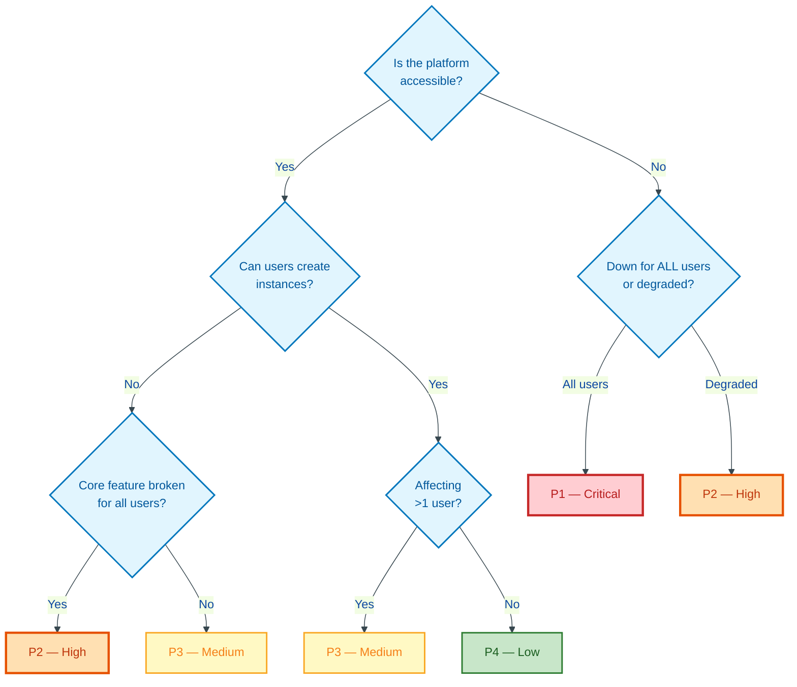
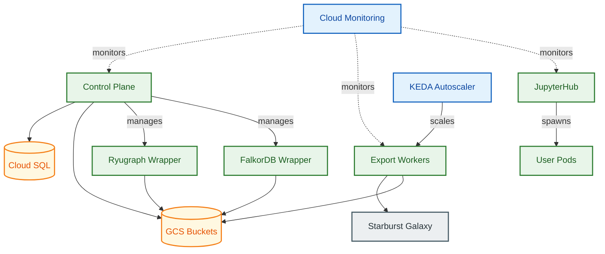
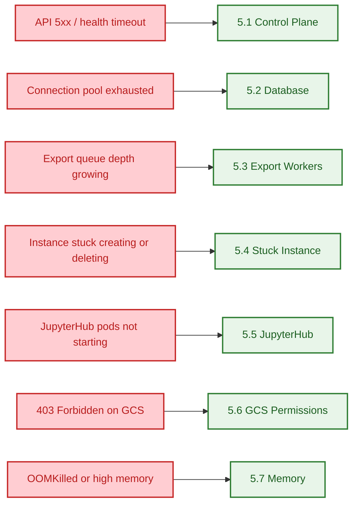

# Incident Response Runbook

**Document Type:** Incident Response Runbook
**Version:** 1.0
**Status:** Accepted
**Last Updated:** 2026-04-08

> **HSBC ITSM Integration:** Configure alert routing and communication channels according to HSBC ITSM standards. Replace references to specific tools below with the HSBC-approved equivalents for on-call management, incident communication, and change control.

---

## Quick Reference: Severity Levels

| Severity | Description | Acknowledge | Resolve | Example |
|----------|-------------|-------------|---------|---------|
| **P1** | Platform down / data loss risk | 15 min | 4 hours | Control plane unreachable, database down |
| **P2** | Major feature degraded | 30 min | 8 hours | Export pipeline stuck, no new instances |
| **P3** | Minor feature impacted | 2 hours | 24 hours | Single user pod failing, slow queries |
| **P4** | Cosmetic / low impact | 8 hours | 5 days | Dashboard rendering issue, log noise |

> **Note:** Resolve SLAs represent technical resolution time and exclude Deliverance change-control overhead. For P1/P2 incidents, use the emergency change process -- obtain retrospective approval within 24 hours.

---

## 1. Severity Classification

### P1 -- Critical (Platform Down)

- Control plane API returns 5xx for all requests
- Cloud SQL database unreachable or corrupted
- No new graph instances can be created
- Data loss or unauthorized data exposure detected
- All export workers permanently failing

### P2 -- High (Major Feature Degraded)

- Export worker backlog growing and not recovering
- Graph instances stuck in creating/deleting for >5 min
- JupyterHub not starting new user pods
- Database connection pool exhausted (>90% used)
- Error rate >5% sustained for >10 min

### P3 -- Medium (Minor Feature Impacted)

- Single graph instance stuck or failing
- Individual export job failing repeatedly
- JupyterHub idle culling not working
- One wrapper type (Ryugraph or FalkorDB) failing while other works
- Background job failing intermittently

### P4 -- Low (Cosmetic / Informational)

- Metric collection gaps
- Log format issues
- Non-critical deprecation warnings
- Documentation inaccuracies
- Dashboard display issues

---

## 2. Escalation Matrix

| Severity | First Responder | Escalation (if not resolved in SLA) | Final Escalation |
|----------|----------------|--------------------------------------|-----------------|
| **P1** | On-call ops engineer | Platform engineering lead (30 min) | Head of engineering (2 hours) |
| **P2** | On-call ops engineer | Platform engineering lead (2 hours) | Head of engineering (4 hours) |
| **P3** | Assigned ops engineer | On-call ops engineer (8 hours) | Platform engineering lead (24 hours) |
| **P4** | Assigned ops engineer | Backlog review (next sprint) | N/A |

**Contact details:** Maintain an up-to-date on-call roster in the team's ITSM tool (ServiceNow). During a P1 incident, use the following lookup order:

1. **On-call roster:** Check the ITSM on-call schedule for the "Graph OLAP Platform" service
2. **Platform engineering lead:** Listed in the ITSM service owner field for "Graph OLAP Platform"
3. **Head of engineering:** Listed in the ITSM escalation path for the "Data Platform" business service

> **Action required (HSBC):** Replace these generic references with direct links to the ServiceNow on-call schedule, and add named contacts with phone numbers for P1 escalation.

---

## 3. Incident Workflow

```mermaid
%%{init: {
  "theme": "base",
  "themeVariables": {
    "primaryColor": "#E3F2FD",
    "primaryTextColor": "#0D47A1",
    "primaryBorderColor": "#1565C0",
    "lineColor": "#37474F"
  }
}}%%
flowchart LR
    accTitle: Incident Response Workflow
    accDescr: Shows the five phases of incident response from detection through post-mortem

    classDef detect fill:#BBDEFB,stroke:#1565C0,stroke-width:2px,color:#0D47A1
    classDef triage fill:#FFF9C4,stroke:#F9A825,stroke-width:2px,color:#F57F17
    classDef investigate fill:#E1F5FE,stroke:#0277BD,stroke-width:2px,color:#01579B
    classDef resolve fill:#C8E6C9,stroke:#2E7D32,stroke-width:2px,color:#1B5E20
    classDef postmortem fill:#F3E5F5,stroke:#7B1FA2,stroke-width:2px,color:#4A148C

    D["DETECT<br/><i>Alert fires, user report,<br/>or dashboard anomaly</i>"]:::detect
    T["TRIAGE<br/><i>Classify severity,<br/>assign responder</i>"]:::triage
    I["INVESTIGATE<br/><i>Follow playbook,<br/>collect evidence</i>"]:::investigate
    R["RESOLVE<br/><i>Apply fix, verify,<br/>close incident</i>"]:::resolve
    P["POST-MORTEM<br/><i>Blameless review,<br/>action items</i>"]:::postmortem

    D --> T --> I --> R --> P
```


<details>
<summary>Mermaid Source</summary>



</details>

### Step 1: Detect

Sources of detection:

- **Automated alerts** -- Cloud Monitoring / Managed Prometheus alert fires
- **User reports** -- Via ServiceNow or support channel
- **Dashboard anomaly** -- Cloud Monitoring dashboard shows unexpected pattern
- **Scheduled health check** -- Daily ops check finds issue

### Step 2: Triage


<details>
<summary>Mermaid Source</summary>



</details>

**P1/P2 discrimination:** If the control plane is down for ALL users, it is P1. If it is degraded (slow, intermittent errors), it is P2.

**P2/P3 discrimination:** If a core feature (instance creation, exports, JupyterHub) is broken for all users, it is P2. If it affects only specific instances or users, it is P3.

### Step 3: Investigate

1. Open an incident record in the ITSM tool
2. Identify the affected component using the triage tree above
3. Follow the relevant playbook from Section 5
4. Document all findings in the incident record
5. If the playbook does not resolve the issue, escalate per Section 2

### Step 4: Resolve

1. **Open a Deliverance change request** before applying any production-modifying fix. For P1 incidents, use the emergency change process and obtain retrospective approval within 24 hours.
2. Apply the fix, referencing the Deliverance CR number in all commands and commit messages
3. Verify the fix: re-check health endpoints, confirm metrics normalize
4. Monitor for 15 minutes after fix to confirm stability
5. Update the incident record with resolution details, including the Deliverance CR number
6. Collect audit evidence: attach the change request, deployment logs, and before/after metrics to the incident record for SOX compliance
7. Notify affected users that service is restored

### Step 5: Post-Mortem

Required for all P1 and P2 incidents. Optional for P3. See Section 7.

---

## 4. Initial Diagnostic Steps (All Incidents)

Before following a specific playbook, gather baseline information:

```bash
# 1. Check all pod status
kubectl get pods -n graph-olap-platform -o wide

# 2. Check recent events
kubectl get events -n graph-olap-platform --sort-by='.lastTimestamp' | tail -30

# 3. Check control plane health
kubectl exec -n graph-olap-platform deploy/control-plane -- \
  curl -s http://localhost:8080/health

# 4. Check key metrics
kubectl exec -n graph-olap-platform deploy/control-plane -- \
  curl -s http://localhost:8080/metrics | grep -E '(error|queue_depth|connections|instances_active)'

# 5. Check node health
kubectl get nodes -o wide
kubectl top nodes
```

---

## Platform Component Map

Use this diagram to understand blast radius and cascade failures. If a component fails, trace its dependents to assess impact scope.


<details>
<summary>Mermaid Source</summary>



</details>

## Symptom Quick Router

If you know the symptom but not the playbook, use this to navigate directly.


<details>
<summary>Mermaid Source</summary>



</details>

---

## 5. Incident Playbooks

### 5.1 Control Plane Unresponsive (P1)

**Symptoms:** `/health` endpoint times out or returns 5xx. API calls fail. Alert: `ControlPlaneDown`.

**Steps:**

1. Check if control plane pods are running:
   ```bash
   kubectl get pods -n graph-olap-platform -l app=control-plane
   ```

2. If pods are in `CrashLoopBackOff`, check logs:
   ```bash
   kubectl logs -n graph-olap-platform -l app=control-plane --previous --tail=200
   ```

3. If pods are `Running` but not responding, check resource pressure:
   ```bash
   kubectl top pod -n graph-olap-platform -l app=control-plane
   ```

4. If CPU/memory is at limit, scale up replicas:
   ```bash
   kubectl scale deploy/control-plane -n graph-olap-platform --replicas=4
   ```

5. If pods are healthy but still not responding, check database connectivity:
   ```bash
   kubectl exec -n graph-olap-platform deploy/control-plane -- \
     python3 -c "import asyncio, os; from sqlalchemy.ext.asyncio import create_async_engine; e=create_async_engine(os.environ['DATABASE_URL']); asyncio.run(e.dispose())"
   ```

6. If database is unreachable, proceed to playbook 5.2.

7. If all else fails, perform a rolling restart:
   ```bash
   kubectl rollout restart deploy/control-plane -n graph-olap-platform
   kubectl rollout status deploy/control-plane -n graph-olap-platform --timeout=120s
   ```

**Recovery verification:** `/health` returns 200, error rate returns to < 1%.

---

### 5.2 Database Connection Exhaustion (P1/P2)

**Symptoms:** API requests return 503. Logs show "connection pool exhausted" or "too many connections". Alert: `DatabaseConnectionPoolExhausted`.

**Steps:**

1. Check connection pool metrics:
   ```bash
   kubectl exec -n graph-olap-platform deploy/control-plane -- \
     curl -s http://localhost:8080/metrics | grep database_connections
   ```

2. Check Cloud SQL connection count:
   ```bash
   gcloud sql instances describe <INSTANCE> --project=<PROJECT> \
     --format="value(settings.databaseFlags)"
   ```

3. Identify long-running queries holding connections:
   ```bash
   kubectl exec -n graph-olap-platform deploy/control-plane -- python3 -c "
   import asyncio, os
   from sqlalchemy.ext.asyncio import create_async_engine
   from sqlalchemy import text
   async def check():
       engine = create_async_engine(os.environ['DATABASE_URL'])
       async with engine.connect() as conn:
           result = await conn.execute(text(
               \"SELECT pid, state, query_start, query FROM pg_stat_activity WHERE datname = current_database() ORDER BY query_start\"
           ))
           for row in result: print(row)
   asyncio.run(check())
   "
   ```

4. If a specific query is blocking, terminate it:
   ```bash
   # Identify the PID from step 3, then:
   kubectl exec -n graph-olap-platform deploy/control-plane -- python3 -c "
   import asyncio, os
   from sqlalchemy.ext.asyncio import create_async_engine
   from sqlalchemy import text
   async def cancel():
       engine = create_async_engine(os.environ['DATABASE_URL'])
       async with engine.connect() as conn:
           await conn.execute(text('SELECT pg_terminate_backend(<PID>)'))
   asyncio.run(cancel())
   "
   ```

5. If connection count is at Cloud SQL max_connections limit, rolling restart the control plane to reset the pool:
   ```bash
   kubectl rollout restart deploy/control-plane -n graph-olap-platform
   ```

**Recovery verification:** `graph_olap_database_connections{state="available"}` returns to >10% of total.

---

### 5.3 Export Worker Backlog Growing (P2)

**Symptoms:** `graph_olap_export_queue_depth` steadily increasing. New snapshots stuck in `exporting` state. Alert: `ExportQueueBacklog`.

**Steps:**

1. Check if export workers are running:
   ```bash
   kubectl get pods -n graph-olap-platform -l app=export-worker
   ```

2. If zero workers are running despite pending jobs, check KEDA:
   ```bash
   kubectl get scaledobjects -n graph-olap-platform
   kubectl describe scaledobject export-worker -n graph-olap-platform
   kubectl logs -n keda -l app=keda-operator --tail=50
   ```

3. If workers are running but not progressing, check worker logs:
   ```bash
   kubectl logs -n graph-olap-platform -l app=export-worker --tail=100
   ```

4. Check for Starburst Galaxy connectivity issues:
   ```bash
   kubectl exec -n graph-olap-platform deploy/export-worker -- \
     curl -s -o /dev/null -w "%{http_code}" https://<STARBURST_URL>/v1/info
   ```

5. Check for stale claims (jobs claimed but not progressing):
   ```bash
   curl -s http://control-plane-svc:8080/api/ops/export-jobs \
     -H "X-Username: ops-user" | python3 -m json.tool
   ```

6. Trigger export reconciliation to reset stale claims:
   ```bash
   curl -X POST http://control-plane-svc:8080/api/ops/jobs/trigger \
     -H "X-Username: ops-user" \
     -H "Content-Type: application/json" \
     -d '{"job_name": "export_reconciliation", "reason": "Manual trigger: export backlog recovery"}'
   ```

7. If Starburst Galaxy is down, the only option is to wait for it to recover. Export workers will retry with backoff (3 attempts, then mark failed).

**Recovery verification:** `export_queue_depth` starts decreasing. New exports complete successfully.

---

### 5.4 Graph Instance Stuck in CREATING/DELETING (P2/P3)

**Symptoms:** Alert: `InstanceStuckInTransition` fires when an instance is in a transitional state for more than 5 minutes. User cannot use the instance or create a replacement.

**Steps:**

1. Get the pod name for the instance:
   ```bash
   curl -s http://control-plane-svc:8080/api/instances/<INSTANCE_ID> \
     -H "X-Username: ops-user" | python3 -c "import sys,json; print(json.load(sys.stdin).get('pod_name','NO POD'))"
   ```

2. Check pod status:
   ```bash
   kubectl get pod <POD_NAME> -n graph-olap-platform -o wide
   kubectl describe pod <POD_NAME> -n graph-olap-platform
   ```

3. **If stuck CREATING:**
   - `Pending` with no node: cluster autoscaler may be scaling up. Wait 5 min.
   - `Pending` with event "insufficient resources": node pool at capacity. Check quota.
   - `Init:Error`: check init container logs: `kubectl logs <POD_NAME> -n graph-olap-platform -c init`
   - `CrashLoopBackOff`: check wrapper logs: `kubectl logs <POD_NAME> -n graph-olap-platform`

4. **If stuck DELETING:**
   - Pod still exists: `kubectl delete pod <POD_NAME> -n graph-olap-platform --force --grace-period=0`
   - Pod gone, DB record stale: trigger reconciliation (see 5.1, step on reconciliation)

5. Trigger reconciliation to sync state:
   ```bash
   curl -X POST http://control-plane-svc:8080/api/ops/jobs/trigger \
     -H "X-Username: ops-user" \
     -H "Content-Type: application/json" \
     -d '{"job_name": "reconciliation", "reason": "Manual trigger: stuck instance recovery"}'
   ```

**Recovery verification:** Instance reaches `running` or `terminated` state. User can create new instances.

---

### 5.5 JupyterHub Pods Not Starting (P2/P3)

**Symptoms:** Users cannot access JupyterHub. New user pods stay in `Pending` or `Error`. Alert: `PodRestartLoop` (hub pod).

**Steps:**

1. Check hub pod:
   ```bash
   kubectl get pods -n graph-olap-platform -l component=hub
   kubectl logs -n graph-olap-platform -l component=hub --tail=100
   ```

2. Check proxy pod:
   ```bash
   kubectl get pods -n graph-olap-platform -l component=proxy
   ```

3. If hub is running but user pods fail to start, check events:
   ```bash
   kubectl get events -n graph-olap-platform --field-selector reason=FailedScheduling | tail -10
   ```

4. Check if the singleuser image can be pulled:
   ```bash
   kubectl get pods -n graph-olap-platform -l component=singleuser-server \
     -o jsonpath='{.items[0].status.containerStatuses[0].state}'
   ```

5. If `ImagePullBackOff`, verify the image exists:
   ```bash
   kubectl describe pod <USER_POD> -n graph-olap-platform | grep "Failed to pull"
   ```

6. If the hub itself is crashing, rolling restart:
   ```bash
   kubectl rollout restart deploy/hub -n graph-olap-platform
   ```

7. If user pods are pending due to resources, check node pool capacity:
   ```bash
   kubectl describe nodes -l workload-type=graph-instances | grep -A5 "Allocated resources"
   ```

**Recovery verification:** Hub pod is Running. New user login creates a pod within 60 seconds.

---

### 5.6 GCS Permission Errors (P2)

**Symptoms:** Export workers log "403 Forbidden" or "insufficient permissions" for GCS operations. Graph instances fail during data load with "access denied". Alert: `StarburstExportFailureRateHigh` (if exports fail due to GCS write).

**Steps:**

1. Identify which service account is failing:
   ```bash
   # For export worker
   kubectl get sa export-worker -n graph-olap-platform -o yaml | grep gcp-service-account

   # For graph instances (wrapper pods)
   kubectl get sa control-plane -n graph-olap-platform -o yaml | grep gcp-service-account
   ```

2. Verify Workload Identity binding:
   ```bash
   gcloud iam service-accounts get-iam-policy <GSA_EMAIL> --project=<PROJECT>
   ```

3. Verify GCS bucket IAM:
   ```bash
   gsutil iam get gs://<BUCKET_NAME>
   ```

4. Test GCS access from the affected pod:
   ```bash
   kubectl exec -n graph-olap-platform <POD_NAME> -- \
     python3 -c "from google.cloud import storage; c=storage.Client(); print(list(c.list_blobs('<BUCKET>', max_results=1)))"
   ```

5. If Workload Identity is broken, the GCP service account binding may need to be reapplied via Terraform. This requires a change control ticket.

**Recovery verification:** GCS operations succeed. Exports complete. Instances load data from GCS.

---

### 5.7 High Memory Usage on Wrapper Pods (P3)

**Symptoms:** Wrapper pods OOMKilled or approaching memory limits. Queries returning errors or timeouts. Alert: `PodMemoryHigh`.

**Steps:**

1. Identify high-memory pods:
   ```bash
   kubectl top pods -n graph-olap-platform -l 'app in (ryugraph-wrapper, falkordb-wrapper)' --sort-by=memory
   ```

2. Check the graph size loaded in the instance:
   ```bash
   kubectl exec -n graph-olap-platform <POD_NAME> -- \
     curl -s http://localhost:8000/health | python3 -c "
   import sys, json
   d = json.load(sys.stdin)
   print(f'nodes: {d.get(\"node_count\", \"N/A\")}, edges: {d.get(\"edge_count\", \"N/A\")}')
   print(f'status: {d.get(\"status\", \"N/A\")}, engine: {d.get(\"engine\", \"N/A\")}')
   "
   ```

3. If the graph is too large for the allocated memory:
   - The instance needs to be terminated and recreated with a smaller dataset
   - Consider splitting the mapping into smaller subsets
   - Alternatively, use FalkorDB wrapper which handles larger graphs more efficiently in-memory

4. If memory usage is high but the graph is reasonably sized, check for memory leaks:
   ```bash
   kubectl logs -n graph-olap-platform <POD_NAME> --tail=200 | grep -i "memory\|oom\|gc"
   ```

5. If the pod has been OOMKilled, it will restart automatically. Check restart count:
   ```bash
   kubectl get pod <POD_NAME> -n graph-olap-platform -o jsonpath='{.status.containerStatuses[0].restartCount}'
   ```

6. If restarts are frequent (>3 in an hour), terminate the instance via API and investigate the data volume before recreating.

**Recovery verification:** Pod memory usage stabilizes below 80% of limit. No OOMKill events.

---

### 5.8 Unauthorized Data Access (P1)

**Symptoms:** Repeated 401/403 responses in logs from a single source. Analyst-role user accessing admin or ops endpoints. Access from unexpected IP ranges or outside business hours. User reports seeing data they should not have access to. Alert: manual detection via log queries (see below).

> **Note:** There is currently no automated Prometheus alert for authentication/authorization failures. Detection relies on the log queries below and the suspicious activity indicators defined in the [Security Operations Runbook](security-operations.runbook.md). HSBC should consider adding a `HighAuthFailureRate` alert (e.g., `rate(graph_olap_http_requests_total{status=~"401|403"}[5m]) > 0.1`) once baseline auth failure rates are established.

**Steps:**

1. Check for authentication failures (401s) in Cloud Logging:
   ```bash
   # Query Cloud Logging for recent 401/403 responses
   gcloud logging read \
     'resource.type="k8s_container" AND resource.labels.namespace_name="graph-olap-platform" AND jsonPayload.status IN (401, 403)' \
     --project=<PROJECT> --limit=50 --format=json \
     | python3 -c "import sys,json; [print(f'{e[\"timestamp\"]} {e[\"jsonPayload\"].get(\"username\",\"UNKNOWN\")} {e[\"jsonPayload\"].get(\"status\")} {e[\"jsonPayload\"].get(\"path\",\"\")}') for e in json.load(sys.stdin)]"
   ```

2. Check for privilege escalation attempts (analyst accessing ops/admin endpoints):
   ```bash
   gcloud logging read \
     'resource.type="k8s_container" AND resource.labels.namespace_name="graph-olap-platform" AND jsonPayload.status=403 AND (jsonPayload.path=~"/api/ops/" OR jsonPayload.path=~"/api/admin/")' \
     --project=<PROJECT> --limit=50 --format=json
   ```

3. Identify the source of unauthorized access:
   ```bash
   # Check identity resolution logs for the suspected user
   kubectl logs -n graph-olap-platform deploy/control-plane --tail=500 \
     | grep -E 'identity_resolved.*username.*<SUSPECTED_USER>'
   ```

4. If unauthorized access is confirmed, **immediately disable the user**:
   ```bash
   # Disable user in the control plane database to block all further requests
   kubectl exec -n graph-olap-platform deploy/control-plane -- python3 -c "
   import asyncio, os
   from sqlalchemy.ext.asyncio import create_async_engine
   from sqlalchemy import text
   async def disable():
       engine = create_async_engine(os.environ['DATABASE_URL'])
       async with engine.connect() as conn:
           await conn.execute(text(\"UPDATE users SET is_active = false WHERE username = '<USERNAME>'\"))
           await conn.commit()
           print('User disabled')
   asyncio.run(disable())
   "
   ```

5. Check what data the user accessed — review their instance and export activity:
   ```bash
   curl -s http://control-plane-svc:8080/api/ops/export-jobs \
     -H "X-Username: ops-user" \
     | python3 -c "import sys,json; jobs=json.load(sys.stdin)['data']; [print(f'{j[\"id\"]} {j[\"status\"]} {j.get(\"owner\",\"\")}') for j in jobs if j.get('owner')=='<USERNAME>']"
   ```

6. If a compromised credential (leaked X-Username header injection) is suspected, follow the emergency credential rotation procedure in the [Security Operations Runbook](security-operations.runbook.md).

7. Collect evidence for the incident record:
   - Export the relevant Cloud Logging entries to GCS for preservation
   - Record the user's role, access times, and endpoints accessed
   - Document any data that may have been exposed

8. **Open a security incident** in the ITSM tool with classification "Confidentiality Breach" and notify the Information Security team per HSBC escalation policy.

**Recovery verification:** The disabled user can no longer authenticate (receives 403 `USER_DISABLED`). No further unauthorized access patterns in logs for 30 minutes. Security incident record created with full evidence.

---

### 5.9 Data Leakage via Snapshots (P2)

**Symptoms:** Unusually high export volume by a single user. Exports triggered for mappings the user does not normally work with. GCS bucket access from unexpected service accounts or IP ranges. Alert: manual detection via log queries and GCS audit logs.

> **Note:** GCS bucket IAM is bucket-level, not path-level. While exported data is organized by username in the path (`gs://{bucket}/{username}/{mapping_id}/{snapshot_id}/`), any service account with bucket-level read access can read any user's exports. This is a known architectural limitation — path-based separation is organizational, not a security boundary.

**Steps:**

1. Check for unusual export volume by a single user:
   ```bash
   # Query export jobs grouped by owner in the last 24 hours
   curl -s http://control-plane-svc:8080/api/ops/export-jobs \
     -H "X-Username: ops-user" \
     | python3 -c "
   import sys, json
   from collections import Counter
   jobs = json.load(sys.stdin)['data']
   owners = Counter(j.get('owner', 'UNKNOWN') for j in jobs)
   for owner, count in owners.most_common(10):
       print(f'{owner}: {count} exports')
   "
   ```

2. Check GCS audit logs for unexpected data access:
   ```bash
   gcloud logging read \
     'resource.type="gcs_bucket" AND protoPayload.methodName="storage.objects.get" AND protoPayload.resourceName=~"<BUCKET_NAME>"' \
     --project=<PROJECT> --limit=50 --format=json \
     | python3 -c "import sys,json; [print(f'{e[\"timestamp\"]} {e[\"protoPayload\"][\"authenticationInfo\"][\"principalEmail\"]} {e[\"protoPayload\"][\"resourceName\"]}') for e in json.load(sys.stdin)]"
   ```

3. Verify that GCS public access prevention is still enforced:
   ```bash
   gsutil publicAccessPrevention get gs://<BUCKET_NAME>
   # Expected output: "enforced"
   ```

4. Check for unexpected IAM bindings on the export bucket:
   ```bash
   gsutil iam get gs://<BUCKET_NAME> | python3 -c "
   import sys, json
   policy = json.load(sys.stdin)
   for binding in policy.get('bindings', []):
       print(f'{binding[\"role\"]}: {binding[\"members\"]}')
   "
   ```

5. If data leakage is confirmed, **restrict GCS access immediately**:
   ```bash
   # Remove the compromised service account's access (requires Terraform change control)
   # For emergency response, use gcloud directly and reconcile in Terraform afterward:
   gsutil iam ch -d serviceAccount:<COMPROMISED_SA>:objectViewer gs://<BUCKET_NAME>
   ```

6. If the leakage is via application-layer access (user exporting data they shouldn't see), disable the user (see playbook 5.8 step 4) and review the RBAC ownership model:
   ```bash
   # Check what snapshots/mappings the user owns
   kubectl exec -n graph-olap-platform deploy/control-plane -- python3 -c "
   import asyncio, os
   from sqlalchemy.ext.asyncio import create_async_engine
   from sqlalchemy import text
   async def check():
       engine = create_async_engine(os.environ['DATABASE_URL'])
       async with engine.connect() as conn:
           result = await conn.execute(text(
               \"SELECT m.id, m.name, s.id as snapshot_id, s.status FROM mappings m JOIN snapshots s ON s.mapping_id = m.id WHERE m.owner_username = '<USERNAME>'\"
           ))
           for row in result: print(row)
   asyncio.run(check())
   "
   ```

7. Assess the scope of data exposure:
   ```bash
   # List all objects in the user's export path to determine data volume
   gsutil ls -l gs://<BUCKET_NAME>/<USERNAME>/
   ```

8. Collect evidence and escalate:
   - Export GCS audit logs and application logs for the time window
   - Document which mappings/snapshots were exported and their data contents
   - **Open a security incident** with classification "Data Leakage" and notify the Information Security and Data Protection teams per HSBC escalation policy
   - If regulated data (PII, financial) was exposed, trigger the data breach notification process

**Recovery verification:** Unauthorized access path is closed (IAM binding removed or user disabled). Public access prevention confirmed enforced. No further unexpected GCS access in audit logs for 1 hour. Security incident record created with scope assessment.

---

## 6. Communication Templates

### Status Update (During Incident)

```
INCIDENT: [P1/P2/P3/P4] - [Brief Description]
STATUS: Investigating / Identified / Monitoring / Resolved
IMPACT: [What is affected and who is affected]
NEXT UPDATE: [Time of next update]
CURRENT ACTION: [What the team is doing right now]
```

### Resolution Notification

```
RESOLVED: [Brief Description]
DURATION: [Start time] to [End time] ([total duration])
IMPACT: [Summary of what was affected]
ROOT CAUSE: [One-sentence root cause]
RESOLUTION: [What was done to fix it]
FOLLOW-UP: [Post-mortem scheduled for DATE / Action items being tracked in TICKET]
```

---

## 7. Post-Incident Process

### 7.1 When to Conduct a Post-Mortem

- **Required:** All P1 and P2 incidents
- **Recommended:** P3 incidents that recur more than twice in 30 days
- **Timeline:** Within 5 business days of resolution

### 7.2 Post-Mortem Template

```
## Post-Mortem: [Incident Title]

**Date of Incident:** YYYY-MM-DD
**Duration:** HH:MM
**Severity:** P1/P2/P3
**Author:** [Name]
**Participants:** [Names]

### Summary
[2-3 sentence description of what happened]

### Timeline (UTC)
- HH:MM - [Event: alert fired, user reported, etc.]
- HH:MM - [Response: who acknowledged, what they did]
- HH:MM - [Investigation: what was found]
- HH:MM - [Resolution: what fixed it]
- HH:MM - [Verification: how we confirmed it was fixed]

### Root Cause
[Detailed description of WHY the incident happened.
Focus on systemic causes, not individual actions.]

### Impact
- Users affected: [number/description]
- Duration of impact: [time]
- Data affected: [none / description]
- SLA impact: [was any SLA breached?]

### What Went Well
- [Thing 1]
- [Thing 2]

### What Could Be Improved
- [Thing 1]
- [Thing 2]

### Action Items
| Action | Owner | Priority | Due Date | Ticket |
|--------|-------|----------|----------|--------|
| [Action 1] | [Name] | High | YYYY-MM-DD | [TICKET-ID] |
| [Action 2] | [Name] | Medium | YYYY-MM-DD | [TICKET-ID] |
```

### 7.3 Blameless Review Principles

- Focus on the system, not the individual
- Ask "what failed in our process that allowed this?" not "who caused this?"
- Every action item must have an owner and a due date
- Share the post-mortem with the broader team for learning
- Track action items to completion

---

## 8. Alert Reference

The following alerts are configured in Cloud Monitoring / Managed Prometheus. Each maps to a playbook above.

| Alert Name | Severity | Condition | Playbook |
|------------|----------|-----------|----------|
| `ControlPlaneDown` | Critical | `up{job="control-plane"} == 0` for 2 min | 5.1 |
| `HighErrorRate` | Critical | 5xx rate > 5% for 5 min | 5.1 |
| `DatabaseConnectionPoolExhausted` | Warning | Available connections < 10% for 5 min | 5.2 |
| `ExportQueueBacklog` | Warning | Queue depth > 50 for 10 min | 5.3 |
| `ExportWorkersScaledToZero` | Critical | 0 workers + pending jobs for 5 min | 5.3 |
| `StarburstExportFailureRateHigh` | Critical | Failure rate > 10% for 10 min | 5.3 / 5.6 |
| `InstanceFailureRateHigh` | Critical | >10% instances failing for 5 min | 5.4 |
| `PodMemoryHigh` | Warning | Memory > 90% of limit for 5 min | 5.7 |
| `PodRestartLoop` | Warning | >5 restarts in 1 hour | 5.1 / 5.5 |
| `HighLatency` | Warning | P99 latency > 5s for 5 min | 5.1 |
| `ExportDurationHigh` | Warning | P95 export duration > 30 min | 5.3 |
| *Log-based* | Critical | Repeated 401/403 from single source | 5.8 |
| *Log-based* | Critical | Unusual export volume by single user | 5.9 |

---

## Related Documents

- [ADR-130: Incident Response Runbook](--/process/adr/operations/adr-130-incident-response-runbook.md)
- [Observability Design](observability.design.md)
- [Platform Operations Manual (ADR-129)](platform-operations.manual.md)
- [Platform Operations Architecture](--/architecture/platform-operations.md)
- [Monitoring and Alerting Runbook (ADR-131)](monitoring-alerting.runbook.md)
- [Disaster Recovery Plan (ADR-132)](disaster-recovery.runbook.md)
- [Troubleshooting Guide (ADR-135)](troubleshooting.runbook.md)
