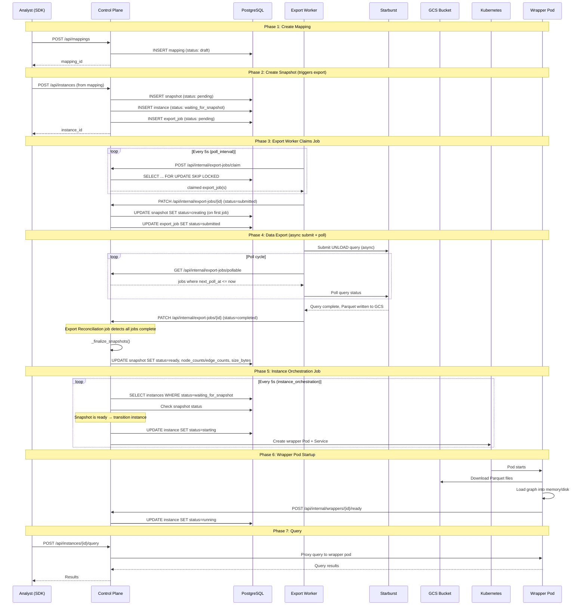
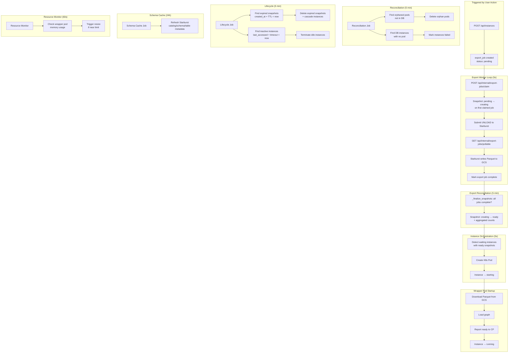

# Background Jobs and Execution Sequence

The control-plane runs six background jobs via APScheduler. All jobs run in-process (no external scheduler) and are configured to `coalesce=True` (combine missed executions) and `max_instances=1` (no concurrent execution of the same job).

---

## Job Inventory

| Job | Default Interval | Configurable | Purpose |
|---|---|---|---|
| **Reconciliation** | 300s (5 min) | `GRAPH_OLAP_RECONCILIATION_JOB_INTERVAL_SECONDS` | Detect and clean up orphaned wrapper pods; reconcile DB state with K8s state |
| **Lifecycle** | 300s (5 min) | `GRAPH_OLAP_LIFECYCLE_JOB_INTERVAL_SECONDS` | Enforce snapshot TTL and instance inactivity timeouts |
| **Instance Orchestration** | 5s | `GRAPH_OLAP_INSTANCE_ORCHESTRATION_JOB_INTERVAL_SECONDS` | Transition instances from `waiting_for_snapshot` to `starting` when their snapshot becomes `ready` |
| **Export Reconciliation** | 5s | *(hardcoded)* | Recover from export worker crashes; re-claim stale export jobs |
| **Schema Cache** | 86400s (24h) | `GRAPH_OLAP_SCHEMA_CACHE_JOB_INTERVAL_SECONDS` | Refresh Starburst schema metadata cache |
| **Resource Monitor** | 60s | *(hardcoded)* | Monitor wrapper pod memory usage; trigger proactive resize if `sizing_enabled=true` |

---

## End-to-End Flow: Mapping to Queryable Graph

The following sequence shows all jobs involved when a user creates a mapping and queries a graph.


<details>
<summary>Mermaid Source</summary>



</details>

---

## Job Dependency Diagram


<details>
<summary>Mermaid Source</summary>



</details>

---

## Recommended Interval Tuning

For a production environment with moderate usage (10-20 analysts, 5-10 concurrent instances):

| Job | Default | Recommended | Rationale |
|---|---|---|---|
| Reconciliation | 300s | 300s | Fine — runs infrequently, catches drift |
| Lifecycle | 300s | 300s | Fine — TTL is in hours, 5-min check is adequate |
| Instance Orchestration | 5s | 30s | Reduces DB polling; instances start 25s slower worst case |
| Export Reconciliation | 5s (hardcoded) | 30s (requires code change) | Same rationale as orchestration |
| Schema Cache | 86400s | 86400s | Metadata changes rarely; manual refresh available via API |
| Resource Monitor | 60s (hardcoded) | 60s | Reasonable for monitoring memory |

To apply:

```bash
# In the control-plane Deployment env vars:
GRAPH_OLAP_INSTANCE_ORCHESTRATION_JOB_INTERVAL_SECONDS=30
GRAPH_OLAP_RECONCILIATION_JOB_INTERVAL_SECONDS=300
GRAPH_OLAP_LIFECYCLE_JOB_INTERVAL_SECONDS=300
GRAPH_OLAP_SCHEMA_CACHE_JOB_INTERVAL_SECONDS=86400
```
