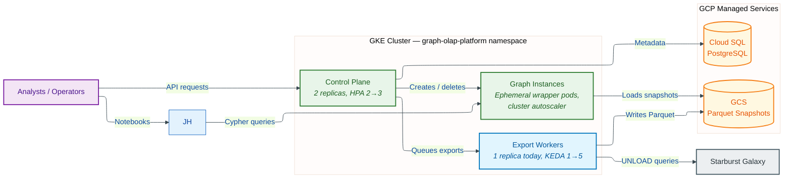
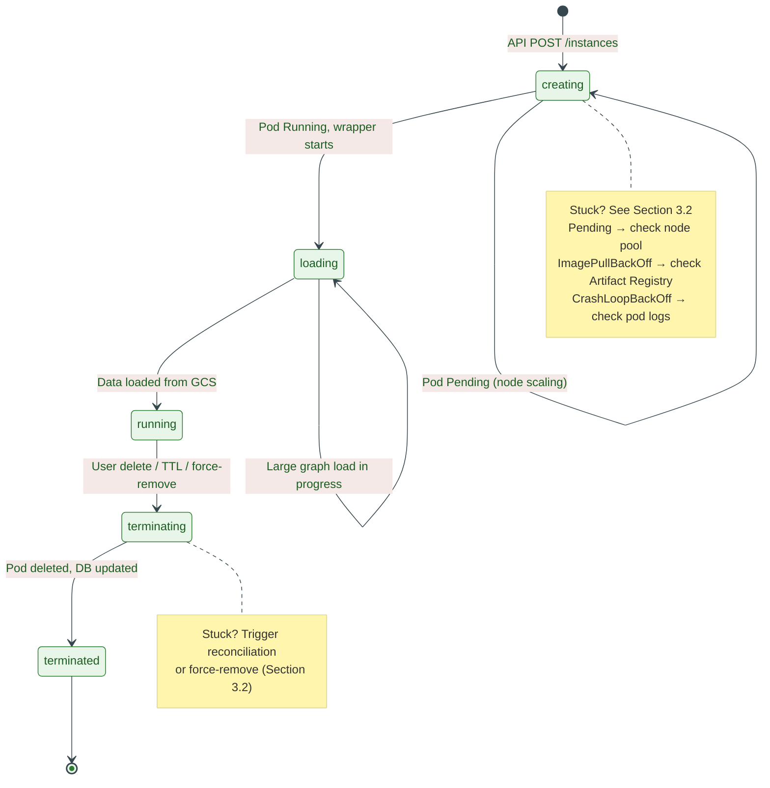
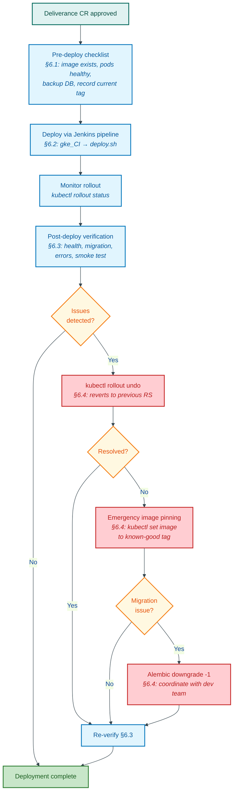

# Platform Operations Manual

**Document Type:** Operations Manual
**Version:** 1.0
**Status:** Accepted
**Last Updated:** 2026-04-08


## Quick Reference

| Task | Command / Action | Frequency |
|------|-----------------|-----------|
| Check all pod status | `kubectl get pods -n graph-olap-platform` | Start of shift |
| Check control plane health | `kubectl exec -n graph-olap-platform deploy/control-plane -- curl -s http://localhost:8080/health` | Every 15 min (automated) |
| View structured logs | `kubectl logs -n graph-olap-platform deploy/control-plane --tail=100` | As needed |
| Count active graph instances | `kubectl get pods -n graph-olap-platform -l app=graph-instance --no-headers \| wc -l` | Hourly |
| Check export queue depth | `kubectl exec -n graph-olap-platform deploy/control-plane -- curl -s http://localhost:8080/metrics \| grep export_queue_depth` | Hourly |
| Check database connections | `kubectl exec -n graph-olap-platform deploy/control-plane -- curl -s http://localhost:8080/metrics \| grep database_connections` | Every 30 min |
| Trigger background job | `kubectl exec -n graph-olap-platform deploy/graph-olap-control-plane -- curl -s -X POST -H "X-Username: ops-user@hsbc.co.uk" -H "Content-Type: application/json" -d '{"job_name":"reconciliation"}' http://localhost:8080/api/ops/jobs/trigger` | Ad hoc |
| View SLO burn rate | Cloud Monitoring > SLOs > Graph OLAP | Daily |

> **API Access:** All `curl` commands above use `kubectl exec` to run inside a control-plane pod (`deploy/graph-olap-control-plane`). All `/api/ops/`, `/api/config/`, and `/api/cluster/` endpoints are authorised by the `X-Username` header (not a bearer token — see [Operator API Access](#operator-api-access) below). For local port-forwarding as an alternative: `kubectl port-forward -n graph-olap-platform deploy/graph-olap-control-plane 8080:8080`, then use `http://localhost:8080` directly.

---

## Authentication and Access Control

External access to the platform ingress is fronted by the Azure AD auth proxy (ADR-137, Proposed). The proxy terminates the user's Azure AD session and forwards the resolved identity to the control plane via the `X-Username` header. Service-to-service calls inside the cluster are isolated by NetworkPolicy (ADR-104/105 removed the shared internal API key).

Until ADR-137 is accepted and deployed, IP whitelisting at the nginx ingress layer (ADR-112, Proposed) remains the documented transitional control; in either case, the control plane itself authorises requests by `X-Username` — there is no bearer token at the application layer.

For detailed access control procedures, see the [Security Operations Runbook](security-operations.runbook.md).

### Operator API Access

Operator-scoped endpoints (`/api/ops/*`, `/api/config/*`, `/api/cluster/*`) authenticate via the `X-Username` header (ADR-104); the operator's role is resolved from the `users` table. There is no bearer token. To call these endpoints, either:

- `kubectl exec` from an authorised workstation (see Quick Reference table above), or
- `kubectl port-forward -n graph-olap-platform deploy/graph-olap-control-plane 8080:8080` and hit `http://localhost:8080` directly,

and supply the `X-Username` header on every request. `kubectl` RBAC plus the Azure AD auth proxy externally gate access to the cluster itself.

### Roles and Permissions

| Role | Token Scope | Permissions |
|------|-------------|-------------|
| analyst | Read, create instances | Most notebook operations |
| ops | Manage platform operations | Health checks, scaling, maintenance |
| admin | Full access | User management, bulk operations, all ops |

For routine operational tasks, use the `ops` role. Reserve `admin` for user management and emergency operations.

---

## Platform Component Overview

The following diagram shows the key platform components, their relationships, and the scaling mechanisms that manage them. Use this as orientation when navigating the sections below.


<details>
<summary>Mermaid Source</summary>



</details>

---

## 1. Daily Operations

### 1.1 Morning Health Check Procedure

Perform these checks at the start of each operational shift.

**Step 1: Verify all platform pods are running.**

```bash
kubectl get pods -n graph-olap-platform -o wide
```

Expected steady state: control-plane (2+ replicas Running), export-worker (0+ replicas, KEDA-managed), jupyter-hub (1 replica Running). Graph instance pods vary based on user activity.

**Step 2: Check control plane health endpoint.**

```bash
kubectl exec -n graph-olap-platform deploy/control-plane -- \
  curl -s http://localhost:8080/health | python3 -m json.tool
```

A healthy response returns `{"status": "healthy"}` with component statuses for database, kubernetes, and background jobs.

**Step 3: Review error logs from the last 8 hours.**

```bash
kubectl logs -n graph-olap-platform deploy/control-plane --since=8h | \
  python3 -c "import sys,json; [print(json.dumps(json.loads(l),indent=2)) for l in sys.stdin if '\"severity\":\"ERROR\"' in l or '\"severity\":\"CRITICAL\"' in l]"
```

**Step 4: Check resource quotas.**

```bash
kubectl describe resourcequota graph-olap-quota -n graph-olap-platform
```

Verify `pods` used count is well below the hard limit of 100.

### 1.2 Log Review

All services emit structured JSON logs via structlog. Logs flow to Cloud Logging automatically via GKE's Fluentbit agent.

**Cloud Logging queries:**

| What | Filter |
|------|--------|
| All errors | `resource.type="k8s_container" resource.labels.namespace_name="graph-olap-platform" severity>=ERROR` |
| Control plane only | `resource.labels.container_name="control-plane"` |
| Export worker failures | `resource.labels.container_name="export-worker" jsonPayload.message=~"failed"` |
| Specific request trace | `jsonPayload.trace_id="<REQUEST_ID>"` |

**Log retention:** Application logs 30 days (Cloud Logging), audit logs 365 days (BigQuery).

### 1.3 Resource Monitoring

**Key metrics to watch (Cloud Monitoring / Managed Prometheus):**

| Metric | Healthy Range | Alert Threshold |
|--------|---------------|-----------------|
| `graph_olap_http_requests_total{status=~"5.."}` rate | < 1% of total | > 5% for 5 min |
| `graph_olap_export_queue_depth` | 0-10 | > 50 for 10 min |
| `graph_olap_instances_active{status="running"}` | 0-100 | > 80 (capacity) |
| `graph_olap_database_connections{state="available"}` | > 10% of pool | < 10% for 5 min |
| `container_memory_usage_bytes` / limit | < 80% | > 90% for 5 min |

---

## 2. Routine Maintenance

### 2.1 Database Maintenance (Cloud SQL PostgreSQL)

> **Change Control:** Any production-modifying step in this section must be raised through HSBC Deliverance change control before execution.

Cloud SQL handles vacuuming and index maintenance automatically. Manual tasks:

**Check database size and table bloat (monthly):**

```bash
kubectl exec -n graph-olap-platform deploy/control-plane -- python3 -c "
import asyncio, os
from sqlalchemy.ext.asyncio import create_async_engine
async def check():
    engine = create_async_engine(os.environ['DATABASE_URL'])
    async with engine.connect() as conn:
        result = await conn.execute(text(\"\"\"
            SELECT schemaname, tablename,
                   pg_size_pretty(pg_total_relation_size(schemaname||'.'||tablename)) as size
            FROM pg_tables WHERE schemaname = 'public'
            ORDER BY pg_total_relation_size(schemaname||'.'||tablename) DESC
        \"\"\"))
        for row in result: print(row)
asyncio.run(check())
"
```

**Alembic migration status:**

Migrations run automatically at control-plane startup. Verify current state and check for pending migrations:

```bash
kubectl exec -n graph-olap-platform deploy/control-plane -- python3 -m alembic current
kubectl exec -n graph-olap-platform deploy/control-plane -- python3 -m alembic history --indicate-current
```

If a migration fails at startup, the control-plane pod will enter `CrashLoopBackOff`. Check logs for the migration error:

```bash
kubectl logs -n graph-olap-platform deploy/control-plane --previous | grep -i "alembic\|migration\|upgrade"
```

Do not manually run `alembic upgrade` unless directed by the development team during hypercare.

### 2.2 GCS Snapshot Cleanup

Snapshots are stored in GCS as Parquet files. The lifecycle job handles TTL-based cleanup automatically (configurable via the ops API -- see Section 2.5 Runtime Configuration Changes to view or adjust lifecycle-config).

**Manual GCS usage check:**

```bash
gsutil du -sh gs://<BUCKET_NAME>/snapshots/
```

**Remove orphaned GCS prefixes** (snapshots with no matching database record). The reconciliation job handles this, but for manual verification:

```bash
kubectl exec -n graph-olap-platform deploy/control-plane -- \
  curl -s -X POST -H "Authorization: Bearer $OPS_TOKEN" \
  http://localhost:8080/api/ops/jobs/reconciliation/trigger
```

### 2.3 Certificate Renewal

> **Change Control:** Any production-modifying step in this section must be raised through HSBC Deliverance change control before execution.

GKE Managed Certificates auto-renew. Verify certificate status:

```bash
kubectl get managedcertificates -n graph-olap-platform
```

Status should show `Active`. If `ProvisioningFailed`, check DNS records point to the correct load balancer IP.

### 2.4 Image Freshness Check

Verify deployed images match the expected versions:

```bash
kubectl get pods -n graph-olap-platform -o jsonpath='{range .items[*]}{.metadata.name}{"\t"}{.spec.containers[0].image}{"\n"}{end}'
```

### 2.5 Runtime Configuration Changes

> **Change Control:** PUT operations on configuration endpoints modify production behaviour. Open a Deliverance change request before making any configuration change.

Three configuration domains can be adjusted at runtime via the ops API without redeployment. Changes persist in Cloud SQL and survive pod restarts.

**View current configuration** (substitute the endpoint path for each domain):

```bash
# Replace <CONFIG> with: lifecycle-config | concurrency-config | export-config
kubectl exec -n graph-olap-platform deploy/control-plane -- \
  curl -s -H "Authorization: Bearer $OPS_TOKEN" http://localhost:8080/api/ops/<CONFIG> | python3 -m json.tool
```

**Change a configuration value:**

1. Record the current value (save the GET output above).
2. Apply the change:
   ```bash
   kubectl exec -n graph-olap-platform deploy/control-plane -- \
     curl -s -X PUT -H "Authorization: Bearer $OPS_TOKEN" \
     -H "Content-Type: application/json" \
     -d '{"instance_idle_timeout_minutes": 60}' \
     http://localhost:8080/api/ops/lifecycle-config | python3 -m json.tool
   ```
3. Verify the change took effect by re-running the GET command.
4. Record the before/after values in the Deliverance change request.

### 2.6 Secret Rotation

Secret rotation procedures are documented in the [Security Operations Runbook](security-operations.runbook.md).

| Secret | Rotation Frequency |
|--------|--------------------|
| Cloud SQL database password | 90 days |
| Internal API key | 90 days |
| Starburst Galaxy credentials | 90 days |
| GCS / Docker registry | N/A (Workload Identity, keyless) |

Review the rotation schedule monthly. If a secret is approaching expiry, follow the procedures in the Security Operations Runbook.

### 2.7 Maintenance Mode

> **Important — current limitation:** the maintenance-mode toggle is persisted in the database but is **not currently enforced** by the control-plane. Setting `maintenance.enabled=1` records the state and message, but it does **not** block write operations and users see no response change. Enforcement is tracked as a known issue — see [Maintenance Mode Enforcement Not Wired](known-issues.md#maintenance-mode-enforcement-not-wired). Until that is fixed, maintenance windows must be coordinated out-of-band (email, ingress-level maintenance page, or scaling the control-plane deployment to zero replicas for the duration).

The toggle is exposed via `PUT /api/config/maintenance` (Ops role required). See [API — Admin & Ops Spec](/api/api-admin-ops-spec/#set-maintenance-mode) for request and response schemas.

---

## 3. Instance Management

### 3.1 Graph Instance Lifecycle

Graph instances are ephemeral Kubernetes pods created and deleted through the control plane API. They are NOT managed by Deployments or StatefulSets.


<details>
<summary>Mermaid Source</summary>



</details>

**List all active instances:**

```bash
kubectl exec -n graph-olap-platform deploy/control-plane -- \
  curl -s -H "Authorization: Bearer $OPS_TOKEN" \
  http://localhost:8080/api/instances | python3 -m json.tool
```

**Check a specific instance pod:**

```bash
kubectl get pod <INSTANCE_POD_NAME> -n graph-olap-platform -o wide
kubectl describe pod <INSTANCE_POD_NAME> -n graph-olap-platform
```

### 3.2 Troubleshooting Stuck Instances

**Instance stuck in `creating` state:**

1. Check pod status: `kubectl get pod <POD_NAME> -n graph-olap-platform`
2. If `Pending` -- check node pool capacity: `kubectl describe pod <POD_NAME> -n graph-olap-platform | grep -A5 Events`
3. If `ImagePullBackOff` -- verify image exists in Artifact Registry
4. If `CrashLoopBackOff` -- check logs: `kubectl logs <POD_NAME> -n graph-olap-platform`

**Instance stuck in `loading` state:**

1. Check wrapper logs: `kubectl logs <POD_NAME> -n graph-olap-platform`
2. Verify GCS access: look for "permission denied" or "not found" errors
3. Check snapshot status via API: `kubectl exec -n graph-olap-platform deploy/control-plane -- curl -s -H "Authorization: Bearer $OPS_TOKEN" http://localhost:8080/api/snapshots/<SNAPSHOT_ID>`

**Instance stuck in `terminating` state:**

1. Check if pod still exists: `kubectl get pod <POD_NAME> -n graph-olap-platform`
2. If pod is gone but DB record persists, trigger reconciliation:
   ```bash
   kubectl exec -n graph-olap-platform deploy/control-plane -- \
     curl -s -X POST -H "Authorization: Bearer $OPS_TOKEN" \
     http://localhost:8080/api/ops/jobs/reconciliation/trigger
   ```
3. The reconciliation job detects missing pods and updates database state accordingly.

**Force-remove a stuck instance (last resort):**

> **Warning:** Force-removing an instance terminates any active user queries on that graph. Verify the instance is genuinely stuck (not just slow to load a large graph) before proceeding.
>
> **Change Control:** This is a production-modifying action. Follow HSBC Deliverance change control per HSBC operational procedures.

Pre-conditions:
1. Confirm the instance has been stuck for at least 15 minutes (check creation timestamp).
2. Confirm no active user sessions: `kubectl logs <POD_NAME> -n graph-olap-platform --tail=50 | grep "query"`
3. If the user has unsaved work, notify them before deleting.

```bash
# Delete the pod (30s grace period allows in-flight requests to complete)
kubectl delete pod <POD_NAME> -n graph-olap-platform --grace-period=30

# Trigger reconciliation to clean up the database record
kubectl exec -n graph-olap-platform deploy/control-plane -- \
  curl -s -X POST -H "Authorization: Bearer $OPS_TOKEN" \
  http://localhost:8080/api/ops/jobs/reconciliation/trigger
```

If the pod does not terminate after 30 seconds (e.g., stuck finalizer), use `--grace-period=0 --force` as a last resort.

### 3.3 Instance Resource Limits

| Wrapper Type | Memory Request | Memory Limit | CPU Request | CPU Limit |
|-------------|---------------|-------------|-------------|-----------|
| Standard (Ryugraph/FalkorDB) | 512Mi | 2Gi | 250m | 1000m |
| Large (Ryugraph with NetworkX) | 8Gi | 32Gi | 2000m | 8000m |

Instances loading large graphs (>1M edges) may approach memory limits. Monitor via:

```bash
kubectl top pod <POD_NAME> -n graph-olap-platform
```

---

## 4. Analyst Notebook Operations

JupyterHub is **not deployed** in the HSBC target. Analysts run the SDK
from corporate-issued notebooks via the HSBC VDI (ADR-108) or from HSBC
Dataproc clusters. There is no in-cluster user-pod lifecycle to manage,
no idle-culling, and no in-cluster notebook-sync init container to
monitor. SDK installation and proxy configuration for those notebook
environments is covered in `docs/hsbc-deployment/jupyter.md` and the SDK
manual's getting-started appendix.

---

## 5. Scaling Operations

> **Change Control:** Any production-modifying step in this section must be raised through HSBC Deliverance change control before execution.

### 5.1 Control Plane Scaling

The control plane runs with `replicas: 2` (`infrastructure/cd/resources/control-plane-deployment.yaml`) plus an HPA (`control-plane-hpa.yaml`, `minReplicas: 2`, `maxReplicas: 3`, 70% CPU / 80% memory targets). Changing the baseline or the HPA bounds is a manifest edit followed by `./infrastructure/cd/deploy.sh control-plane <image-tag>` via the Jenkins pipeline.

```bash
kubectl get pods -n graph-olap-platform -l app=control-plane
```

**Temporary scale (manifest-level change required for permanence):**

```bash
kubectl scale deploy/control-plane -n graph-olap-platform --replicas=2
```

### 5.2 Export Worker Scaling

Export workers have a KEDA `ScaledObject` wired (`infrastructure/cd/resources/export-worker-keda-scaledobject.yaml`, `minReplicaCount: 1`, `maxReplicaCount: 5`, scaling on the control-plane `/api/export-jobs/pending-count` metrics-api trigger). The deployment ships `replicas: 1` so the worker polls permanently; switching the deployment to `replicas: 0` hands control to KEDA for scale-to-zero, once KEDA is confirmed installed in the target cluster. To change the scaling range, edit the `ScaledObject` and redeploy via the Jenkins pipeline.

```bash
kubectl get pods -n graph-olap-platform -l app=export-worker
```

### 5.3 Graph Instance Node Pool

Graph instance pods run on a dedicated node pool with cluster autoscaler enabled (node-count range is HSBC-owned; machine type is `n2-highmem-4` by default, with `n2-highmem-8` available for larger instance sizes).

**Check node pool utilization:**

```bash
kubectl get nodes -l workload-type=graph-instances -o wide
kubectl top nodes -l workload-type=graph-instances
```

**If pods are pending due to node capacity:**

1. Verify cluster autoscaler is running: check GKE console or `kubectl get pods -n kube-system -l k8s-app=cluster-autoscaler`
2. Check node pool max size has not been reached
3. Check for resource quota limits: `kubectl describe resourcequota -n graph-olap-platform`

---

## 6. Deployment and Rollback

> **Change Control:** All deployments to production require an approved HSBC Deliverance change request before execution.


<details>
<summary>Mermaid Source</summary>



</details>

### 6.1 Pre-Deployment Checklist

Before deploying a new version:

1. Confirm the Deliverance change request is approved.
2. Verify the new image exists in Artifact Registry:
   ```bash
   gcloud artifacts docker images list \
     asia-east2-docker.pkg.dev/<PROJECT>/graph-olap/<SERVICE> \
     --filter="tags:<NEW_TAG>" --project=<PROJECT>
   ```
3. Check current deployment health (all pods Running, no CrashLoopBackOff):
   ```bash
   kubectl get pods -n graph-olap-platform -o wide
   ```
4. Create a pre-deployment database backup:
   ```bash
   gcloud sql backups create --instance=<CLOUD_SQL_INSTANCE> --project=<PROJECT> \
     --description="Pre-deploy backup for <DELIVERANCE_TICKET>"
   ```
5. Record the current image tag (for rollback):
   ```bash
   kubectl get deploy/<SERVICE> -n graph-olap-platform \
     -o jsonpath='{.spec.template.spec.containers[0].image}'
   ```

### 6.2 Deploying a New Version

HSBC deployments use `deploy.sh` triggered via the Jenkins pipeline, which runs `kubectl apply` with sed-templated YAML manifests.

**Standard deployment (via Jenkins):**

1. Trigger the Jenkins `gke_CI()` pipeline with the target version.
2. The pipeline builds the image, pushes to Artifact Registry, and runs `./deploy.sh <service|all> <image-tag>`.
3. Monitor the rollout:
   ```bash
   kubectl rollout status deploy/<SERVICE> -n graph-olap-platform --timeout=300s
   ```

**Emergency single-service deployment (manual):**

```bash
# Update the image tag on the deployment directly
kubectl set image deploy/<SERVICE> -n graph-olap-platform \
  <SERVICE>=asia-east2-docker.pkg.dev/<PROJECT>/graph-olap/<SERVICE>:<NEW_TAG>

# Watch the rollout
kubectl rollout status deploy/<SERVICE> -n graph-olap-platform --timeout=300s
```

### 6.3 Post-Deployment Verification

After deployment completes:

1. Verify all pods are Running:
   ```bash
   kubectl get pods -n graph-olap-platform -l app=<SERVICE>
   ```
2. Check health endpoint:
   ```bash
   kubectl exec -n graph-olap-platform deploy/control-plane -- \
     curl -s http://localhost:8080/health | python3 -m json.tool
   ```
3. Verify Alembic migration succeeded (control-plane only):
   ```bash
   kubectl exec -n graph-olap-platform deploy/control-plane -- python3 -m alembic current
   ```
4. Check for errors in the last 5 minutes:
   ```bash
   kubectl logs -n graph-olap-platform deploy/<SERVICE> --since=5m | \
     python3 -c "import sys,json; [print(l.strip()) for l in sys.stdin if '\"severity\":\"ERROR\"' in l]"
   ```
5. Run a smoke test -- create and delete a graph instance via the API to confirm end-to-end functionality.

### 6.4 Rollback

If a deployment causes issues, roll back to the previous version.

**Rollback a deployment (kubectl):**

```bash
# Undo the last deployment (reverts to previous ReplicaSet image)
kubectl rollout undo deploy/<SERVICE> -n graph-olap-platform

# Verify the rollback
kubectl rollout status deploy/<SERVICE> -n graph-olap-platform --timeout=300s

# Confirm the correct image is restored
kubectl get deploy/<SERVICE> -n graph-olap-platform \
  -o jsonpath='{.spec.template.spec.containers[0].image}'
```

**Emergency image pinning:**

If `rollout undo` does not resolve the issue (e.g., no previous ReplicaSet available):

```bash
kubectl set image deploy/<SERVICE> -n graph-olap-platform \
  <SERVICE>=asia-east2-docker.pkg.dev/<PROJECT>/graph-olap/<SERVICE>:<KNOWN_GOOD_TAG>
```

**Database migration rollback (control-plane only, last resort):**

> **Warning:** Only use this if the Alembic migration itself caused the issue. Coordinate with the development team during hypercare.

```bash
kubectl exec -n graph-olap-platform deploy/control-plane -- \
  python3 -m alembic downgrade -1
```

After any rollback, repeat the post-deployment verification steps (Section 6.3) and update the Deliverance change request with the rollback details.

---

## 7. Backup Procedures

### 7.1 PostgreSQL Backups (Cloud SQL)

> **Change Control:** Any production-modifying step in this section must be raised through HSBC Deliverance change control before execution.

Cloud SQL provides automated daily backups with point-in-time recovery (WAL archiving) and 7-day retention by default (see `infrastructure/terraform/modules/cloudsql/main.tf` and `variables.tf`). Adjust `backup_retention_days` and `point_in_time_recovery` in the Terraform variables if a longer retention window is required.

**Verify backup status:**

```bash
gcloud sql backups list --instance=<CLOUD_SQL_INSTANCE> --project=<PROJECT>
```

**Create an on-demand backup before maintenance:**

```bash
gcloud sql backups create --instance=<CLOUD_SQL_INSTANCE> --project=<PROJECT>
```

**Restore from backup (RTO / RPO per HSBC DR targets):**

> **Warning:** A Cloud SQL restore **replaces all data** in the target instance. All data written after the backup point will be lost. This is destructive and non-reversible.

Restore procedure:

1. Scale down the control plane to prevent writes during restore:
   ```bash
   kubectl scale deploy/control-plane -n graph-olap-platform --replicas=0
   ```
2. Create a pre-restore backup (safety net):
   ```bash
   gcloud sql backups create --instance=<CLOUD_SQL_INSTANCE> --project=<PROJECT> \
     --description="Pre-restore safety backup"
   ```
3. Execute the restore:
   ```bash
   gcloud sql backups restore <BACKUP_ID> \
     --restore-instance=<CLOUD_SQL_INSTANCE> \
     --project=<PROJECT>
   ```
4. Verify data integrity (check Alembic migration version and row counts):
   ```bash
   kubectl scale deploy/control-plane -n graph-olap-platform --replicas=1
   kubectl exec -n graph-olap-platform deploy/control-plane -- python3 -m alembic current
   ```
5. Scale control plane back to normal:
   ```bash
   kubectl scale deploy/control-plane -n graph-olap-platform --replicas=2
   ```
6. Trigger full reconciliation to sync pod state with restored database:
   ```bash
   kubectl exec -n graph-olap-platform deploy/control-plane -- \
     curl -s -X POST -H "Authorization: Bearer $OPS_TOKEN" \
     http://localhost:8080/api/ops/jobs/reconciliation/trigger
   ```

### 7.2 GCS Snapshot Management

Parquet snapshots in GCS are the source of truth for graph data. They can be re-exported from Starburst Galaxy if lost.

**List snapshots by age:**

```bash
gsutil ls -l gs://<BUCKET>/snapshots/ | sort -k2
```

**GCS object versioning** is enabled for the snapshots bucket. To recover a deleted snapshot:

```bash
gsutil ls -la gs://<BUCKET>/snapshots/<SNAPSHOT_PREFIX>/
gsutil cp gs://<BUCKET>/snapshots/<SNAPSHOT_PREFIX>/file#<GENERATION> gs://<BUCKET>/snapshots/<SNAPSHOT_PREFIX>/file
```

**Re-export from Starburst Galaxy** (if GCS data is lost):

Create a new snapshot via the API. The export worker will re-run the Starburst Galaxy UNLOAD query.

---

## 8. Background Jobs

The control plane runs six background jobs via APScheduler (in-process, not separate pods):

| Job | Interval | What It Does |
|-----|----------|-------------|
| Instance Orchestration | 5 sec | Processes pending instance operations |
| Instance Reconciliation | 5 min | Syncs pod state with database, cleans orphaned pods |
| Export Reconciliation | 5 sec | Resets stale export claims, finalizes completed snapshots (deliberate exception to ADR-040; near-real-time propagation required) |
| Lifecycle Cleanup | 5 min | Enforces TTL on instances/snapshots/mappings, terminates idle instances |
| Schema Cache Refresh | 24 hrs | Refreshes Starburst Galaxy schema metadata cache |
| Resource Monitor | 60 sec | Monitors wrapper pod memory usage; triggers proactive resize when `sizing_enabled=true` |

**Check job status:**

```bash
kubectl exec -n graph-olap-platform deploy/control-plane -- \
  curl -s -H "Authorization: Bearer $OPS_TOKEN" \
  http://localhost:8080/api/ops/jobs/status | python3 -m json.tool
```

**Trigger a job manually:**

```bash
kubectl exec -n graph-olap-platform deploy/control-plane -- \
  curl -s -X POST -H "Authorization: Bearer $OPS_TOKEN" \
  http://localhost:8080/api/ops/jobs/<JOB_TYPE>/trigger
```

Where `<JOB_TYPE>` is one of: `orchestration`, `reconciliation`, `lifecycle`, `export_reconciliation`, `schema_cache`.

**Monitor job health via metrics:**

- `background_job_last_success_timestamp_seconds{job_name="..."}` -- timestamp of last successful run
- `background_job_health_status{job_name="..."}` -- 1 = healthy, 0 = unhealthy (3+ consecutive failures)

---

## 9. Common Operational Commands

### 9.1 Pod, Log, and Network Commands

Pod status, log access, and network diagnostic commands are embedded in the procedures where they are needed. Refer to:

- **Pod status:** Quick Reference table (top of document), Section 1.1 (Morning Health Check), Section 3.1 (Instance Lifecycle)
- **Log access:** Quick Reference table, Section 1.1 Step 3, Section 1.2 (Log Review), Section 3.2 (Troubleshooting Stuck Instances)
- **Network / connectivity:** Section 1.1 Step 2 (health endpoint), Section 2.3 (Certificate Renewal), Section 5.3 (Node Pool)

### 9.4 Ops API Endpoints (Requires Ops Role)

| Endpoint | Method | Purpose |
|----------|--------|---------|
| `/api/ops/cluster-health` | GET | Component health status |
| `/api/ops/metrics` | GET | Platform metrics summary |
| `/api/ops/state` | GET | System state overview |
| `/api/ops/jobs/status` | GET | Background job timestamps |
| `/api/ops/jobs/<type>/trigger` | POST | Manually trigger a job |
| `/api/ops/lifecycle-config` | GET/PUT | View/update TTL settings |
| `/api/ops/concurrency-config` | GET/PUT | View/update concurrency limits |
| `/api/ops/export-config` | GET/PUT | View/update export settings |
| `/api/ops/export-jobs` | GET | Export job debugging info |

> **Change Control:** PUT operations on `/api/ops/*-config` endpoints modify production behaviour (TTL durations, concurrency limits, export settings). These changes persist in the database and survive pod restarts. Open a Deliverance change request before modifying any configuration endpoint.

---

## 10. Operational SLAs

> **HSBC-owned.** Availability and latency targets, error-budget policy, and
> capacity-headroom thresholds are owned by HSBC and must be filled in by
> HSBC SRE before this section is published in its final form. The rows
> below show the measurement axes the platform instruments today — HSBC
> decides the targets.

### 10.1 Availability Targets

| Component | Target Uptime | Measurement |
|-----------|--------------|-------------|
| Control Plane API | `<HSBC_SLO_CP_AVAILABILITY>` | Successful responses / total requests |
| Cloud SQL | Per GCP service SLA (regional HA) | `<HSBC_SLO_DB_AVAILABILITY>` if stricter than GCP SLA |
| GCS | Per GCP service SLA (multi-zone) | `<HSBC_SLO_GCS_AVAILABILITY>` if stricter than GCP SLA |

### 10.2 Performance Targets

| Metric | Target | Notes |
|--------|--------|-------|
| API response time (P95) | `<HSBC_SLO_API_P95>` | Excluding long-running operations |
| Cypher query latency (P95) | `<HSBC_SLO_CYPHER_P95>` | Typical graph queries |
| Algorithm execution | `<HSBC_SLO_ALGO_P95>` | Dependent on graph size |
| Instance startup time (P95) | `<HSBC_SLO_INSTANCE_P95>` | Including data load from GCS |
| Export throughput | `<HSBC_SLO_EXPORT_THROUGHPUT>` | Per export job |
| Export success rate | `<HSBC_SLO_EXPORT_SUCCESS>` | Starburst Galaxy UNLOAD success |

### 10.3 Capacity Limits

See [Capacity Planning Guide (ADR-133)](capacity-planning.manual.md) for detailed resource sizing, scaling thresholds, and cost management. Key limits at a glance: namespace ResourceQuota caps pods at 50 (verify in `infrastructure/cd/resources/resource-quota.yaml` for the target environment), KEDA limits export workers between 1 and 5 replicas (`export-worker-keda-scaledobject.yaml`), and HPA bounds the control plane between 2 and 3 replicas (`control-plane-hpa.yaml`). Node-pool autoscaler ranges are HSBC-owned. Monitor with: `kubectl get resourcequota graph-olap-quota -n graph-olap-platform`

---

## 11. Disaster Recovery

This section provides a summary reference. Full recovery procedures, including step-by-step commands and Deliverance change control requirements, are in the [Disaster Recovery Plan](disaster-recovery.runbook.md).

| Scenario | RTO (HSBC-owned) | RPO (HSBC-owned) | Recovery Method |
|----------|------------------|------------------|-----------------|
| Instance pod failure | Immediate (tool-level) | N/A | Create new instance from existing snapshot |
| Control plane pod failure | Tool-level (Kubernetes auto-restart) | 0 | Kubernetes auto-restart (stateless) |
| Cloud SQL failure | `<HSBC_RTO_CLOUDSQL>` | `<HSBC_RPO_CLOUDSQL>` | Point-in-time recovery (within configured backup retention) |
| GCS data loss | `<HSBC_RTO_GCS>` | N/A (data reconstructable) | Re-export from Starburst Galaxy |
| Regional outage | 4 hours | 5 minutes | Restore to alternate GCP region |

---

## Related Documents

- [ADR-128: Operational Documentation Strategy](--/process/adr/operations/adr-128-operational-documentation-strategy.md) -- parent strategy for all operational documents
- [ADR-129: Platform Operations Manual](--/process/adr/operations/adr-129-platform-operations-manual.md) -- decision record for this manual
- [Incident Response Runbook](incident-response.runbook.md) -- escalation procedures
- [Monitoring and Alerting Runbook](monitoring-alerting.runbook.md) -- alert response procedures
- [Disaster Recovery Plan](disaster-recovery.runbook.md) -- full DR procedures (Section 11 is a summary)
- [Service Catalogue](service-catalogue.manual.md) -- service inventory and dependency map
- [Capacity Planning Guide](capacity-planning.manual.md) -- resource sizing, scaling thresholds, cost management
- [Troubleshooting Guide](troubleshooting.runbook.md) -- symptom-indexed diagnostic trees beyond Section 3.2
- [Security Operations Runbook](security-operations.runbook.md) -- secret rotation, certificate management
- [Deployment Design](deployment.design.md) -- deployment architecture
- [Observability Design](observability.design.md) -- logging, metrics, alerting
- [Platform Operations Architecture](--/architecture/platform-operations.md) -- SLOs, background jobs
