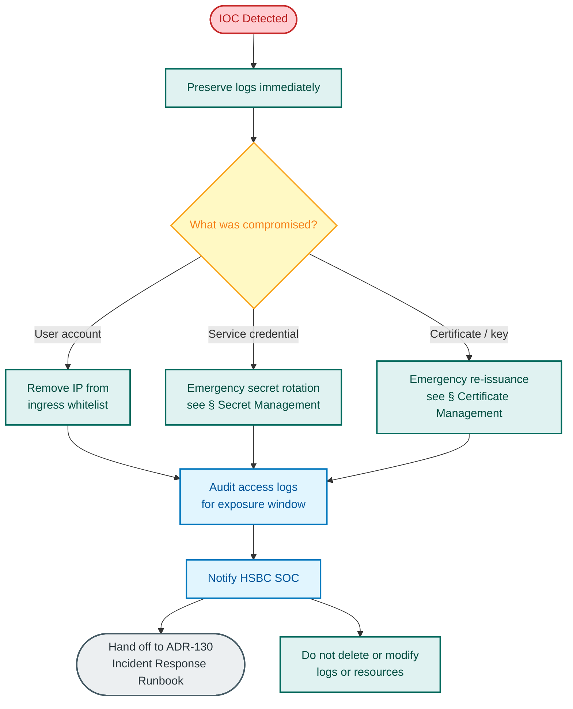

# Security Operations Runbook

**Version:** 1.0
**Last Updated:** 2026-04-17

This runbook provides step-by-step procedures for day-to-day security operations on the Graph OLAP Platform. It covers secret management, certificate lifecycle, vulnerability response, access control, security monitoring, and compliance.

**References:**
- [ADR-136: Security Operations Runbook](--/process/adr/operations/adr-136-security-operations-runbook.md)
- [ADR-112: Remove Auth0 and Replace with IP Whitelisting](--/process/adr/security/adr-112-remove-auth0-replace-with-ip-whitelisting.md) -- current access control model
- [ADR-130: Incident Response Runbook](--/process/adr/operations/adr-130-incident-response-runbook.md) -- incident lifecycle handoff
- [Container Security Audit](--/security/container-security-audit.md) -- security posture assessment
- [Security Improvements Summary](--/security/security-improvements-summary.md) -- implemented controls
- [Container Supply Chain Governance](--/governance/container-supply-chain.governance.md) -- image acquisition process
- [Observability Design](--/operations/observability.design.md) -- logging and monitoring architecture

## Table of Contents

- [Secret Management](#secret-management)
- [Certificate Management](#certificate-management)
- [Vulnerability Management](#vulnerability-management)
- [Access Control Operations](#access-control-operations)
- [Security Monitoring](#security-monitoring)
- [Compliance Operations](#compliance-operations)
- [Hardening Checklist](#hardening-checklist)

---

## Secret Management

### Secret Inventory

| Secret | Storage | Used By | Rotation Frequency |
|--------|---------|---------|-------------------|
| Cloud SQL database password | Google Secret Manager (`database-url`) | control-plane | 90 days |
| Internal API key | Google Secret Manager (`api-internal-token`) | control-plane, export-worker | 90 days |
| Starburst Galaxy password | Google Secret Manager (`starburst-password`) | export-worker | 90 days |
| GCS service account key | Workload Identity (no key file) | all services | N/A (keyless) |
| Docker registry credentials | Workload Identity (no key file) | GKE node pool | N/A (keyless) |

> **Note:** ADR-112 removed Auth0 and all OIDC infrastructure. Access control uses ingress IP whitelisting and X-Username headers. When HSBC production authentication is finalised, add the relevant secrets (e.g., OIDC client secret, signing keys) to this inventory and document their rotation procedures.

> **Rotation frequency:** The 90-day rotation cycle aligns with HSBC's credential rotation policy for non-privileged service credentials. Adjust if HSBC security policy specifies a different cadence.

### Routine Secret Rotation: Cloud SQL Password

Perform this procedure during a maintenance window. Expected downtime: under 60 seconds.

1. Generate a new password:
   ```bash
   NEW_PASSWORD=$(openssl rand -base64 32)
   ```
2. Update the password in Cloud SQL:
   ```bash
   gcloud sql users set-password postgres \
     --instance=<INSTANCE_NAME> \
     --password="${NEW_PASSWORD}"
   ```
3. Update the secret in Google Secret Manager:
   ```bash
   echo -n "${NEW_PASSWORD}" | gcloud secrets versions add database-url --data-file=-
   ```
4. Restart the control plane to pick up the new secret version:
   ```bash
   kubectl rollout restart deployment/control-plane -n graph-olap-platform
   ```
5. Verify the control plane health endpoint returns healthy:
   ```bash
   kubectl rollout status deployment/control-plane -n graph-olap-platform --timeout=120s
   curl -sf https://<INGRESS_HOST>/health | jq .checks.postgres
   ```
6. **If health check fails** -- re-enable the previous secret version and investigate:
   ```bash
   gcloud secrets versions enable <OLD_VERSION_NUMBER> --secret=database-url
   kubectl rollout restart deployment/control-plane -n graph-olap-platform
   ```
7. Once healthy, disable the old secret version:
   ```bash
   gcloud secrets versions disable <OLD_VERSION_NUMBER> --secret=database-url
   ```

### Routine Secret Rotation: Internal API Key

1. Generate a new API key:
   ```bash
   NEW_KEY=$(openssl rand -hex 32)
   ```
2. Update the secret in Google Secret Manager:
   ```bash
   echo -n "${NEW_KEY}" | gcloud secrets versions add api-internal-token --data-file=-
   ```
3. Restart both the control plane and export worker simultaneously so both pick up the new key at the same time:
   ```bash
   kubectl rollout restart deployment/control-plane deployment/export-worker -n graph-olap-platform
   ```

   > **Note:** `kubectl rollout restart` issues restart commands sequentially, not atomically. There is a brief window (typically under 30 seconds) where one service may have the new key while the other still has the old key, causing inter-service authentication failures. This is expected and self-resolving once both rollouts complete. During emergency rotation of a compromised key, monitor for 5xx errors between services during this window.

4. Verify both deployments are healthy:
   ```bash
   kubectl rollout status deployment/control-plane -n graph-olap-platform --timeout=120s
   kubectl rollout status deployment/export-worker -n graph-olap-platform --timeout=120s
   kubectl logs -n graph-olap-platform -l app=export-worker --since=2m | grep -i "health\|error"
   ```
5. **If either deployment fails** -- re-enable the previous secret version and restart both:
   ```bash
   gcloud secrets versions enable <OLD_VERSION_NUMBER> --secret=api-internal-token
   kubectl rollout restart deployment/control-plane deployment/export-worker -n graph-olap-platform
   ```
6. Once healthy, disable the old secret version.

### Routine Secret Rotation: Starburst Galaxy Password

Coordinate with the Starburst Galaxy administrator before rotating. The export-worker and E2E test jobs use this credential.

1. Generate a new password in the Starburst Galaxy console for the service account.
2. Update the secret in Google Secret Manager:
   ```bash
   echo -n "<NEW_STARBURST_PASSWORD>" | gcloud secrets versions add starburst-password --data-file=-
   ```
3. Restart the export worker to pick up the new secret:
   ```bash
   kubectl rollout restart deployment/export-worker -n graph-olap-platform
   ```
4. Verify the export worker can connect to Starburst:
   ```bash
   kubectl rollout status deployment/export-worker -n graph-olap-platform --timeout=120s
   kubectl logs -n graph-olap-platform -l app=export-worker --since=2m | grep -i "starburst\|error"
   ```
5. **If health check fails** -- re-enable the previous secret version:
   ```bash
   gcloud secrets versions enable <OLD_VERSION_NUMBER> --secret=starburst-password
   kubectl rollout restart deployment/export-worker -n graph-olap-platform
   ```
6. Once healthy, disable the old secret version.

### Emergency Secret Rotation: Compromised Credential

If a credential is believed to be compromised, follow this expedited procedure:

1. **Immediately** rotate the compromised secret using the appropriate routine procedure above. Do not wait for a maintenance window.
2. **Revoke** any active sessions that may have used the compromised credential:
   - For database credentials: terminate all active database connections (`gcloud sql connect` and issue `SELECT pg_terminate_backend(pid) FROM pg_stat_activity WHERE usename='postgres'`).
   - For API keys: restart all services that use the key.
   - For Starburst credentials: contact the Starburst Galaxy administrator to invalidate the old credential.
3. **Audit** access logs for suspicious activity during the exposure window:
   ```bash
   gcloud logging read \
     'resource.type="k8s_container" resource.labels.namespace_name="graph-olap-platform"' \
     --freshness=24h --format=json | jq 'select(.jsonPayload.user_id != null)' \
     > /tmp/access-audit.json
   ```
4. **Report** the incident to the HSBC security operations centre (SOC) per the incident response runbook.
5. **Document** the incident: timeline, scope, actions taken, and follow-up items.

> **Change Control:** Emergency rotations may proceed without prior Deliverance approval. Submit a retrospective change request within 24 hours.

---

## Certificate Management

### Certificate Inventory

| Certificate | Type | Issuer | Location | Renewal |
|-------------|------|--------|----------|---------|
| Ingress TLS (public) | TLS server | Google-managed / Let's Encrypt | GKE Ingress | Automatic |
| Cloud SQL server cert | TLS server | Google internal CA | Cloud SQL instance | Automatic (Google-managed) |
| Cloud SQL client cert | TLS client | Google internal CA | Secret Manager | 365 days |

### Verifying Certificate Expiry

```bash
# Ingress TLS certificate
echo | openssl s_client -connect <INGRESS_HOST>:443 -servername <INGRESS_HOST> 2>/dev/null \
  | openssl x509 -noout -dates

# Cloud SQL server certificate
gcloud sql instances describe <INSTANCE_NAME> \
  --format='value(serverCaCert.expirationTime)'
```

### Certificate Renewal: Ingress TLS

If using Google-managed certificates, renewal is automatic. If using cert-manager with Let's Encrypt:

1. Check certificate status:
   ```bash
   kubectl get certificate -n graph-olap-platform
   kubectl describe certificate -n graph-olap-platform <CERT_NAME>
   ```
2. If renewal failed, check cert-manager logs:
   ```bash
   kubectl logs -n cert-manager -l app=cert-manager --since=1h
   ```
3. Force renewal by deleting the certificate secret (cert-manager will re-issue):
   ```bash
   kubectl delete secret -n graph-olap-platform <TLS_SECRET_NAME>
   ```

### Emergency Certificate Re-Issuance

If a private key is compromised:

1. Delete the existing certificate and its backing secret to trigger re-issuance with a new key pair:
   ```bash
   kubectl delete certificate -n graph-olap-platform <CERT_NAME>
   kubectl delete secret -n graph-olap-platform <TLS_SECRET_NAME>
   ```
2. Verify cert-manager has re-issued the certificate (may take 1-2 minutes):
   ```bash
   kubectl get certificate -n graph-olap-platform
   # STATUS should show "True" under READY
   ```
3. Verify the new certificate is served:
   ```bash
   echo | openssl s_client -connect <HOST>:443 2>/dev/null | openssl x509 -noout -serial -dates
   ```

### Certificate Renewal: Cloud SQL Client Certificate

The Cloud SQL client certificate expires after 365 days. Renew before expiry to avoid database connection failures.

1. Create a new client certificate:
   ```bash
   gcloud sql ssl client-certs create <CERT_NAME> \
     --instance=<INSTANCE_NAME> \
     --cert=client-cert.pem --key=client-key.pem
   ```
2. Update the certificate in Google Secret Manager or the relevant Kubernetes secret.
3. Restart services that connect to Cloud SQL:
   ```bash
   kubectl rollout restart deployment/control-plane -n graph-olap-platform
   ```
4. Verify database connectivity:
   ```bash
   kubectl rollout status deployment/control-plane -n graph-olap-platform --timeout=120s
   curl -sf https://<INGRESS_HOST>/health | jq .checks.postgres
   ```
5. Revoke the old client certificate after confirming the new one works:
   ```bash
   gcloud sql ssl client-certs delete <OLD_CERT_NAME> --instance=<INSTANCE_NAME>
   ```

---

## Vulnerability Management

### Container Image Scanning Schedule

The HSBC supply chain relies on Chainguard distroless base images (`cgr.dev/chainguard/python:latest` for `control-plane`, `export-worker`, and `falkordb-wrapper`) which ship with a near-zero CVE surface. Image provenance is recorded in Jenkins build metadata (`VERSION=1.0_N_<sha7>`, pushed to `gcr.io/hsbc-12636856-udlhk-dev/com/hsbc/wholesale/data/<service>`). Pipeline-integrated vulnerability scanning (Trivy/Grype/Syft) is NOT part of the current HSBC Jenkins `gke_CI()` flow; see [Container Security Audit](--/security/container-security-audit.md) for the full posture assessment.

| Activity | Frequency | Tool | Owner |
|----------|-----------|------|-------|
| Base-image currency review | Weekly | Manual check of Chainguard image digest vs. latest | Ops team |
| Registry on-demand scan | Monthly | GCR Container Analysis (`gcloud artifacts docker images scan`) | Ops team |
| Python dependency review | Per-release | Manual review of `pyproject.toml` lock diffs | Security team |
| Jenkins build artifact audit | Per-release | `gke_CI()` build logs + image digest verification | Release engineer |

> **Note (ADR-128 §297):** Dev-model tooling (Trivy/Grype/Syft/Cosign/Dependabot/SBOM generators) is **not** part of the HSBC shipping surface. If HSBC security policy later mandates pipeline scanning, it will be added to the Jenkins `gke_CI()` stage via a follow-up ADR and this table updated accordingly.

### Vulnerability Triage Process

Triage all findings by CVSS score:

| CVSS Score | Severity | Response Time | Action |
|------------|----------|---------------|--------|
| 9.0 -- 10.0 | Critical | 24 hours | Immediate patching. Block deployment if fix available. |
| 7.0 -- 8.9 | High | 7 days | Schedule patch in next sprint. |
| 4.0 -- 6.9 | Medium | 30 days | Include in next regular maintenance cycle. |
| 0.1 -- 3.9 | Low | 90 days | Track and address opportunistically. |

### Patching Procedures: Base Image Update

1. Update the base image tag in the service's Dockerfile. Production HSBC services use Chainguard distroless:
   ```dockerfile
   FROM cgr.dev/chainguard/python:latest  # Pin to a specific digest for HSBC releases
   ```
2. Build the new image locally for verification, then trigger the Jenkins `gke_CI()` pipeline which produces the canonical image at `gcr.io/hsbc-12636856-udlhk-dev/com/hsbc/wholesale/data/<service>:1.0_N_<sha7>`. Pipeline-integrated vulnerability scanning is not currently wired in (see Container Image Scanning Schedule above); Jenkins build logs are the image-provenance record.
3. Run unit and integration tests via the HSBC CI workflow attached to the change request.
4. Deploy via the HSBC Jenkins CD stage or, for manual promotion, the deploy script:

   > **Change Control:** Open a Deliverance change request before deploying the patched image.

   ```bash
   ./infrastructure/cd/deploy.sh <service>
   kubectl -n graph-olap-platform get pods,deployments,services
   ```
5. Verify the service health after deployment.

### Patching Procedures: Python Dependency Update

1. Update the dependency in `pyproject.toml` for the affected service.
2. Regenerate the lock file:
   ```bash
   ./tools/scripts/generate-lockfiles.sh
   ```
3. Build, test, and deploy as above.

### Image Provenance

The HSBC supply chain relies on Jenkins build metadata for image provenance, not SBOMs or signed attestations:

- Each image tag embeds the 7-char git SHA (`VERSION=1.0_N_<sha7>`) — the source commit is recoverable from the tag.
- Jenkins `gke_CI()` build logs (retained per HSBC Jenkins retention policy) record the build inputs, base-image digest, and push target.
- Image digests are visible in `gcr.io/hsbc-12636856-udlhk-dev/com/hsbc/wholesale/data/<service>` and can be cross-checked against the Jenkins build record during audit.

> **Note:** Cosign image signing, SBOM generation (Syft/CycloneDX/SPDX), and SLSA provenance attestations are **not** currently part of the HSBC supply chain. These may be introduced via a future ADR if required by HSBC security policy; until then, Jenkins build metadata + git SHA traceability is the provenance path.

---

## Access Control Operations

> **Note:** ADR-112 removed Auth0 and all OIDC infrastructure. The current access control model is IP whitelisting at the nginx ingress layer with application-level identity via X-Username headers. When HSBC production authentication is finalised (enterprise IAM, OIDC, or other), this section must be rewritten with the chosen mechanism's provisioning and deprovisioning procedures.

> **Known limitation:** The X-Username header is set by the client and trusted without server-side verification. Any user on the IP whitelist can set any username, including `admin`. This is a compensating-control gap that must be closed before HSBC production go-live by integrating with enterprise IAM (e.g., CyberArk, Active Directory). Until then, IP whitelisting is the sole access control boundary, and audit log entries based on X-Username cannot provide non-repudiation.

### Ingress IP Whitelist Management

Access to the platform is controlled by the nginx ingress `whitelist-source-range` annotation. Only IP addresses in the whitelist can reach the platform.

1. View the current whitelist:
   ```bash
   kubectl get ingress -n graph-olap-platform -o json \
     | jq '.items[].metadata.annotations["nginx.ingress.kubernetes.io/whitelist-source-range"]'
   ```
2. To add or remove an IP, update the ingress annotation via Terraform (preferred) or the Helm values file. Never edit the ingress directly -- persist changes in source control.
3. Create a Deliverance change request before modifying the whitelist in production.
4. After applying the change, verify access from the new IP and confirm denied access from a non-whitelisted IP.

### Application-Level Identity

The platform uses X-Username headers for application-level identity. This is set by the client and trusted by the control plane. There is no server-side authentication mechanism.

| Role | Permissions | Typical Users |
|------|-------------|---------------|
| `analyst` | Read data, create instances, run queries | Data analysts, data scientists |
| `ops` | All analyst permissions + platform management | Platform engineers, SREs |
| `admin` | All ops permissions + user management, config | Platform administrators |

Role assignment is configured in the control-plane configuration. User provisioning and deprovisioning consist of adding/removing IP addresses from the whitelist and updating the control-plane user configuration.

### User Offboarding

1. Remove the user's IP address from the ingress whitelist.
2. Check for orphaned resources owned by the user:
   ```bash
   curl -s https://<INGRESS_HOST>/api/v1/instances \
     -H "X-Username: admin" \
     | jq '.[] | select(.owner_username == "<USERNAME>")'
   ```
3. Terminate any active instances and clean up exports belonging to the user.

> **Caveat:** If the user shares an IP range with other users (corporate NAT, VPN exit node, or CIDR block), their IP address cannot be removed without blocking other users on the same range. In this case, coordinate with the network team to determine whether a more granular IP rule is possible, or defer to the enterprise IAM integration for username-level revocation.

### Service Account Management

Service-to-service authentication uses API keys stored in Google Secret Manager. Each service has a dedicated Kubernetes service account with Workload Identity binding:

| Kubernetes SA | GCP SA | Purpose |
|---------------|--------|---------|
| `control-plane` | `control-plane@<PROJECT>.iam.gserviceaccount.com` | Cloud SQL, GCS read |
| `export-worker` | `export-worker@<PROJECT>.iam.gserviceaccount.com` | GCS write, Starburst Galaxy access |
| `jupyter-labs` | `jupyter-labs@<PROJECT>.iam.gserviceaccount.com` | GCS read (notebook sync) |

To verify a Workload Identity binding:

```bash
gcloud iam service-accounts get-iam-policy <GCP_SA_EMAIL> \
  --format=json | jq '.bindings[] | select(.role == "roles/iam.workloadIdentityUser")'
```

### Periodic Access Review

Perform quarterly:

1. Export the current ingress IP whitelist and identify the owner of each IP/CIDR range.
2. Cross-reference with the authorised personnel register maintained in the HSBC access management system of record. If no centralised register exists, obtain a signed list from the team lead and file it as audit evidence.
3. Remove IP addresses belonging to users who have left the project or changed roles.
4. Verify service account permissions have not been expanded beyond their documented scope:
   ```bash
   for SA in control-plane export-worker jupyter-labs; do
     echo "--- ${SA} ---"
     gcloud projects get-iam-policy <PROJECT_ID> \
       --flatten="bindings[].members" \
       --filter="bindings.members:${SA}@<PROJECT>.iam.gserviceaccount.com" \
       --format="table(bindings.role)"
   done
   ```
5. Document the review outcome and file as evidence for SOX audits.

### Segregation of Duties

Production operations must follow HSBC segregation of duties requirements:

- The person who writes code must not be the person who deploys it.
- The person who approves a Deliverance change request must not be the requestor.
- `admin` role access requires dual approval. (Until enterprise IAM is integrated, this control relies on IP whitelisting and procedural enforcement rather than technical enforcement -- see the Known Limitation note above.)
- Emergency access grants must be reviewed and revoked within 24 hours.

---

## Security Monitoring

### Suspicious Activity Indicators

Monitor for these patterns in Cloud Logging:

| Indicator | Description | Severity |
|-----------|-------------|----------|
| Repeated 401/403 from one IP | Brute-force or credential stuffing | High |
| 403 on admin endpoints from non-admin user | Privilege escalation attempt | High |
| Unusual hours API activity | Access outside business hours (before 07:00 or after 20:00 UTC) | Medium |
| High volume of instance creation | More than 10 instances created by one user in 1 hour | Medium |
| API calls from non-whitelisted IPs | IP whitelist bypass or misconfiguration | Critical |
| Bulk data export by a single user | More than 5 exports in 1 hour from a single user | Medium |
| Ingress whitelist modification | Unauthorised CIDR range added to ingress annotation | Critical |

### Security Log Queries

> **Data Protection:** Security log queries may surface PII (user identifiers, IP addresses). Handle query results according to HSBC GDPR and data protection requirements. Retain security investigation logs only for the duration required by the investigation plus the mandated retention period.

```
# Failed authentication attempts (last 24 hours)
resource.type="k8s_container"
resource.labels.namespace_name="graph-olap-platform"
jsonPayload.message=~"401|unauthorized|authentication failed"
severity>=WARNING

# Privilege escalation attempts (403 on admin/ops endpoints)
resource.type="k8s_container"
resource.labels.namespace_name="graph-olap-platform"
jsonPayload.message=~"403|forbidden"
httpRequest.requestUrl=~"/api/v1/ops/|/api/v1/admin/"

# Ingress whitelist changes (GKE audit log)
resource.type="k8s_cluster"
protoPayload.methodName=~"io.k8s.networking.v1.ingresses.update|io.k8s.networking.v1.ingresses.patch"
protoPayload.resourceName=~"graph-olap-platform"

# Unusual data export volume
resource.type="k8s_container"
resource.labels.container_name="export-worker"
jsonPayload.message=~"export_completed"
```

### Indicators of Compromise (IOC) Response


<details>
<summary>Mermaid Source</summary>



</details>

If an IOC is detected:

1. Capture and preserve relevant logs immediately:
   ```bash
   gcloud logging read \
     'resource.type="k8s_container" resource.labels.namespace_name="graph-olap-platform"' \
     --freshness=48h --format=json > /tmp/incident-logs-$(date +%Y%m%d).json
   ```
2. If a user account is compromised, immediately remove the user's IP address from the ingress whitelist to block all access, then restart the ingress controller to apply the change.
3. If a service account is compromised, follow the emergency secret rotation procedure.
4. Notify the HSBC SOC and follow the [Incident Response Runbook](--/process/adr/operations/adr-130-incident-response-runbook.md) for formal incident lifecycle management.
5. Do not delete or modify any logs or resources until instructed by the incident response team.

---

## Compliance Operations

### SOX Audit Preparation

The platform supports SOX compliance through change control, access management, and audit logging.

**Evidence to collect before an audit:**

| Evidence | Source | Collection Method |
|----------|--------|-------------------|
| Change history | Git commit log + Deliverance tickets | `git log --since="YYYY-01-01" --oneline` |
| Access control list | Ingress whitelist + control-plane user config | `kubectl get ingress` annotation + control-plane ConfigMap |
| Access reviews | Quarterly review documents | Internal document store |
| Vulnerability scan results | Jenkins build artifacts + on-demand `gcloud artifacts docker images scan` output | Jenkins archive + gcloud CLI |
| Secret rotation log | Google Secret Manager version history | `gcloud secrets versions list --secret=<NAME>` |
| Incident reports | Incident response documentation | Internal document store |
| Deployment history | Jenkins `gke_CI()` pipeline logs + Deliverance tickets | Jenkins archive + `kubectl -n graph-olap-platform rollout history deployment/<service>` |

### Change Control via Deliverance

All production changes follow the Deliverance change control process:

1. Create a Deliverance change request with the change description, risk assessment, and rollback plan.
2. Obtain approval from the required approvers (typically: team lead + ops lead).
3. Reference the Deliverance ticket in the Git commit message.
4. After deployment, update the Deliverance ticket with the deployment outcome.
5. Close the ticket after the change stabilisation period (typically 24 hours).

### Evidence Collection: Secret Rotation

To prove secrets have been rotated within policy:

```bash
# List all versions with creation dates
gcloud secrets versions list --secret=database-url --format="table(name,state,createTime)"
gcloud secrets versions list --secret=api-internal-token --format="table(name,state,createTime)"
gcloud secrets versions list --secret=starburst-password --format="table(name,state,createTime)"
```

Verify that the most recent active version was created within the 90-day rotation policy window.

---

## Hardening Checklist

Perform this checklist monthly. Record the date and outcome for each item.

### Container Security

- [ ] All containers run as non-root (`runAsNonRoot: true` in pod security context)
- [ ] All containers drop all Linux capabilities (`drop: ["ALL"]`)
- [ ] No containers use privileged mode (`privileged: false`)
- [ ] No containers mount the Docker socket
- [ ] Read-only root filesystem is enabled where possible (`readOnlyRootFilesystem: true`)
- [ ] All images are pulled from private Artifact Registry (no public image references)
- [ ] Image pull policy is `IfNotPresent` or `Always` (never `Never` in production)

Verification:

```bash
kubectl get pods -n graph-olap-platform -o json \
  | jq '.items[] | {name: .metadata.name,
      containers: [.spec.containers[] | {name: .name,
        runAsNonRoot: .securityContext.runAsNonRoot,
        privileged: .securityContext.privileged,
        readOnlyRootFilesystem: .securityContext.readOnlyRootFilesystem}]}'
```

### Network Security

- [ ] Network policies are enforced in the graph-olap-platform namespace
- [ ] Default deny ingress policy is in place
- [ ] Only the ingress controller can reach the control plane on port 8080
- [ ] Wrapper pods can only be reached from the control plane
- [ ] Export workers can reach Starburst Galaxy and GCS but not the public internet
- [ ] No pods have `hostNetwork: true`

Verification:

```bash
kubectl get networkpolicies -n graph-olap-platform
kubectl get pods -n graph-olap-platform -o json \
  | jq '.items[] | select(.spec.hostNetwork == true) | .metadata.name'
```

### Cluster Security

- [ ] GKE cluster is private (no public endpoint)
- [ ] Shielded GKE nodes are enabled
- [ ] Workload Identity is enabled on all node pools
- [ ] Binary Authorization is in ENFORCED mode for the HSBC `asia-east2` project (DRYRUN is not acceptable in production; document an exception with security team approval if ENFORCED cannot be enabled). Per **ADR-147**, BinAuthZ is demo-exempt — the gcp-london-demo environment does not enforce BinAuthZ.
- [ ] Pod Security Standards are enforced at the namespace level
- [ ] RBAC is configured with least-privilege roles
- [ ] Audit logging is enabled at the GKE cluster level

Verification:

```bash
gcloud container clusters describe <CLUSTER_NAME> --zone=<ZONE> \
  --format="table(privateClusterConfig.enablePrivateNodes,
    shieldedNodes.enabled,
    workloadIdentityConfig.workloadPool,
    binaryAuthorization.evaluationMode)"
```

### Secret Security

- [ ] No secrets are stored in environment variables in deployment manifests (use Secret Manager references)
- [ ] All secrets in Google Secret Manager have automatic rotation reminders set
- [ ] No service account keys exist (Workload Identity is used instead)
- [ ] Secret Manager IAM bindings follow least privilege (only the consuming service account has `secretAccessor`)

Verification:

```bash
# Check for service account keys (should return empty for all SAs)
for SA in control-plane export-worker jupyter-labs; do
  echo "--- ${SA} ---"
  gcloud iam service-accounts keys list \
    --iam-account="${SA}@<PROJECT>.iam.gserviceaccount.com" \
    --format="table(name,validAfterTime,validBeforeTime)" \
    --filter="keyType=USER_MANAGED"
done
```

### Supply Chain Security

- [ ] All three Python services (`control-plane`, `export-worker`, `falkordb-wrapper`) use Chainguard distroless base images (`cgr.dev/chainguard/python:latest`)
- [ ] Base image digests are reviewed for currency each release (see [Container Security Audit](--/security/container-security-audit.md))
- [ ] Python dependency updates go through the lockfile regeneration path (`tools/scripts/generate-lockfiles.sh`) and are reviewed per release
- [ ] The [Container Supply Chain Governance process](--/governance/container-supply-chain.governance.md) is followed for any new external images
- [ ] GCR cleanup policies are configured (delete untagged images older than 30 days)
- [ ] Jenkins `gke_CI()` build logs for each shipped release are retained per HSBC Jenkins retention policy

> **Note:** Cosign image signing, SBOM attestation (Syft/CycloneDX/SPDX), and SLSA provenance are not currently part of the HSBC supply chain. A follow-up ADR will evaluate these if mandated by HSBC security policy.

---

## Related Documents

- [Incident Response Runbook (ADR-130)](incident-response.runbook.md) — Security incident escalation
- [Platform Operations Manual (ADR-129)](platform-operations.manual.md) — Routine operations
- [Service Catalogue (ADR-134)](service-catalogue.manual.md) — Service inventory and ports
- [Monitoring and Alerting Runbook (ADR-131)](monitoring-alerting.runbook.md) — Security alert response
- [Deployment Design](deployment.design.md) — Secret management, access controls
- [Change Control Framework](--/governance/change-control-framework.governance.md) — SOX compliance, Deliverance workflow
- [Platform Operations Architecture](--/architecture/platform-operations.md) — Security controls matrix
