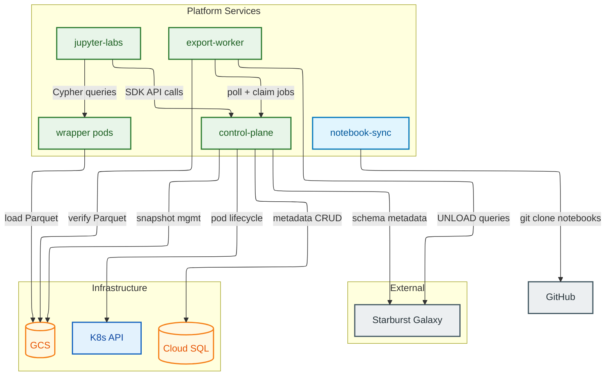
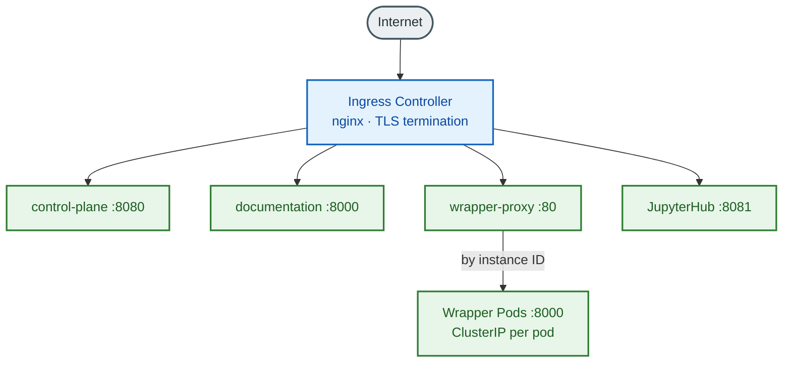
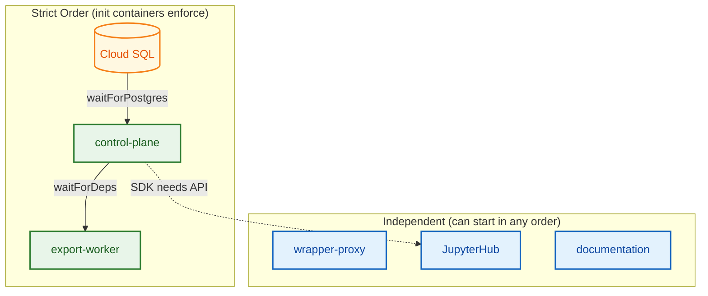

# Service Catalogue

**Document Type:** Operations Manual
**Version:** 1.1
**Last Updated:** 2026-04-17
**ADR:** [ADR-134](--/process/adr/operations/adr-134-service-catalogue.md), [ADR-149](--/process/adr/process/adr-149-implementation-vs-documentation-drift-remediation.md) (Tier-B.7 drift remediation)

---

## 1. Service Inventory

### 1.1 Platform Services

| Service | Type | Port | Health Endpoint | Replicas | Criticality | Owner |
|---------|------|------|-----------------|----------|-------------|-------|
| control-plane | Deployment | 8080 | `GET /health` | 1 (fixed) | Critical | Platform team |
| export-worker | Deployment | -- | -- | 1 (fixed) | High | Platform team |
| wrapper-proxy | Deployment | 80 | -- | 2 (fixed) | High | Platform team |
| documentation | Deployment | 8000 | `GET /` | 1 | Low | Platform team |
| extension-server | Deployment | 80 | -- | 1 | Medium | Platform team |

> **Autoscaling state.** Neither HPA nor KEDA is enabled on the HSBC handoff target. The `infrastructure/cd/resources/*-deployment.yaml` manifests applied by `infrastructure/cd/deploy.sh` ship fixed replica counts (1 for control-plane and export-worker, 2 for wrapper-proxy) and no `HorizontalPodAutoscaler` or KEDA `ScaledObject` resources. KEDA is not installed in the HSBC target cluster.
>
> ### 1.2 Dynamic Services (Created on Demand)

| Service | Type | Port | Health Endpoint | Lifecycle | Criticality |
|---------|------|------|-----------------|-----------|-------------|
| ryugraph-wrapper | Pod | 8000 | `GET /health` | Per-instance, TTL-managed | High |
| falkordb-wrapper | Pod | 8000 | `GET /health` | Per-instance, TTL-managed | High |
| notebook-sync | Init Container | -- | -- | Runs once at pod start | Medium |

> **Note — wrapper deployment model.** `ryugraph-wrapper` and
> `falkordb-wrapper` have **no Helm charts**. Wrapper pods are created
> imperatively by the control plane at instance creation time, one per
> instance. See
> [`ryugraph-wrapper.deployment.design.md`](--/component-designs/ryugraph-wrapper.deployment.design.md)
> for the spawn flow, image-rollout procedure, and lifecycle.

### 1.3 JupyterHub Services

| Service | Type | Port | Health Endpoint | Replicas | Criticality |
|---------|------|------|-----------------|----------|-------------|
| JupyterHub (hub) | Deployment | 8081 | `GET /hub/health` | 1 | High |
| User notebook pods | Pod | 8888 | -- | 0--N (per-user, idle culled) | Medium |

---

## 2. Dependency Map

Mermaid Source

### 2.1 Dependency Direction Summary

| From | To | Protocol | Purpose |
|------|----|----------|---------|
| control-plane | Cloud SQL | PostgreSQL (TLS) | Metadata CRUD |
| control-plane | GCS | HTTPS | Snapshot management |
| control-plane | K8s API | HTTPS | Wrapper pod lifecycle |
| control-plane | Starburst Galaxy | HTTPS | Schema metadata, query validation |
| export-worker | control-plane | HTTP (in-cluster) | Poll and claim export jobs |
| export-worker | Starburst Galaxy | HTTPS | Submit UNLOAD queries |
| export-worker | GCS | HTTPS | Verify Parquet row counts |
| wrapper pods | GCS | HTTPS | Load Parquet data on startup |
| jupyter-labs | control-plane | HTTP (in-cluster) | SDK API calls |
| jupyter-labs | wrapper pods | HTTP (in-cluster) | Cypher queries, algorithm execution |
| notebook-sync | GitHub | HTTPS (git clone) | Clone tutorial/reference notebooks into the user's working directory at pod start |

---

## 3. Service Descriptions

### 3.1 control-plane

**Purpose:** Central API server. Manages all platform resources (mappings, snapshots, instances). Runs background reconciliation and lifecycle jobs. Serves as the single entry point for the SDK and all administrative operations.

**Key Endpoints:**

| Endpoint | Method | Purpose |
|----------|--------|---------|
| `/health` | GET | Liveness and readiness probe |
| `/metrics` | GET | Prometheus metrics (port 9090) |
| `/api/mappings/*` | CRUD | Graph mapping definitions |
| `/api/instances/*` | CRUD | Graph instance lifecycle |
| `/api/schema/*` | GET | Starburst Galaxy schema browser |
| `/api/config/*` | GET/PUT | Runtime configuration (Ops role) |
| `/ops/*` | GET/POST | Cluster health, background jobs, metrics |
| `/admin/*` | POST | Bulk operations (Admin role) |
| `/api/internal/*` | POST | Service-to-service (export-worker) |

**Dependencies:**

- **Upstream:** Cloud SQL (required -- will not start without it), GCS, K8s API, Starburst Galaxy
- **Downstream:** export-worker (polls control-plane), SDK/notebooks (API calls), wrapper pods (created by control-plane)

**Data Stores:**

- Cloud SQL PostgreSQL: all metadata (mappings, snapshots, instances, export jobs, config)
- GCS: snapshot Parquet files (read/write)

**Key Environment Variables:**

| Variable | Source | Purpose |
|----------|--------|---------|
| `DATABASE_URL` | Secret `control-plane-secrets` | PostgreSQL connection string |
| `GCS_BUCKET` | ConfigMap | GCS bucket name |
| `GCP_PROJECT` | ConfigMap | GCP project ID |
| `K8S_NAMESPACE` | ConfigMap | Namespace for wrapper pods |
| `WRAPPER_IMAGE` | ConfigMap | Ryugraph wrapper Docker image |
| `FALKORDB_WRAPPER_IMAGE` | ConfigMap | FalkorDB wrapper Docker image |
| `STARBURST_URL` | ConfigMap | Starburst Galaxy endpoint |
| `STARBURST_USER` | ConfigMap | Starburst Galaxy service account |
| `STARBURST_PASSWORD` | Secret `starburst-credentials` | Starburst Galaxy password |

> **Note — internal endpoint authentication.** Internal endpoints (`/api/internal/*`) are isolated by NetworkPolicy, not a shared secret. See `packages/control-plane/src/control_plane/config.py:123-124`.

**Health Check:** `GET /health` is a plain liveness check -- returns `{"status": "healthy"}` with HTTP 200 (does not check database connectivity). `GET /ready` is the readiness check -- verifies database connectivity and returns `{"status": "ready", "database": "connected"}` with HTTP 200. If the database is unreachable, `/ready` returns `{"status": "not_ready", "database": "disconnected"}`.

**Restart Safety:** Safe to restart. Stateless -- all state is in Cloud SQL. In-flight API requests will fail; clients (SDK) retry automatically. Background jobs resume on startup.

**Scaling:** Fixed at 1 replica on the HSBC target (`infrastructure/cd/resources/control-plane-deployment.yaml:spec.replicas=1`, no `HorizontalPodAutoscaler`). Each replica can handle ~100 req/s. Database connection pool: 25 per replica + 5 overflow.

---

### 3.2 export-worker

**Purpose:** Polls control-plane for pending export jobs, submits UNLOAD queries to Starburst Galaxy, monitors query progress, and verifies Parquet row counts in GCS. Fully stateless -- all state is persisted in Cloud SQL via the control-plane API.

**Key Interfaces:**

| Interface | Direction | Purpose |
|-----------|-----------|---------|
| `POST /api/internal/exports/claim` | Outbound to control-plane | Claim pending jobs |
| `POST /api/internal/exports/{id}/status` | Outbound to control-plane | Report job status |
| Starburst Galaxy REST API | Outbound | Submit UNLOAD, poll query status |
| GCS | Outbound | Count Parquet rows |

**Dependencies:**

- **Upstream:** control-plane (required -- will not start without it via init container check)
- **Upstream:** Starburst Galaxy (required for export execution)
- **Upstream:** GCS (required for row count verification)
- **Downstream:** None

**Data Stores:** None directly. All state is managed through the control-plane API.

**Key Environment Variables:**

| Variable | Source | Purpose |
|----------|--------|---------|
| `CONTROL_PLANE_URL` | ConfigMap | Control-plane internal URL |
| `STARBURST_URL` | ConfigMap | Starburst Galaxy endpoint |
| `STARBURST_USER` | ConfigMap | Starburst Galaxy service account |
| `STARBURST_PASSWORD` | Secret `export-worker-secrets` | Starburst Galaxy password |
| `POLL_INTERVAL_SECONDS` | ConfigMap | Main loop interval (default 5) |
| `CLAIM_LIMIT` | ConfigMap | Max jobs to claim per cycle (default 10) |

> **Note — internal endpoint authentication.** The worker authenticates to the control-plane via NetworkPolicy-scoped in-cluster access, not a shared secret.

**Health Check:** No HTTP health endpoint. Liveness is determined by pod status. The worker runs a continuous polling loop and exits on fatal errors.

**Restart Safety:** Safe to restart at any time. No in-memory state. Export jobs use a claim-based model: uncompleted claims are reset by the control-plane export reconciliation job (runs every 5 seconds; deliberate exception to ADR-040 for near-real-time propagation) and re-claimed by another worker.

**Scaling:** Fixed at 1 replica on the HSBC target (`infrastructure/cd/resources/export-worker-deployment.yaml:spec.replicas=1`, no KEDA `ScaledObject`). KEDA is not installed in the HSBC target cluster.

---

### 3.3 wrapper-proxy

**Purpose:** Nginx-based request routing proxy that sits in front of ryugraph-wrapper and falkordb-wrapper pods. Routes graph API requests (`/wrapper/{slug}/*`) to the appropriate backend wrapper pod via dynamic DNS resolution through CoreDNS. Supports both static wrappers (always-running `falkordb-wrapper` and `ryugraph-wrapper` services) and dynamic per-analyst wrappers created by the control-plane.

**Key Endpoints:**

| Endpoint | Method | Purpose |
|----------|--------|---------|
| `/healthz` | GET | Liveness and readiness probe |
| `/wrapper/falkordb/*` | ANY | Proxy to static falkordb-wrapper pod |
| `/wrapper/ryugraph/*` | ANY | Proxy to static ryugraph-wrapper pod |
| `/wrapper/{slug}/*` | ANY | Proxy to dynamic wrapper pod by instance slug |

**Dependencies:**

- **Upstream:** CoreDNS (resolves `wrapper-{slug}` ClusterIP services)
- **Downstream:** ryugraph-wrapper pods, falkordb-wrapper pods (all dynamic and static instances)

**Data Stores:** None. Fully stateless reverse proxy.

**Key Environment Variables:**

| Variable | Source | Purpose |
|----------|--------|---------|
| `POD_NAMESPACE` | Downward API (`metadata.namespace`) | Injected into nginx config for service DNS resolution |

**Resource Requirements:**

| Resource | Request | Limit |
|----------|---------|-------|
| CPU | 100m | 500m |
| Memory | 128Mi | 256Mi |

**Ports:** Container port 8080, Service port 80 (CD/LoadBalancer) or 8080 (Helm/ClusterIP). Exposed externally via Ingress for instance API routing.

**Health Check:** `GET /healthz` on port 8080 returns HTTP 200. Liveness probe: initial delay 10s, period 10s. Readiness probe: initial delay 5s, period 5s.

**Restart Safety:** Fully stateless. Safe to restart at any time. In-flight proxied requests will fail; clients (SDK) retry automatically. A PodDisruptionBudget (`minAvailable: 1`) ensures at least one replica remains available during rolling updates.

**Scaling:** Fixed at 1 replica (no autoscaling). Resource footprint is minimal. Can be scaled horizontally if proxy throughput becomes a bottleneck.

---

### 3.4 ryugraph-wrapper

**Purpose:** Serves a single Ryugraph (KuzuDB fork) graph instance. Loads Parquet data from GCS on startup, provides Cypher query execution and NetworkX graph algorithm APIs.

**Key Endpoints:**

| Endpoint | Method | Purpose |
|----------|--------|---------|
| `/health` | GET | Liveness probe |
| `/ready` | GET | Readiness probe (data loaded) |
| `/api/query` | POST | Execute Cypher query |
| `/api/algorithms/*` | POST | Run graph algorithms (PageRank, etc.) |

**Dependencies:**

- **Upstream:** GCS (load Parquet on startup)
- **Downstream:** None (serves SDK/notebook queries directly)

**Data Stores:** Embedded KuzuDB (disk-backed buffer pool). Data loaded from GCS Parquet at startup.

**Key Environment Variables:**

| Variable | Source | Purpose |
|----------|--------|---------|
| `WRAPPER_TYPE` | Pod spec | `ryugraph` |
| `WRAPPER_SNAPSHOT_ID` | Pod spec | Snapshot to load |
| `WRAPPER_GCS_BASE_PATH` | Pod spec | GCS path for Parquet data |
| `BUFFER_POOL_SIZE` | Pod spec | KuzuDB buffer pool in bytes |

**Health Check:** `GET /health` returns HTTP 200 when process is alive. `GET /ready` returns HTTP 200 only after Parquet data is fully loaded.

**Restart Safety:** Pods are ephemeral. Data is loaded from GCS on every startup. Restarting a wrapper pod causes temporary unavailability for that graph instance. Users can re-query after the pod restarts and reloads data (typically 1--3 minutes).

**Scaling:** Not horizontally scalable -- one pod per graph instance by design. Vertical scaling via in-place resize (CPU: both directions; memory: increase only).

---

### 3.5 falkordb-wrapper

**Purpose:** Serves a single FalkorDB graph instance. In-memory only graph database. Provides Cypher query execution and native C-based graph algorithm APIs.

**Key Endpoints:** Same as ryugraph-wrapper (`/health`, `/ready`, `/api/query`, `/api/algorithms/*`).

**Dependencies:** Same as ryugraph-wrapper (GCS for data loading).

**Data Stores:** FalkorDB (in-memory, Redis-based). All data must fit in RAM. No disk caching.

**Key Environment Variables:**

| Variable | Source | Purpose |
|----------|--------|---------|
| `WRAPPER_TYPE` | Pod spec | `falkordb` |
| `WRAPPER_SNAPSHOT_ID` | Pod spec | Snapshot to load |
| `WRAPPER_GCS_BASE_PATH` | Pod spec | GCS path for Parquet data |

**Health Check:** Same as ryugraph-wrapper.

**Restart Safety:** Same as ryugraph-wrapper. Data is re-loaded from GCS on restart. In-memory state is lost on restart.

**Scaling:** Same as ryugraph-wrapper. FalkorDB typically requires 1.5x more memory than Ryugraph for the same dataset due to its in-memory-only architecture.

---

### 3.6 jupyter-labs (JupyterHub)

**Purpose:** Provides JupyterHub with per-user notebook pods. Users interact with the platform exclusively through the Python SDK in Jupyter notebooks. Idle pods are culled after 30 minutes.

**Key Endpoints:**

| Endpoint | Method | Purpose |
|----------|--------|---------|
| `/hub/health` | GET | Hub health check |
| `/jupyter/*` | GET/POST | JupyterHub UI and API |
| `:8888` (user pods) | -- | Individual notebook servers |

**Dependencies:**

- **Upstream:** control-plane (SDK makes API calls from notebooks)
- **Upstream:** wrapper pods (SDK sends Cypher queries and algorithm requests)
- **Upstream:** GitHub (notebook-sync init container clones the tutorial repo at pod start)

**Data Stores:** Persistent volume (10 Gi) for user notebooks. Hub state in SQLite (embedded).

**Key Environment Variables:**

| Variable | Source | Purpose |
|----------|--------|---------|
| `CONTROL_PLANE_URL` | ConfigMap | SDK uses this to reach control-plane |
| `JUPYTER_ENABLE_LAB` | ConfigMap | Enable JupyterLab interface |
| `GRAPH_OLAP_IN_CLUSTER_MODE` | ConfigMap | SDK cluster-aware routing |
| `GRAPH_OLAP_NAMESPACE` | ConfigMap | K8s namespace for service discovery |

**Health Check:** `GET /hub/health` on the hub pod.

**Restart Safety:** Hub pod restart terminates all user sessions. User notebook data is preserved on the persistent volume. Users must reconnect after hub restart. Individual user pod restarts only affect that user.

**Scaling:** Hub itself is a single instance. User pods scale automatically (one per user). Idle culling at 30 minutes reduces resource consumption.

---

### 3.7 notebook-sync

**Purpose:** Init container (named `fetch-notebooks`) wired into the `jupyter-labs` Helm chart (`infrastructure/helm/charts/jupyter-labs/templates/deployment.yaml`, gated on `notebookSync.enabled`). It also runs at JupyterHub singleuser-pod startup via `singleuser.initContainers` in `infrastructure/helm/values/jupyterhub-gke-london.yaml`. Clones tutorial and reference notebooks from GitHub (repo/path baked into the image) into the user's working directory.

**Dependencies:** GitHub (clones notebooks via a PAT stored in the `git-sync-token` Kubernetes secret).

**Restart Safety:** Runs once per pod start. No persistent state. Re-runs automatically on pod restart.

---

### 3.8 documentation

**Purpose:** MkDocs Material static documentation site. Serves the platform's user and operator documentation.

**Key Endpoints:**

| Endpoint | Method | Purpose |
|----------|--------|---------|
| `/` | GET | Documentation site root |

**Dependencies:** None at runtime. Static files served by built-in HTTP server.

**Data Stores:** None. Static content baked into Docker image.

**Key Environment Variables:**

| Variable | Source | Purpose |
|----------|--------|---------|
| `PORT` | ConfigMap | HTTP listen port (default 8000) |

**Health Check:** `GET /` returns HTTP 200.

**Restart Safety:** Fully stateless. Safe to restart at any time with zero data loss.

**Scaling:** Single replica sufficient. Can scale horizontally if needed but load is minimal.

---

### 3.9 extension-server

**Purpose:** Serves Ryugraph algorithm extension packages. Used by ryugraph-wrapper pods to discover and load additional graph algorithms beyond the built-in set.

**Dependencies:** None at runtime.

**Restart Safety:** Fully stateless. Safe to restart. Wrapper pods cache extensions after initial load.

---

## 4. Infrastructure Dependencies

| Dependency | Type | Purpose | Failure Impact |
|------------|------|---------|----------------|
| Cloud SQL PostgreSQL | Managed database | All platform metadata | control-plane returns 503; no new instances/exports |
| GCS (bucket) | Object storage | Parquet snapshots, notebooks | Instance creation fails; exports fail; notebook sync fails |
| GKE API | Kubernetes API server | Wrapper pod lifecycle | Cannot create/delete graph instances |
| Workload Identity | IAM binding | Pod-to-GCP authentication | GCS and Cloud SQL access denied |
| Cloud NAT | Networking | Egress for Starburst Galaxy, container pulls | Exports fail; image pulls fail |
| Managed Certificates | TLS | HTTPS termination at ingress | External API access fails |

---

## 5. External Dependencies

| Dependency | Type | Protocol | Purpose | Failure Impact |
|------------|------|----------|---------|----------------|
| Starburst Galaxy (managed Trino) | SaaS | HTTPS | Data source for exports and schema browsing | Exports fail; schema cache stale (serves cached data) |

> **Access control:** The platform currently uses IP whitelisting at the nginx ingress layer (ADR-112). There is no external authentication provider dependency. ADR-137 (status: Proposed) plans migration to Azure AD.

---

## 6. Network Topology

### 6.1 Internal Communication

All service-to-service communication is via ClusterIP services within the `graph-olap-platform` namespace. No service exposes a NodePort or LoadBalancer type (except JupyterHub in local dev).

Mermaid Source

### 6.2 Ingress Routes

The HSBC handoff target is the GKE cluster `hsbc-12636856-udlhk-dev-vp2-cluster` in `asia-east2-b` (project `hsbc-12636856-udlhk-dev`). Hostnames are defined in `infrastructure/cd/resources/certificate.yaml` and `infrastructure/cd/resources/control-plane-ingress.yaml`.

| Host / Path | Backend | Notes |
|-------------|---------|-------|
| `control-plane-graph-olap-platform.hsbc-12636856-udlhk-dev.dev.gcp.cloud.hk.hsbc/*` | control-plane:8080 | API and admin (`gce-internal` ingress, self-signed TLS via cert-manager) |
| `control-plane-graph-olap-platform.hsbc-12636856-udlhk-dev.dev.gcp.cloud.hk.hsbc/wrapper/*` | nginx-wrapper-proxy:80 | Routed to wrapper pods (same ingress, path-based) |
| `graphdocs-graph-olap-platform.hsbc-12636856-udlhk-dev.dev.gcp.cloud.hk.hsbc/*` | documentation:8000 | IP-whitelisted |
| `wrappers-graph-olap-platform.hsbc-12636856-udlhk-dev.dev.gcp.cloud.hk.hsbc/*` | wrapper-proxy (direct) | Wildcard wrapper hostname (per-instance via DNS) |

> JupyterHub is not deployed to the HSBC target; analysts run the SDK from corporate-issued notebooks via the VDI (ADR-108). The wildcard cert in `infrastructure/cd/resources/certificate.yaml` covers `*.graph-olap-platform.hsbc-12636856-udlhk-dev.dev.gcp.cloud.hk.hsbc` for per-instance wrapper DNS.

### 6.3 Pod-to-Pod Encryption

Internal traffic is encrypted with WireGuard (ChaCha20-Poly1305) via Cilium Transparent Encryption on GKE Dataplane V2. No application-level TLS is needed for in-cluster communication.

---

## 7. Port Map

| Service | Container Port | Service Port | Protocol | Exposed Via |
|---------|---------------|--------------|----------|-------------|
| control-plane | 8080 | 8080 | HTTP | Ingress |
| control-plane (metrics) | 9090 | 9090 | HTTP | PodMonitoring |
| export-worker | -- | -- | -- | None (outbound only) |
| ryugraph-wrapper | 8000 | 8000 | HTTP | ClusterIP + wrapper-proxy |
| falkordb-wrapper | 8000 | 8000 | HTTP | ClusterIP + wrapper-proxy |
| wrapper-proxy | 8080 | 80 | HTTP | Ingress |
| jupyterhub (hub) | 8081 | 8081 | HTTP | Ingress |
| jupyter user pods | 8888 | 8888 | HTTP | Hub proxy |
| documentation | 8000 | 8000 | HTTP | Ingress |
| extension-server | 80 | 80 | HTTP | ClusterIP |
| Cloud SQL | 5432 | -- | PostgreSQL | Private IP |

---

## 8. Configuration Reference

### 8.1 Shared Configuration (All Services)

| Variable | Purpose | Default |
|----------|---------|---------|
| `LOG_LEVEL` | Logging verbosity | `INFO` |
| `LOG_FORMAT` | Log output format | `json` |
| `ENVIRONMENT` | Environment name | `production` |
| `GCP_PROJECT` | GCP project ID | -- (required) |

### 8.2 Control-Plane Configuration

| Variable | Purpose | Default |
|----------|---------|---------|
| `DATABASE_URL` | PostgreSQL connection string | -- (required, from Secret) |
| `DB_POOL_SIZE` | SQLAlchemy pool size | `25` |
| `DB_MAX_OVERFLOW` | Pool overflow connections | `5` |
| `GCS_BUCKET` | GCS bucket for snapshots | -- (required) |
| `K8S_NAMESPACE` | Namespace for wrapper pods | Release namespace |
| `K8S_IN_CLUSTER` | Use in-cluster K8s config | `true` |
| `WRAPPER_IMAGE` | Ryugraph Docker image:tag | -- (required) |
| `FALKORDB_WRAPPER_IMAGE` | FalkorDB Docker image:tag | -- (required) |
| `WRAPPER_SERVICE_ACCOUNT` | K8s SA for wrapper pods | `graph-wrapper` |
| `EXTERNAL_BASE_URL` | Public API URL for SDK | -- (required) |
| `STARBURST_URL` | Starburst Galaxy endpoint | -- (required) |
| `STARBURST_USER` | Starburst Galaxy service account | -- (required) |
| `RECONCILIATION_JOB_INTERVAL_SECONDS` | Instance reconciliation job interval | `30` |
| `LIFECYCLE_JOB_INTERVAL_SECONDS` | TTL/cleanup job interval | `30` |
| `SCHEMA_CACHE_JOB_INTERVAL_SECONDS` | Starburst Galaxy schema cache refresh | `300` |
| `CONCURRENCY_PER_ANALYST` | Max instances per user | `10` |
| `CONCURRENCY_CLUSTER_TOTAL` | Max instances cluster-wide | `50` |

### 8.3 Export-Worker Configuration

| Variable | Purpose | Default |
|----------|---------|---------|
| `CONTROL_PLANE_URL` | Internal API endpoint | `http://control-plane:8080` |
| `STARBURST_URL` | Starburst Galaxy endpoint | -- (required) |
| `STARBURST_USER` | Starburst Galaxy service account | -- (required) |
| `STARBURST_PASSWORD` | Starburst Galaxy password | -- (from Secret) |
| `POLL_INTERVAL_SECONDS` | Main loop polling interval | `5` |
| `EMPTY_POLL_BACKOFF_SECONDS` | Backoff when no jobs found | `10` |
| `CLAIM_LIMIT` | Max jobs claimed per cycle | `10` |
| `POLL_LIMIT` | Max queries polled per cycle | `10` |
| `STARBURST_REQUEST_TIMEOUT_SECONDS` | Starburst Galaxy API timeout | `30` |
| `STARBURST_CLIENT_TAGS` | Client identification tags | `graph-olap-export` |

### 8.4 Wrapper Pod Configuration

| Variable | Purpose | Default |
|----------|---------|---------|
| `WRAPPER_TYPE` | `ryugraph` or `falkordb` | Set by control-plane |
| `WRAPPER_SNAPSHOT_ID` | Snapshot to load from GCS | Set by control-plane |
| `WRAPPER_GCS_BASE_PATH` | Full GCS path for Parquet data | Set by control-plane |
| `WRAPPER_INSTANCE_ID` | Instance identifier | Set by control-plane |
| `WRAPPER_URL_SLUG` | URL path segment for proxy routing | Set by control-plane |
| `WRAPPER_MAPPING_ID` | Source mapping identifier | Set by control-plane |
| `WRAPPER_CONTROL_PLANE_URL` | Control-plane URL for status callbacks | Set by control-plane |
| `WRAPPER_INSTANCE_URL` | External URL of this instance | Set by control-plane |
| `BUFFER_POOL_SIZE` | KuzuDB buffer pool (ryugraph only) | `1073741824` (1 GB) |
| `RYUGRAPH_DATABASE_PATH` | KuzuDB data directory (ryugraph only) | Set by control-plane |
| `FALKORDB_DATABASE_PATH` | FalkorDB data directory (falkordb only) | Set by control-plane |

### 8.5 Secrets

| Secret Name | Keys | Used By |
|-------------|------|---------|
| `control-plane-secrets` | `database-url` | control-plane |
| `export-worker-secrets` | `STARBURST_PASSWORD` | export-worker |
| `starburst-credentials` | `password` | control-plane (schema cache) |

> Internal traffic between export-worker and control-plane is isolated by NetworkPolicy rather than a shared secret.

All secrets are managed via Google Secret Manager with External Secrets Operator syncing to Kubernetes Secrets.

---

## 9. Background Jobs

The control-plane runs these six background jobs via APScheduler (in-process, not separate pods):

| Job | Interval | Purpose | Manually Triggerable |
|-----|----------|---------|---------------------|
| Instance Orchestration | 5 seconds | Process pending instance operations | No |
| Instance Reconciliation | 30 seconds | Sync pod state with database records | Yes (`trigger_job("reconciliation")`) |
| Export Reconciliation | 5 seconds | Reset stale export claims, finalize jobs (deliberate exception to ADR-040; near-real-time propagation required) | Yes (`trigger_job("export_reconciliation")`) |
| Lifecycle Cleanup | 30 seconds | Enforce TTL, clean up orphaned resources | Yes (`trigger_job("lifecycle")`) |
| Schema Cache Refresh | 5 minutes | Update Starburst Galaxy metadata cache | Yes (`trigger_job("schema_cache")`) |
| Resource Monitor | 60 seconds | Monitor wrapper pod memory usage; trigger proactive resize if `sizing_enabled=true` | No |

---

## 10. Service Startup Order

Services must start in this order (init containers enforce this automatically):

Mermaid Source

1. **Cloud SQL** -- must be available (init container: `waitForPostgres`)
2. **control-plane** -- starts and runs database migrations
3. **export-worker** -- waits for control-plane (init container: `waitForDeps`)
4. **wrapper-proxy** -- stateless, can start in any order
5. **JupyterHub** -- independent, but SDK calls require control-plane
6. **documentation** -- independent, no dependencies

Wrapper pods are created dynamically by the control-plane and are not part of the startup sequence.

---

## Related Documents

- [Detailed Architecture](--/architecture/detailed-architecture.md) -- C4 diagrams, container decomposition
- [Platform Operations Architecture](--/architecture/platform-operations.md) -- technology stack, SLOs, background jobs, observability
- [Capacity Planning Guide](capacity-planning.manual.md) -- resource allocation and sizing formulas
- [ADR-134: Service Catalogue](--/process/adr/operations/adr-134-service-catalogue.md)
