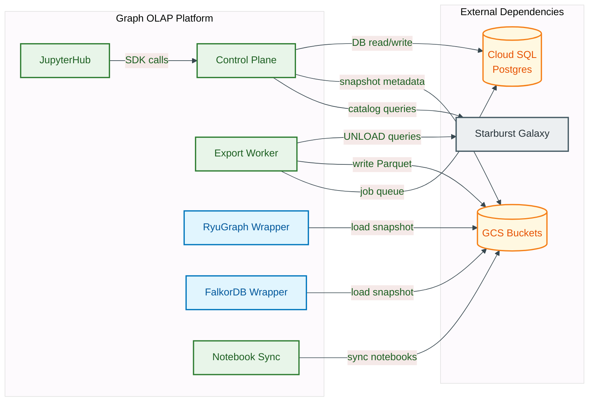
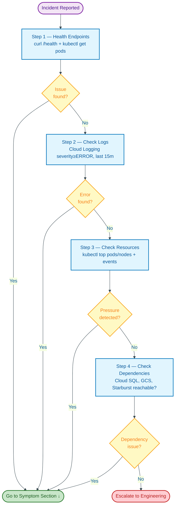
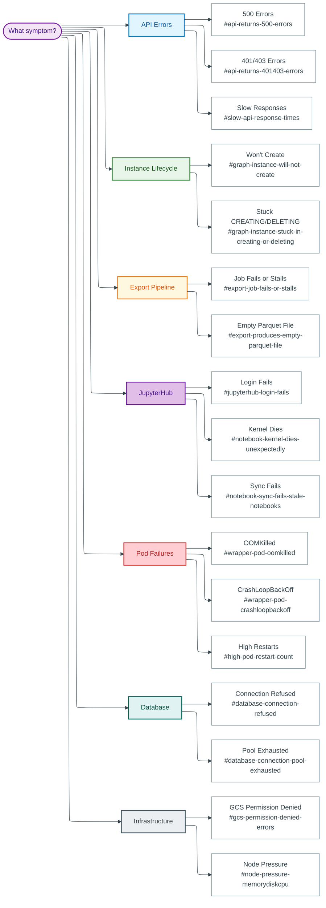
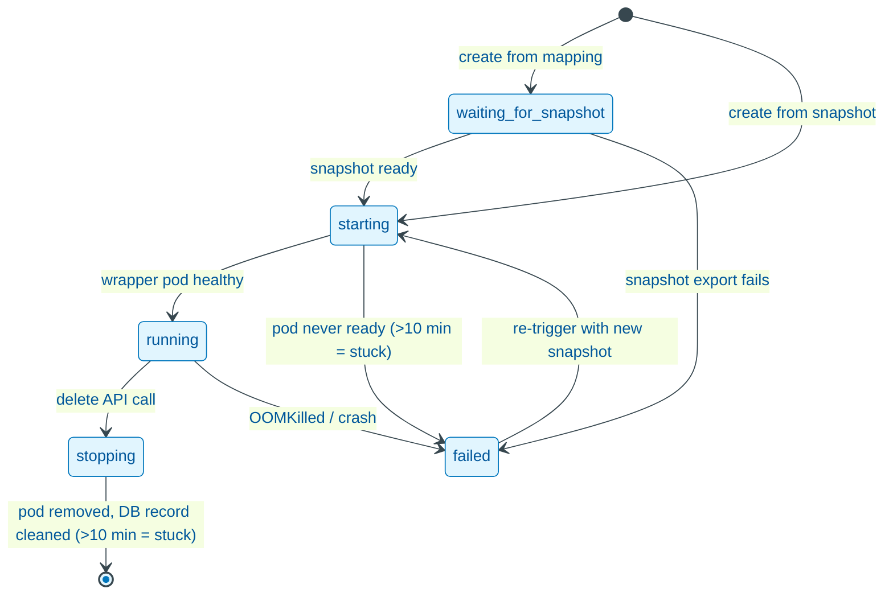
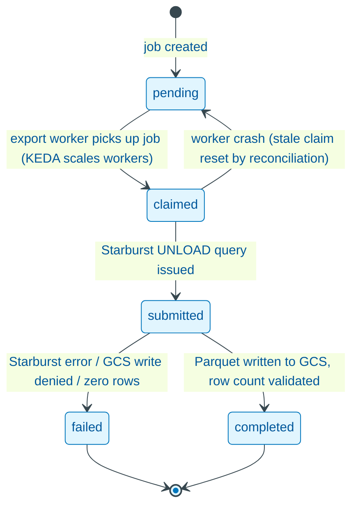

# Troubleshooting Guide

> **Triage routing:** If you arrived here from a fired alert, start with the [Monitoring and Alerting Runbook](monitoring-alerting.runbook.md) -- it is indexed by alert name and provides targeted response procedures. If you are investigating a symptom without a matching alert (user report, gradual degradation, post-incident investigation), continue with this guide. For service inventory, ports, and health endpoints, see the [Service Catalogue (ADR-134)](service-catalogue.manual.md).

This runbook provides systematic, symptom-indexed troubleshooting procedures for the Graph OLAP Platform. Each entry follows a consistent format: symptoms, possible causes, diagnostic steps, and resolution steps.

| | |
|---|---|
| **References:** |
- [ADR-135: Troubleshooting Guide](--/process/adr/operations/adr-135-troubleshooting-guide.md)
- [Service Catalogue (ADR-134)](service-catalogue.manual.md) -- service inventory, ports, health endpoints, dependency map
- [Observability Design](observability.design.md) -- structured log format, metrics, alerting rules
- [Monitoring and Alerting Runbook](monitoring-alerting.runbook.md) -- alert response procedures
- [Incident Response Runbook](incident-response.runbook.md) -- severity classification, escalation matrix, incident workflow
## Table of Contents

- [Service Dependencies](#service-dependencies)
- [Diagnostic Methodology](#diagnostic-methodology)
- [Quick Health Check Commands](#quick-health-check-commands)
- [Troubleshooting by Symptom](#troubleshooting-by-symptom)
  - [API Returns 500 Errors](#api-returns-500-errors)
  - [API Returns 401/403 Errors](#api-returns-401403-errors)
  - [Slow API Response Times](#slow-api-response-times)
  - [Graph Instance Will Not Create](#graph-instance-will-not-create)
  - [Graph Instance Stuck in CREATING or DELETING](#graph-instance-stuck-in-creating-or-deleting)
  - [Export Job Fails or Stalls](#export-job-fails-or-stalls)
  - [Export Produces Empty Parquet File](#export-produces-empty-parquet-file)
  - [Schema Browser Returns Empty Catalogs](#schema-browser-returns-empty-catalogs)
  - [JupyterHub Login Fails](#jupyterhub-login-fails)
  - [Notebook Kernel Dies Unexpectedly](#notebook-kernel-dies-unexpectedly)
  - [Notebook Sync Fails (Stale Notebooks)](#notebook-sync-fails-stale-notebooks)
  - [Wrapper Pod OOMKilled](#wrapper-pod-oomkilled)
  - [Wrapper Pod CrashLoopBackOff](#wrapper-pod-crashloopbackoff)
  - [Database Connection Refused](#database-connection-refused)
  - [Database Connection Pool Exhausted](#database-connection-pool-exhausted)
  - [GCS Permission Denied Errors](#gcs-permission-denied-errors)
  - [High Pod Restart Count](#high-pod-restart-count)
  - [Node Pressure (Memory/Disk/CPU)](#node-pressure-memorydiskcpu)
  - [TLS Certificate Expired or Expiring](#tls-certificate-expired-or-expiring)
  - [Secret Rotation Failure](#secret-rotation-failure)
- [Log Analysis Guide](#log-analysis-guide)
- [Database Troubleshooting](#database-troubleshooting)
- [Network Troubleshooting](#network-troubleshooting)

---

## Service Dependencies

Use this map to understand blast radius. When one dependency is unhealthy, trace the arrows to see which services are affected.


<details>
<summary>Mermaid Source</summary>



</details>

---

## Diagnostic Methodology


<details>
<summary>Mermaid Source</summary>



</details>

Follow these four steps in order before diving into symptom-specific sections. This avoids chasing false leads.

> **Change control:** any resolution step that modifies production state requires a Deliverance change request before proceeding. For P1/P2 incidents, use the emergency change process and obtain retrospective approval within 24 hours. Steps requiring change control are marked with **Deliverance required** below.

**Step 1 -- Check health endpoints.**

```bash
# Control plane health (returns basic service status; use /ready for database connectivity)
curl -s https://<INGRESS_HOST>/health | jq .

# Individual pod readiness
kubectl get pods -n graph-olap-platform -o wide
```

**Step 2 -- Check logs.** Look for ERROR or CRITICAL severity entries in the last 15 minutes.

```bash
# Cloud Logging (GCP console or gcloud)
gcloud logging read \
  'resource.type="k8s_container" resource.labels.namespace_name="graph-olap-platform" severity>=ERROR' \
  --limit=50 --format=json --freshness=15m

# Or via kubectl for a specific pod
kubectl logs -n graph-olap-platform <POD_NAME> --since=15m | grep -i error
```

**Step 3 -- Check resources.** Verify CPU, memory, and disk are within limits.

```bash
kubectl top pods -n graph-olap-platform
kubectl top nodes
kubectl get events -n graph-olap-platform --sort-by='.lastTimestamp' | tail -20
```

**Step 4 -- Check dependencies.** Verify external services are reachable.

```bash
# Cloud SQL connectivity (from within a pod)
kubectl exec -n graph-olap-platform deploy/control-plane -- \
  python -c "import asyncpg; print('OK')"

# GCS bucket accessibility
kubectl exec -n graph-olap-platform deploy/control-plane -- \
  python -c "from google.cloud import storage; c = storage.Client(); print(list(c.list_blobs('BUCKET', max_results=1)))"
```

---

## Quick Health Check Commands

```bash
# --- Cluster overview ---
kubectl get pods -n graph-olap-platform
kubectl get svc -n graph-olap-platform
kubectl get ingress -n graph-olap-platform

# --- Pod status detail ---
kubectl get pods -n graph-olap-platform -o custom-columns=\
NAME:.metadata.name,STATUS:.status.phase,RESTARTS:.status.containerStatuses[0].restartCount,AGE:.metadata.creationTimestamp
kubectl get events -n graph-olap-platform --sort-by='.lastTimestamp' --field-selector type=Warning

# Health and metrics
curl -sf https://<INGRESS_HOST>/health | jq .
curl -sf https://<INGRESS_HOST>/metrics | grep -E '^(graph_olap_|background_job_)'
```

---

## Troubleshooting by Symptom

Use the decision tree below to navigate to the correct section. If unsure, start with the [Diagnostic Methodology](#diagnostic-methodology) above.


<details>
<summary>Mermaid Source</summary>



</details>

### API Returns 500 Errors

**Symptoms:** HTTP 500 responses from the control plane. Error rate spike visible on the overview dashboard.

**Possible causes:**
- Database connection failure (Cloud SQL unreachable or pool exhausted)
- Unhandled exception in application code
- Dependency timeout (Starburst Galaxy, GCS, wrapper pod)

**Diagnostic steps:**

1. Check the control plane health endpoint:
   ```bash
   curl -s https://<INGRESS_HOST>/health | jq .
   ```
2. Check for ERROR-level logs with the failing endpoint:
   ```bash
   gcloud logging read \
     'resource.type="k8s_container" resource.labels.container_name="control-plane" severity=ERROR' \
     --limit=20 --format=json --freshness=15m
   ```
3. Correlate using the `trace_id` from the error response to find the full request chain:
   ```bash
   gcloud logging read 'jsonPayload.trace_id="<TRACE_ID>"' --format=json
   ```
4. Check database connection pool metrics:
   ```bash
   curl -sf https://<INGRESS_HOST>/metrics | grep graph_olap_database_connections
   ```

**Resolution steps:**

1. If the health endpoint shows `postgres: unhealthy`, see [Database Connection Refused](#database-connection-refused).
2. If the health endpoint shows `starburst: unhealthy`, verify the Starburst Galaxy cluster is accessible.
3. If connection pool is exhausted, see [Database Connection Pool Exhausted](#database-connection-pool-exhausted).
4. If the error is an unhandled exception, capture the full stack trace from logs and escalate to engineering.
5. **Escalation:** if unresolved after 15 minutes, escalate to the platform engineering lead via the [Incident Response Runbook](incident-response.runbook.md).

---

### API Returns 401/403 Errors

**Symptoms:** HTTP 401 (Unauthorized) or 403 (Forbidden) responses. Users report being unable to access endpoints they previously could.

**Possible causes:**
- Client IP not in the ingress whitelist (external access)
- Missing or invalid `X-Internal-Api-Key` header (service-to-service calls)
- API key mismatch after a secret rotation
- Ingress whitelist annotation changed or overwritten by the latest `deploy.sh` / Jenkins rollout

**Diagnostic steps:**

1. Identify the source IP of the rejected request from ingress logs:
   ```bash
   kubectl logs -n graph-olap-platform -l app.kubernetes.io/name=ingress-nginx --since=15m | grep 403
   ```
2. Check the current ingress whitelist annotation:
   ```bash
   kubectl get ingress -n graph-olap-platform -o jsonpath='{.items[*].metadata.annotations.nginx\.ingress\.kubernetes\.io/whitelist-source-range}'
   ```
3. For service-to-service 401s, verify `X-Internal-Api-Key` matches Secret Manager: `gcloud secrets versions access latest --secret="internal-api-key"`

**Resolution steps:**

1. If the client IP is not whitelisted, add it to the ingress whitelist following the procedures in the [Security Operations Runbook](security-operations.runbook.md).
   > **Deliverance required** -- modifying the ingress whitelist changes production access control.
2. If the internal API key is mismatched after a rotation, restart the affected services to pick up the new secret. See also [Secret Rotation Failure](#secret-rotation-failure).
   > **Deliverance required** -- restarting services modifies production state.
3. **Escalation:** if unresolved after 30 minutes, escalate to the on-call ops engineer via the [Incident Response Runbook](incident-response.runbook.md).

---

### Slow API Response Times

**Symptoms:** P95 latency exceeds 2 seconds. Users report slow page loads or SDK timeouts.

**Possible causes:**
- Database slow queries (missing index, lock contention)
- Connection pool saturation (requests queuing for a connection)
- Large response payloads (listing many resources without pagination)
- Downstream wrapper pod responding slowly (graph loading in progress)

**Diagnostic steps:**

1. Check request latency in Cloud Logging:
   ```bash
   gcloud logging read \
     'resource.type="k8s_container" resource.labels.namespace_name="graph-olap-platform" jsonPayload.duration_ms>2000' \
     --limit=20 --format=json --freshness=30m
   ```
2. Check database connection pool utilization:
   ```bash
   curl -sf https://<INGRESS_HOST>/metrics | grep graph_olap_database_connections
   ```
3. Check for slow queries in Cloud SQL logs:
   ```bash
   gcloud logging read \
     'resource.type="cloudsql_database" textPayload=~"duration:"' \
     --limit=20 --format=json --freshness=30m
   ```
4. Check wrapper pod health if instance endpoints are slow:
   ```bash
   kubectl get pods -n graph-olap-platform -l app=graph-instance
   kubectl top pods -n graph-olap-platform -l app=graph-instance
   ```

**Resolution steps:**

1. If a specific query is slow, check Cloud SQL query insights for missing indexes.
2. If the connection pool is saturated, consider increasing `pool_size` in the control plane configuration (requires redeployment).
   > **Deliverance required** -- redeployment modifies production state.
3. If wrapper pods are slow, check whether they are still loading graph data (see wrapper logs for `graph_loaded` events).
4. If the issue correlates with high traffic, verify KEDA scaling is functioning for export workers and that node autoscaler has capacity.
5. **Escalation:** if unresolved after 30 minutes, escalate to the platform engineering lead via the [Incident Response Runbook](incident-response.runbook.md).

---

### Graph Instance Lifecycle

The following state diagram shows valid instance transitions. The "Will Not Create" and "Stuck" entries below cover failures at specific points in this lifecycle.


<details>
<summary>Mermaid Source</summary>



</details>

### Graph Instance Will Not Create

**Symptoms:** POST to `/api/instances` returns an error or the instance immediately transitions to `FAILED`.

**Possible causes:**
- No ready snapshots available for the requested mapping
- Cluster resource quota exceeded (cannot schedule a new wrapper pod)
- Wrapper container image pull failure
- Concurrency limit reached (per-analyst or cluster-total)

**Diagnostic steps:**

1. Check the most recent export job for the mapping to determine snapshot status:
   ```bash
   curl -s https://<INGRESS_HOST>/api/export-jobs \
     -H "X-Username: <USERNAME>" \
     | jq '[.[] | select(.mapping_id=="<MAPPING_ID>")] | sort_by(.created_at) | last | {id, status}'
   ```
2. Check cluster resource availability:
   ```bash
   kubectl describe nodes | grep -A5 "Allocated resources"
   ```
3. Check for pod scheduling failures:
   ```bash
   kubectl get events -n graph-olap-platform --field-selector reason=FailedScheduling
   ```
4. Check concurrency limits:
   ```bash
   curl -s https://<INGRESS_HOST>/api/config/concurrency \
     -H "X-Username: <USERNAME>" | jq .
   ```

**Resolution steps:**

1. If no snapshot is ready, trigger a new snapshot and wait for export completion.
2. If resources are exhausted, terminate idle instances or wait for node autoscaler to provision a new node (typically 2-5 minutes).
3. If the container image cannot be pulled, verify the image exists in Artifact Registry and the node service account has `artifactregistry.reader` role.
4. If the concurrency limit is reached, the user must terminate an existing instance or an ops user can increase the limit.
5. **Escalation:** if unresolved after 30 minutes, escalate to the platform engineering lead via the [Incident Response Runbook](incident-response.runbook.md).

---

### Instance Limit Reached — 409 CONCURRENCY_LIMIT_EXCEEDED

**Symptoms:** `POST /api/instances` (or any instance-creating or memory-resizing call) returns HTTP `409 Conflict` with error code `CONCURRENCY_LIMIT_EXCEEDED`. Analysts see a `ConcurrencyLimitError` raised from the SDK with a message such as `Cannot create instance: per_analyst limit exceeded (10/10)`.

**What the control plane checks.** Before a new instance is created — and before the implicit snapshot export is kicked off, so a 409 never leaves an orphaned snapshot behind — `InstanceService` runs five governance checks (`services/instance_service.py:355` and `496`; memory checks in `_check_governance_limits` at line 150). Each produces a distinct `limit_type` in the error payload:

| `limit_type` | What it means | Source of the limit |
|---|---|---|
| `per_analyst` | The requesting user already owns the maximum number of active instances. | `concurrency.per_analyst` in `global_config` (default `5` seeded from env; env default `10`). |
| `cluster_total` | The whole platform is at capacity. | `concurrency.cluster_total` in `global_config` (default `50`). |
| `instance_memory` | The requested per-instance memory exceeds the hard per-instance cap. | `GRAPH_OLAP_SIZING_MAX_MEMORY_GB` (default `32 GiB`). |
| `user_memory` | Total memory across all of this user's running instances would exceed the per-user cap. | `GRAPH_OLAP_SIZING_PER_USER_MAX_MEMORY_GB` (default `64 GiB`). |
| `cluster_memory` | Total memory across every running instance would exceed the cluster soft limit. | `GRAPH_OLAP_SIZING_CLUSTER_MEMORY_SOFT_LIMIT_GB` (default `256 GiB`). |

**What users see.** The error is returned as JSON:

```json
{
  "error": {
    "code": "CONCURRENCY_LIMIT_EXCEEDED",
    "message": "Cannot create instance: per_analyst limit exceeded (10/10)",
    "details": {
      "limit_type": "per_analyst",
      "current_count": 10,
      "max_allowed": 10
    }
  }
}
```

The SDK surfaces this as a `ConcurrencyLimitError` exception. Read endpoints (listing, querying, health) remain unaffected.

**Diagnostic steps:**

1. Confirm the limit type from the error `details.limit_type`. That tells you whether this is a per-user, cluster-count, or memory-budget issue.
2. Read the current counts from the admin API:
   ```bash
   # Current configured limits
   curl -s https://<INGRESS_HOST>/api/config/concurrency \
     -H "X-Username: <OPS_USER>" -H "X-Use-Case-Id: platform_ops" | jq .

   # Live usage (cluster-wide and per-user counters)
   curl -s https://<INGRESS_HOST>/api/cluster/instances \
     -H "X-Username: <OPS_USER>" -H "X-Use-Case-Id: platform_ops" | jq .
   ```
3. List the offending user's active instances — only instances in `creating`, `starting`, or `running` count toward `per_analyst`:
   ```bash
   curl -s "https://<INGRESS_HOST>/api/instances?owner=<USERNAME>" \
     -H "X-Username: <OPS_USER>" -H "X-Use-Case-Id: platform_ops" \
     | jq '[.items[] | select(.status | IN("creating","starting","running"))] | length'
   ```
4. For memory-based limits, cross-check actual pod memory usage against the configured soft limit:
   ```bash
   kubectl top pods -n graph-olap-platform -l app.kubernetes.io/component=graph-instance \
     --sort-by=memory
   ```
5. Check for stuck instances that are still counted as active but will never start. A pod that is `Pending` for over 10 minutes with no matching node, or one that is `Terminating` for over 10 minutes, may be inflating the count:
   ```bash
   kubectl get pods -n graph-olap-platform -l app.kubernetes.io/component=graph-instance \
     -o wide
   ```
6. If the cluster memory limit is the problem, check whether GKE autoscaling has run out of headroom on the instance node pool — the limit is a *soft* budget the control plane enforces *before* asking K8s for pods, so a 409 here means the platform budget is full even if the cluster could technically schedule more:
   ```bash
   kubectl get nodes -l graph-olap.io/workload=instance \
     -o custom-columns=NAME:.metadata.name,CAPACITY:.status.capacity.memory,ALLOC:.status.allocatable.memory
   ```

**Resolution steps:**

1. **Per-user limit (`per_analyst`).** Ask the analyst to terminate an instance they no longer need. If their workflow legitimately needs more, an Ops user can raise the limit for everyone via `PUT /api/config/concurrency` — there is no per-user override; the limit is global. See the [Configuration Reference](/operations/configuration-reference/#runtime-configuration-database-global_config).
2. **Cluster-count limit (`cluster_total`).** Identify idle instances via `GET /api/instances?status=running` and the `last_used_at` timestamp. Terminate the oldest unused ones, or raise `concurrency.cluster_total` after confirming the cluster has spare memory and node capacity.
3. **Per-instance memory (`instance_memory`).** The caller asked for more than `sizing.max_memory_gb`. Resize to a value within the cap, or — if this is a legitimate large-dataset case — escalate to change the platform-wide cap.
4. **Per-user memory (`user_memory`).** Sum of this user's running instances is over budget. Terminate or shrink existing instances before launching another.
5. **Cluster memory soft limit (`cluster_memory`).** The platform is intentionally holding back before K8s would start evicting pods. Terminate the largest-memory idle instances first, or raise the soft limit after confirming the node pool has real headroom.
6. **Stale counts.** If the admin API shows more active instances than `kubectl` does, the reconciliation job may have fallen behind. Check `control-plane` logs for reconciliation errors and see the [Instance Reconciliation](#graph-instance-stuck-in-creating-or-deleting) section.

> **Important:** raising a limit is a runtime config change and persists in `global_config`. Open a Deliverance change request before running `PUT /api/config/concurrency`. The change survives control-plane restarts.

---

### Graph Instance Stuck in CREATING or DELETING

**Symptoms:** Instance remains in `CREATING` or `DELETING` status for more than 10 minutes.

**Possible causes:**
- Wrapper pod stuck in `Pending` (resource constraints) or `ContainerCreating` (image pull)
- Wrapper pod started but health check never passes (data loading failure)
- Reconciliation job not running (control plane pod restarted, scheduler lost)
- Kubernetes API latency delaying pod operations

**Diagnostic steps:**

1. Find the wrapper pod for the instance:
   ```bash
   kubectl get pods -n graph-olap-platform -l graph-olap.io/instance-id=<INSTANCE_ID>
   ```
2. If the pod exists, describe it to find events:
   ```bash
   kubectl describe pod -n graph-olap-platform <POD_NAME>
   ```
3. If the pod is running but not ready, check its logs:
   ```bash
   kubectl logs -n graph-olap-platform <POD_NAME> --since=10m
   ```
4. Check that the reconciliation background job is running:
   ```bash
   curl -sf https://<INGRESS_HOST>/metrics \
     | grep 'background_job_last_success_timestamp_seconds{job_name="reconciliation"}'
   ```

**Resolution steps:**

1. If the pod is `Pending` with `FailedScheduling`, see [Graph Instance Will Not Create](#graph-instance-will-not-create).
2. If the pod is running but the health check fails, check wrapper logs for data loading errors (GCS access, corrupt snapshot).
3. If the reconciliation job has not run recently, restart the control plane pod to reset the APScheduler:
   > **Deliverance required** -- restarting a production deployment.
   ```bash
   kubectl rollout restart deployment/control-plane -n graph-olap-platform
   ```
4. For stuck `DELETING`, manually delete the wrapper pod and the reconciliation job will clean up the database record:
   > **Deliverance required** -- deleting a production pod.
   ```bash
   kubectl delete pod -n graph-olap-platform <POD_NAME> --grace-period=30
   ```
5. **Escalation:** if unresolved after 30 minutes, escalate to the platform engineering lead via the [Incident Response Runbook](incident-response.runbook.md).

---

### Export Job Lifecycle

Export jobs pass through the following states. The "Fails or Stalls" and "Empty Parquet" entries below cover failures at specific transitions.


<details>
<summary>Mermaid Source</summary>



</details>

### Export Job Fails or Stalls

**Symptoms:** Export jobs remain in `PENDING` or `CLAIMED` status indefinitely. Snapshot never reaches `READY`.

**Possible causes:**
- Export worker pods scaled to zero and KEDA is not scaling up
- Starburst Galaxy cluster unreachable or overloaded
- GCS write permissions missing for the export worker service account
- Export worker crashed after claiming a job (stale claim)

**Diagnostic steps:**

1. Check export queue depth:
   ```bash
   curl -sf https://<INGRESS_HOST>/metrics | grep graph_olap_export_queue_depth
   ```
2. Check export worker pod count:
   ```bash
   kubectl get pods -n graph-olap-platform -l app=export-worker
   ```
3. Check KEDA scaled object status:
   ```bash
   kubectl get scaledobject -n graph-olap-platform
   ```
4. Check export worker logs for Starburst Galaxy errors:
   ```bash
   kubectl logs -n graph-olap-platform -l app=export-worker --since=30m | grep -i error
   ```
5. Check for stale claims:
   ```bash
   curl -sf https://<INGRESS_HOST>/metrics | grep stale_export_claims
   ```

**Resolution steps:**

1. If workers are scaled to zero with pending jobs, check KEDA trigger configuration and the metrics endpoint it polls.
2. If Starburst Galaxy is unreachable, verify network policies allow export-worker to reach the Starburst Galaxy endpoint.
3. If GCS permissions are denied, see [GCS Permission Denied Errors](#gcs-permission-denied-errors).
4. Stale claims are automatically reset by the export reconciliation background job. If the job is not running, restart the control plane.
   > **Deliverance required** -- restarting a production deployment.
5. **Escalation:** if unresolved after 30 minutes, escalate to the platform engineering lead via the [Incident Response Runbook](incident-response.runbook.md).

---

### Export Produces Empty Parquet File

**Symptoms:** Export job completes successfully but the Parquet file in GCS has zero rows.

**Possible causes:**
- Source query returns no data (mapping points to an empty table or wrong catalog/schema)
- Starburst Galaxy UNLOAD succeeded but the source table was empty at query time
- Row count validation is disabled or skipped

**Diagnostic steps:**

1. Check the export job details for row count:
   ```bash
   curl -s https://<INGRESS_HOST>/api/export-jobs \
     -H "X-Username: <USERNAME>" \
     | jq '.[] | select(.id=="<EXPORT_ID>") | {status, row_count, error}'
   ```
2. Check export worker logs for the specific job:
   ```bash
   kubectl logs -n graph-olap-platform -l app=export-worker --since=1h \
     | grep "<EXPORT_ID>"
   ```
3. Verify the source table has data by running the mapping's query directly against Starburst Galaxy.

**Resolution steps:**

1. If the source table is empty, verify the mapping configuration points to the correct catalog, schema, and table.
2. If the table had data but the export was empty, check for WHERE clause filters in the mapping that may exclude all rows.
3. Re-trigger the export after confirming the source data is populated.
4. **Escalation:** if unresolved after 30 minutes, escalate to the on-call ops engineer via the [Incident Response Runbook](incident-response.runbook.md).

---

### Schema Browser Returns Empty Catalogs

**Symptoms:** Calls to `/api/schema/catalogs` return an empty list. The schema browser in the SDK shows no catalogs, schemas, or tables. Analysts cannot discover data sources.

**Possible causes:**
- `GRAPH_OLAP_STARBURST_URL` is empty or missing in the control-plane ConfigMap- Control-plane pod cannot reach the Starburst endpoint (network policy, DNS, or firewall)
- Starburst credentials are wrong or the role is misconfigured
- The cache refresh job has not run yet (pod just restarted) or failed silently

**Quick check:**

```bash
curl -s https://<INGRESS_HOST>/api/schema/admin/stats \
  -H "X-Username: <OPS_USERNAME>" | jq '.data | {total_catalogs, last_refresh}'
```

`total_catalogs: 0` with `last_refresh: null` confirms the cache has never been populated since the pod last started.

**Diagnostic steps:**

1. Check the cache stats and last refresh time (see above).
2. Search logs for the refresh failure:
   ```bash
   gcloud logging read \
     'resource.type="k8s_container"
      resource.labels.container_name="control-plane"
      jsonPayload.event="schema_cache_refresh_failed"' \
     --limit=5 --format=json --freshness=25h
   ```
3. Inspect the `error` field in the log payload — it contains the exception that aborted the refresh.
4. Verify the URL is set in the ConfigMap:
   ```bash
   kubectl get configmap -n graph-olap-platform control-plane-config -o yaml \
     | grep STARBURST_URL
   ```
5. If the URL is empty, set it to `https://wsdv-hk-dev.hk.hsbc:8443` in `infrastructure/cd/resources/control-plane-configmap.yaml` and follow the redeploy flow in step 1 of the Resolution steps below.**Full debug procedure:** [Starburst Schema Cache Debug Guide](starburst-schema-cache-debug.md)

**Resolution steps:**

1. If `GRAPH_OLAP_STARBURST_URL` is empty: set it to `https://wsdv-hk-dev.hk.hsbc:8443` in `infrastructure/cd/resources/control-plane-configmap.yaml`, commit to the change repo, raise a Deliverance change request, and once approved run `./infrastructure/cd/deploy.sh <VERSION>` (or wait for Jenkins to pick up the CR).
   > **Deliverance required** — modifying the ConfigMap and triggering a rolling restart changes production state.
2. If the URL is correct but connection fails: exec into the pod and test TCP reachability with `nc -zv wsdv-hk-dev.hk.hsbc 8443`. A timeout indicates a network policy or firewall issue.
3. Once connectivity is restored, trigger an immediate refresh:
   ```bash
   curl -X POST https://<INGRESS_HOST>/api/schema/admin/refresh \
     -H "X-Username: <OPS_USERNAME>"
   ```
4. **Escalation:** if unresolved after 30 minutes, escalate to the platform engineering lead via the [Incident Response Runbook](incident-response.runbook.md).

---

### JupyterHub Login Fails

**Symptoms:** Users cannot log in to JupyterHub. Browser shows 403, 502, or a redirect loop.

**Possible causes:**
- User's IP not in the ingress whitelist
- JupyterHub hub pod is down or restarting
- Ingress TLS certificate expired or misconfigured (see [TLS Certificate Expired or Expiring](#tls-certificate-expired-or-expiring))
- JupyterHub ingress annotation or routing misconfigured

**Diagnostic steps:**

1. Check JupyterHub pod status:
   ```bash
   kubectl get pods -n graph-olap-platform -l app=jupyterhub
   ```
2. Check hub logs for authentication errors:
   ```bash
   kubectl logs -n graph-olap-platform -l component=hub --since=15m
   ```
3. Verify the ingress TLS certificate:
   ```bash
   kubectl get ingress -n graph-olap-platform -o jsonpath='{.items[*].spec.tls}'
   echo | openssl s_client -connect <JUPYTERHUB_HOST>:443 -servername <JUPYTERHUB_HOST> 2>/dev/null \
     | openssl x509 -noout -dates
   ```
4. Verify the user's IP is in the ingress whitelist (see the [Security Operations Runbook](security-operations.runbook.md)).

**Resolution steps:**

1. If the hub pod is down, check events with `kubectl describe pod` and resolve the underlying issue (OOM, image pull failure).
2. If the user's IP is not whitelisted, add it following the access control procedures in the [Security Operations Runbook](security-operations.runbook.md).
   > **Deliverance required** -- modifying the ingress whitelist changes production access control.
3. If the TLS certificate is expired, see [TLS Certificate Expired or Expiring](#tls-certificate-expired-or-expiring).
4. **Escalation:** if unresolved after 30 minutes, escalate to the platform engineering lead via the [Incident Response Runbook](incident-response.runbook.md).

---

### Notebook Kernel Dies Unexpectedly

**Symptoms:** Notebook kernel restarts mid-execution. Users see "Kernel Restarting" or lose cell output.

**Possible causes:**
- Notebook pod OOMKilled (user loaded a large dataset into memory)
- Session credentials expired during a long session (SDK calls fail, kernel may crash on unhandled error)
- Underlying node eviction due to memory pressure

**Diagnostic steps:**

1. Check the user's notebook pod:
   ```bash
   kubectl get pods -n graph-olap-platform -l hub.jupyter.org/username=<USERNAME>
   kubectl describe pod -n graph-olap-platform <NOTEBOOK_POD>
   ```
2. Look for OOMKilled in the pod's last termination reason:
   ```bash
   kubectl get pod -n graph-olap-platform <NOTEBOOK_POD> \
     -o jsonpath='{.status.containerStatuses[0].lastState.terminated.reason}'
   ```
3. Check node-level memory pressure:
   ```bash
   kubectl describe node <NODE_NAME> | grep -A3 Conditions
   ```

**Resolution steps:**

1. If OOMKilled, advise the user to reduce dataset size or request a memory limit increase via the ops configuration endpoint.
2. If session credentials have expired, advise the user to re-authenticate. The platform uses DB-backed user records resolved via the `X-Username` header — the session is established at the JupyterHub level, not a JWT token. (Updated for ADR-104)
3. If node eviction occurred, check for noisy neighbours and consider dedicated node pools for notebook workloads.
4. **Escalation:** if unresolved after 30 minutes, escalate to the on-call ops engineer via the [Incident Response Runbook](incident-response.runbook.md).

---

### Notebook Sync Fails (Stale Notebooks)

**Symptoms:** Users see outdated notebooks after a pod restart. New notebooks from the repository are missing.

**Possible causes:**
- notebook-sync init container failed (GCS bucket does not exist or permissions denied)
- Init container completed but copied stale files from a cached GCS object
- Pod did not restart after notebooks were updated in GCS

**Diagnostic steps:**

1. Check the init container status:
   ```bash
   kubectl get pod -n graph-olap-platform <NOTEBOOK_POD> \
     -o jsonpath='{.status.initContainerStatuses[*].state}'
   ```
2. Check init container logs:
   ```bash
   kubectl logs -n graph-olap-platform <NOTEBOOK_POD> -c notebook-sync
   ```
3. Verify the GCS bucket and path exist:
   ```bash
   gsutil ls gs://<BUCKET>/notebooks/
   ```

**Resolution steps:**

1. If the bucket does not exist, create it or correct the bucket name in the notebook-sync configuration.
2. If permissions are denied, verify the pod's Workload Identity service account has `storage.objectViewer` on the bucket.
3. To force a refresh, delete the user's notebook pod. JupyterHub will create a new one with fresh init container execution.
   > **Deliverance required** -- deleting a production pod.
4. **Escalation:** if unresolved after 30 minutes, escalate to the on-call ops engineer via the [Incident Response Runbook](incident-response.runbook.md).

---

### Wrapper Pod OOMKilled

**Symptoms:** Wrapper pod (ryugraph-wrapper or falkordb-wrapper) is terminated with reason `OOMKilled`. Instance transitions to `FAILED`.

**Possible causes:**
- Graph data exceeds the pod's memory limit (large number of nodes/edges)
- KuzuDB or FalkorDB buffer pool sized larger than the container memory limit
- Memory leak during long-running query execution

**Diagnostic steps:**

1. Check the pod's termination reason:
   ```bash
   kubectl get pod -n graph-olap-platform <POD_NAME> \
     -o jsonpath='{.status.containerStatuses[0].lastState.terminated}'
   ```
2. Check the memory limit vs. actual usage before the kill:
   ```bash
   kubectl describe pod -n graph-olap-platform <POD_NAME> | grep -A2 Limits
   ```
3. Check the graph size (node and edge counts) from the snapshot metadata:
   ```bash
   curl -s https://<INGRESS_HOST>/api/snapshots/<SNAPSHOT_ID> \
     -H "X-Username: <USERNAME>" | jq '{node_count, edge_count}'
   ```

**Resolution steps:**

1. If the graph is genuinely too large, update the resource limits in the deployment manifest (`infrastructure/cd/resources/<wrapper>-deployment.yaml`) and run `infrastructure/cd/deploy.sh <VERSION>`.
   > **Deliverance required** -- modifying deployment resource limits and redeploying.
2. For ryugraph-wrapper, if the buffer pool is oversized, reduce `RYUGRAPH_BUFFER_POOL_SIZE` in the configmap to fit within the container memory limit (leave headroom for the Python process). For falkordb-wrapper, reduce the pod's `resources.limits.memory` in the deployment manifest -- FalkorDB is an in-memory database whose memory is governed by Kubernetes resource limits, not a buffer pool variable.
   > **Deliverance required** -- modifying production configuration.
3. If a memory leak is suspected, capture heap profiles before the next OOM and escalate to engineering.
4. **Escalation:** if unresolved after 30 minutes, escalate to the platform engineering lead via the [Incident Response Runbook](incident-response.runbook.md).

---

### Wrapper Pod CrashLoopBackOff

**Symptoms:** Wrapper pod repeatedly crashes and restarts. Kubernetes shows `CrashLoopBackOff` status.

**Possible causes:**
- Application startup error (missing environment variable, bad configuration)
- Corrupt or incompatible snapshot data
- Port conflict or binding failure
- Dependency not available at startup (GCS, control plane)

**Diagnostic steps:**

1. Check pod events:
   ```bash
   kubectl describe pod -n graph-olap-platform <POD_NAME> | tail -20
   ```
2. Check the most recent container logs (including previous crashes):
   ```bash
   kubectl logs -n graph-olap-platform <POD_NAME> --previous
   ```
3. Verify all required environment variables are set:
   ```bash
   kubectl exec -n graph-olap-platform <POD_NAME> -- env | sort
   ```

**Resolution steps:**

1. If an environment variable is missing, check the deployment manifests in `infrastructure/cd/resources/` and Google Secret Manager configuration.
   > **Deliverance required** -- modifying deployment manifests.
2. If the snapshot data is corrupt, re-trigger the export for that mapping to produce a fresh snapshot.
3. If a dependency is unreachable at startup, verify network policies and service DNS resolution.
4. **Escalation:** if unresolved after 30 minutes, escalate to the platform engineering lead via the [Incident Response Runbook](incident-response.runbook.md).

---

### Database Connection Refused

**Symptoms:** Control plane logs show `asyncpg.ConnectionRefusedError` or `could not connect to server`.

**Possible causes:**
- Cloud SQL instance is stopped or restarting
- Cloud SQL Auth Proxy sidecar is not running
- SSL/TLS connection syntax issue (see ADR-058)
- Firewall rule blocking the connection

**Diagnostic steps:**

1. Check Cloud SQL status: `gcloud sql instances describe <INSTANCE_NAME> --format='value(state)'`
2. Check Auth Proxy sidecar: `kubectl logs -n graph-olap-platform <CONTROL_PLANE_POD> -c cloud-sql-proxy --since=5m`
3. Check SSL errors: `kubectl logs -n graph-olap-platform deploy/control-plane --since=5m | grep -i ssl`
4. Verify connection string format matches ADR-058 requirements.

**Resolution steps:**

1. If Cloud SQL is stopped, start it from the GCP console or via `gcloud sql instances patch`.
   > **Deliverance required** -- starting a Cloud SQL instance modifies production infrastructure.
2. If the Auth Proxy sidecar crashed, it will restart automatically. Check its logs for the root cause.
3. For SSL syntax issues, ensure the connection string uses `ssl=require` in the asyncpg DSN (not `sslmode=require`, which is the psycopg2 syntax).
4. If a firewall rule is blocking, verify the authorized networks on the Cloud SQL instance include the GKE cluster's IP range.
5. **Escalation:** if unresolved after 15 minutes, escalate to the platform engineering lead via the [Incident Response Runbook](incident-response.runbook.md).

---

### Database Connection Pool Exhausted

**Symptoms:** API requests queue and eventually time out. Metrics show `graph_olap_database_connections{state="available"}` at or near zero.

**Possible causes:**
- Long-running transactions holding connections (e.g., slow export queries)
- Connection leak (connection not returned to pool after an exception)
- Pool size too small for the request volume
- Dead connections occupying pool slots

**Diagnostic steps:**

1. Check current pool state:
   ```bash
   curl -sf https://<INGRESS_HOST>/metrics | grep graph_olap_database_connections
   ```
2. Check Cloud SQL active connections:
   ```bash
   gcloud sql instances describe <INSTANCE_NAME> \
     --format='value(settings.databaseFlags)'
   ```
3. Look for long-running queries:
   ```bash
   # Connect to Cloud SQL and run:
   SELECT pid, now() - query_start AS duration, query
   FROM pg_stat_activity
   WHERE state = 'active'
   ORDER BY duration DESC;
   ```

**Resolution steps:**

1. Kill long-running queries if they are not critical:
   > **Deliverance required** -- terminating active database connections.
   ```sql
   SELECT pg_terminate_backend(<PID>);
   ```
2. If connections are leaked, restart the control plane to reset the pool:
   > **Deliverance required** -- restarting a production deployment.
   ```bash
   kubectl rollout restart deployment/control-plane -n graph-olap-platform
   ```
3. If traffic is legitimately high, increase `pool_size` and `max_overflow` in the SQLAlchemy configuration and redeploy.
   > **Deliverance required** -- redeployment modifies production state.
4. Configure pool pre-ping (`pool_pre_ping=True`) to automatically discard stale connections.
5. **Escalation:** if unresolved after 15 minutes, escalate to the platform engineering lead via the [Incident Response Runbook](incident-response.runbook.md).

---

### GCS Permission Denied Errors

**Symptoms:** Logs show `google.api_core.exceptions.Forbidden: 403` or `Access denied` when reading from or writing to GCS.

**Possible causes:**
- Workload Identity binding missing or misconfigured
- GCS bucket IAM policy does not include the Kubernetes service account
- Bucket does not exist
- Service account key expired (if using key-based auth instead of Workload Identity)

**Diagnostic steps:**

1. Identify the Kubernetes service account for the failing pod:
   ```bash
   kubectl get pod -n graph-olap-platform <POD_NAME> -o jsonpath='{.spec.serviceAccountName}'
   ```
2. Check the Workload Identity binding:
   ```bash
   kubectl get serviceaccount -n graph-olap-platform <SA_NAME> \
     -o jsonpath='{.metadata.annotations.iam\.gke\.io/gcp-service-account}'
   ```
3. Verify the GCP service account has the correct role on the bucket:
   ```bash
   gsutil iam get gs://<BUCKET> | grep <GCP_SA_EMAIL>
   ```
4. Verify the bucket exists:
   ```bash
   gsutil ls gs://<BUCKET>/
   ```

**Resolution steps:**

1. If the Workload Identity annotation is missing, add it to the deployment manifest in `infrastructure/cd/resources/` and run `infrastructure/cd/deploy.sh <VERSION>`.
   > **Deliverance required** -- modifying deployment manifests and redeploying.
2. If the GCP service account lacks the role, add it:
   > **Deliverance required** -- modifying IAM permissions.
   ```bash
   gsutil iam ch serviceAccount:<GCP_SA_EMAIL>:roles/storage.objectAdmin gs://<BUCKET>
   ```
3. If the bucket does not exist, create it in the correct region with the expected name.
4. After any IAM change, allow up to 5 minutes for propagation before retesting.
5. **Escalation:** if unresolved after 30 minutes, escalate to the platform engineering lead via the [Incident Response Runbook](incident-response.runbook.md).

---

### High Pod Restart Count

**Symptoms:** Pod restart count > 5 in the last hour. `PodRestartLoop` alert fires.

**Possible causes:**
- Application crash on startup (bad config, missing dependency)
- Liveness probe failing (application deadlock, resource starvation)
- OOMKilled repeatedly

**Diagnostic steps:**

1. Check the restart count and last termination reason:
   ```bash
   kubectl get pod -n graph-olap-platform <POD_NAME> \
     -o jsonpath='{.status.containerStatuses[0].restartCount}'
   kubectl get pod -n graph-olap-platform <POD_NAME> \
     -o jsonpath='{.status.containerStatuses[0].lastState.terminated.reason}'
   ```
2. Check logs from the previous crash:
   ```bash
   kubectl logs -n graph-olap-platform <POD_NAME> --previous
   ```
3. Check events for the pod:
   ```bash
   kubectl describe pod -n graph-olap-platform <POD_NAME> | grep -A5 Events
   ```

**Resolution steps:**

1. If the termination reason is `OOMKilled`, see [Wrapper Pod OOMKilled](#wrapper-pod-oomkilled).
2. If the termination reason is `Error`, check the previous logs for the root cause and fix the configuration or code.
3. If the liveness probe is failing, verify the health endpoint is responding within the probe timeout.
4. **Escalation:** if unresolved after 30 minutes, escalate to the platform engineering lead via the [Incident Response Runbook](incident-response.runbook.md).

---

### Node Pressure (Memory/Disk/CPU)

**Symptoms:** Pods evicted with reason `Evicted`. Node conditions show `MemoryPressure`, `DiskPressure`, or `PIDPressure` as `True`.

**Possible causes:**
- Too many pods scheduled on a single node
- Node autoscaler has not yet provisioned additional nodes
- Large graph instances consuming disproportionate memory
- Log or temporary file accumulation filling disk

**Diagnostic steps:**

1. Check node conditions:
   ```bash
   kubectl describe nodes | grep -E 'Name:|Conditions:' -A5
   ```
2. Check which pods are using the most resources on the affected node:
   ```bash
   kubectl top pods -n graph-olap-platform --sort-by=memory
   ```
3. Check disk usage on the node:
   ```bash
   kubectl get nodes -o jsonpath='{.items[*].status.conditions[?(@.type=="DiskPressure")].status}'
   ```

**Resolution steps:**

1. If memory pressure, terminate idle graph instances to free resources.
2. If disk pressure, clean up completed job pods and old log files. Check for large emptyDir volumes.
3. If the node autoscaler is not adding nodes, verify the node pool's maximum size has not been reached and that the autoscaler is enabled.
4. For persistent pressure, increase the node pool's machine type or maximum node count via the infrastructure configuration.
   > **Deliverance required** -- modifying infrastructure capacity.
5. **Escalation:** if unresolved after 30 minutes, escalate to the platform engineering lead via the [Incident Response Runbook](incident-response.runbook.md).

---

### TLS Certificate Expired or Expiring

**Symptoms:** HTTPS connections fail with certificate errors. Browsers show "Your connection is not private" warnings. SDK clients report SSL/TLS handshake failures. Ingress returns 502 errors for all HTTPS traffic.

**Possible causes:**
- Google-managed certificate auto-renewal failed
- cert-manager renewal failed (DNS challenge failure, rate limit, misconfigured issuer)
- Cloud SQL client certificate expired
- Manual certificate not renewed before expiry

**Diagnostic steps:**

1. Check ingress TLS certificate expiry:
   ```bash
   echo | openssl s_client -connect <INGRESS_HOST>:443 -servername <INGRESS_HOST> 2>/dev/null \
     | openssl x509 -noout -dates -subject
   ```
2. Check cert-manager certificate status (if using cert-manager):
   ```bash
   kubectl get certificate -n graph-olap-platform
   kubectl describe certificate -n graph-olap-platform <CERT_NAME>
   ```
3. Check cert-manager logs for renewal errors:
   ```bash
   kubectl logs -n cert-manager -l app=cert-manager --since=1h | grep -i error
   ```
4. Check Cloud SQL server certificate expiry:
   ```bash
   gcloud sql instances describe <INSTANCE_NAME> \
     --format='value(serverCaCert.expirationTime)'
   ```

**Resolution steps:**

1. If using Google-managed certificates and renewal failed, verify the domain's DNS records point to the correct load balancer IP.
2. If using cert-manager, force renewal by deleting the certificate secret (cert-manager will re-issue automatically):
   > **Deliverance required** -- deleting and re-issuing a production TLS certificate.
   ```bash
   kubectl delete secret -n graph-olap-platform <TLS_SECRET_NAME>
   ```
3. Verify the new certificate is served after renewal:
   ```bash
   echo | openssl s_client -connect <INGRESS_HOST>:443 -servername <INGRESS_HOST> 2>/dev/null \
     | openssl x509 -noout -serial -dates
   ```
4. For Cloud SQL client certificate expiry, follow the certificate renewal procedure in the [Security Operations Runbook](security-operations.runbook.md).
5. **Escalation:** if unresolved after 15 minutes, escalate to the platform engineering lead via the [Incident Response Runbook](incident-response.runbook.md).

---

### Secret Rotation Failure

**Symptoms:** Services fail to authenticate after a scheduled or emergency secret rotation. API returns 401 errors for service-to-service calls. Database connections fail with authentication errors after a password rotation. Export workers cannot reach the control plane.

**Possible causes:**
- Rotation job updated the secret in Google Secret Manager but services were not restarted to pick up the new version
- Secret version mismatch between services (e.g., control plane restarted but export worker was not)
- Google Secret Manager permissions prevent the rotation from completing
- Old secret version was disabled before all services picked up the new one

**Diagnostic steps:**

1. Check the current secret version in Google Secret Manager:
   ```bash
   gcloud secrets versions list <SECRET_NAME> --limit=3 --format='table(name,state,createTime)'
   ```
2. Check whether the affected pod is using the latest secret version:
   ```bash
   kubectl exec -n graph-olap-platform <POD_NAME> -- env | grep -i key
   ```
3. Check service logs for authentication errors after the rotation timestamp:
   ```bash
   gcloud logging read \
     'resource.type="k8s_container" resource.labels.namespace_name="graph-olap-platform" jsonPayload.message=~"auth.*error|401|403|password"' \
     --limit=20 --format=json --freshness=1h
   ```
4. Verify all services that share the rotated secret were restarted together (see the secret inventory in the [Security Operations Runbook](security-operations.runbook.md)):
   ```bash
   kubectl get pods -n graph-olap-platform -o custom-columns=\
   NAME:.metadata.name,STARTED:.status.startTime --sort-by='.status.startTime'
   ```

**Resolution steps:**

1. If services were not restarted after rotation, restart all services that use the rotated secret simultaneously:
   > **Deliverance required** -- restarting production services.
   ```bash
   # Example for internal API key (used by control-plane and export-worker):
   kubectl rollout restart deployment/control-plane deployment/export-worker -n graph-olap-platform
   ```
2. If the old secret version was disabled too early, re-enable it temporarily while services restart:
   > **Deliverance required** -- modifying secret versions.
   ```bash
   gcloud secrets versions enable <OLD_VERSION_NUMBER> --secret=<SECRET_NAME>
   ```
3. Verify service health after the restart:
   ```bash
   kubectl rollout status deployment/control-plane -n graph-olap-platform --timeout=120s
   curl -sf https://<INGRESS_HOST>/health | jq .
   ```
4. Once all services are healthy on the new secret, disable the old version:
   ```bash
   gcloud secrets versions disable <OLD_VERSION_NUMBER> --secret=<SECRET_NAME>
   ```
5. **Escalation:** if unresolved after 30 minutes, escalate to the platform engineering lead via the [Incident Response Runbook](incident-response.runbook.md).

---

## Log Analysis Guide

> **PII Warning:** Log entries may contain `user_id` values that correspond to HSBC staff identifiers. Redact `user_id` fields before sharing log output. Do not export raw logs to external tools or communication channels.

All services emit structured JSON logs (GKE Fluentbit to Cloud Logging). Key fields: `severity`, `message`, `component`, `trace_id`, `user_id`, `resource_type`, `resource_id`, `duration_ms`. See [Observability Design](observability.design.md) for the full schema.

To correlate across services, use the `trace_id` from the client's response headers (see [API Returns 500 Errors](#api-returns-500-errors) step 3).

### Common Cloud Logging Queries

For detailed query syntax and additional queries, see the [Monitoring and Alerting Runbook](monitoring-alerting.runbook.md).

```
# All errors in the last hour
resource.type="k8s_container" resource.labels.namespace_name="graph-olap-platform" severity>=ERROR

# Errors for a specific user
resource.type="k8s_container" resource.labels.namespace_name="graph-olap-platform" jsonPayload.user_id="<USER>" severity>=ERROR

# Slow operations (> 5 seconds)
resource.type="k8s_container" resource.labels.namespace_name="graph-olap-platform" jsonPayload.duration_ms>5000

# Export worker failures
resource.type="k8s_container" resource.labels.container_name="export-worker" severity>=ERROR
```

---

## Database Troubleshooting

For connection issues, see [Database Connection Refused](#database-connection-refused) and [Database Connection Pool Exhausted](#database-connection-pool-exhausted).

### Slow Queries

1. Enable Cloud SQL query insights in the GCP console.
2. Check `pg_stat_statements` for the slowest queries and look for sequential scans on large tables. Add missing indexes based on `EXPLAIN ANALYZE`.

### Migration Failures

1. Check logs: `kubectl logs -n graph-olap-platform deploy/control-plane | grep -i alembic`
2. Verify current head: `SELECT version_num FROM alembic_version;`
3. Do not manually modify the `alembic_version` table. Escalate migration failures to engineering.

---

## Network Troubleshooting

### DNS Resolution

1. Verify CoreDNS is running: `kubectl get pods -n kube-system -l k8s-app=kube-dns`
2. Test resolution from the affected pod:
   ```bash
   kubectl exec -n graph-olap-platform <POD_NAME> -- nslookup control-plane-svc.graph-olap-platform.svc.cluster.local
   ```
3. If DNS fails, check CoreDNS logs: `kubectl logs -n kube-system -l k8s-app=kube-dns --since=5m`

### Service Discovery

1. Verify the target service exists and has endpoints:
   ```bash
   kubectl get svc -n graph-olap-platform <SERVICE_NAME>
   kubectl get endpoints -n graph-olap-platform <SERVICE_NAME>
   ```
2. Empty endpoints means target pods are not running or labels do not match the service selector.

### Ingress Issues

1. Check the ingress resource and backend health:
   ```bash
   kubectl get ingress -n graph-olap-platform
   kubectl describe ingress -n graph-olap-platform <INGRESS_NAME>
   ```
2. Verify ingress controller pods: `kubectl get pods -n ingress-nginx`
3. Check TLS certificate: `echo | openssl s_client -connect <HOST>:443 -servername <HOST> 2>/dev/null | openssl x509 -noout -dates -subject`
4. For GKE, verify the external IP is assigned and load balancer health checks are passing.

---

## Related Documents

- [Incident Response Runbook (ADR-130)](incident-response.runbook.md) -- Escalation procedures
- [Monitoring and Alerting Runbook (ADR-131)](monitoring-alerting.runbook.md) -- Alert response procedures
- [Platform Operations Manual (ADR-129)](platform-operations.manual.md) -- Routine operations
- [Service Catalogue (ADR-134)](service-catalogue.manual.md) -- Service inventory and dependencies
- [Disaster Recovery Plan (ADR-132)](disaster-recovery.runbook.md) -- Major failure recovery
- [Deployment Rollback Procedures](deployment-rollback-procedures.md) -- Rollback procedures
- [E2E Tests Runbook](e2e-tests.runbook.md) -- E2E test troubleshooting
- [Observability Design](observability.design.md) -- Log queries, metric queries
